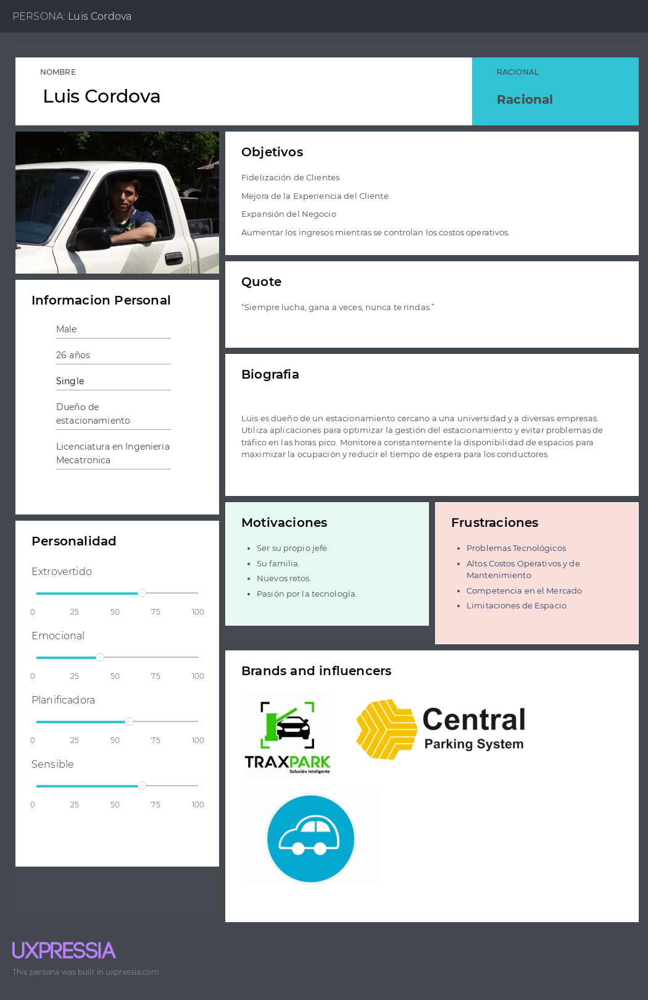
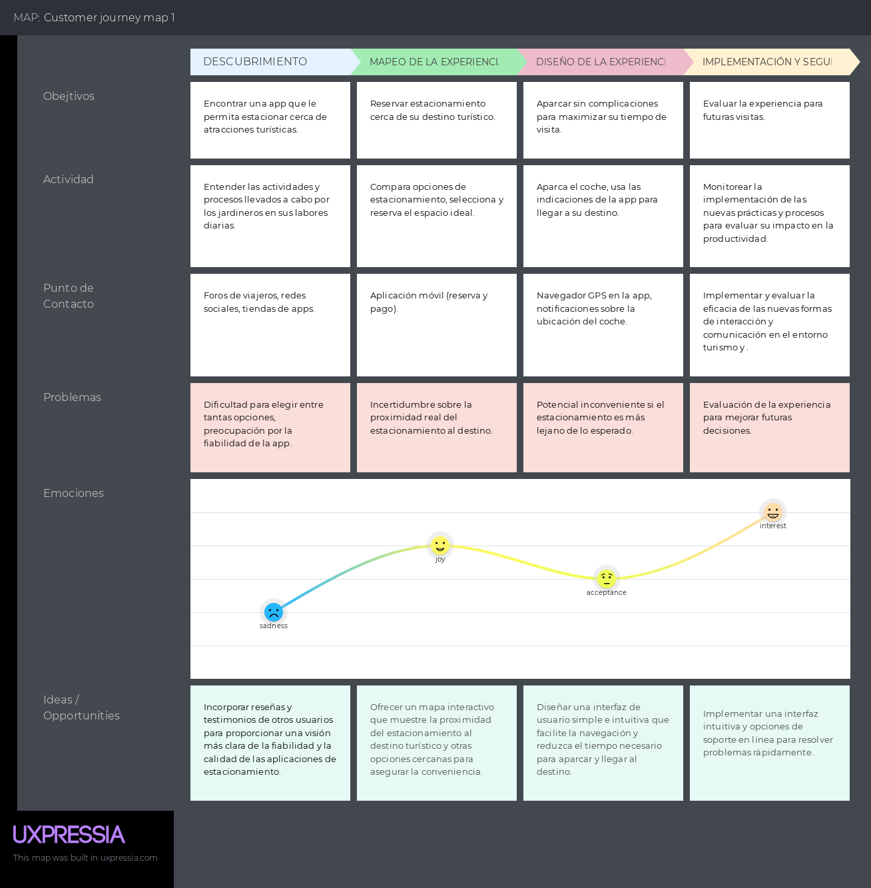
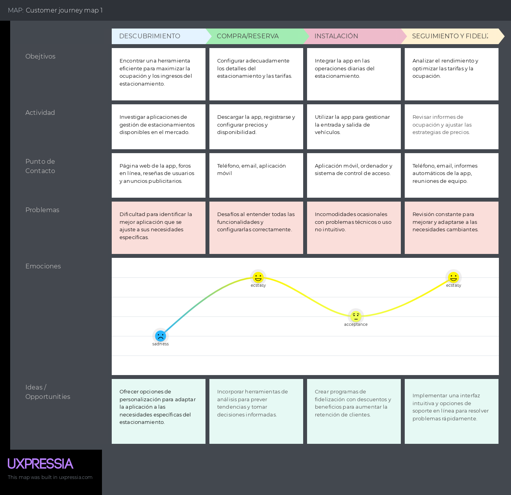
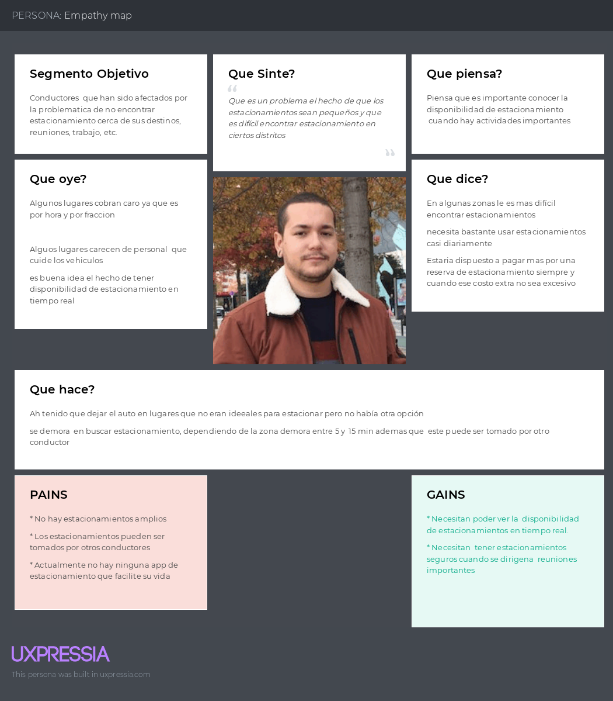
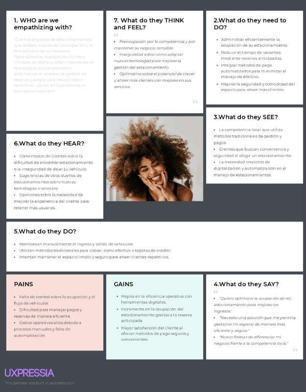
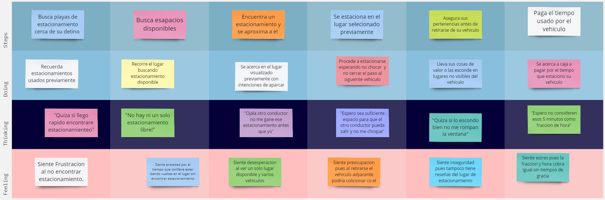
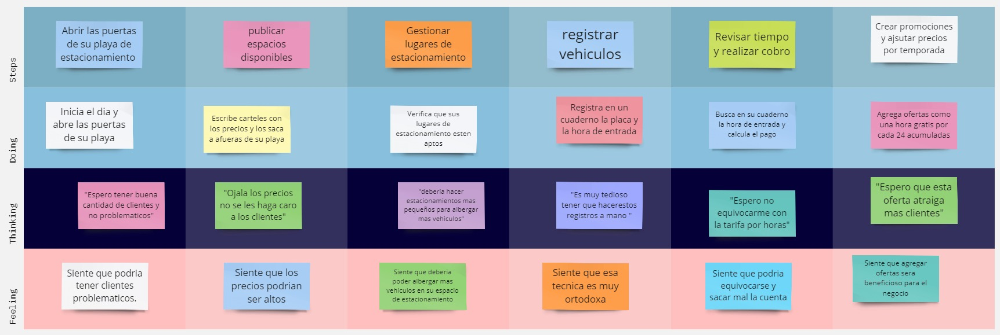

# Capítulo II: Requirements Elicitation & Analysis

## 2.1. Competidores.

### 2.1.1. Análisis competitivo.

El análisis competitivo es fundamental para la toma de decisiones estratégicas, ya que permite identificar oportunidades y amenazas, además de contribuir a la creación de ventajas competitivas sostenibles en el mercado. Esta herramienta es crucial para que las empresas se mantengan ágiles y tomen decisiones informadas en un entorno empresarial en constante evolución. A continuación, se muestra cómo se ha integrado esta herramienta en el desarrollo del proyecto y el análisis de los competidores.

# Competitive Analysis Landscape

| | | **Quadrapp**  | **Parkimeter**  | **ElParking**  | **Aparcados**  |
|---|---|---|---|---|---|
| **¿Por qué este análisis?** | | Identificar cómo Quadrapp se posiciona frente a sus competidores en términos de servicios, ventajas competitivas y estrategias de mercado, con el fin de fortalecer la propuesta de valor y captar más clientes. |
| **Perfil** | **Overview** | Respuesta innovadora a la ineficiente gestión de estacionamientos en espacios de alto tráfico. Integra IoT, cámaras, sensores, geolocalización y app móvil para optimizar la experiencia de conductores y administradores. | App web y móvil que ofrece reserva de plazas en Europa y América Latina. | App web y móvil para reservar aparcamientos en distintas ciudades de Europa y América Latina. | App web y móvil centrada en reservas en España, con planes de expansión internacional. |
| | **Ventaja Competitiva** | Detección en tiempo real de espacios libres, reserva y pago automatizado, optimización de rutas y gestión inteligente para administradores. | Descuentos de hasta el 70% y sin gastos de gestión. Disponible 24/7. | Incluye gestión de multas y pagos de parquímetros además de la reserva. | Geolocalización y notificaciones en tiempo real. |
| **Perfil de Marketing** | **Mercado Objetivo** | Conductores urbanos y propietarios de estacionamientos privados. | Conductores en áreas urbanas congestionadas. | Conductores en áreas urbanas congestionadas. | Conductores en áreas urbanas congestionadas. |
| | **Estrategias de Marketing** | Foco en ciudades de alta densidad vehicular (Lima, Arequipa, Trujillo). Campañas digitales + alianzas con municipalidades y dueños de estacionamientos. | Publicidad digital, redes sociales e influencers. | Publicidad digital, redes sociales e influencers. | Publicidad digital y redes sociales. |
| **Perfil del Producto** | **Productos & Servicios** | • Monitoreo en tiempo real • Reserva y pago automatizado • Optimización de rutas • Gestión para administradores | Reserva de parkings en España y principales ciudades globales. | Reserva de estacionamientos + gestión de multas y pagos. | Reserva de estacionamientos en áreas urbanas. |
| | **Precios** | Plataforma gratuita + tarifas de estacionamiento. Monetización adicional para administradores (suscripciones/gestión inteligente). | Plataforma gratuita + tarifas + suscripción VIP. | Plataforma gratuita + tarifas + descuentos especiales. | Plataforma gratuita + tarifas de estacionamiento. |
| | **Canales** | App móvil + Web. | Web + Móvil. | Web + Móvil. | Web + Móvil. |
| **Análisis SWOT** | **Fortalezas** | Tecnología IoT, detección en tiempo real, optimización de rutas, enfoque en sostenibilidad. | Presencia en Europa y América Latina. | Servicios adicionales (multas y pagos). | Expansión internacional (Europa y Asia). |
| | **Debilidades** | Alta inversión inicial en hardware (sensores/cámaras). | Competencia con servicios similares. | Mercado altamente competitivo. | Competencia con servicios similares. |
| | **Oportunidades** | Creciente parque automotor en Latinoamérica; interés municipal en soluciones de movilidad. | Mayor congestión vehicular = más demanda. | Expansión en España y mayor adopción urbana. | Crecimiento potencial en Latinoamérica. |
| | **Amenazas** | Regulaciones urbanas y barreras de adopción tecnológica. | Nuevas startups en el sector. | Nuevas startups en el sector. | Nuevas startups en el sector. |

### 2.1.2. Estrategias y tácticas frente a competidores.

Basado en el análisis competitivo previo, se identificaron claramente las fortalezas, oportunidades, debilidades y amenazas de los competidores. Esta información es fundamental para diseñar estrategias y tácticas que permitan superar a la competencia cuando el servicio se lance al mercado de manera rentable. A continuación, se presentan una serie de estrategias y tácticas planificadas para lograr este objetivo.

| **Fortalezas** | **Estrategias (Oportunidades)** | **Estrategias (Amenazas)** |
|----------------|---------------------------------|-----------------------------|
| Innovación, alcance a un público objetivo más amplio y soporte en tiempo real para los usuarios. | Garantizar el mejor servicio y soporte al cliente, fomentando la fidelización. La propuesta basada en sensores inteligentes representa un factor diferenciador que generará interés y disposición de adopción. | Anticipar posibles cambios normativos mediante un análisis constante de políticas de movilidad, asegurando la adaptación de la solución sin comprometer su viabilidad. |

| **Debilidades** | **Estrategias (Oportunidades)** | **Estrategias (Amenazas)** |
|-----------------|---------------------------------|-----------------------------|
| Mercado altamente competitivo y emergente. | Incrementar la promoción de la aplicación destacando la innovación, con el fin de posicionarla como la mejor opción del mercado y ganar la validación de los usuarios. | Aprovechar que los cambios en políticas afectan también a los competidores, diferenciándonos con campañas que resalten cómo nuestra propuesta contribuye a mejorar la gestión de la movilidad en las ciudades. |

## 2.2. Entrevistas.

La sección detalla cómo investigamos nuestros segmentos objetivo mediante la recopilación de datos a través de entrevistas.

### 2.2.1. Diseño de entrevistas.

**Preguntas dirigidas a Conductores particulares**

----

**Preguntas principales**

- ¿Podrías decirme tu nombre completo y edad?  
- ¿En qué distrito resides actualmente?  
- ¿Cuál es tu estado civil?  
- ¿Dónde naciste?  
- ¿Qué dispositivos tecnológicos utilizas?  
- ¿Qué navegadores utilizas?  
- ¿Qué tipo de vehículo(s) menor(es) posees?  
- ¿Qué habilidades consideras que tienes en relación con el manejo o mantenimiento de tu(s) vehículo(s)?  
- ¿Qué factores consideras al elegir un vehículo menor? (Ej. economía, estilo, funcionalidad)  
- ¿Qué influencias (familia, amigos, medios, etc.) han afectado tus decisiones al comprar un vehículo?  
- ¿Qué tipos de vehículos tienes disponibles para rentar o vender?  
- ¿Cómo determinas el precio de tus vehículos?  
- ¿Qué medidas de seguridad implementas para asegurarte de que tus vehículos estén siempre en buen estado antes de rentarlos o venderlos?  
- ¿Cómo manejas la limpieza y desinfección de los vehículos?  
- ¿Cuáles son los requisitos o condiciones para rentar o vender uno de tus vehículos?  

**Preguntas complementarias**

- ¿Sigues algún protocolo específico para la limpieza y desinfección, y con qué frecuencia realizas estas tareas?  
- ¿Qué proceso sigues para verificar la identidad y credibilidad de los posibles propietarios?  
- ¿Cómo organizas la entrega y recogida de los vehículos? ¿Tienes puntos de recogida específicos o cómo coordinas estos procesos?  
- ¿Cómo manejas las valoraciones y reseñas que dejan los propietarios?  
- Durante el periodo de renta o venta, ¿qué tipo de soporte proporcionas a los propietarios?  
- ¿Estás abierto a considerar descuentos o promociones especiales para atraer más propietarios?  
- ¿Hay alguna mejora o característica que te gustaría ver en la aplicación que utilizas para gestionar tus vehículos?  

**Preguntas dirigidas a Propietarios de estacionamientos**

---

**Preguntas principales**

- ¿Podrías decirme tu nombre completo y edad?  
- ¿En qué distrito resides actualmente?  
- ¿Dónde naciste y en qué lugar vives actualmente?  
- ¿Cuál es tu estado civil?  
- ¿Podrías describir tu nivel socioeconómico? ¿Te consideras en un nivel alto, intermedio o bajo?  
- ¿Podrías contarnos un poco acerca de ti y tu experiencia con el alquiler y la compra de vehículos?  
- ¿Qué te impulsó a buscar una aplicación para alquilar o comprar vehículos?  
- ¿Qué esperas lograr al utilizar una aplicación para alquilar o comprar vehículos?  
- ¿Qué dificultades o problemas has enfrentado en tus experiencias previas con el alquiler y la compra de vehículos?  
- ¿Qué características consideras esenciales en una aplicación para alquilar o comprar vehículos?  
- ¿Qué métodos de pago prefieres para realizar transacciones en línea?  
- ¿Cómo te gustaría recibir notificaciones sobre tus reservas y el estado de los vehículos?  
- ¿Cuál ha sido tu experiencia con la seguridad y protección en el alquiler y la compra de vehículos?  
- ¿Qué mejoras o características adicionales crees que podrían mejorar tu experiencia al usar una aplicación de renta o compra de vehículos?  

**Preguntas complementarias**

- ¿Cómo has gestionado el alquiler o la compra de vehículos en el pasado?  
- ¿Qué tipo de soporte o asistencia esperas recibir durante el proceso de alquiler o compra?  
- ¿Tienes alguna preferencia particular en cuanto a la aplicación o tecnología que se utiliza para acceder a la aplicación?  
- ¿Cómo prefieres gestionar la búsqueda de vehículos en una aplicación?  
- ¿Qué tipo de información te gustaría ver en las descripciones de los vehículos?  

### 2.2.2. Registro de entrevistas.
**Segmento 1**

Nombre: _____
Edad: _ años 
Ocupación: _____  
  
{texto mucho}

**Segmento 2**

**Entrevista 1**  
**Nombres y Apellidos:** Joaquín Abdias Trujillo Lizarbe  
**Edad:** 21 años  
**Distrito:** Comas  
**Timing:**  
**Duración:** 3:29  

  

**Resumen:**

Joaquín Trujillo es un propietario de estacionamiento, él comenta que muchas veces le resulta complicado gestionar y organizar la disponibilidad y reservación de espacios en su estacionamiento por la cantidad de clientes. Considera que la visualización en tiempo real de la disponibilidad de los espacios, así como la generación de reportes de disponibilidad es importante para acelerar la gestión y mejorar la experiencia de los clientes. Los métodos de pago que utiliza principalmente es el pago efectivo y por transacciones a través de servicios como Yape. A pesar de no haber utilizado una sistema que le permita automatizar estos procesos, estaría dispuesto a implementarlo para disminuir el tiempo requerido en estas tareas. En conclusión, Joaquín considera importante la implementación de funciones que le permitan mejorar la gestión de su estacionamiento y de sus clientes.

### 2.2.3. Análisis de entrevistas.

**Análisis del Segmento Conductores particulares**

Los entrevistados valoran la posibilidad de contar con una aplicación que les permita ahorrar tiempo en la búsqueda de estacionamientos, así como la seguridad de disponer de espacios confiables y bien gestionados. Además, destacan la importancia de que la plataforma sea intuitiva, rápida y que brinde información en tiempo real sobre la disponibilidad de espacios. También consideran relevante el soporte al cliente en caso de problemas durante el proceso de reserva o pago.  

Sin embargo, algunos manifestaron preocupación por los costos asociados al uso de la aplicación y por la confianza en la precisión de la información sobre la disponibilidad de estacionamientos. Otro aspecto mencionado fue la necesidad de una mayor transparencia en los términos de uso y en las tarifas, ya que temen cargos ocultos o comisiones adicionales.  

---

**Análisis del Segmento Propietario de estacionamientos**

Los entrevistados valoran la oportunidad de generar ingresos adicionales a través de la renta de sus espacios de estacionamiento, así como la posibilidad de llegar a un mayor número de clientes gracias a la visibilidad que ofrece una aplicación especializada. Resaltan la importancia de contar con herramientas que les permitan gestionar sus espacios de forma sencilla, con opciones para fijar precios, horarios de disponibilidad y medidas de seguridad.  

Sin embargo, expresaron inquietudes respecto a la confiabilidad de los usuarios que alquilan los espacios y el riesgo de que los vehículos no respeten los tiempos establecidos o dañen las instalaciones. Asimismo, consideran necesario que la aplicación ofrezca garantías de pago seguras, soporte en caso de conflictos y mecanismos de evaluación que les permitan filtrar a los usuarios con mejor reputación.  

## 2.3. Needfinding.

### 2.3.1. User Personas.

- **Segmento Conductores particulares:**

- **Segmento Propietario de estacionamientos:**

### 2.3.2. User Task Matrix.

Se presenta el Task Matrix, una tabla que muestra las tareas realizadas por los User Personas, incluyendo su importancia y frecuencia. A continuación, se proporciona un resumen basado en la información presentada.

| **Segmento Objetivo**             | **Tarea**                                                                       | **Frecuencia** | **Importancia** |
|----------------------------------|----------------------------------------------------------------------------------|----------------|------------------|
| Conductores particulares         | Buscar estacionamientos disponibles                                              | Media          | Alta             |
| Conductores particulares         | Comparar precios de estacionamientos                                             | Alta           | Media            |
| Conductores particulares         | Reservar estacionamientos con anticipación                                      | Media          | Alta             |
| Conductores particulares         | Pagar por estacionamiento a través de la aplicación                              | Alta           | Alta             |
| Conductores particulares         | Recibir direcciones al estacionamiento reservado                                | Alta           | Alta             |
| Conductores particulares         | Filtrar estacionamientos por criterios (precio, seguridad, etc.)                | Alta           | Alta             |
| Conductores particulares         | Recibir notificaciones sobre descuentos y ofertas                               | Media          | Baja             |
| Conductores particulares         | Verificar disponibilidad de estacionamiento en tiempo real                      | Alta           | Alta             |
| Conductores particulares         | Consultar historial de estacionamientos utilizados                              | Media          | Baja             |
| Propietario de estacionamientos  | Administrar y actualizar la disponibilidad de espacios                           | Alta           | Alta             |
| Propietario de estacionamientos  | Ajustar precios de los espacios de estacionamiento                               | Media          | Alta             |
| Propietario de estacionamientos  | Gestionar reservas de estacionamientos                                           | Alta           | Alta             |
| Propietario de estacionamientos  | Procesar pagos de estacionamiento a través de la aplicación                      | Alta           | Media            |
| Propietario de estacionamientos  | Revisar y ajustar las características del estacionamiento (precio, seguridad, etc.) | Media       | Alta             |
| Propietario de estacionamientos  | Revisar reportes de uso y disponibilidad                                         | Media          | Media            |
| Propietario de estacionamientos  | Recibir y gestionar comentarios y valoraciones de los usuarios                   | Baja           | Media            |
| Propietario de estacionamientos  | Promocionar descuentos y ofertas especiales                                      | Media          | Media            |
| Propietario de estacionamientos  | Consultar el historial de transacciones y reservas                               | Baja           | Media            |

A través del *User Task Matrix*, podemos identificar las frecuencias e importancias entre los diferentes segmentos que presentamos y usar esta información como guía.

Al examinar los dos segmentos objetivo, se identifica que los conductores particulares priorizan la eficiencia y la comodidad en el uso de los estacionamientos, mientras que los propietarios de estacionamientos centran su atención en la administración y maximización de sus espacios. A pesar de tener metas diferentes, ambos grupos coinciden en la necesidad de una solución que simplifique la disponibilidad, la gestión y la experiencia general del estacionamiento.

### 2.3.3. User Journey Mapping.

En esta sección se ilustra el recorrido completo del usuario (end-to-end journey) de la aplicación EcoMovil para los segmentos objetivos: Universitarios y adquirientes. El User Journey Mapping comienza desde el momento en que el cliente toma conocimiento de la aplicación, pasando por el proceso de decidir usarla, registrarse, utilizarla y, finalmente, la posibilidad de dejar de usarla.

- **Segmento Conductores particulares:**

- **Segmento Propietario de estacionamientos:**

### 2.3.4. Empathy Mapping.

- **Segmento Conductores particulares:**

- **Segmento Propietario de estacionamientos:**

### 2.3.5. As-is Scenario Mapping.

- **Segmento Conductores particulares:**

- **Segmento Propietario de estacionamientos:**

## 2.5. Ubiquitous Language.

- **Parking space (Espacio de Estacionamiento):** Lugar específico dentro de un estacionamiento donde un vehículo puede ser aparcado.

- **Reservation (Reserva):** La acción de reservar un espacio de estacionamiento específico por un periodo de tiempo determinado, garantizando su disponibilidad.

- **Real-Time Availability (Disponibilidad en Tiempo Real):** Información actualizada instantáneamente sobre los espacios de estacionamiento libres y ocupados.

- **Geolocation (Geolocalización):** El uso de tecnologías de ubicación para determinar la posición geográfica del usuario y mostrar opciones de estacionamiento cercanas.

- **Interactive Map (Mapa Interactivo):** Un mapa digital dentro de la aplicación que muestra la ubicación de estacionamientos disponibles en tiempo real.

- **Hourly Rates (Tarifas por Hora):** El costo asociado con la reserva de un espacio de estacionamiento, calculado por horas de uso.

- **Online Payment (Pago en Línea):** El proceso de completar el pago para una reserva a través de métodos de pago digitales, como tarjetas de crédito, débito o billeteras electrónicas.

- **Booking History (Historial de Reservas):** Un registro de todas las reservas pasadas realizadas por el usuario, que incluye detalles como fecha, hora, ubicación y costo.

- **Real-Time Notifications (Notificaciones en Tiempo Real):** Alertas enviadas al usuario para informarles sobre cambios en la disponibilidad, confirmaciones de reserva, o vencimientos de tiempo de estacionamiento.

- **User (Usuario):** Persona que utiliza la aplicación para buscar, reservar y pagar por espacios de estacionamiento.

- **Parking Lot Owner (Propietario de Estacionamiento):** Persona o entidad que posee y administra un estacionamiento y que ofrece espacios para la reserva a través de la aplicación.

- **System Administrator (Administrador del Sistema):** Persona responsable de la gestión y mantenimiento de la aplicación, incluyendo la supervisión de la disponibilidad de los espacios y la gestión de usuarios y datos.

- **Check-in (Registro):** El proceso de confirmar la llegada al espacio de estacionamiento reservado, activando el tiempo de uso.

- **Check-out (Salida):** El proceso de marcar la salida del espacio de estacionamiento, finalizando el tiempo de uso y actualizando la disponibilidad.

- **Parking Zone (Zona de Estacionamiento):** Una área geográfica específica que contiene múltiples espacios de estacionamiento, gestionada dentro de la aplicación.

- **Time of Grace (Tiempo de Gracia):** Un periodo corto de tiempo permitido antes o después de la reserva, en el cual el usuario puede llegar sin incurrir en cargos adicionales.

- **Fine for Excess Time (Multa por Exceso de Tiempo):** Un cargo adicional aplicado si un usuario excede el tiempo de estacionamiento reservado.

- **Validation System (Sistema de Validación):** Mecanismo para verificar que un vehículo tenga una reserva válida para un espacio de estacionamiento específico.
