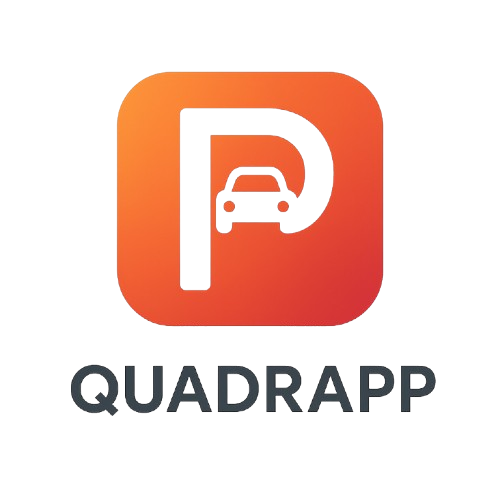

    <strong>Universidad Peruana de Ciencias Aplicadas</strong>     
    </img> 
    <strong>Ingeniería de Software</strong> 
     <strong>Diseño de Experimentos de Ingeniería de Software - 7500</strong> 
     <strong>Docente: Ivan Robles Fernández</strong>  

    <strong>Startup: PCC Team</strong> 
     <strong>Producto: Quadrapp</strong> 

    <h3 align="center">Team Members:</h3>

    <table align="center">
        <tr>
            <th style="text-align:center;">Nombre</th>
            <th style="text-align:center;">Código</th>
        </tr>
        <tr>
            <td style="text-align:center;">Solis Solis, Leonardo José</td>
            <td style="text-align:center;">U20211G163</td>
        </tr>
        <tr>
            <td style="text-align:center;">Nanfuñay Liza, Pedro Jesús</td>
            <td style="text-align:center;">U202215462</td>
        </tr>
        <tr>
            <td style="text-align:center;">Calisaya Sánchez, Juan Jesús</td>
            <td style="text-align:center;">U202121935</td>
        </tr>
        <tr>
            <td style="text-align:center;">Oneglio De Paz, Beth Shantal</td>
            <td style="text-align:center;">U202213423</td>
        </tr>
        <tr>
            <td style="text-align:center;">Lagos Aguilar, Luis Eduardo</td>
            <td style="text-align:center;">U202121975</td>
        </tr>
    </table>
    

</body>

 <strong>2025-02</strong>

 

# Registro de Versiones del Informe

| Versión | Fecha | Autor | Descripción de Modificación |
| ----------- | ----------- | ----------- | ----------- |
| 1.0 | 10/09/2025 | Solis, Nanfuñay, Calisaya, Oneglio, Lagos | Creación del documento de trabajo en formato Markdown. |
| 1.1 | 14/09/2025 | Solis, Nanfuñay, Calisaya, Oneglio, Lagos | Desarrollo del perfil de la startup y de la solución, identificación de segmentos objetivo y formulación de preguntas para el diseño de entrevistas. |
| 1.2 | 14/09/2025 | Solis, Nanfuñay, Calisaya, Oneglio, Lagos | Redacción de las guías de estilo e infraestructura de la información. |
| 1.3 | 15/09/2025 | Solis, Nanfuñay, Calisaya, Oneglio, Lagos | Realización y registro de entrevistas con los segmentos objetivo y análisis de los resultados. Creación del Impact Mapping. Redacción de las guías de estilo y la arquitectura de la información. |
| 1.4 | 16/09/2025 | Solis, Nanfuñay, Calisaya, Oneglio, Lagos | Elaboración de historias de usuario y del backlog del producto. |
| 1.5 | 16/09/2025 | Solis, Nanfuñay, Calisaya, Oneglio, Lagos | Creación del diagrama de base de datos, diagrama de clases, diccionario de clases, diagramas de contenedores, diagramas de contexto y diagramas de componentes. |
| 1.5 | 16/09/2025 | Solis, Nanfuñay, Calisaya, Oneglio, Lagos | Registro de las evidencias del Sprint. |

# Project Report Collaboration Insights

URL del repositorio para el Project Report en la organización de GitHub del equipo:

https://github.com/Experiemtos-SI0732-Group-3-PCC-Team/Final-Project-Documentation-Report/blob/Chapter-I/upc-pre-202520-1asi0732-7500-pcc-report-t.md 

**TB1**

Para la elaboración del informe correspondiente a la entrega TB1, la implementación de las secciones se distribuyó entre los miembros del equipo de la siguiente manera:

| Integrantes | Tareas Asignadas |
| ----------- | ---------------- |
| Solis Solis, Leonardo José | Product Implementation & Deployment, Video About-the-Product, Back-end |
| Nanfuñay Liza, Pedro Jesús | Ubiquitous Language, Requirements Specification, Front-end |
| Calisaya Sánchez, Juan Jesús | Product Implementation, Back-end |
| Oneglio De Paz, Beth Shantal | Introducción, Requirements Elicitation & Analysis, Front-end |
| Lagos Aguilar, Luis Eduardo | Product Design, Architecture Design |

La colaboración en el informe se llevó a cabo mediante commits frecuentes en el repositorio de la organización PCC Team.

**GitHub Collaboration Insights**

GitHub también muestra un historial de las ramas principales y los procesos de fusión realizados. Todas las ramas se crearon siguiendo el diseño de GitFlow para asegurar una adecuada organización al utilizar un sistema de control de versiones.

Los miembros del equipo son:

- Solis Solis, Leonardo José
- Nanfuñay Liza, Pedro Jesús
- Calisaya Sánchez, Juan Jesús
- Oneglio De Paz, Beth Shantal
- Lagos Aguilar, Luis Eduardo

Se describen las ramas más destacadas de la siguiente manera:

main: Representada en negro. Es la rama principal del proyecto y se actualiza con cada entregable.
develop: Representada en azul. Es la rama principal para el proceso de desarrollo del proyecto.
feature-product-design: Representada en verde. Incluye el contenido de flujos de usuario y wireframes.
feature-sprint1: Representada en amarillo. Contiene los artefactos relacionados con el sprint 1 en el informe.
Los gráficos siguientes muestran los análisis de commits en el repositorio del informe, incluyendo la cantidad de líneas de texto añadidas por cada miembro del equipo.

**TB1**

# Contenido

## Tabla de contenidos

[Registro de Versiones del Informe](#registro-de-versiones-del-informe)

[Project Report Collaboration Insights](#project-report-collaboration-insights)

[Student Outcome](#student-outcome)

[Capítulo I: Introducción](#capítulo-i-introducción)

[1.1 Startup Profile](#11-startup-profile)  
[1.1.1. Descripción de la Startup](#111-descripción-de-la-startup)  
[1.1.2. Perfiles de integrantes del equipo](#112-perfiles-de-integrantes-del-equipo)  

[1.2. Solution Profile](#12-solution-profile)  
[1.2.1 Antecedentes y problemática](#121-antecedentes-y-problemática)  
[1.2.2 Lean UX Process.](#122-lean-ux-process)  
[1.2.2.1. Lean UX Problem Statements.](#1221-lean-ux-problem-statements)  
[1.2.2.2. Lean UX Assumptions.](#1222-lean-ux-assumptions)  
[1.2.2.3. Lean UX Hypothesis Statements.](#1223-lean-ux-hypothesis-statements)  
[1.2.2.4. Lean UX Canvas.](#1224-lean-ux-canvas)  

[1.3. Segmentos objetivo.](#13-segmentos-objetivo)  

[Capítulo II: Requirements Elicitation & Analysis](#capítulo-ii-requirements-elicitation--analysis)  

[2.1. Competidores](#21-competidores)  
[2.1.1. Análisis competitivo](#211-análisis-competitivo)  
[2.1.2. Estrategias y tácticas frente a competidores](#211-análisis-competitivo)  

[2.2. Entrevistas](#22-entrevistas)  
[2.2.1. Diseño de entrevistas](#221-diseño-de-entrevistas)  
[2.2.2. Registro de entrevistas](#222-registro-de-entrevistas)  
[2.2.3. Análisis de entrevistas](#223-análisis-de-entrevistas)  

[2.3. Needfinding](#23-needfinding)  
[2.3.1. User Personas](#231-user-personas)  
[2.3.2. User Task Matrix](#232-user-task-matrix)  
[2.3.3. User Journey Mapping](#233-user-journey-mapping)  
[2.3.4. Empathy Mapping](#234-empathy-mapping)  
[2.3.5. As-is Scenario Mapping](#235-as-is-scenario-mapping)

[2.4. Ubiquitous Language](#25-ubiquitous-language)  

[Capítulo III: Requirements Specification](#capítulo-iii-requirements-specification)  

[3.1. To-Be Scenario Mapping](#31-to-be-scenario-mapping)  
[3.2. User Stories](#32-user-stories)  
[3.3. Product Backlog](#33-product-backlog)  
[3.4. Impact Mapping](#34-impact-mapping)  

[Capítulo IV: Product Design](#capítulo-v-product-design)  
[4.1. Style Guidelines.](#41-style-guidelines)  
[4.1.1. General Style Guidelines.](#411-general-style-guidelines)  
[4.1.2. Web, Mobile and IoT Style Guidelines.](#412-web-mobile-and-iot-style-guidelines)  
[4.2. Information Architecture.](#42-information-architecture)  
[4.2.1. Organization Systems.](#421-organization-systems)  
[4.2.2. Labeling Systems.](#422-labeling-systems)  
[4.2.3. SEO Tags and Meta Tags](#423-seo-tags-and-meta-tags)  
[4.2.4. Searching Systems.](#424-searching-systems)  
[4.2.5. Navigation Systems.](#425-navigation-systems)  
[4.3. Landing Page UI Design.](#43-landing-page-ui-design)  
[4.3.1. Landing Page Wireframe.](#431-landing-page-wireframe)  
[4.3.2. Landing Page Mock-up.](#432-landing-page-mock-up)  
[4.4. Mobile Applications UX/UI Design.](#44-mobile-applications-uxui-design)  
[4.4.1. Mobile Applications Wireframes.](#441-applications-wireframes)  
[4.4.2. Mobile Applications Wireflow Diagrams.](#442-applications-wireflow-diagrams)  
[4.4.3. Mobile Applications Mock-ups.](#443-applications-mock-ups)  
[4.4.4. Mobile Applications User Flow Diagrams.](#444-applications-user-flow-diagrams)  
[4.5. Mobile Applications Prototyping.](#45-applications-prototyping)  
[4.5.1. Android Mobile Applications Prototyping.](#451-android-mobile-applications-prototyping)  
[4.5.2. iOS Mobile Applications Prototyping.](#452-ios-mobile-applications-prototyping)  

[4.6. Web Applications UX/UI Design.](#46-web-applications-uxui-design)  
[4.6.1. Web Applications Wireframes.](#461-web-applications-wireframes)  
[4.6.2. Web Applications Wireflow Diagrams.](#462-web-applications-wireflow-diagrams)  
[4.6.3. Web Applications Mock-ups.](#463-web-applications-mock-ups)  
[4.6.4. Web Applications User Flow Diagrams.](#464-web-applications-user-flow-diagrams)  

[4.7. Web Applications Prototyping.](#47-web-applications-prototyping)  

[4.8. Domain-Driven Software Architecture.](#48-domain-driven-software-architecture)  
[4.8.1. Software Architecture Context Diagram.](#481-software-architecture-context-diagram)  
[4.8.2. Software Architecture Container Diagrams.](#482-software-architecture-container-diagrams)  
[4.8.3. Software Architecture Components Diagrams.](#483-software-architecture-components-diagrams)  

[4.9. Software Object-Oriented Design.](#49-software-object-oriented-design)  
[4.9.1. Class Diagrams.](#491-class-diagrams)  
[4.9.2. Class Dictionary.](#492-class-dictionary)  

[4.10. Database Design.](#410-database-design)  
[4.10.1. Relational/Non-Relational Database Diagram.](#4101-relational-non-relational-database-diagram)  

[Capítulo V: Product Implementation](#capítulo-v-product-implementation)  

[5.1. Software Configuration Management.](#51-software-configuration-management)  
[5.1.1. Software Development Environment Configuration.](#511-software-development-environment-configuration)  
[5.1.2. Source Code Management.](#512-source-code-management)  
[5.1.3. Source Code Style Guide & Conventions](#513-source-code-style-guide-conventions)  
[5.1.4. Software Deployment Configuration](#514-software-deployment-configuration)  

[5.2. Product Implementation & Deployment.](#52-product-implementation-deployment)  
[5.2.1. Sprint Backlogs.](#521-sprint-backlogs)  
[5.2.2. Implemented Landing Page Evidence.](#522-implemented-landing-page-evidence)  
[5.2.3. Implemented Frotend-Web Application Evidence.](#523-implemented-frontend-web-application-evidence)  
[5.2.4. Implemented Native-Mobile Application Evidence.](#524-implemented-native-mobile-application-evidence)  
[5.2.5. Implemented RESTful API and/or Serverless Backend Evidence.](#525-implemented-restful-api-and-or-serverless-backend-evidence)  
[5.2.6. RESTful API Documentation.](#526-restful-api-documentation)  
[5.2.7. Team Collaboration Insights.](#527-team-collaboration-insights)  

[5.3. Video About-the-Product](#54-video-about-the-product)  

[Conclusiones](#conclusiones)  
[Conclusiones y recomendaciones](#conclusiones-y-recomendaciones)  
[Bibliografía](#bibliografía)  
[Anexos](#anexos)  

# Student Outcome

| Criterio específico | Acciones Realizadas | Conclusiones |
|---------------------|----------------------|--------------|
| **4.c.1** Reconoce responsabilidad ética y profesional en situaciones de ingeniería de software | Solis Solis, Leonardo José  **TB1**  Para esta entrega demostré responsabilidad ética y profesional al diseñar y desarrollar los bounded contexts de IAM y Parking Management, haciendo uso de SpringBoot y Java para el manejo seguro de datos de usuario y el mantenimiento de la integridad del sistema.  Nanfuñay Liza, Pedro Jesús  **TB1**  Durante el desarrollo y documentación de la presente solución tecnológica, demostré la responsabilidad ética y profesional al cumplir con estándares de calidad, transparencia y buenas prácticas en ingeniería de software. Reconociendo la importancia de proteger la información y mantener un comportamiento responsable en cada etapa del proceso  Calisaya Sánchez, Juan Jesús  **TB1**  En el Capítulo V asumí responsabilidad ética y profesional al configurar el entorno de desarrollo, gestionar el código fuente y definir guías de estilo claras, garantizando un trabajo ordenado, transparente y de calidad en la implementación del software.  Oneglio De Paz, Beth Shantal  **TB1**  En los Capítulos I y II asumí responsabilidad ética y profesional al documentar de forma clara y estructurada el perfil de la startup, la problemática, el proceso Lean UX y los artefactos de Requirements Elicitation & Analysis, garantizando calidad y buenas prácticas en el trabajo.  Lagos Aguilar, Luis Eduardo  **TB1**  Se evidenció la capacidad de identificar dilemas éticos en la práctica de la ingeniería de software y de aplicar criterios de responsabilidad profesional. El trabajo permitió reflexionar sobre el impacto de las decisiones técnicas en los usuarios y la importancia de cumplir con estándares de calidad y buenas prácticas. | El trabajo realizado ha sido sobresaliente, cumpliendo con todos los segmentos del proyecto. El documento redactado ofrece un detallado informe sobre los pasos seguidos en la planificación, desarrollo y envío del proyecto a producción, garantizando así un resultado digno y completo. |
| **4.c.2** Emite juicios informados considerando el impacto de las soluciones de ingeniería de software en contextos globales, económicos, ambientales y sociales | Solis Solis, Leonardo José   **TB1**  En esta entrega, evalué el impacto de la solucion propuesta para el desarrollo de los bounded contexts de IAM y ParkingManagement, tomando en cuenta la seguridad de datos, eficiencia y accesibilidad.  Nanfuñay Liza, Pedro Jesús   **TB1**  Al desarrollar y documentar la solución tecnológica, realicé una evaluación crítica en cómo su implementación pueda generar beneficios en contextos globales, económicos, ambientales y sociales. Ello me permitió emitir juicios informados, valorando cómo la solución puede contribuir positivamente en diversos entornos.  Calisaya Sánchez, Juan Jesús  **TB1**  En el Capítulo V: Product Implementation trabajé en la configuración y gestión del software, estableciendo el entorno de desarrollo adecuado, la administración del código fuente y la definición de guías de estilo y convenciones para mantener la calidad y legibilidad del proyecto. Asimismo, documenté la configuración para el despliegue del software, asegurando un proceso ordenado, eficiente y alineado con las buenas prácticas de implementación.  Oneglio De Paz, Beth Shantal  **TB1**  En los Capítulos I y II emití juicios informados al analizar la problemática, los competidores y los segmentos objetivo, considerando el impacto de la solución propuesta en contextos globales, económicos, ambientales y sociales.  Lagos Aguilar, Luis Eduardo  **TB1**   Se logró emitir juicios críticos sustentados en análisis de casos reales, evaluando cómo las soluciones de software repercuten en diferentes contextos. El aprendizaje incluyó valorar el rol del ingeniero en la generación de soluciones sostenibles y responsables, reconociendo la necesidad de integrar factores sociales, ambientales y económicos en el diseño de software. | En conclusión, el trabajo realizado refleja un compromiso ético y profesional en cada etapa, asegurando calidad, organización y responsabilidad en la documentación, análisis y desarrollo de la solución propuesta, lo que garantiza una implementación sólida y confiable del proyecto. |

# Capítulo I: Introducción

## 1.1. Startup Profile

En esta sección se ofrece una descripción del startup y se detallan los perfiles de los integrantes del equipo.

### 1.1.1. Descripción de la Startup

Quadrapp surge como una respuesta innovadora ante la ineficiente gestión de estacionamientos en espacios públicos y privados de alto tráfico. En las ciudades, los conductores pierden tiempo buscando espacios disponibles, lo que genera congestión, contaminación y malestar en la experiencia de uso.

Lo que nos diferencia de otras aplicaciones es que no solo mostramos disponibilidad de espacios, sino que integramos tecnología IoT, cámaras de monitoreo, sensores y geolocalización para:

- Detectar en tiempo real los espacios libres.
- Permitir la reserva y el pago automatizado de estacionamientos.
- Optimizar las rutas hacia los estacionamientos cercanos.
- Brindar a los administradores una gestión eficiente y rentable de sus espacios.

Además, incluimos espacios particulares: cualquier usuario con una cochera o estacionamiento privado podrá registrarlo en la app y generar ingresos extra.

**Misión:** Facilitar el acceso a estacionamientos seguros, rápidos y confiables mediante el uso de tecnología, mejorando la movilidad urbana y la experiencia del conductor.

**Visión:** Convertirnos en la aplicación líder en gestión de estacionamientos inteligentes, contribuyendo a ciudades más sostenibles, organizadas y conectadas.

**Logotipo de la Startup:**

**Logotipo del Servicio:**

#### 1.1.2. Perfiles de integrantes del equipo

| Descripción de los Miembros del Equipo | Perfiles de los Miembros del Equipo |
|----------------------------------------|--------------------------------------|
| Mi nombre es Juan Jesús Calisaya Sánchez - u202121935, tengo 21 años y actualmente curso Ingeniería de Software. Me considero una persona responsable, amigable y empática. Poseo conocimientos en C++, SQL, Python, HTML/CSS, JavaScript, C#, entre otros lenguajes y tecnologías. Estas habilidades me serán de gran utilidad para llevar a cabo el proyecto. |  |
| Mi nombre es Luis, estudiante de la carrera de Ingeniería de Software, y estoy con muchas ganas de dar lo mejor de mí por este equipo. Me considero una persona curiosa, siempre dispuesta a escuchar y proponer ideas que aporten al grupo. A lo largo de mi formación, he desarrollado habilidades técnicas en el diseño guiado por el dominio (Domain Driven Design) y en el desarrollo front-end utilizando frameworks como Vue y Angular. Además, tengo experiencia intermedia programando en lenguajes como C++ y Python. |  |
| Mi nombre es Pedro Jesús Nanfuñay Liza, tengo 20 años y soy estudiante de la carrera de Ingeniería de Software. Me considero una persona creativa, responsable, perseverante y siempre dispuesto a trabajar en equipo. Tengo conocimientos en varios lenguajes de programación como C++, Java y Python; en el desarrollo web con frameworks Angular y Primevue, y en base de datos relacionales y no relacionales como SQL y MongoDB. Espero aportar de manera positiva al equipo y cumplir con los objetivos establecidos. |  |
| Mi nombre es Beth Shantal Oneglio De Paz - u202213423, tengo 20 años y estudio Ingeniería de Software en la UPC. Disfruto trabajar en equipo y resolver problemas digitales. Estoy capacitada para enfrentar situaciones estresantes con responsabilidad y liderazgo. Poseo conocimientos avanzados en gestión y programación, adquiridos en ciclos anteriores. Manejo lenguajes y tecnologías como Python, C++, HTML5, CSS3, .NET, Vue.js, C#, JavaScript, PHP, MongoDB y MySQL. |  |
| Mi nombre es Leonardo Solis - U20211G163, tengo 21 años y actualmente curso la carrera de Ingeniería de Software. Desde pequeño me gustan los videojuegos, y esto me llevó a investigar cómo estaban hechos, descubriendo la programación e impulsándome a seguir aprendiendo más acerca de este mundo. |  |

## 1.2. Solution Profile

Está compuesta por dos secciones:

### Antecedentes y Problemática:

Esta sección describe el problema que el proyecto busca resolver. Incluye el enunciado del problema, una descripción de los aspectos clave que la solución debe abordar, así como los objetivos y las restricciones del proyecto.

### Lean UX Process:

Esta sección aplica el proceso de Lean UX y detalla cómo se abordará la resolución del problema mediante el modelo de negocio.

### 1.2.1 Antecedentes y problemática

### Antecedentes:

En la última década, el crecimiento acelerado del parque automotor ha generado una presión sin precedentes sobre los espacios de estacionamiento. Según la Asociación Automotriz del Perú (2023), Lima incrementa en más de 100,000 vehículos por año, intensificando el tráfico sobre todo en horas pico (7:00–9:00 AM y 5:00–8:00 PM).

Además, estudios como el de Lima Cómo Vamos (2022) señalan que el 60% del tráfico en distritos como Miraflores y San Isidro se debe a vehículos en búsqueda de estacionamiento. Investigaciones internacionales como las de Shoup (2018) y Litman (2020) también destacan que la falta de estacionamientos inteligentes genera pérdidas económicas y un impacto ambiental considerable.

Ante este panorama, la necesidad de alternativas de gestión inteligente de estacionamientos es cada vez más urgente.

### Problemática (5Ws y 2Hs)

#### What (Qué)

**¿Cuál es el problema?**

La ineficiente gestión de estacionamientos en espacios públicos y privados de alto tráfico. Los conductores pierden tiempo buscando un espacio, lo que genera congestión vehicular, contaminación y frustración.

#### When (Cuándo)

**¿Cuándo se presenta el problema?**

- En horas pico (entrada/salida laboral, horarios escolares).
- Durante eventos masivos (conciertos, partidos, ferias, etc.).
- En zonas de alta demanda y poca oferta de estacionamientos.

#### Who (Quién)

**¿Quiénes están involucrados?**

- Conductores particulares.
- Propietarios/administradores de estacionamientos (comerciales y privados).

**¿A quién le sucede el problema?**

- A los conductores que pierden tiempo y dinero buscando estacionamiento.
- A los propietarios que no logran rentabilizar al máximo sus espacios.

**¿Quién lo utilizará?**

- Conductores que buscan estacionar rápido y seguro.
- Propietarios de cocheras, playas de estacionamiento o espacios privados que quieran generar ingresos extra.

#### Why (Por qué)

**¿Cuál es la causa del problema?**

- Crecimiento desordenado de las ciudades.
- Alta demanda y poca oferta de estacionamientos disponibles.
- Falta de herramientas tecnológicas de gestión y monitoreo en tiempo real.
- Ineficiencia en la administración de espacios privados no integrados al sistema.

#### ¿Cuáles son las 2H?

#### How (Cómo)

**¿En qué condiciones los usuarios usan nuestro producto?**

- Cuando necesitan estacionar en zonas de alto tráfico.
- Bajo presión de tiempo (citas, trabajo, estudios, eventos).
- Buscando reducir estrés, tiempo perdido y costos de transporte.

**¿Cómo nos conocieron los usuarios?**

- A través de campañas digitales (redes sociales, Google Maps, App Stores).
- Recomendaciones boca a boca.
- Al buscar soluciones a problemas de estacionamiento en apps móviles.

**¿Cómo prefieren los usuarios acceder a nuestro servicio?**

- Mediante aplicación móvil (Android/iOS).
- Con integración web para reservas previas.
- Opcionalmente con integración en sistemas de GPS o apps de movilidad.

#### How much (Cuánto)

**¿Cuánto impacta el problema?**

- Un conductor puede perder entre 15 a 30 minutos diarios buscando estacionamiento.
- Esto genera más del 30% del tráfico en zonas céntricas según estudios urbanos.
- Impacto económico: pérdida de productividad, gastos adicionales en combustible y contaminación ambiental.
- Impacto en propietarios: espacios desaprovechados que reducen ingresos potenciales.

### 1.2.2 Lean UX Process.

#### 1.2.2.1. Lean UX Problem Statements.

**Problem Statement**

Nuestro propósito es desarrollar una aplicación que conecte a conductores urbanos con espacios de estacionamiento disponibles, tanto públicos como privados, mediante tecnologías IoT, cámaras, sensores y una plataforma digital (web y móvil).

Hemos observado que los conductores pierden una cantidad significativa de tiempo y combustible buscando estacionamiento, lo cual genera congestión vehicular, contaminación ambiental y estrés. Asimismo, los propietarios de estacionamientos carecen de herramientas para gestionar, rentabilizar y optimizar sus espacios de manera eficiente.

Este problema refleja una ineficiencia estructural en la gestión de la movilidad urbana, que afecta tanto a usuarios como a autoridades y administradores de espacios.

La pregunta que nos planteamos es:

¿Cómo podemos diseñar una solución tecnológica que optimice la búsqueda, reserva y pago de estacionamientos en tiempo real, reduciendo el impacto en la movilidad y el medio ambiente, al mismo tiempo que brinda valor económico a los propietarios de espacios?

#### 1.2.2.2. Lean UX Assumptions.

**Business Assumptions**

**Necesidades de los Clientes**

**Creemos que nuestros clientes buscan** encontrar estacionamientos de forma rápida, segura y confiable, reducir el tiempo perdido y el estrés al buscar parqueo, acceder a tarifas claras con reservas anticipadas y pagos digitales, y contar con una alternativa sostenible que disminuya la congestión y la contaminación.

**Solución Propuesta**

Nuestra aplicación está diseñada para mostrar en tiempo real los espacios de estacionamiento disponibles mediante IoT y sensores, permitir la reserva anticipada y el pago digital inmediato, ofrecer a los propietarios de espacios una plataforma web para gestionar, optimizar y rentabilizar sus estacionamientos, e integrar seguridad y trazabilidad en cada transacción.

**Valor Principal**

El valor principal de la aplicación se basa en la optimización de la movilidad urbana al reducir el tiempo de búsqueda de estacionamiento y el tráfico, así como en la generación de ingresos adicionales para los propietarios de estacionamientos. Entre los beneficios adicionales se encuentra la disminución de emisiones de CO₂ al reducir las vueltas innecesarias, la mayor seguridad y confianza al estacionar en espacios validados y la digitalización de la fiscalización municipal.

**Beneficios Adicionales**

**Adquisición de Clientes**

La promoción de la aplicación se realizará a través de campañas en redes sociales y Google Ads, convenios con municipalidades y centros comerciales, estrategias de marketing con influencers y prensa digital especializada en movilidad urbana, además de un programa de referidos y recompensas para los usuarios iniciales.

**Modelo de Ingresos**

El modelo de ingresos se fundamenta en una comisión por cada reserva de estacionamiento confirmada, visible mediante un comprobante en pantalla, tarifas dinámicas en función de la demanda y la ubicación, y suscripciones premium para propietarios que deseen acceder a herramientas avanzadas de gestión.

**Competencia**

La competencia está representada por aplicaciones de estacionamiento como EasyPark o Parkopedia, que se centran principalmente en la búsqueda de espacios, pero carecen de integración local con municipalidades y propietarios particulares. La ventaja diferencial de Quadrapp es su modelo híbrido entre web y móvil, su integración de IoT en tiempo real y la inclusión de espacios particulares que actualmente no son explotados.

**Riesgos Principales**

**Estrategias para Mitigar Riesgos**

Los riesgos principales se relacionan con la baja adopción inicial por desconfianza en pagos digitales, los costos de instalación de sensores o cámaras de monitoreo y la posible competencia de soluciones internacionales que ingresen al mercado local. Para mitigar estos riesgos se consideran promociones iniciales con estacionamientos gratuitos o con descuento, alianzas con municipalidades para reducir costos de infraestructura, un fuerte enfoque en seguridad digital con pagos encriptados y comprobantes visibles, y campañas educativas sobre los beneficios de la aplicación.

**User Assumptions**

**¿Quién es el usuario?**

- Conductores urbanos (18–45 años).
- Propietarios de estacionamientos (comerciales o residenciales).

**¿Dónde encaja nuestro producto en sus trabajos o vidas?**

- Conductores: uso cotidiano en trayectos a trabajo, estudios o actividades sociales.
- Propietarios: gestión digital y en tiempo real de sus espacios desde la web.

**¿Qué problema resuelve nuestro producto?**

- Reduce el tiempo de búsqueda de parqueo.
- Mejora la seguridad y confianza al estacionar.
- Aumenta ingresos de propietarios.

**¿Cuándo y cómo es usado nuestro producto?**

- Conductores: antes y durante la salida, al planificar o llegar a un destino.
- Propietarios: de manera continua para registrar disponibilidad, tarifas y reservas.

**¿Qué características son importantes?**

- Reserva en tiempo real y pagos digitales seguros.
- Integración con mapas y geolocalización.
- Notificaciones de disponibilidad y tarifas.
- Panel web para gestión de espacios.

**Feature Assumptions**

- Los sensores IoT podrán detectar en tiempo real la disponibilidad de espacios.
- Los usuarios preferirán pagar digitalmente desde la app en lugar de efectivo.
- Los propietarios estarán dispuestos a digitalizar su gestión para aumentar ingresos.

**Business Outcomes**

- Reducción del 30% en tiempo de búsqueda de estacionamientos.
- Aumento del 20% en ingresos para propietarios y municipalidades.
- Disminución del 15% en emisiones contaminantes en zonas críticas.

**Users**

- Conductores urbanos con smartphone.
- Propietarios de espacios de estacionamiento.
- Municipalidades que administran espacios públicos.

**User Outcomes & Benefits**

- Ahorro de tiempo y combustible.
- Reducción del estrés y mejora en la experiencia de movilidad.
- Ingresos adicionales para propietarios de estacionamientos.

#### 1.2.2.3. Lean UX Hypothesis Statements.

- **Hypothesis Statement 01:**

**Creemos que** los conductores buscan una forma rápida y confiable de encontrar estacionamiento disponible en tiempo real.  
**Sabremos que** esto es cierto al observar un alto número de búsquedas de estacionamiento en la aplicación.  
**Cuando** al menos el 60% de los usuarios consulte la app al menos 3 veces por semana para ubicar espacios libres.  

- **Hypothesis Statement 02:**

**Creemos que** los dueños de estacionamientos necesitan una plataforma que les permita optimizar el uso de sus espacios vacíos.  
**Sabremos que** esto es cierto al medir la cantidad de espacios registrados y la frecuencia de reservas confirmadas.  
**Cuando** más del 50% de los estacionamientos registrados incrementen su ocupación en un 30% durante el primer trimestre.  

- **Hypothesis Statement 03:**

**Creemos que** los usuarios valoran la posibilidad de pagar y reservar estacionamiento desde la app para ahorrar tiempo.  
**Sabremos que** esto es cierto al rastrear el número de reservas y pagos realizados a través de la aplicación.  
**Cuando** al menos el 40% de los usuarios activos utilicen el sistema de pago en línea al menos una vez por semana.  

- **Hypothesis Statement 04:**

**Creemos que** ofrecer notificaciones en tiempo real sobre disponibilidad y tarifas aumentará la satisfacción del usuario.  
**Sabremos que** esto es cierto al analizar las calificaciones en la app y las reseñas positivas sobre la utilidad de las alertas.  
**Cuando** más del 70% de los usuarios activen y mantengan activadas las notificaciones de la aplicación.  

- **Hypothesis Statement 05:**

**Creemos que** una interfaz sencilla y visualmente clara hará que los usuarios adopten y recomienden la aplicación.  
**Sabremos que** esto es cierto al evaluar las métricas de retención de usuarios y la tasa de invitaciones compartidas.  
**Cuando** al menos el 50% de los nuevos usuarios regresen a la app en la primera semana y un 20% recomiende Quadrapp a otros.  

#### 1.2.2.4. Lean UX Canvas.

El Lean UX Canvas es una herramienta empleada en el ámbito del diseño centrado en el usuario (UX) y la metodología Lean, con el propósito de desarrollar productos de manera más eficiente y eficaz. Su finalidad es ofrecer un marco estructurado que facilita la colaboración entre equipos multidisciplinarios. A continuación, se presenta el Lean UX Canvas que el equipo ha trabajado utilizando Canva.

