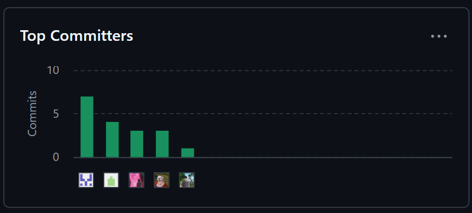

<<<<<<< HEAD

    <strong>Universidad Peruana de Ciencias Aplicadas</strong>     
    </img> 
    <strong>Ingeniería de Software</strong> 
     <strong>Diseño de Experimentos de Ingeniería de Software - 7500</strong> 
     <strong>Docente: Ivan Robles Fernández</strong>  

    <strong>Startup: PCC Team</strong> 
     <strong>Producto: Quadrapp</strong> 

    <h3 align="center">Team Members:</h3>

    <table align="center">
        <tr>
            <th style="text-align:center;">Nombre</th>
            <th style="text-align:center;">Código</th>
        </tr>
        <tr>
            <td style="text-align:center;">Solis Solis, Leonardo José</td>
            <td style="text-align:center;">U20211G163</td>
        </tr>
        <tr>
            <td style="text-align:center;">Nanfuñay Liza, Pedro Jesús</td>
            <td style="text-align:center;">U202215462</td>
        </tr>
        <tr>
            <td style="text-align:center;">Calisaya Sánchez, Juan Jesús</td>
            <td style="text-align:center;">U202121935</td>
        </tr>
        <tr>
            <td style="text-align:center;">Oneglio De Paz, Beth Shantal</td>
            <td style="text-align:center;">U202213423</td>
        </tr>
        <tr>
            <td style="text-align:center;">Lagos Aguilar, Luis Eduardo</td>
            <td style="text-align:center;">U202121975</td>
        </tr>
    </table>
    

</body>

 <strong>2025-02</strong>

 

# Registro de Versiones del Informe

| Versión | Fecha | Autor | Descripción de Modificación |
| ----------- | ----------- | ----------- | ----------- |
| 1.0 | 10/09/2025 | Solis, Nanfuñay, Calisaya, Oneglio, Lagos | Creación del documento de trabajo en formato Markdown. |
| 1.1 | 14/09/2025 | Solis, Nanfuñay, Calisaya, Oneglio, Lagos | Desarrollo del perfil de la startup y de la solución, identificación de segmentos objetivo y formulación de preguntas para el diseño de entrevistas. |
| 1.2 | 14/09/2025 | Solis, Nanfuñay, Calisaya, Oneglio, Lagos | Redacción de las guías de estilo e infraestructura de la información. |
| 1.3 | 15/09/2025 | Solis, Nanfuñay, Calisaya, Oneglio, Lagos | Realización y registro de entrevistas con los segmentos objetivo y análisis de los resultados. Creación del Impact Mapping. Redacción de las guías de estilo y la arquitectura de la información. |
| 1.4 | 16/09/2025 | Solis, Nanfuñay, Calisaya, Oneglio, Lagos | Elaboración de historias de usuario y del backlog del producto. |
| 1.5 | 16/09/2025 | Solis, Nanfuñay, Calisaya, Oneglio, Lagos | Creación del diagrama de base de datos, diagrama de clases, diccionario de clases, diagramas de contenedores, diagramas de contexto y diagramas de componentes. |
| 1.5 | 16/09/2025 | Solis, Nanfuñay, Calisaya, Oneglio, Lagos | Registro de las evidencias del Sprint. |

# Project Report Collaboration Insights

URL del repositorio para el Project Report en la organización de GitHub del equipo:

https://github.com/Experiemtos-SI0732-Group-3-PCC-Team/Final-Project-Documentation-Report/blob/Chapter-I/upc-pre-202520-1asi0732-7500-pcc-report-t.md 

**TB1**

Para la elaboración del informe correspondiente a la entrega TB1, la implementación de las secciones se distribuyó entre los miembros del equipo de la siguiente manera:

| Integrantes | Tareas Asignadas |
| ----------- | ---------------- |
| Solis Solis, Leonardo José | Product Implementation & Deployment, Video About-the-Product, Back-end |
| Nanfuñay Liza, Pedro Jesús | Ubiquitous Language, Requirements Specification, Front-end |
| Calisaya Sánchez, Juan Jesús | Product Implementation, Back-end |
| Oneglio De Paz, Beth Shantal | Introducción, Requirements Elicitation & Analysis, Front-end |
| Lagos Aguilar, Luis Eduardo | Product Design, Architecture Design |

La colaboración en el informe se llevó a cabo mediante commits frecuentes en el repositorio de la organización PCC Team.

**GitHub Collaboration Insights**

GitHub también muestra un historial de las ramas principales y los procesos de fusión realizados. Todas las ramas se crearon siguiendo el diseño de GitFlow para asegurar una adecuada organización al utilizar un sistema de control de versiones.

Los miembros del equipo son:

- Solis Solis, Leonardo José
- Nanfuñay Liza, Pedro Jesús
- Calisaya Sánchez, Juan Jesús
- Oneglio De Paz, Beth Shantal
- Lagos Aguilar, Luis Eduardo

Se describen las ramas más destacadas de la siguiente manera:

main: Representada en negro. Es la rama principal del proyecto y se actualiza con cada entregable.
develop: Representada en azul. Es la rama principal para el proceso de desarrollo del proyecto.
feature-product-design: Representada en verde. Incluye el contenido de flujos de usuario y wireframes.
feature-sprint1: Representada en amarillo. Contiene los artefactos relacionados con el sprint 1 en el informe.
Los gráficos siguientes muestran los análisis de commits en el repositorio del informe, incluyendo la cantidad de líneas de texto añadidas por cada miembro del equipo.

**TB1**

# Contenido

## Tabla de contenidos

[Registro de Versiones del Informe](#registro-de-versiones-del-informe)

[Project Report Collaboration Insights](#project-report-collaboration-insights)

[Student Outcome](#student-outcome)

[Capítulo I: Introducción](#capítulo-i-introducción)

[1.1 Startup Profile](#11-startup-profile)  
[1.1.1. Descripción de la Startup](#111-descripción-de-la-startup)  
[1.1.2. Perfiles de integrantes del equipo](#112-perfiles-de-integrantes-del-equipo)  

[1.2. Solution Profile](#12-solution-profile)  
[1.2.1 Antecedentes y problemática](#121-antecedentes-y-problemática)  
[1.2.2 Lean UX Process.](#122-lean-ux-process)  
[1.2.2.1. Lean UX Problem Statements.](#1221-lean-ux-problem-statements)  
[1.2.2.2. Lean UX Assumptions.](#1222-lean-ux-assumptions)  
[1.2.2.3. Lean UX Hypothesis Statements.](#1223-lean-ux-hypothesis-statements)  
[1.2.2.4. Lean UX Canvas.](#1224-lean-ux-canvas)  

[1.3. Segmentos objetivo.](#13-segmentos-objetivo)  

[Capítulo II: Requirements Elicitation & Analysis](#capítulo-ii-requirements-elicitation--analysis)  

[2.1. Competidores](#21-competidores)  
[2.1.1. Análisis competitivo](#211-análisis-competitivo)  
[2.1.2. Estrategias y tácticas frente a competidores](#211-análisis-competitivo)  

[2.2. Entrevistas](#22-entrevistas)  
[2.2.1. Diseño de entrevistas](#221-diseño-de-entrevistas)  
[2.2.2. Registro de entrevistas](#222-registro-de-entrevistas)  
[2.2.3. Análisis de entrevistas](#223-análisis-de-entrevistas)  

[2.3. Needfinding](#23-needfinding)  
[2.3.1. User Personas](#231-user-personas)  
[2.3.2. User Task Matrix](#232-user-task-matrix)  
[2.3.3. User Journey Mapping](#233-user-journey-mapping)  
[2.3.4. Empathy Mapping](#234-empathy-mapping)  
[2.3.5. As-is Scenario Mapping](#235-as-is-scenario-mapping)

[2.4. Ubiquitous Language](#25-ubiquitous-language)  

[Capítulo III: Requirements Specification](#capítulo-iii-requirements-specification)  

[3.1. To-Be Scenario Mapping](#31-to-be-scenario-mapping)  
[3.2. User Stories](#32-user-stories)  
[3.3. Product Backlog](#33-product-backlog)  
[3.4. Impact Mapping](#34-impact-mapping)  

[Capítulo IV: Product Design](#capítulo-v-product-design)  
[4.1. Style Guidelines.](#41-style-guidelines)  
[4.1.1. General Style Guidelines.](#411-general-style-guidelines)  
[4.1.2. Web, Mobile and IoT Style Guidelines.](#412-web-mobile-and-iot-style-guidelines)  
[4.2. Information Architecture.](#42-information-architecture)  
[4.2.1. Organization Systems.](#421-organization-systems)  
[4.2.2. Labeling Systems.](#422-labeling-systems)  
[4.2.3. SEO Tags and Meta Tags](#423-seo-tags-and-meta-tags)  
[4.2.4. Searching Systems.](#424-searching-systems)  
[4.2.5. Navigation Systems.](#425-navigation-systems)  
[4.3. Landing Page UI Design.](#43-landing-page-ui-design)  
[4.3.1. Landing Page Wireframe.](#431-landing-page-wireframe)  
[4.3.2. Landing Page Mock-up.](#432-landing-page-mock-up)  
[4.4. Mobile Applications UX/UI Design.](#44-mobile-applications-uxui-design)  
[4.4.1. Mobile Applications Wireframes.](#441-applications-wireframes)  
[4.4.2. Mobile Applications Wireflow Diagrams.](#442-applications-wireflow-diagrams)  
[4.4.3. Mobile Applications Mock-ups.](#443-applications-mock-ups)  
[4.4.4. Mobile Applications User Flow Diagrams.](#444-applications-user-flow-diagrams)  
[4.5. Mobile Applications Prototyping.](#45-applications-prototyping)  
[4.5.1. Android Mobile Applications Prototyping.](#451-android-mobile-applications-prototyping)  
[4.5.2. iOS Mobile Applications Prototyping.](#452-ios-mobile-applications-prototyping)  

[4.6. Web Applications UX/UI Design.](#46-web-applications-uxui-design)  
[4.6.1. Web Applications Wireframes.](#461-web-applications-wireframes)  
[4.6.2. Web Applications Wireflow Diagrams.](#462-web-applications-wireflow-diagrams)  
[4.6.3. Web Applications Mock-ups.](#463-web-applications-mock-ups)  
[4.6.4. Web Applications User Flow Diagrams.](#464-web-applications-user-flow-diagrams)  

[4.7. Web Applications Prototyping.](#47-web-applications-prototyping)  

[4.8. Domain-Driven Software Architecture.](#48-domain-driven-software-architecture)  
[4.8.1. Software Architecture Context Diagram.](#481-software-architecture-context-diagram)  
[4.8.2. Software Architecture Container Diagrams.](#482-software-architecture-container-diagrams)  
[4.8.3. Software Architecture Components Diagrams.](#483-software-architecture-components-diagrams)  

[4.9. Software Object-Oriented Design.](#49-software-object-oriented-design)  
[4.9.1. Class Diagrams.](#491-class-diagrams)  
[4.9.2. Class Dictionary.](#492-class-dictionary)  

[4.10. Database Design.](#410-database-design)  
[4.10.1. Relational/Non-Relational Database Diagram.](#4101-relational-non-relational-database-diagram)  

[Capítulo V: Product Implementation](#capítulo-v-product-implementation)  

[5.1. Software Configuration Management.](#51-software-configuration-management)  
[5.1.1. Software Development Environment Configuration.](#511-software-development-environment-configuration)  
[5.1.2. Source Code Management.](#512-source-code-management)  
[5.1.3. Source Code Style Guide & Conventions](#513-source-code-style-guide-conventions)  
[5.1.4. Software Deployment Configuration](#514-software-deployment-configuration)  

[5.2. Product Implementation & Deployment.](#52-product-implementation-deployment)  
[5.2.1. Sprint Backlogs.](#521-sprint-backlogs)  
[5.2.2. Implemented Landing Page Evidence.](#522-implemented-landing-page-evidence)  
[5.2.3. Implemented Frotend-Web Application Evidence.](#523-implemented-frontend-web-application-evidence)  
[5.2.4. Implemented Native-Mobile Application Evidence.](#524-implemented-native-mobile-application-evidence)  
[5.2.5. Implemented RESTful API and/or Serverless Backend Evidence.](#525-implemented-restful-api-and-or-serverless-backend-evidence)  
[5.2.6. RESTful API Documentation.](#526-restful-api-documentation)  
[5.2.7. Team Collaboration Insights.](#527-team-collaboration-insights)  

[5.3. Video About-the-Product](#54-video-about-the-product)  

[Conclusiones](#conclusiones)  
[Conclusiones y recomendaciones](#conclusiones-y-recomendaciones)  
[Bibliografía](#bibliografía)  
[Anexos](#anexos)  

# Student Outcome

| Criterio específico | Acciones Realizadas | Conclusiones |
|---------------------|----------------------|--------------|
| **4.c.1** Reconoce responsabilidad ética y profesional en situaciones de ingeniería de software | Solis Solis, Leonardo José  **TB1**  Para esta entrega demostré responsabilidad ética y profesional al diseñar y desarrollar los bounded contexts de IAM y Parking Management, haciendo uso de SpringBoot y Java para el manejo seguro de datos de usuario y el mantenimiento de la integridad del sistema.  Nanfuñay Liza, Pedro Jesús  **TB1**  Durante el desarrollo y documentación de la presente solución tecnológica, demostré la responsabilidad ética y profesional al cumplir con estándares de calidad, transparencia y buenas prácticas en ingeniería de software. Reconociendo la importancia de proteger la información y mantener un comportamiento responsable en cada etapa del proceso  Calisaya Sánchez, Juan Jesús  **TB1**  En el Capítulo V asumí responsabilidad ética y profesional al configurar el entorno de desarrollo, gestionar el código fuente y definir guías de estilo claras, garantizando un trabajo ordenado, transparente y de calidad en la implementación del software.  Oneglio De Paz, Beth Shantal  **TB1**  En los Capítulos I y II asumí responsabilidad ética y profesional al documentar de forma clara y estructurada el perfil de la startup, la problemática, el proceso Lean UX y los artefactos de Requirements Elicitation & Analysis, garantizando calidad y buenas prácticas en el trabajo.  Lagos Aguilar, Luis Eduardo  **TB1**  Se evidenció la capacidad de identificar dilemas éticos en la práctica de la ingeniería de software y de aplicar criterios de responsabilidad profesional. El trabajo permitió reflexionar sobre el impacto de las decisiones técnicas en los usuarios y la importancia de cumplir con estándares de calidad y buenas prácticas. | El trabajo realizado ha sido sobresaliente, cumpliendo con todos los segmentos del proyecto. El documento redactado ofrece un detallado informe sobre los pasos seguidos en la planificación, desarrollo y envío del proyecto a producción, garantizando así un resultado digno y completo. |
| **4.c.2** Emite juicios informados considerando el impacto de las soluciones de ingeniería de software en contextos globales, económicos, ambientales y sociales | Solis Solis, Leonardo José   **TB1**  En esta entrega, evalué el impacto de la solucion propuesta para el desarrollo de los bounded contexts de IAM y ParkingManagement, tomando en cuenta la seguridad de datos, eficiencia y accesibilidad.  Nanfuñay Liza, Pedro Jesús   **TB1**  Al desarrollar y documentar la solución tecnológica, realicé una evaluación crítica en cómo su implementación pueda generar beneficios en contextos globales, económicos, ambientales y sociales. Ello me permitió emitir juicios informados, valorando cómo la solución puede contribuir positivamente en diversos entornos.  Calisaya Sánchez, Juan Jesús  **TB1**  En el Capítulo V: Product Implementation trabajé en la configuración y gestión del software, estableciendo el entorno de desarrollo adecuado, la administración del código fuente y la definición de guías de estilo y convenciones para mantener la calidad y legibilidad del proyecto. Asimismo, documenté la configuración para el despliegue del software, asegurando un proceso ordenado, eficiente y alineado con las buenas prácticas de implementación.  Oneglio De Paz, Beth Shantal  **TB1**  En los Capítulos I y II emití juicios informados al analizar la problemática, los competidores y los segmentos objetivo, considerando el impacto de la solución propuesta en contextos globales, económicos, ambientales y sociales.  Lagos Aguilar, Luis Eduardo  **TB1**   Se logró emitir juicios críticos sustentados en análisis de casos reales, evaluando cómo las soluciones de software repercuten en diferentes contextos. El aprendizaje incluyó valorar el rol del ingeniero en la generación de soluciones sostenibles y responsables, reconociendo la necesidad de integrar factores sociales, ambientales y económicos en el diseño de software. | En conclusión, el trabajo realizado refleja un compromiso ético y profesional en cada etapa, asegurando calidad, organización y responsabilidad en la documentación, análisis y desarrollo de la solución propuesta, lo que garantiza una implementación sólida y confiable del proyecto. |

# Capítulo I: Introducción

## 1.1. Startup Profile

En esta sección se ofrece una descripción del startup y se detallan los perfiles de los integrantes del equipo.

### 1.1.1. Descripción de la Startup

Quadrapp surge como una respuesta innovadora ante la ineficiente gestión de estacionamientos en espacios públicos y privados de alto tráfico. En las ciudades, los conductores pierden tiempo buscando espacios disponibles, lo que genera congestión, contaminación y malestar en la experiencia de uso.

Lo que nos diferencia de otras aplicaciones es que no solo mostramos disponibilidad de espacios, sino que integramos tecnología IoT, cámaras de monitoreo, sensores y geolocalización para:

- Detectar en tiempo real los espacios libres.
- Permitir la reserva y el pago automatizado de estacionamientos.
- Optimizar las rutas hacia los estacionamientos cercanos.
- Brindar a los administradores una gestión eficiente y rentable de sus espacios.

Además, incluimos espacios particulares: cualquier usuario con una cochera o estacionamiento privado podrá registrarlo en la app y generar ingresos extra.

**Misión:** Facilitar el acceso a estacionamientos seguros, rápidos y confiables mediante el uso de tecnología, mejorando la movilidad urbana y la experiencia del conductor.

**Visión:** Convertirnos en la aplicación líder en gestión de estacionamientos inteligentes, contribuyendo a ciudades más sostenibles, organizadas y conectadas.

**Logotipo de la Startup:**

**Logotipo del Servicio:**

#### 1.1.2. Perfiles de integrantes del equipo

| Descripción de los Miembros del Equipo | Perfiles de los Miembros del Equipo |
|----------------------------------------|--------------------------------------|
| Mi nombre es Juan Jesús Calisaya Sánchez - u202121935, tengo 21 años y actualmente curso Ingeniería de Software. Me considero una persona responsable, amigable y empática. Poseo conocimientos en C++, SQL, Python, HTML/CSS, JavaScript, C#, entre otros lenguajes y tecnologías. Estas habilidades me serán de gran utilidad para llevar a cabo el proyecto. |  |
| Mi nombre es Luis, estudiante de la carrera de Ingeniería de Software, y estoy con muchas ganas de dar lo mejor de mí por este equipo. Me considero una persona curiosa, siempre dispuesta a escuchar y proponer ideas que aporten al grupo. A lo largo de mi formación, he desarrollado habilidades técnicas en el diseño guiado por el dominio (Domain Driven Design) y en el desarrollo front-end utilizando frameworks como Vue y Angular. Además, tengo experiencia intermedia programando en lenguajes como C++ y Python. |  |
| Mi nombre es Pedro Jesús Nanfuñay Liza, tengo 20 años y soy estudiante de la carrera de Ingeniería de Software. Me considero una persona creativa, responsable, perseverante y siempre dispuesto a trabajar en equipo. Tengo conocimientos en varios lenguajes de programación como C++, Java y Python; en el desarrollo web con frameworks Angular y Primevue, y en base de datos relacionales y no relacionales como SQL y MongoDB. Espero aportar de manera positiva al equipo y cumplir con los objetivos establecidos. |  |
| Mi nombre es Beth Shantal Oneglio De Paz - u202213423, tengo 20 años y estudio Ingeniería de Software en la UPC. Disfruto trabajar en equipo y resolver problemas digitales. Estoy capacitada para enfrentar situaciones estresantes con responsabilidad y liderazgo. Poseo conocimientos avanzados en gestión y programación, adquiridos en ciclos anteriores. Manejo lenguajes y tecnologías como Python, C++, HTML5, CSS3, .NET, Vue.js, C#, JavaScript, PHP, MongoDB y MySQL. |  |
| Mi nombre es Leonardo Solis - U20211G163, tengo 21 años y actualmente curso la carrera de Ingeniería de Software. Desde pequeño me gustan los videojuegos, y esto me llevó a investigar cómo estaban hechos, descubriendo la programación e impulsándome a seguir aprendiendo más acerca de este mundo. |  |

## 1.2. Solution Profile

Está compuesta por dos secciones:

### Antecedentes y Problemática:

Esta sección describe el problema que el proyecto busca resolver. Incluye el enunciado del problema, una descripción de los aspectos clave que la solución debe abordar, así como los objetivos y las restricciones del proyecto.

### Lean UX Process:

Esta sección aplica el proceso de Lean UX y detalla cómo se abordará la resolución del problema mediante el modelo de negocio.

### 1.2.1 Antecedentes y problemática

### Antecedentes:

En la última década, el crecimiento acelerado del parque automotor ha generado una presión sin precedentes sobre los espacios de estacionamiento. Según la Asociación Automotriz del Perú (2023), Lima incrementa en más de 100,000 vehículos por año, intensificando el tráfico sobre todo en horas pico (7:00–9:00 AM y 5:00–8:00 PM).

Además, estudios como el de Lima Cómo Vamos (2022) señalan que el 60% del tráfico en distritos como Miraflores y San Isidro se debe a vehículos en búsqueda de estacionamiento. Investigaciones internacionales como las de Shoup (2018) y Litman (2020) también destacan que la falta de estacionamientos inteligentes genera pérdidas económicas y un impacto ambiental considerable.

Ante este panorama, la necesidad de alternativas de gestión inteligente de estacionamientos es cada vez más urgente.

### Problemática (5Ws y 2Hs)

#### What (Qué)

**¿Cuál es el problema?**

La ineficiente gestión de estacionamientos en espacios públicos y privados de alto tráfico. Los conductores pierden tiempo buscando un espacio, lo que genera congestión vehicular, contaminación y frustración.

#### When (Cuándo)

**¿Cuándo se presenta el problema?**

- En horas pico (entrada/salida laboral, horarios escolares).
- Durante eventos masivos (conciertos, partidos, ferias, etc.).
- En zonas de alta demanda y poca oferta de estacionamientos.

#### Who (Quién)

**¿Quiénes están involucrados?**

- Conductores particulares.
- Propietarios/administradores de estacionamientos (comerciales y privados).

**¿A quién le sucede el problema?**

- A los conductores que pierden tiempo y dinero buscando estacionamiento.
- A los propietarios que no logran rentabilizar al máximo sus espacios.

**¿Quién lo utilizará?**

- Conductores que buscan estacionar rápido y seguro.
- Propietarios de cocheras, playas de estacionamiento o espacios privados que quieran generar ingresos extra.

#### Why (Por qué)

**¿Cuál es la causa del problema?**

- Crecimiento desordenado de las ciudades.
- Alta demanda y poca oferta de estacionamientos disponibles.
- Falta de herramientas tecnológicas de gestión y monitoreo en tiempo real.
- Ineficiencia en la administración de espacios privados no integrados al sistema.

#### ¿Cuáles son las 2H?

#### How (Cómo)

**¿En qué condiciones los usuarios usan nuestro producto?**

- Cuando necesitan estacionar en zonas de alto tráfico.
- Bajo presión de tiempo (citas, trabajo, estudios, eventos).
- Buscando reducir estrés, tiempo perdido y costos de transporte.

**¿Cómo nos conocieron los usuarios?**

- A través de campañas digitales (redes sociales, Google Maps, App Stores).
- Recomendaciones boca a boca.
- Al buscar soluciones a problemas de estacionamiento en apps móviles.

**¿Cómo prefieren los usuarios acceder a nuestro servicio?**

- Mediante aplicación móvil (Android/iOS).
- Con integración web para reservas previas.
- Opcionalmente con integración en sistemas de GPS o apps de movilidad.

#### How much (Cuánto)

**¿Cuánto impacta el problema?**

- Un conductor puede perder entre 15 a 30 minutos diarios buscando estacionamiento.
- Esto genera más del 30% del tráfico en zonas céntricas según estudios urbanos.
- Impacto económico: pérdida de productividad, gastos adicionales en combustible y contaminación ambiental.
- Impacto en propietarios: espacios desaprovechados que reducen ingresos potenciales.

### 1.2.2 Lean UX Process.

#### 1.2.2.1. Lean UX Problem Statements.

**Problem Statement**

Nuestro propósito es desarrollar una aplicación que conecte a conductores urbanos con espacios de estacionamiento disponibles, tanto públicos como privados, mediante tecnologías IoT, cámaras, sensores y una plataforma digital (web y móvil).

Hemos observado que los conductores pierden una cantidad significativa de tiempo y combustible buscando estacionamiento, lo cual genera congestión vehicular, contaminación ambiental y estrés. Asimismo, los propietarios de estacionamientos carecen de herramientas para gestionar, rentabilizar y optimizar sus espacios de manera eficiente.

Este problema refleja una ineficiencia estructural en la gestión de la movilidad urbana, que afecta tanto a usuarios como a autoridades y administradores de espacios.

La pregunta que nos planteamos es:

¿Cómo podemos diseñar una solución tecnológica que optimice la búsqueda, reserva y pago de estacionamientos en tiempo real, reduciendo el impacto en la movilidad y el medio ambiente, al mismo tiempo que brinda valor económico a los propietarios de espacios?

#### 1.2.2.2. Lean UX Assumptions.

**Business Assumptions**

**Necesidades de los Clientes**

**Creemos que nuestros clientes buscan** encontrar estacionamientos de forma rápida, segura y confiable, reducir el tiempo perdido y el estrés al buscar parqueo, acceder a tarifas claras con reservas anticipadas y pagos digitales, y contar con una alternativa sostenible que disminuya la congestión y la contaminación.

**Solución Propuesta**

Nuestra aplicación está diseñada para mostrar en tiempo real los espacios de estacionamiento disponibles mediante IoT y sensores, permitir la reserva anticipada y el pago digital inmediato, ofrecer a los propietarios de espacios una plataforma web para gestionar, optimizar y rentabilizar sus estacionamientos, e integrar seguridad y trazabilidad en cada transacción.

**Valor Principal**

El valor principal de la aplicación se basa en la optimización de la movilidad urbana al reducir el tiempo de búsqueda de estacionamiento y el tráfico, así como en la generación de ingresos adicionales para los propietarios de estacionamientos. Entre los beneficios adicionales se encuentra la disminución de emisiones de CO₂ al reducir las vueltas innecesarias, la mayor seguridad y confianza al estacionar en espacios validados y la digitalización de la fiscalización municipal.

**Beneficios Adicionales**

**Adquisición de Clientes**

La promoción de la aplicación se realizará a través de campañas en redes sociales y Google Ads, convenios con municipalidades y centros comerciales, estrategias de marketing con influencers y prensa digital especializada en movilidad urbana, además de un programa de referidos y recompensas para los usuarios iniciales.

**Modelo de Ingresos**

El modelo de ingresos se fundamenta en una comisión por cada reserva de estacionamiento confirmada, visible mediante un comprobante en pantalla, tarifas dinámicas en función de la demanda y la ubicación, y suscripciones premium para propietarios que deseen acceder a herramientas avanzadas de gestión.

**Competencia**

La competencia está representada por aplicaciones de estacionamiento como EasyPark o Parkopedia, que se centran principalmente en la búsqueda de espacios, pero carecen de integración local con municipalidades y propietarios particulares. La ventaja diferencial de Quadrapp es su modelo híbrido entre web y móvil, su integración de IoT en tiempo real y la inclusión de espacios particulares que actualmente no son explotados.

**Riesgos Principales**

**Estrategias para Mitigar Riesgos**

Los riesgos principales se relacionan con la baja adopción inicial por desconfianza en pagos digitales, los costos de instalación de sensores o cámaras de monitoreo y la posible competencia de soluciones internacionales que ingresen al mercado local. Para mitigar estos riesgos se consideran promociones iniciales con estacionamientos gratuitos o con descuento, alianzas con municipalidades para reducir costos de infraestructura, un fuerte enfoque en seguridad digital con pagos encriptados y comprobantes visibles, y campañas educativas sobre los beneficios de la aplicación.

**User Assumptions**

**¿Quién es el usuario?**

- Conductores urbanos (18–45 años).
- Propietarios de estacionamientos (comerciales o residenciales).

**¿Dónde encaja nuestro producto en sus trabajos o vidas?**

- Conductores: uso cotidiano en trayectos a trabajo, estudios o actividades sociales.
- Propietarios: gestión digital y en tiempo real de sus espacios desde la web.

**¿Qué problema resuelve nuestro producto?**

- Reduce el tiempo de búsqueda de parqueo.
- Mejora la seguridad y confianza al estacionar.
- Aumenta ingresos de propietarios.

**¿Cuándo y cómo es usado nuestro producto?**

- Conductores: antes y durante la salida, al planificar o llegar a un destino.
- Propietarios: de manera continua para registrar disponibilidad, tarifas y reservas.

**¿Qué características son importantes?**

- Reserva en tiempo real y pagos digitales seguros.
- Integración con mapas y geolocalización.
- Notificaciones de disponibilidad y tarifas.
- Panel web para gestión de espacios.

**Feature Assumptions**

- Los sensores IoT podrán detectar en tiempo real la disponibilidad de espacios.
- Los usuarios preferirán pagar digitalmente desde la app en lugar de efectivo.
- Los propietarios estarán dispuestos a digitalizar su gestión para aumentar ingresos.

**Business Outcomes**

- Reducción del 30% en tiempo de búsqueda de estacionamientos.
- Aumento del 20% en ingresos para propietarios y municipalidades.
- Disminución del 15% en emisiones contaminantes en zonas críticas.

**Users**

- Conductores urbanos con smartphone.
- Propietarios de espacios de estacionamiento.
- Municipalidades que administran espacios públicos.

**User Outcomes & Benefits**

- Ahorro de tiempo y combustible.
- Reducción del estrés y mejora en la experiencia de movilidad.
- Ingresos adicionales para propietarios de estacionamientos.

#### 1.2.2.3. Lean UX Hypothesis Statements.

- **Hypothesis Statement 01:**

**Creemos que** los conductores buscan una forma rápida y confiable de encontrar estacionamiento disponible en tiempo real.  
**Sabremos que** esto es cierto al observar un alto número de búsquedas de estacionamiento en la aplicación.  
**Cuando** al menos el 60% de los usuarios consulte la app al menos 3 veces por semana para ubicar espacios libres.  

- **Hypothesis Statement 02:**

**Creemos que** los dueños de estacionamientos necesitan una plataforma que les permita optimizar el uso de sus espacios vacíos.  
**Sabremos que** esto es cierto al medir la cantidad de espacios registrados y la frecuencia de reservas confirmadas.  
**Cuando** más del 50% de los estacionamientos registrados incrementen su ocupación en un 30% durante el primer trimestre.  

- **Hypothesis Statement 03:**

**Creemos que** los usuarios valoran la posibilidad de pagar y reservar estacionamiento desde la app para ahorrar tiempo.  
**Sabremos que** esto es cierto al rastrear el número de reservas y pagos realizados a través de la aplicación.  
**Cuando** al menos el 40% de los usuarios activos utilicen el sistema de pago en línea al menos una vez por semana.  

- **Hypothesis Statement 04:**

**Creemos que** ofrecer notificaciones en tiempo real sobre disponibilidad y tarifas aumentará la satisfacción del usuario.  
**Sabremos que** esto es cierto al analizar las calificaciones en la app y las reseñas positivas sobre la utilidad de las alertas.  
**Cuando** más del 70% de los usuarios activen y mantengan activadas las notificaciones de la aplicación.  

- **Hypothesis Statement 05:**

**Creemos que** una interfaz sencilla y visualmente clara hará que los usuarios adopten y recomienden la aplicación.  
**Sabremos que** esto es cierto al evaluar las métricas de retención de usuarios y la tasa de invitaciones compartidas.  
**Cuando** al menos el 50% de los nuevos usuarios regresen a la app en la primera semana y un 20% recomiende Quadrapp a otros.  

#### 1.2.2.4. Lean UX Canvas.

El Lean UX Canvas es una herramienta empleada en el ámbito del diseño centrado en el usuario (UX) y la metodología Lean, con el propósito de desarrollar productos de manera más eficiente y eficaz. Su finalidad es ofrecer un marco estructurado que facilita la colaboración entre equipos multidisciplinarios. A continuación, se presenta el Lean UX Canvas que el equipo ha trabajado utilizando Canva.

=======
# Capítulo II: Requirements Elicitation & Analysis

## 2.1. Competidores.

### 2.1.1. Análisis competitivo.

El análisis competitivo es fundamental para la toma de decisiones estratégicas, ya que permite identificar oportunidades y amenazas, además de contribuir a la creación de ventajas competitivas sostenibles en el mercado. Esta herramienta es crucial para que las empresas se mantengan ágiles y tomen decisiones informadas en un entorno empresarial en constante evolución. A continuación, se muestra cómo se ha integrado esta herramienta en el desarrollo del proyecto y el análisis de los competidores.

# Competitive Analysis Landscape

| | | **Quadrapp**  | **Parkimeter**  | **ElParking**  | **Aparcados**  |
|---|---|---|---|---|---|
| **¿Por qué este análisis?** | | Identificar cómo Quadrapp se posiciona frente a sus competidores en términos de servicios, ventajas competitivas y estrategias de mercado, con el fin de fortalecer la propuesta de valor y captar más clientes. |
| **Perfil** | **Overview** | Respuesta innovadora a la ineficiente gestión de estacionamientos en espacios de alto tráfico. Integra IoT, cámaras, sensores, geolocalización y app móvil para optimizar la experiencia de conductores y administradores. | App web y móvil que ofrece reserva de plazas en Europa y América Latina. | App web y móvil para reservar aparcamientos en distintas ciudades de Europa y América Latina. | App web y móvil centrada en reservas en España, con planes de expansión internacional. |
| | **Ventaja Competitiva** | Detección en tiempo real de espacios libres, reserva y pago automatizado, optimización de rutas y gestión inteligente para administradores. | Descuentos de hasta el 70% y sin gastos de gestión. Disponible 24/7. | Incluye gestión de multas y pagos de parquímetros además de la reserva. | Geolocalización y notificaciones en tiempo real. |
| **Perfil de Marketing** | **Mercado Objetivo** | Conductores urbanos y propietarios de estacionamientos privados. | Conductores en áreas urbanas congestionadas. | Conductores en áreas urbanas congestionadas. | Conductores en áreas urbanas congestionadas. |
| | **Estrategias de Marketing** | Foco en ciudades de alta densidad vehicular (Lima, Arequipa, Trujillo). Campañas digitales + alianzas con municipalidades y dueños de estacionamientos. | Publicidad digital, redes sociales e influencers. | Publicidad digital, redes sociales e influencers. | Publicidad digital y redes sociales. |
| **Perfil del Producto** | **Productos & Servicios** | • Monitoreo en tiempo real • Reserva y pago automatizado • Optimización de rutas • Gestión para administradores | Reserva de parkings en España y principales ciudades globales. | Reserva de estacionamientos + gestión de multas y pagos. | Reserva de estacionamientos en áreas urbanas. |
| | **Precios** | Plataforma gratuita + tarifas de estacionamiento. Monetización adicional para administradores (suscripciones/gestión inteligente). | Plataforma gratuita + tarifas + suscripción VIP. | Plataforma gratuita + tarifas + descuentos especiales. | Plataforma gratuita + tarifas de estacionamiento. |
| | **Canales** | App móvil + Web. | Web + Móvil. | Web + Móvil. | Web + Móvil. |
| **Análisis SWOT** | **Fortalezas** | Tecnología IoT, detección en tiempo real, optimización de rutas, enfoque en sostenibilidad. | Presencia en Europa y América Latina. | Servicios adicionales (multas y pagos). | Expansión internacional (Europa y Asia). |
| | **Debilidades** | Alta inversión inicial en hardware (sensores/cámaras). | Competencia con servicios similares. | Mercado altamente competitivo. | Competencia con servicios similares. |
| | **Oportunidades** | Creciente parque automotor en Latinoamérica; interés municipal en soluciones de movilidad. | Mayor congestión vehicular = más demanda. | Expansión en España y mayor adopción urbana. | Crecimiento potencial en Latinoamérica. |
| | **Amenazas** | Regulaciones urbanas y barreras de adopción tecnológica. | Nuevas startups en el sector. | Nuevas startups en el sector. | Nuevas startups en el sector. |

### 2.1.2. Estrategias y tácticas frente a competidores.

Basado en el análisis competitivo previo, se identificaron claramente las fortalezas, oportunidades, debilidades y amenazas de los competidores. Esta información es fundamental para diseñar estrategias y tácticas que permitan superar a la competencia cuando el servicio se lance al mercado de manera rentable. A continuación, se presentan una serie de estrategias y tácticas planificadas para lograr este objetivo.

| **Fortalezas** | **Estrategias (Oportunidades)** | **Estrategias (Amenazas)** |
|----------------|---------------------------------|-----------------------------|
| Innovación tecnológica con IoT, cámaras, geolocalización y aplicación móvil; alcance a un público urbano amplio; soporte en tiempo real. | Brindar la mejor experiencia de usuario y servicio al cliente, destacando la facilidad de uso de la app. La propuesta de detección en tiempo real con sensores inteligentes será un factor diferenciador que generará interés y rápida adopción. | Implementar un sistema de monitoreo de regulaciones de movilidad urbana para adaptar la solución a cambios normativos, asegurando cumplimiento y sostenibilidad sin afectar su rentabilidad. |

| **Debilidades** | **Estrategias (Oportunidades)** | **Estrategias (Amenazas)** |
|-----------------|---------------------------------|-----------------------------|
| Mercado de aplicaciones de movilidad altamente competitivo y emergente. | Impulsar campañas de promoción resaltando los beneficios únicos de Quadrapp: reducción del tiempo de búsqueda de estacionamiento, reserva anticipada, comprobante digital y facilidad de pago. Esto posicionará a Quadrapp como la opción más innovadora y confiable. | Diferenciarnos con campañas que muestren cómo Quadrapp contribuye a la sostenibilidad urbana y a la gestión eficiente de espacios, mitigando el impacto de normativas que afectan por igual a los competidores. |

## 2.2. Entrevistas.

La sección detalla cómo investigamos nuestros segmentos objetivo mediante la recopilación de datos a través de entrevistas.

### 2.2.1. Diseño de entrevistas.

**Preguntas dirigidas a Conductores particulares**

----

**Preguntas demográficas**

- ¿Cuál es tu nombre?  
- ¿Cuál es tu edad?  
- ¿Dónde vives?  
- ¿A qué te dedicas?  
- ¿Cuáles consideras que son tus principales habilidades?  

**Preguntas principales**

- ¿Con qué frecuencia necesitas estacionamiento en la ciudad?  
- ¿Cuánto tiempo dedicas normalmente a buscar estacionamiento?  
- ¿Utilizas actualmente alguna aplicación o servicio para encontrar estacionamiento?  
- ¿Qué tan importante es para ti conocer la disponibilidad de estacionamiento en tiempo real?  
- ¿Estarías dispuesto/a a pagar una tarifa adicional por garantizar un espacio de estacionamiento reservado?  
- ¿Qué consideras más importante al elegir un estacionamiento: costo, proximidad, o seguridad?  
- ¿Te gustaría recibir recomendaciones de rutas hacia el estacionamiento más cercano basado en el tráfico en tiempo real?  

**Preguntas complementarias**

- ¿Has tenido experiencias frustrantes buscando estacionamiento en la ciudad?  
- ¿Qué mejoras te gustaría ver en los servicios de estacionamiento que utilizas actualmente?  

**Preguntas dirigidas a Propietarios de estacionamientos**

---

**Preguntas demográficas**

- ¿Cuál es tu nombre?  
- ¿Cuál es tu edad?  
- ¿Dónde vives?  
- ¿A qué te dedicas?  
- ¿Cuáles consideras que son tus principales habilidades?  

**Preguntas principales**

- ¿Consideras sencillo el proceso de gestionamiento de espacios en tu estacionamiento?  
- ¿Qué tan importante es para ti contar con información en tiempo real sobre los espacios disponibles?  
- ¿Utilizas algún sistema digital para administrar los pagos y reservas de los espacios de estacionamiento?  
- ¿Qué beneficios ves en la posibilidad de automatizar el proceso de reserva y pago de los espacios de estacionamiento?  
- ¿Qué tan relevante es para ti ofrecer opciones de pago seguras y rápidas a tus clientes?  
- ¿De qué manera crees que la integración de una app que gestione datos y pagos podría mejorar la eficiencia de tu negocio?  

**Preguntas complementarias**

- ¿Cuáles son los principales desafíos que enfrentas al administrar tu estacionamiento?  
- ¿Qué funcionalidades adicionales te gustaría que una app ofreciera para facilitar la gestión de tu negocio?  
- ¿Te gustaría recibir reportes o análisis sobre la ocupación y rotación de vehículos en tu estacionamiento?  

### 2.2.2. Registro de entrevistas.

**Segmento objetivo \#1: Conductores**

**Entrevista 1** 
**Nombres y Apellidos:** Joan Talizo Balbin 
**Edad:** 23 años 
**Distrito:** Surco 
**Timing:** 
**Duración:** 6:06 

   

**Resumen**

Resumen: Balbín utiliza su auto todos los días para ir a la universidad y a su trabajo como desarrollador web en una ONG. Esto lo obliga a buscar estacionamiento constantemente, lo cual puede tomarle entre 10 a 20 minutos, dependiendo del tráfico y la zona. Actualmente no usa ninguna aplicación para encontrar estacionamiento, pero considera que una app con información en tiempo real sería muy útil, ya que le ahorraría tiempo y evitaría dar vueltas innecesarias. También le gustaría que la app recomiende rutas según el tráfico, lo cual considera clave para optimizar sus desplazamientos. Está dispuesto a pagar una tarifa adicional por reservar un espacio, siempre que esto le garantice seguridad y cercanía. Aunque valora la seguridad, prioriza el costo y la proximidad al momento de elegir un estacionamiento. Ha vivido situaciones frustrantes, como perder tiempo en el tráfico, no encontrar espacios libres o que otro conductor le gane el lugar. Por ello, valora la posibilidad de saber en tiempo real si hay espacios disponibles e incluso recibir alertas si ocurre algo sospechoso con su vehículo.

**Entrevista 2** 
**Nombres y Apellidos:** Luis Ángel Anampa Lavado 
**Edad:** 21 años 
**Distrito:** San Borja 
**Timing:** 
**Duración:** 3:00 

  

**Resumen:**

Resumen: Ángel utiliza su vehículo todos los días, por lo que necesita estacionamiento de forma constante. El tiempo que le toma encontrar un espacio varía según la zona y el tráfico, pudiendo tardar entre 10 a 20 minutos o más en horas punta. Actualmente no usa ninguna aplicación para encontrar estacionamiento, pero considera que sería una herramienta muy útil. Destaca que conocer la disponibilidad de espacios en tiempo real es clave, ya que le permitiría ahorrar tiempo y evitar vueltas innecesarias. Está dispuesto a pagar una tarifa adicional por reservar un espacio, siempre y cuando no sea excesiva. Al elegir un estacionamiento, valora principalmente el costo y la proximidad, dejando la seguridad en un segundo plano aunque también le parece importante. Ángel estaría muy interesado en una aplicación que le recomiende rutas hacia estacionamientos disponibles evitando el tráfico. Ha tenido experiencias frustrantes buscando estacionamiento, como perder espacios a último momento o tener que maniobrar en lugares muy estrechos. Finalmente, sugiere como mejoras la posibilidad de recibir notificaciones en tiempo real cuando se libera un espacio cercano, y también alertas de seguridad en caso de movimientos sospechosos cerca del vehículo.

**Entrevista 3** 
**Nombres y Apellidos:** Manuel Vargas
**Edad:** 21 años 
**Distrito:** San Juan de Miraflores
**Timing:** 
**Duración:** 25:00

  

El entrevistado conduce a diario y encuentra mayores dificultades para estacionar en horas punta (3–4 p. m. y 7–8 p. m.). Busca estacionamiento con Google Maps (principal), Waze y Apple Maps, y pregunta a seguridad o locales si no conoce la zona; sin embargo, percibe que estas apps solo muestran el lugar y no brindan precio, horarios, “tiempo de gracia”, estado (abierto/mantenimiento) ni disponibilidad en tiempo real. Su satisfacción actual es 3–4/5. Sus criterios clave son seguridad del vehículo (prioridad), precio y distancia al destino. Considera razonables tarifas cercanas a S/ 7 por hora (centros comerciales) e inaceptables alrededor de S/ 40 (aeropuerto), con sensibilidad al “bolsillo común”. Prefiere pagar en efectivo o Yape en playas/calles y con tarjeta en centros comerciales. Confía sobre todo en reseñas de amigos/usuarios, además de iluminación, cámaras y personal de seguridad, y toma en cuenta el distrito. Antes de decidir necesita ver precio final, medidas/espacios amplios, plazas libres y horarios. Su principal dolor es la gente que se estaciona mal e invade espacios, con incidentes de golpes leves; además, a su padre le rompieron una luz por dejar el auto en la vía. Acepta compartir ubicación solo durante el uso de la app. Probaría una app con disponibilidad en tiempo real, reservas y pago en un toque, y pagaría comisión o suscripción si el precio es razonable, aunque reconoce que no siempre la usaría. Valora funciones como reservar espacio (prioritaria), recordatorios de tiempo, pago in-app, navegación directa al ingreso y notificaciones cercanas. Como implicaciones de producto, propone un MVP con disponibilidad en vivo, reserva, precio/hora claro, medidas/altura, señales de seguridad e identidad (iluminación/cámaras) y reseñas verificadas; un flujo “buscar cerca → ver precio final estimado → reservar → navegar al ingreso → pagar → alertas de tiempo”; pagos en efectivo/Yape y tarjeta, y un modo de privacidad que comparta la ubicación solo durante el uso.

**Segmento objetivo \#2: Propietario de estacionamiento**

**Entrevista 4** 
**Nombres y Apellidos:** Joaquín Abdias Trujillo Lizarbe 
**Edad:** 21 años 
**Distrito:** Comas 
**Timing:** 
**Duración:** 3:29 

  

**Resumen:**

Joaquín Trujillo es un propietario de estacionamiento, él comenta que muchas veces le resulta complicado gestionar y organizar la disponibilidad y reservación de espacios en su estacionamiento por la cantidad de clientes. Considera que la visualización en tiempo real de la disponibilidad de los espacios, así como la generación de reportes de disponibilidad es importante para acelerar la gestión y mejorar la experiencia de los clientes. Los métodos de pago que utiliza principalmente es el pago efectivo y por transacciones a través de servicios como Yape. A pesar de no haber utilizado una sistema que le permita automatizar estos procesos, estaría dispuesto a implementarlo para disminuir el tiempo requerido en estas tareas. En conclusión, Joaquín considera importante la implementación de funciones que le permitan mejorar la gestión de su estacionamiento y de sus clientes.

**Segmento objetivo \#2: Propietario de estacionamiento**

**Entrevista 5**  
**Nombres y Apellidos:** Luciano De la Torre Pay Pay  
**Edad:** 21 años   
**Distrito:** Ate  
**Timing:**   
**Duración:** 5:10  

  

**Resumen:**

Luciano De la Torre, propietario de un estacionamiento, señala que una de sus principales dificultades es la gestión y organización de la disponibilidad y las reservas de espacios debido a la gran cantidad de clientes. Considera fundamental contar con una visualización en tiempo real de los espacios disponibles y con reportes de disponibilidad, ya que estas herramientas agilizarían la administración y mejorarían la experiencia de los usuarios. Actualmente, los métodos de pago que utiliza con mayor frecuencia son el efectivo y las transacciones digitales a través de Yape. Aunque no ha empleado previamente un sistema automatizado, está dispuesto a implementarlo para reducir el tiempo invertido en estas tareas. En conclusión, Luciano destaca la importancia de incorporar funciones que optimicen la gestión de su estacionamiento y brinden un mejor servicio a sus clientes.

**Segmento objetivo \#1: Conductores**

**Entrevista 1** 
**Nombres y Apellidos:** Joan Talizo Balbin 
**Edad:** 23 años 
**Distrito:** Surco 
**Timing:** 
**Duración:** 6:06 

   

**Resumen**

Resumen: Balbín utiliza su auto todos los días para ir a la universidad y a su trabajo como desarrollador web en una ONG. Esto lo obliga a buscar estacionamiento constantemente, lo cual puede tomarle entre 10 a 20 minutos, dependiendo del tráfico y la zona. Actualmente no usa ninguna aplicación para encontrar estacionamiento, pero considera que una app con información en tiempo real sería muy útil, ya que le ahorraría tiempo y evitaría dar vueltas innecesarias. También le gustaría que la app recomiende rutas según el tráfico, lo cual considera clave para optimizar sus desplazamientos. Está dispuesto a pagar una tarifa adicional por reservar un espacio, siempre que esto le garantice seguridad y cercanía. Aunque valora la seguridad, prioriza el costo y la proximidad al momento de elegir un estacionamiento. Ha vivido situaciones frustrantes, como perder tiempo en el tráfico, no encontrar espacios libres o que otro conductor le gane el lugar. Por ello, valora la posibilidad de saber en tiempo real si hay espacios disponibles e incluso recibir alertas si ocurre algo sospechoso con su vehículo.

### 2.2.3. Análisis de entrevistas.

**Análisis del Segmento Conductores particulares**

Los entrevistados valoran la posibilidad de contar con una aplicación que les permita ahorrar tiempo en la búsqueda de estacionamientos, así como la seguridad de disponer de espacios confiables y bien gestionados. Además, destacan la importancia de que la plataforma sea intuitiva, rápida y que brinde información en tiempo real sobre la disponibilidad de espacios. También consideran relevante el soporte al cliente en caso de problemas durante el proceso de reserva o pago.  

Sin embargo, algunos manifestaron preocupación por los costos asociados al uso de la aplicación y por la confianza en la precisión de la información sobre la disponibilidad de estacionamientos. Otro aspecto mencionado fue la necesidad de una mayor transparencia en los términos de uso y en las tarifas, ya que temen cargos ocultos o comisiones adicionales.  

---

**Análisis del Segmento Propietario de estacionamientos**

De acuerdo con las entrevistas realizadas a propietarios de estacionamientos, se identificó que este segmento enfrenta desafíos relacionados con la gestión manual de espacios, la falta de información en tiempo real y las dificultades para controlar pagos y reservas. Muchos coincidieron en que aún dependen de métodos tradicionales como tickets en papel o registros en cuadernos, lo que genera errores y pérdidas económicas.

Los entrevistados señalaron que lo más importante para ellos es contar con un sistema digital confiable que les permita visualizar la ocupación de los espacios al instante, así como facilitar el proceso de pago de manera segura y rápida. Además, mostraron interés en que la herramienta ofrezca reportes sobre rotación y niveles de ocupación, ya que esto les permitiría tomar mejores decisiones en cuanto a tarifas y promociones.

En cuanto a motivaciones, destacaron la necesidad de optimizar ingresos, reducir la carga de trabajo del personal y brindar un servicio más moderno y competitivo. También se mencionó que una aplicación que centralice la información y los pagos podría generar confianza en los clientes y fidelizarlos a largo plazo.

En conclusión, los propietarios ven en la integración de una aplicación digital una oportunidad clara para modernizar su negocio, mejorar la eficiencia operativa y aumentar la rentabilidad, al mismo tiempo que ofrecen una mejor experiencia a los usuarios.

## 2.3. Needfinding.

### 2.3.1. User Personas.

- **Segmento Conductores particulares:**

- **Segmento Propietario de estacionamientos:**

### 2.3.2. User Task Matrix.

Se presenta el Task Matrix, una tabla que muestra las tareas realizadas por los User Personas, incluyendo su importancia y frecuencia. A continuación, se proporciona un resumen basado en la información presentada.

| **Segmento Objetivo**             | **Tarea**                                                                       | **Frecuencia** | **Importancia** |
|----------------------------------|----------------------------------------------------------------------------------|----------------|------------------|
| Conductores particulares         | Buscar estacionamientos disponibles                                              | Media          | Alta             |
| Conductores particulares         | Comparar precios de estacionamientos                                             | Alta           | Media            |
| Conductores particulares         | Reservar estacionamientos con anticipación                                      | Media          | Alta             |
| Conductores particulares         | Pagar por estacionamiento a través de la aplicación                              | Alta           | Alta             |
| Conductores particulares         | Recibir direcciones al estacionamiento reservado                                | Alta           | Alta             |
| Conductores particulares         | Filtrar estacionamientos por criterios (precio, seguridad, etc.)                | Alta           | Alta             |
| Conductores particulares         | Recibir notificaciones sobre descuentos y ofertas                               | Media          | Baja             |
| Conductores particulares         | Verificar disponibilidad de estacionamiento en tiempo real                      | Alta           | Alta             |
| Conductores particulares         | Consultar historial de estacionamientos utilizados                              | Media          | Baja             |
| Propietario de estacionamientos  | Administrar y actualizar la disponibilidad de espacios                           | Alta           | Alta             |
| Propietario de estacionamientos  | Ajustar precios de los espacios de estacionamiento                               | Media          | Alta             |
| Propietario de estacionamientos  | Gestionar reservas de estacionamientos                                           | Alta           | Alta             |
| Propietario de estacionamientos  | Procesar pagos de estacionamiento a través de la aplicación                      | Alta           | Media            |
| Propietario de estacionamientos  | Revisar y ajustar las características del estacionamiento (precio, seguridad, etc.) | Media       | Alta             |
| Propietario de estacionamientos  | Revisar reportes de uso y disponibilidad                                         | Media          | Media            |
| Propietario de estacionamientos  | Recibir y gestionar comentarios y valoraciones de los usuarios                   | Baja           | Media            |
| Propietario de estacionamientos  | Promocionar descuentos y ofertas especiales                                      | Media          | Media            |
| Propietario de estacionamientos  | Consultar el historial de transacciones y reservas                               | Baja           | Media            |

A través del *User Task Matrix*, podemos identificar las frecuencias e importancias entre los diferentes segmentos que presentamos y usar esta información como guía.

Al examinar los dos segmentos objetivo, se identifica que los conductores particulares priorizan la eficiencia y la comodidad en el uso de los estacionamientos, mientras que los propietarios de estacionamientos centran su atención en la administración y maximización de sus espacios. A pesar de tener metas diferentes, ambos grupos coinciden en la necesidad de una solución que simplifique la disponibilidad, la gestión y la experiencia general del estacionamiento.

### 2.3.3. User Journey Mapping.

En esta sección se ilustra el recorrido completo del usuario (end-to-end journey) de la aplicación para los segmentos objetivos. El User Journey Mapping comienza desde el momento en que el cliente toma conocimiento de la aplicación, pasando por el proceso de decidir usarla, registrarse, utilizarla y, finalmente, la posibilidad de dejar de usarla.

- **Segmento Conductores particulares:**

- **Segmento Propietario de estacionamientos:**

### 2.3.4. Empathy Mapping.

- **Segmento Conductores particulares:**

- **Segmento Propietario de estacionamientos:**

### 2.3.5. As-is Scenario Mapping.

- **Segmento Conductores particulares:**

- **Segmento Propietario de estacionamientos:**

## 2.5. Ubiquitous Language.

- **Parking space (Espacio de Estacionamiento):** Lugar específico dentro de un estacionamiento donde un vehículo puede ser aparcado.

- **Reservation (Reserva):** La acción de reservar un espacio de estacionamiento específico por un periodo de tiempo determinado, garantizando su disponibilidad.

- **Real-Time Availability (Disponibilidad en Tiempo Real):** Información actualizada instantáneamente sobre los espacios de estacionamiento libres y ocupados.

- **Geolocation (Geolocalización):** El uso de tecnologías de ubicación para determinar la posición geográfica del usuario y mostrar opciones de estacionamiento cercanas.

- **Interactive Map (Mapa Interactivo):** Un mapa digital dentro de la aplicación que muestra la ubicación de estacionamientos disponibles en tiempo real.

- **Hourly Rates (Tarifas por Hora):** El costo asociado con la reserva de un espacio de estacionamiento, calculado por horas de uso.

- **Online Payment (Pago en Línea):** El proceso de completar el pago para una reserva a través de métodos de pago digitales, como tarjetas de crédito, débito o billeteras electrónicas.

- **Booking History (Historial de Reservas):** Un registro de todas las reservas pasadas realizadas por el usuario, que incluye detalles como fecha, hora, ubicación y costo.

- **Real-Time Notifications (Notificaciones en Tiempo Real):** Alertas enviadas al usuario para informarles sobre cambios en la disponibilidad, confirmaciones de reserva, o vencimientos de tiempo de estacionamiento.

- **User (Usuario):** Persona que utiliza la aplicación para buscar, reservar y pagar por espacios de estacionamiento.

- **Parking Lot Owner (Propietario de Estacionamiento):** Persona o entidad que posee y administra un estacionamiento y que ofrece espacios para la reserva a través de la aplicación.

- **System Administrator (Administrador del Sistema):** Persona responsable de la gestión y mantenimiento de la aplicación, incluyendo la supervisión de la disponibilidad de los espacios y la gestión de usuarios y datos.

- **Check-in (Registro):** El proceso de confirmar la llegada al espacio de estacionamiento reservado, activando el tiempo de uso.

- **Check-out (Salida):** El proceso de marcar la salida del espacio de estacionamiento, finalizando el tiempo de uso y actualizando la disponibilidad.

- **Parking Zone (Zona de Estacionamiento):** Una área geográfica específica que contiene múltiples espacios de estacionamiento, gestionada dentro de la aplicación.

- **Time of Grace (Tiempo de Gracia):** Un periodo corto de tiempo permitido antes o después de la reserva, en el cual el usuario puede llegar sin incurrir en cargos adicionales.

- **Fine for Excess Time (Multa por Exceso de Tiempo):** Un cargo adicional aplicado si un usuario excede el tiempo de estacionamiento reservado.

- **Validation System (Sistema de Validación):** Mecanismo para verificar que un vehículo tenga una reserva válida para un espacio de estacionamiento específico.
>>>>>>> Chapter-II
