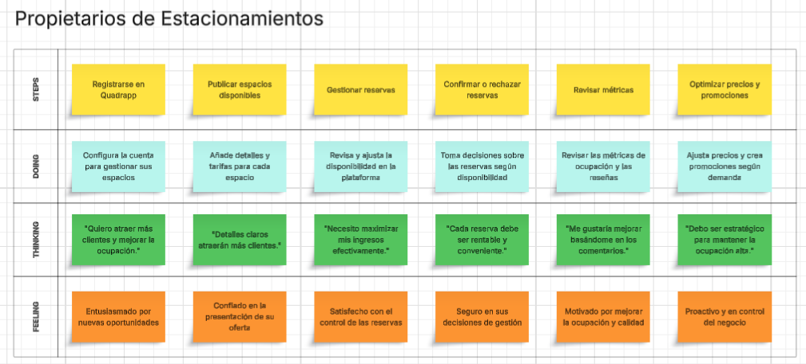

# <center>COURSE PROJECT</center>

<p align="center">
    <strong>Universidad Peruana de Ciencias Aplicadas</strong><br>
    </img><br>
    <strong>Ingeniería de Software</strong><br>
    <strong>Curso: Diseño de Experimentos de Ingeniería de Software</strong><br>
    <strong>Profesor: Ivan Robles Fernández </strong><br>
    <br>INFORME TRABAJO FINAL
</p>

<center>

#### Startup: PCC
#### Product: Quadrapp

</center>

### <center>Team  Members:</center>
<center>

| Codigo                           | Miembro       |
|----------------------------------|------------|
|  U20211G163 | Solis Solis, Leonardo José|
|  U202215462 | Nanfuñay Liza, Pedro Jesús|
|  U202121935 | Calisaya Sánchez, Juan Jesús|
|  U202213423 | Oneglio De Paz, Beth Shantal|
|  U202121975 | Lagos Aguilar, Luis Eduardo|

<br> AGOSTO 2025
</center>  
<div style="page-break-after: always;"></div>

# Registro de Versiones del Informe
<center>

| Version | Fecha | Autor | Descripcion de Modificacion |
| ----------- | ----------- | ----------- | ----------- |
| 0.0 | 01/09/2025 |Grupo 1 |Se crea el documento |  

</center>

# Project Report Collaboration Insights
[URL del repositorio](https://www.example.com)

(Imagenes de los commits cada entrega)


# Contenido


[Registro de Versiones del Informe](#registro-de-versiones-del-informe)

[Project Report Collaboration Insights](#project-report-collaboration-insights)

[Student Outcome](#student-outcome)

[Capítulo I: Introducción](#capítulo-i-introducción)

[1.1 Startup Profile](#11-startup-profile)  
[1.1.1. Descripción de la Startup](#111-descripción-de-la-startup)  
[1.1.2. Perfiles de integrantes del equipo](#112-perfiles-de-integrantes-del-equipo)  

[1.2. Solution Profile](#12-solution-profile)  
[1.2.1 Antecedentes y problemática](#121-antecedentes-y-problemática)  
[1.2.2 Lean UX Process.](#122-lean-ux-process)  
[1.2.2.1. Lean UX Problem Statements.](#1221-lean-ux-problem-statements)  
[1.2.2.2. Lean UX Assumptions.](#1222-lean-ux-assumptions)  
[1.2.2.3. Lean UX Hypothesis Statements.](#1223-lean-ux-hypothesis-statements)  
[1.2.2.4. Lean UX Canvas.](#1224-lean-ux-canvas)  

[1.3. Segmentos objetivo.](#13-segmentos-objetivo)  

[Capítulo II: Requirements Elicitation & Analysis](#capítulo-ii-requirements-elicitation--analysis)  

[2.1. Competidores](#21-competidores)  
[2.1.1. Análisis competitivo](#211-análisis-competitivo)  
[2.1.2. Estrategias y tácticas frente a competidores](#211-análisis-competitivo)  

[2.2. Entrevistas](#22-entrevistas)  
[2.2.1. Diseño de entrevistas](#221-diseño-de-entrevistas)  
[2.2.2. Registro de entrevistas](#222-registro-de-entrevistas)  
[2.2.3. Análisis de entrevistas](#223-análisis-de-entrevistas)  

[2.3. Needfinding](#23-needfinding)  
[2.3.1. User Personas](#231-user-personas)  
[2.3.2. User Task Matrix](#232-user-task-matrix)  
[2.3.3. User Journey Mapping](#233-user-journey-mapping)  
[2.3.4. Empathy Mapping](#234-empathy-mapping)  
[2.3.5. As-is Scenario Mapping](#235-as-is-scenario-mapping)

[2.4. Ubiquitous Language](#25-ubiquitous-language)  

[Capítulo III: Requirements Specification](#capítulo-iii-requirements-specification)  

[3.1. To-Be Scenario Mapping](#31-to-be-scenario-mapping)  
[3.2. User Stories](#32-user-stories)  
[3.3. Product Backlog](#33-product-backlog)  
[3.4. Impact Mapping](#34-impact-mapping)  

[Capítulo IV: Product Design](#capítulo-v-product-design)  
[4.1. Style Guidelines.](#41-style-guidelines)  
[4.1.1. General Style Guidelines.](#411-general-style-guidelines)  
[4.1.2. Web, Mobile and IoT Style Guidelines.](#412-web-mobile-and-iot-style-guidelines)  
[4.2. Information Architecture.](#42-information-architecture)  
[4.2.1. Organization Systems.](#421-organization-systems)  
[4.2.2. Labeling Systems.](#422-labeling-systems)  
[4.2.3. SEO Tags and Meta Tags](#423-seo-tags-and-meta-tags)  
[4.2.4. Searching Systems.](#424-searching-systems)  
[4.2.5. Navigation Systems.](#425-navigation-systems)  
[4.3. Landing Page UI Design.](#43-landing-page-ui-design)  
[4.3.1. Landing Page Wireframe.](#431-landing-page-wireframe)  
[4.3.2. Landing Page Mock-up.](#432-landing-page-mock-up)  
[4.4. Mobile Applications UX/UI Design.](#44-mobile-applications-uxui-design)  
[4.4.1. Mobile Applications Wireframes.](#441-applications-wireframes)  
[4.4.2. Mobile Applications Wireflow Diagrams.](#442-applications-wireflow-diagrams)  
[4.4.3. Mobile Applications Mock-ups.](#443-applications-mock-ups)  
[4.4.4. Mobile Applications User Flow Diagrams.](#444-applications-user-flow-diagrams)  
[4.5. Mobile Applications Prototyping.](#45-applications-prototyping)  
[4.5.1. Android Mobile Applications Prototyping.](#451-android-mobile-applications-prototyping)  
[4.5.2. iOS Mobile Applications Prototyping.](#452-ios-mobile-applications-prototyping)  

[4.6. Web Applications UX/UI Design.](#46-web-applications-uxui-design)  
[4.6.1. Web Applications Wireframes.](#461-web-applications-wireframes)  
[4.6.2. Web Applications Wireflow Diagrams.](#462-web-applications-wireflow-diagrams)  
[4.6.3. Web Applications Mock-ups.](#463-web-applications-mock-ups)  
[4.6.4. Web Applications User Flow Diagrams.](#464-web-applications-user-flow-diagrams)  

[4.7. Web Applications Prototyping.](#47-web-applications-prototyping)  

[4.8. Domain-Driven Software Architecture.](#48-domain-driven-software-architecture)  
[4.8.1. Software Architecture Context Diagram.](#481-software-architecture-context-diagram)  
[4.8.2. Software Architecture Container Diagrams.](#482-software-architecture-container-diagrams)  
[4.8.3. Software Architecture Components Diagrams.](#483-software-architecture-components-diagrams)  

[4.9. Software Object-Oriented Design.](#49-software-object-oriented-design)  
[4.9.1. Class Diagrams.](#491-class-diagrams)  
[4.9.2. Class Dictionary.](#492-class-dictionary)  

[4.10. Database Design.](#410-database-design)  
[4.10.1. Relational/Non-Relational Database Diagram.](#4101-relational-non-relational-database-diagram)  

[Capítulo V: Product Implementation](#capítulo-v-product-implementation)  

[5.1. Software Configuration Management.](#51-software-configuration-management)  
[5.1.1. Software Development Environment Configuration.](#511-software-development-environment-configuration)  
[5.1.2. Source Code Management.](#512-source-code-management)  
[5.1.3. Source Code Style Guide & Conventions](#513-source-code-style-guide-conventions)  
[5.1.4. Software Deployment Configuration](#514-software-deployment-configuration)  

[5.2. Product Implementation & Deployment.](#52-product-implementation-deployment)  
[5.2.1. Sprint Backlogs.](#521-sprint-backlogs)  
[5.2.2. Implemented Landing Page Evidence.](#522-implemented-landing-page-evidence)  
[5.2.3. Implemented Frotend-Web Application Evidence.](#523-implemented-frontend-web-application-evidence)  
[5.2.4. Implemented Native-Mobile Application Evidence.](#524-implemented-native-mobile-application-evidence)  
[5.2.5. Implemented RESTful API and/or Serverless Backend Evidence.](#525-implemented-restful-api-and-or-serverless-backend-evidence)  
[5.2.6. RESTful API Documentation.](#526-restful-api-documentation)  
[5.2.7. Team Collaboration Insights.](#527-team-collaboration-insights)  

[5.3. Video About-the-Product](#54-video-about-the-product)  

[Conclusiones](#conclusiones)  
[Conclusiones y recomendaciones](#conclusiones-y-recomendaciones)  
[Bibliografía](#bibliografía)  
[Anexos](#anexos)  

# Student Outcome
|Criterio Especifico|Acciones Realizadas|Conclusiones|
|-|-|-|
|Trabaja en equipo para proporcionar liderazgo en forma conjunta.|Compañero1:<br> *TB1:*  <p>* texto etc.. </p> |TB1 <p>Conclusion</p>|
|Trabaja en equipo para proporcionar liderazgo en forma conjunta|Compañero1:<br> *TB1:*  <p>* texto etc.. </p> |TB1 <p>Conclusion</p>|
# Capítulo I: Introducción
## 1.1. Startup Profile
### 1.1.1. Descripción de la Startup
#### 1.1.2. Perfiles de integrantes del equipo
|Miembros del equipo | Codigo Estudiante | Carrera | Conocimientos / Habilidades |
|-|-|-|-|
|Compañero 1 	|U20...|Ingenieria de software|C++, piton .etc|

## 1.2. Solution Profile
### 1.2.1 Antecedentes y problemática
### 1.2.2 Lean UX Process.
#### 1.2.2.1. Lean UX Problem Statements.
#### 1.2.2.2. Lean UX Assumptions.
|Business Assumptions|User Assumptions|
|-|-|
|1. - 12. |1. - 6.|
#### 1.2.2.3. Lean UX Hypothesis Statements.
Texto
#### 1.2.2.4. Lean UX Canvas.
(imagen con texto)
## 1.3. Segmentos objetivo.
| | Segmento 1 | Segmento 2  |
| - | - |-|
| Variables                 |  |  |
| Geográfica                |  |  |
| Demográfica               |  |  |
| Psicológica               |  |  |
| Función de comportamiento |  |  |

---

# Capítulo II: Requirements Elicitation & Analysis
## 2.1. Competidores.
### 2.1.1. Análisis competitivo.

| Competitive Analysis Landscape                          |  |
| ------------------------------------------------------- | -|
| ¿Por qué llevar a cabo este análisis?                   | -- |


| |  | (Nosotros) | Competidor  | Comptdor |
|-|-|-|-|-|
| PERFIL| Overview | lorem | ipsum | lorem |
|| Ventaja competitiva ¿Qué valor ofrece a los clientes? |  ipsu | impuz |
|| Mercado Objetivo                                        | Jeda | asa | asa2 |
| Perfil de marketing                                     | Estrategia de Marketing | Redes Sociales | Redes Sociales | Televisión, Redes Sociales |
| Perfil del producto                                     | Productos y servicios | Elementos Gráficos Interactivos Enseñanza de Matemáticas Lúdica y Autodidacta Educación matemática interactiva Ámbito Freemium | Educación matemática interactiva Mas de 100 cursos en 28 idiomas diferentes | Educación general interactiva Contratos con Movistar |
|| Precios y costos                                        | Freemium (Cuenta Premium permite personalizar los juegos) Gratis | Gratuito | Gratuito |
|| Canales de distribución (Web y/o Móvil)                 | Web y Móvil Web | Móvil Web | Web y móvil Web |
### 2.1.2. Estrategias y tácticas frente a competidores.


|Competidores ->|  | Nosotros | Competidor2| Competidor3|
|-|-|-|-|-|
| Análisis SWOT | Fortalezas | lorem | Lorem | lorem |
|| Debilidades   | lorem | lorem | lorem | lorem | 
|| Oportunidades | lorem | lorem | lorem | lorem | 
|| Amenazas      | lorem | lorem | lorem | lorem |

## 2.2. Entrevistas.
### 2.2.1. Diseño de entrevistas.
Preguntas generales:

1. ¿Cuál es su nombre? 
2. ¿Qué edad tiene? 
3. ¿A qué se dedica? 
4. ¿[Opinion de idea de propuesta]? 

Entrevistas usuario segmento 2
1. ¿Lorem?
2. ¿Lorem?
3. ¿Lorem?
4. ¿Lorem?  
   
Entrevistas usuario segmento 2
1. ¿Lorem? 
2. ¿Lorem?
3. ¿Lorem?
4. ¿Lorem? 
### 2.2.2. Registro de entrevistas.
Segmento 1  
Nombre: _____
Edad: _ años 
Ocupación: _____  
  
{texto mucho}

Segmento 2  
Nombre: _____
Edad: _ años 
Ocupación: _____  

{texto}

### 2.2.3. Análisis de entrevistas.
Segmento 1:
{texto}
Segmento 2:
{texto}
## 2.3. Needfinding.
### 2.3.1. User Personas.
Segmento 1:  


Segmento 2:


### 2.3.2. User Task Matrix.
| --- | ------ | Segmento 1  | ------/----- | Segmento 2  | ---------- |
| --- | ------ | ----------- | ------------ | ----------- | ---------- |
| ID  | Titulo | Importancia | Frecuencia   | Importancia | Frecuencia |
| U01X| {Texto}| Alta        | Alta         | Media       | Baja       |
### 2.3.3. User Journey Mapping.
Registration:
Why would they trust us?
- s
- s
- s
  
Onboarding and first use:
How can they feel successful?
- s
- s
- s  
  
Sharing:
Why would they invite others?
- s
- s
- s

### 2.3.4. Empathy Mapping.
Segmento 1:


Segmento 2:

### 2.3.5. As-is Scenario Mapping.

Segmento 1  
Escenario: {escenario}

As Is:
| Fases| Fase 1 | Fase 2| Fase 3| Fase 4|
| -------- | --------- | --------- | ------- | --------- |
| Doing | texto| texto | texto| texto|
| Thinking | texto| texto | texto| texto|
| Feeling  | texto| texto | texto| texto|

Segmento 2  
Escenario: Dificultad para entender Matemáticas

As Is:
| Fases| Fase 1 | Fase 2| Fase 3| Fase 4|
| -------- | --------- | --------- | ------- | --------- |
| Doing | texto| texto | texto| texto|
| Thinking | texto| texto | texto| texto|
| Feeling  | texto| texto | texto| texto|
## 2.4 Big Picture EventStorming.

## 2.5. Ubiquitous Language.
```
Texto ubiquo: Definicion de este
```

---

# Capítulo III: Requirements Specification

## 3.1. To-Be Scenario Mapping.

Segmento 1 - Conductores Urbanos Frecuentes: <br>
El "To-Be Scenario Mapping" para Conductores Urbanos Frecuentes muestra los resultados esperados para los conductores urbanos frecuentes que necesitan tener rápido acceso a estacionamientos.

Escenario ideal para usuarios frecuentes que buscan estacionarse sin complicaciones.


<br>

Segmento 2 - Propietarios de estacionamientos: <br>
El "To-Be Scenario Mapping" para Propietarios de Estacionamientos muestra los resultados esperados para la gestión de estacionamientos brindadas por Quadrapp.

Escenario ideal para usuarios frecuentes que buscan estacionar sin complicaciones.



## 3.2. User Stories.

#### EPICS

Las epics definidas para el proyecto Quadrapp están diseñadas para abordar las necesidades clave de los usuarios y el equipo de desarrollo. Estas epics cubren funcionalidades críticas para la plataforma de gestión de estacionamiento en tiempo real, asegurando que tanto los visitantes como los desarrolladores puedan interactuar eficazmente con el sistema.

| Epic / Story ID | Título                        | Descripción                                                                                                                                                                        |
| ------------------------- | ---------------------------------------- | --------------------------------------------------------------------------------------------------------------------------------------------------------------------------------------------- |
| EP01            | Navegación en Landing Page              | Como visitante de Quadrapp, deseo poder navegar de forma intuitiva por la landing page para acceder rápidamente a información importante y funciones clave. |
| EP02            | Autenticación y Registro de Usuarios    | Como visitante, deseo registrarme e iniciar sesión utilizando correo electrónico o redes sociales para acceder de manera conveniente y segura.                |
| EP03            | Recuperación de Contraseña             | Como visitante, deseo recuperar mi contraseña fácilmente para poder acceder a mi cuenta en caso de olvido.                                                    |
| EP04            | Visualización de Servicios y Beneficios | Como visitante, deseo conocer los servicios y beneficios de Quadrapp desde la landing page para entender cómo la plataforma puede ayudarme.                  |
| EP05            | Soporte y FAQ                            | Como visitante, deseo acceder a una sección de soporte y preguntas frecuentes para resolver mis dudas de manera rápida y autónoma.                           |
| EP06            | Conexión con Redes Sociales             | Como visitante, deseo conectar mi cuenta de Quadrapp con mis redes sociales para compartir mi experiencia y obtener beneficios adicionales.                   |
| EP07            | Búsqueda de Estacionamientos            | Como visitante, deseo buscar estacionamientos y ver la disponibilidad en tiempo real para elegir el mejor lugar antes de dirigirme.                             |
| EP08            | Disponibilidad en Tiempo Real            | Como visitante, deseo visualizar la disponibilidad de los estacionamientos actualizada automáticamente para evitar reservas en espacios ocupados.              |
| EP09            | Gestión de Reservas                     | Como visitante, deseo poder realizar, modificar y cancelar mis reservas de estacionamiento para ajustar mis planes con flexibilidad.                            |
| EP10            | Gestión de Perfil de Usuario            | Como visitante, deseo actualizar y gestionar mi perfil de usuario para mantener mi información y preferencias personalizadas.                                  |
| EP11            | Notificaciones en Tiempo Real            | Como visitante, deseo recibir notificaciones sobre eventos importantes y mis reservas para estar informado de manera oportuna.                                  |
| EP12            | Integración con Mapas                   | Como visitante, deseo ver rutas y ubicaciones de estacionamientos mediante integración con mapas para optimizar mi tiempo y desplazamiento.                    |
| EP13            | Funcionalidad de Favoritos               | Como visitante, deseo marcar estacionamientos como favoritos para acceder rápidamente a los lugares que uso frecuentemente.                                    |
| EP14            | Opiniones y Calificaciones               | Como visitante, deseo dejar y leer opiniones de otros usuarios sobre los estacionamientos para tomar decisiones informadas.                                     |
| EP15            | Seguridad y Privacidad de Datos          | Como visitante, deseo que mis datos personales y de pago estén protegidos con altos estándares de seguridad para sentirme seguro usando la app.               |
| EP16            | Optimización de Backend                 | Como developer, deseo mejorar la eficiencia del backend para consultas y búsquedas para reducir los tiempos de espera y mejorar el rendimiento.                |
| EP17            | Gestión de Promociones y Beneficios     | Como visitante, deseo acceder a promociones y beneficios personalizados para maximizar mis ahorros y recompensas.                                               |
| EP18            | Administración de Reservas en Backend   | Como developer, deseo gestionar las reservas en el backend para asegurar que los datos de reserva sean consistentes y actualizados en la plataforma.            |
| EP19            | Gestión de Pagos y Transacciones        | Como visitante, deseo realizar pagos seguros y gestionar mis transacciones en la app para completar el proceso de reserva de manera confiable.                  |

<br>

#### User Stories

Los User Stories para el proyecto Quadrapp están orientadas a mejorar la experiencia del usuario final y facilitar las tareas del equipo de desarrollo. Estas historias cubren múltiples aspectos de la plataforma, incluyendo la landing page, la integración y mejora del backend, el desarrollo de interfaces de usuario eficientes en el frontend y mobile aplication. Cada historia está diseñada para ser fácilmente comprensible y directamente aplicable, con criterios de aceptación específicos que guían el desarrollo y aseguran que las funcionalidades implementadas satisfagan los requisitos del negocio y las expectativas del usuario final.

<table border="1" cellspacing="0" cellpadding="5">
  <tr>
    <td>Story ID</td>
    <td>User</td>
    <td>Priority</td>
    <td>Epic</td>
  </tr>
  <tr>
    <td>US01</td>
    <td>Visitante</td>
    <td>Alta</td>
    <td>EP01</td>
  </tr>
  <tr>
    <td>Title</td>
    <td colspan="3">Navegación Intuitiva en la Landing Page</td>
  </tr>
  <tr>
    <td colspan="4">Description</td>
  </tr>
  <tr>
    <td colspan="4">Como visitante de Quadrapp, deseo que la landing page tenga una barra de navegación clara y accesible para encontrar fácilmente las secciones importantes.</td>
  </tr>
  <tr>
    <td colspan="4">Acceptance Criteria</td>
  </tr>
  <tr>
    <td colspan="4">Escenario 01: </strong>  Given que estoy en la landing page, When hago clic en el menú de navegación, Then debería ver opciones claras como "Inicio", "Características", "Reservar Espacio" y "Contáctenos". <br> Escenario 02: Given que navego por la página, When paso el mouse por los elementos del menú, Then deberían resaltarse para indicar que son interactivos.</td>
  </tr>

  <tr>
    <td>US02</td>
    <td>Visitante</td>
    <td>Alta</td>
    <td>EP04</td>
  </tr>
  <tr>
    <td>Title</td>
    <td colspan="3">Visualización de Ciudades con Servicio</td>
  </tr>
  <tr>
    <td colspan="4">Description</td>
  </tr>
  <tr>
    <td colspan="4">Como visitante, deseo ver en la landing page las ciudades donde Quadrapp está disponible para saber si puedo utilizar el servicio en mi ubicación.</td>
  </tr>
  <tr>
    <td colspan="4">Acceptance Criteria</td>
  </tr>
  <tr>
    <td colspan="4">Escenario 01: Given que estoy en la landing page, When desplazo hacia la sección de ciudades, Then debería ver información sobre las ciudades como Lima, Arequipa y Cusco. <br> Escenario 02: Given que selecciono una ciudad, When hago clic en la información de la ciudad, Then debería ver detalles adicionales de esa ubicación.
  </tr>

  <tr>
    <td>US03</td>
    <td>Visitante</td>
    <td>Alta</td>
    <td>EP05</td>
  </tr>
  <tr>
    <td>Title</td>
    <td colspan="3">Promociones Destacadas</td>
  </tr>
  <tr>
    <td colspan="4">Description</td>
  </tr>
  <tr>
    <td colspan="4">Como visitante, deseo ver promociones destacadas en la landing page para aprovechar descuentos y beneficios en las ciudades disponibles.</td>
  </tr>
  <tr>
    <td colspan="4">Acceptance Criteria</td>
  </tr>
  <tr>
    <td colspan="4">Escenario 01: Given que estoy en la landing page, When desplazo hacia la sección de promociones, Then debería ver promociones específicas como "Promoción en Lima" y "Promoción en Cusco". <br> Escenario 02: Given que hago clic en una promoción, When selecciono una promoción específica, Then debería llevarme a una página de detalles de la promoción.
  </tr>

  <tr>
    <td>US04</td>
    <td>Visitante</td>
    <td>Alta</td>
    <td>EP04</td>
  </tr>
  <tr>
    <td>Title</td>
    <td colspan="3">Beneficios para Conductores y Dueños de estacionamiento</td>
  </tr>
  <tr>
    <td colspan="4">Description</td>
  </tr>
  <tr>
    <td colspan="4">Como visitante, deseo ver una sección en la landing page que me explique los beneficios de usar Quadrapp para entender las ventajas que ofrece.</td>
  </tr>
  <tr>
    <td colspan="4">Acceptance Criteria</td>
  </tr>
  <tr>
    <td colspan="4">Escenario 01: Given que estoy en la landing page, When desplazo hacia la sección de beneficios, Then debería ver información sobre beneficios para conductores y dueños de estacionamiento. <br> Escenario 02: Given que quiero más detalles, When hago clic en un beneficio específico, Then debería expandirse con más información.
  </tr>

  <tr>
    <td>US05</td>
    <td>Visitante</td>
    <td>Alta</td>
    <td>EP06</td>
  </tr>
  <tr>
    <td>Title</td>
    <td colspan="3">Visualización de Misión de la Empresa</td>
  </tr>
  <tr>
    <td colspan="4">Description</td>
  </tr>
  <tr>
    <td colspan="4">Como visitante, deseo ver una sección en la landing page que me explique los beneficios de usar Quadrapp para entender las ventajas que ofrece.</td>
  </tr>
  <tr>
    <td colspan="4">Acceptance Criteria</td>
  </tr>
  <tr>
    <td colspan="4">Escenario 01: Given que estoy en la landing page, When desplazo hacia la sección de beneficios, Then debería ver información sobre beneficios para conductores y dueños de estacionamiento. <br> Escenario 02: Given que quiero más detalles, When hago clic en un beneficio específico, Then debería expandirse con más información.
  </tr>

  <tr>
    <td>US06</td>
    <td>Visitante</td>
    <td>Alta</td>
    <td>EP06</td>
  </tr>
  <tr>
    <td>Title</td>
    <td colspan="3">Visualización de Visión de la Empresa</td>
  </tr>
  <tr>
    <td colspan="4">Description</td>
  </tr>
  <tr>
    <td colspan="4">Como visitante, deseo ver la visión de Quadrapp en la landing page para conocer sus metas futuras y crecimiento.</td>
  </tr>
  <tr>
    <td colspan="4">Acceptance Criteria</td>
  </tr>
  <tr>
    <td colspan="4">Escenario 01: Given que estoy en la landing page, When desplazo hacia la sección de"Visión",Then debería ver una breve descripción de la visión de la empresa. <br> Escenario 02: Given que quiero conocer más detalles, When hago clic en "Leer más" en la sección de visión, Then debería ver una descripción completa de los objetivos futuros.
  </tr>

  <tr>
    <td>US07</td>
    <td>Visitante</td>
    <td>Alta</td>
    <td>EP04</td>
  </tr>
  <tr>
    <td>Title</td>
    <td colspan="3">Visualización del Equipo</td>
  </tr>
  <tr>
    <td colspan="4">Description</td>
  </tr>
  <tr>
    <td colspan="4">Como visitante, deseo ver una sección que muestre a los miembros del equipo de Quadrapp para conocer quiénes están detrás del proyecto.</td>
  </tr>
  <tr>
    <td colspan="4">Acceptance Criteria</td>
  </tr>
  <tr>
    <td colspan="4">Escenario 01: Given que estoy en la landing page, When desplazo hacia la sección "Our Team", Then debería ver fotos y descripciones de cada miembro del equipo. <br> Escenario 02: Given que estoy en la sección del equipo, When hago clic en la imagen de un miembro, Then debería ver información detallada sobre sus roles y experiencia. 
  </tr>

  <tr>
    <td>US08</td>
    <td>Visitante</td>
    <td>Alta</td>
    <td>EP07</td>
  </tr>
  <tr>
    <td>Title</td>
    <td colspan="3">Información de Contacto</td>
  </tr>
  <tr>
    <td colspan="4">Description</td>
  </tr>
  <tr>
    <td colspan="4">Como visitante, deseo ver una sección de contacto en la landing page para saber cómo comunicarme con Quadrapp si tengo preguntas o comentarios.</td>
  </tr>
  <tr>
    <td colspan="4">Acceptance Criteria</td>
  </tr>
  <tr>
    <td colspan="4">Escenario 01: Given que estoy en la landing page, When desplazo hacia la sección "Contact Us", Then debería ver un formulario para ingresar nombre, correo electrónico y mensaje. <br> Escenario 02: Given que estoy en la sección de contacto, When hago clic en "Enviar Mensaje" sin llenar todos los campos, Then debería ver un mensaje de error indicando que todos los campos son obligatorios. 
  </tr>

  <tr>
    <td>US09</td>
    <td>Visitante</td>
    <td>Alta</td>
    <td>EP07</td>
  </tr>
  <tr>
    <td>Title</td>
    <td colspan="3">Envío de Mensaje de Contacto</td>
  </tr>
  <tr>
    <td colspan="4">Description</td>
  </tr>
  <tr>
    <td colspan="4">Como visitante, deseo poder enviar un mensaje a Quadrapp desde la landing page para hacer preguntas o dar feedback.</td>
  </tr>
  <tr>
    <td colspan="4">Acceptance Criteria</td>
  </tr>
  <tr>
    <td colspan="4">Escenario 01: Given que estoy en la sección de contacto, When ingreso mi nombre, correo y mensaje y hago clic en "Enviar Mensaje", Then debería ver una confirmación de que el mensaje fue enviado exitosamente. <br> Escenario 02: Given que he enviado un mensaje, When el envío es exitoso, Then debería recibir un correo de confirmación indicando que Quadrapp ha recibido mi mensaje.
  </tr>

<tr>
  <td>US10</td>
  <td>Visitante</td>
  <td>Alta</td>
  <td>EP04</td>
</tr>
<tr>
  <td>Title</td>
  <td colspan="3">Visualización de Información de Características</td>
</tr>
<tr>
  <td colspan="4">Description</td>
</tr>
<tr>
  <td colspan="4">Como visitante, deseo ver las características de Quadrapp en la landing page para entender qué ofrece el servicio.</td>
</tr>
<tr>
  <td colspan="4">Acceptance Criteria</td>
</tr>
<tr>
  <td colspan="4">Escenario 01: Given que estoy en la landing page, When desplazo hacia la sección de características, Then debería ver una descripción de las características principales de Quadrapp. <br> Escenario 02: Given que quiero conocer más detalles, When hago clic en una característica específica, Then debería abrirse una ventana emergente con información adicional.</td>
</tr>

<tr>
  <td>US11</td>
  <td>Visitante</td>
  <td>Alta</td>
  <td>EP02</td>
</tr>
<tr>
  <td>Title</td>
  <td colspan="3">Botón de Registro e Inicio de Sesión</td>
</tr>
<tr>
  <td colspan="4">Description</td>
</tr>
<tr>
  <td colspan="4">Como visitante, deseo ver botones destacados de "Registrarse" e "Iniciar Sesión" en la landing page para acceder a la plataforma o crear una cuenta fácilmente.</td>
</tr>
<tr>
  <td colspan="4">Acceptance Criteria</td>
</tr>
<tr>
  <td colspan="4">Escenario 01: Given que estoy en la landing page, When veo la sección superior de la página, Then deberían estar visibles los botones de "Iniciar Sesión" y "Registrarse". <br> Escenario 02: Given que hago clic en "Iniciar Sesión", When no tengo una cuenta creada, Then debería ver una opción para registrarme rápidamente.</td>
</tr>

<tr>
  <td>US12</td>
  <td>Visitante</td>
  <td>Media</td>
  <td>EP06</td>
</tr>
<tr>
  <td>Title</td>
  <td colspan="3">Enlace a Redes Sociales</td>
</tr>
<tr>
  <td colspan="4">Description</td>
</tr>
<tr>
  <td colspan="4">Como visitante, deseo ver enlaces a las redes sociales de Quadrapp en la landing page para seguir sus novedades y actualizaciones.</td>
</tr>
<tr>
  <td colspan="4">Acceptance Criteria</td>
</tr>
<tr>
  <td colspan="4">Escenario 01: Given que estoy en la landing page, When desplazo hacia el pie de página, Then debería ver íconos de redes sociales que me lleven a las cuentas oficiales de Quadrapp. <br> Escenario 02: Given que hago clic en un ícono de redes sociales, When selecciono Facebook, Then debería redirigirme a la página oficial de Quadrapp en Facebook.</td>
</tr>

<tr>
  <td>US13</td>
  <td>Visitante</td>
  <td>Media</td>
  <td>EP04</td>
</tr>
<tr>
  <td>Title</td>
  <td colspan="3">Visualización de Slogan</td>
</tr>
<tr>
  <td colspan="4">Description</td>
</tr>
<tr>
  <td colspan="4">Como visitante, deseo ver un slogan atractivo en la landing page de Quadrapp para entender de inmediato la propuesta del servicio.</td>
</tr>
<tr>
  <td colspan="4">Acceptance Criteria</td>
</tr>
<tr>
  <td colspan="4">Escenario 01: Given que estoy en la landing page, When veo la sección principal, Then debería encontrar un slogan o mensaje atractivo que me introduzca al servicio. <br> Escenario 02: Given que el slogan aparece en la sección principal, When paso a otra sección y vuelvo a la principal, Then el slogan debería mantenerse visible.</td>
</tr>

<tr>
  <td>US14</td>
  <td>Visitante</td>
  <td>Media</td>
  <td>EP13</td>
</tr>
<tr>
  <td>Title</td>
  <td colspan="3">Acceso a Información Legal</td>
</tr>
<tr>
  <td colspan="4">Description</td>
</tr>
<tr>
  <td colspan="4">Como visitante, deseo ver enlaces a la información legal y políticas de privacidad en la landing page para revisar los términos de uso y la protección de mis datos.</td>
</tr>
<tr>
  <td colspan="4">Acceptance Criteria</td>
</tr>
<tr>
  <td colspan="4">Escenario 01: Given que estoy en la landing page, When desplazo hacia el pie de página, Then debería ver enlaces a las políticas de privacidad y términos de servicio. <br> Escenario 02: Given que hago clic en el enlace de política de privacidad, When se abre el documento, Then debería ver la información completa de privacidad en una nueva página o ventana.</td>
</tr>

<tr>
  <td>US15</td>
  <td>Conductor</td>
  <td>Alta</td>
  <td>EP11</td>
</tr>
<tr>
  <td>Title</td>
  <td colspan="3">Inicio de Sesión para Conductores</td>
</tr>
<tr>
  <td colspan="4">Description</td>
</tr>
<tr>
  <td colspan="4">Como conductor interesado en usar Quadrapp, deseo iniciar sesión con mi cuenta registrada anteriormente para acceder a la aplicación.</td>
</tr>
<tr>
  <td colspan="4">Acceptance Criteria</td>
</tr>
<tr>
  <td colspan="4">Escenario 01: Given que el conductor ingresa su correo y contraseña, When hace clic en "Iniciar sesión", Then debe acceder a su dashboard de conductor si las credenciales son correctas. <br> Escenario 02: Given que el conductor ingresa credenciales incorrectas, When intenta iniciar sesión, Then debe mostrarse un mensaje de error indicando que las credenciales son inválidas.</td>
</tr>

<tr>
  <td>US16</td>
  <td>Conductor</td>
  <td>Alta</td>
  <td>EP02</td>
</tr>
<tr>
  <td>Title</td>
  <td colspan="3">Registro de Conductores</td>
</tr>
<tr>
  <td colspan="4">Description</td>
</tr>
<tr>
  <td colspan="4">Como conductor interesado en usar Quadrapp, deseo registrar mi cuenta para acceder a la plataforma.</td>
</tr>
<tr>
  <td colspan="4">Acceptance Criteria</td>
</tr>
<tr>
  <td colspan="4">Escenario 01: Given que un nuevo conductor quiere registrarse, When ingresa los datos necesarios y hace clic en "Registrarse", Then debe recibir un mensaje de confirmación de cuenta creada. <br> Escenario 02: Given que el conductor intenta registrarse sin llenar los campos requeridos, When intenta completar el registro, Then debe mostrarse un mensaje de error solicitando los datos faltantes.</td>
</tr>

<tr>
  <td>US17</td>
  <td>Propietario de estacionamiento</td>
  <td>Alta</td>
  <td>EP02</td>
</tr>
<tr>
  <td>Title</td>
  <td colspan="3">Registro de Propietarios de estacionamiento</td>
</tr>
<tr>
  <td colspan="4">Description</td>
</tr>
<tr>
  <td colspan="4">Como propietario de estacionamiento, deseo registrar mi cuenta para hacer uso de las funcionalidades que me ofrece Quadrapp.</td>
</tr>
<tr>
  <td colspan="4">Acceptance Criteria</td>
</tr>
<tr>
  <td colspan="4">Escenario 01: Given que un dueño de estacionamiento quiere registrarse, When llena el formulario de registro y hace clic en "Registrarse", Then debe recibir un mensaje de confirmación de cuenta creada. <br> Escenario 02: Given que el formulario no está completo, When intenta registrarse, Then debe mostrarse un mensaje de error indicando los campos faltantes.</td>
</tr>

<tr>
  <td>US18</td>
  <td>Conductor</td>
  <td>Media</td>
  <td>EP04</td>
</tr>
<tr>
  <td>Title</td>
  <td colspan="3">Búsqueda de Reservas para Conductores</td>
</tr>
<tr>
  <td colspan="4">Description</td>
</tr>
<tr>
  <td colspan="4">Como conductor, deseo hacer uso de la búsqueda de reservas para visualizar mis reservas activas y pasadas.</td>
</tr>
<tr>
  <td colspan="4">Acceptance Criteria</td>
</tr>
<tr>
  <td colspan="4">Escenario 01: Given que el conductor quiere ver sus reservas, When ingresa al menú de reservas, Then debe ver una lista de todas sus reservas activas y completadas. <br> Escenario 02: Given que el conductor busca una reserva específica, When ingresa un criterio de búsqueda, Then debe mostrarse la reserva correspondiente si existe.</td>
</tr>

<tr>
  <td>US19</td>
  <td>Conductor</td>
  <td>Alta</td>
  <td>EP12</td>
</tr>
<tr>
  <td>Title</td>
  <td colspan="3">Pago de Reservas por Transacción</td>
</tr>
<tr>
  <td colspan="4">Description</td>
</tr>
<tr>
  <td colspan="4">Como conductor, deseo realizar el pago de mis reservas por transacción para completar mis reservas.</td>
</tr>
<tr>
  <td colspan="4">Acceptance Criteria</td>
</tr>
<tr>
  <td colspan="4">Escenario 01: Given que el conductor realiza una reserva, When selecciona "Pagar", Then debe ser dirigido a la pasarela de pago para completar la transacción. <br> Escenario 02: Given que el pago es exitoso, When se procesa el pago, Then debe recibir una confirmación de reserva y recibo de pago.</td>
</tr>

<tr>
  <td>US20</td>
  <td>Conductor</td>
  <td>Alta</td>
  <td>EP12</td>
</tr>
<tr>
  <td>Title</td>
  <td colspan="3">Confirmación de Reserva Registrada</td>
</tr>
<tr>
  <td colspan="4">Description</td>
</tr>
<tr>
  <td colspan="4">Como conductor, deseo que se muestre una pantalla de confirmación para asegurarme de que la reserva fue registrada correctamente.</td>
</tr>
<tr>
  <td colspan="4">Acceptance Criteria</td>
</tr>
<tr>
  <td colspan="4">Escenario 01: Given que el conductor completa una reserva, When el sistema confirma la transacción, Then debe ver una pantalla indicando que su reserva fue registrada con éxito. <br> Escenario 02: Given que el sistema no puede confirmar la reserva, When se produce un error en el pago, Then debe mostrarse un mensaje solicitando un nuevo intento de pago.</td>
</tr>

<tr>
  <td>US21</td>
  <td>Usuario</td>
  <td>Media</td>
  <td>EP11</td>
</tr>
<tr>
  <td>Title</td>
  <td colspan="3">Registro de Opiniones</td>
</tr>
<tr>
  <td colspan="4">Description</td>
</tr>
<tr>
  <td colspan="4">Como usuario, deseo registrar mis opiniones para dar mi retroalimentación sobre mis experiencias con las funcionalidades de la plataforma.</td>
</tr>
<tr>
  <td colspan="4">Acceptance Criteria</td>
</tr>
<tr>
  <td colspan="4">Escenario 01: Given que el usuario quiere dejar una opinión, When completa el formulario de opinión y hace clic en "Enviar", Then debe ver un mensaje de confirmación de que su opinión fue enviada. <br> Escenario 02: Given que el usuario intenta enviar una opinión sin completar los campos requeridos, When hace clic en "Enviar", Then debe recibir un mensaje indicando que los campos son obligatorios.</td>
</tr>

<tr>
  <td>US22</td>
  <td>Conductor</td>
  <td>Media</td>
  <td>EP09</td>
</tr>
<tr>
  <td>Title</td>
  <td colspan="3">Notificaciones en el Dashboard del Conductor</td>
</tr>
<tr>
  <td colspan="4">Description</td>
</tr>
<tr>
  <td colspan="4">Como conductor, deseo recibir notificaciones en mi dashboard para recibir alertas relevantes como ofertas o recordatorios de reservas.</td>
</tr>
<tr>
  <td colspan="4">Acceptance Criteria</td>
</tr>
<tr>
  <td colspan="4">Escenario 01: Given que el conductor ingresa a su dashboard, When hay notificaciones pendientes, Then debe ver un ícono indicando nuevas notificaciones. <br> Escenario 02: Given que el conductor visualiza una notificación, When hace clic en ella, Then debe acceder a detalles adicionales o redirigirse a la página correspondiente.</td>
</tr>

<tr>
  <td>US23</td>
  <td>Usuario</td>
  <td>Media</td>
  <td>EP08</td>
</tr>
<tr>
  <td>Title</td>
  <td colspan="3">Configuración de Preferencias de Usuario</td>
</tr>
<tr>
  <td colspan="4">Description</td>
</tr>
<tr>
  <td colspan="4">Como usuario, deseo configurar mis preferencias de uso para personalizar mi experiencia en la plataforma.</td>
</tr>
<tr>
  <td colspan="4">Acceptance Criteria</td>
</tr>
<tr>
  <td colspan="4">Escenario 01: Given que el usuario quiere modificar sus preferencias, When accede a "Configuración" y guarda los cambios, Then su perfil debe actualizarse con las nuevas preferencias. <br> Escenario 02: Given que el usuario cambia sus preferencias de notificación, When guarda la configuración, Then debe recibir notificaciones de acuerdo con sus preferencias.</td>
</tr>

<tr>
  <td>US24</td>
  <td>Conductor</td>
  <td>Media</td>
  <td>EP04</td>
</tr>
<tr>
  <td>Title</td>
  <td colspan="3">Historial de Reservas en el Dashboard del Conductor</td>
</tr>
<tr>
  <td colspan="4">Description</td>
</tr>
<tr>
  <td colspan="4">Como conductor, deseo visualizar mi historial de reservas para consultar mis reservas realizadas.</td>
</tr>
<tr>
  <td colspan="4">Acceptance Criteria</td>
</tr>
<tr>
  <td colspan="4">Escenario 01: Given que el conductor quiere revisar su historial, When accede a la sección de historial de reservas, Then debe ver una lista de todas sus reservas previas. <br> Escenario 02: Given que el conductor busca una reserva específica en el historial, When ingresa una fecha o nombre de estacionamiento, Then debería encontrar la reserva correspondiente.</td>
</tr>

<tr>
  <td>US25</td>
  <td>Conductor</td>
  <td>Media</td>
  <td>EP04</td>
</tr>
<tr>
  <td>Title</td>
  <td colspan="3">Alerta de Espacio Disponible</td>
</tr>
<tr>
  <td colspan="4">Description</td>
</tr>
<tr>
  <td colspan="4">Como conductor, deseo recibir alertas de disponibilidad de espacios para ser notificado cuando un espacio de mi interés esté disponible.</td>
</tr>
<tr>
  <td colspan="4">Acceptance Criteria</td>
</tr>
<tr>
  <td colspan="4">Escenario 01: Given que el conductor marca un estacionamiento como favorito, When un espacio en ese estacionamiento se desocupa, Then debería recibir una notificación en su dashboard. <br> Escenario 02: Given que el conductor recibe una alerta de disponibilidad, When hace clic en la notificación, Then debería ser redirigido a la página de reserva para ese espacio.</td>
</tr>

<tr> 
  <td>US26</td> 
  <td>Conductor</td> 
  <td>Alta</td> 
  <td>EP07</td> 
</tr> 
<tr> 
  <td>Title</td> 
  <td colspan="3">Soporte en Tiempo Real en el Dashboard del Conductor</td> 
</tr> 
<tr> 
  <td colspan="4">Description</td> 
</tr> 
<tr> 
  <td colspan="4">Como conductor, deseo un sistema de soporte en tiempo real para poder resolver mis dudas o problemas rápidamente.</td> 
</tr> 
<tr> 
  <td colspan="4">Acceptance Criteria</td> 
</tr> 
<tr> 
  <td colspan="4">Escenario 01: Given que el conductor necesita ayuda, When accede a la sección de soporte en el dashboard, Then debería ver opciones de contacto o un chat en tiempo real. <br> Escenario 02: Given que el conductor inicia una consulta de soporte, When envía su mensaje, Then debería recibir una respuesta o ver un mensaje de confirmación de recibido.</td> 
</tr>

<tr> 
  <td>US27</td> 
  <td>Conductor</td> 
  <td>Alta</td> 
  <td>EP04</td> 
</tr> 
<tr> 
  <td>Title</td> 
  <td colspan="3">Favoritos para Conductores</td> 
</tr> 
<tr> 
  <td colspan="4">Description</td> 
</tr> 
<tr> 
  <td colspan="4">Como conductor, deseo marcar estacionamientos de mi interés como favoritos para facilitar futuras reservas.</td> 
</tr> 
<tr> 
  <td colspan="4">Acceptance Criteria</td> 
</tr> 
<tr> 
  <td colspan="4">Escenario 01: Given que el conductor quiere agregar un estacionamiento a sus favoritos, When hace clic en el botón "Favorito" en el detalle del estacionamiento, Then debería ver el estacionamiento en su lista de favoritos. <br> Escenario 02: Given que el conductor quiere reservar un estacionamiento favorito, When accede a su lista de favoritos, Then debería ver una opción para hacer la reserva directamente.</td> 
</tr>

<tr> 
  <td>US28</td> 
  <td>Conductor</td> 
  <td>Alta</td> 
  <td>EP05</td> 
</tr> 
<tr> 
  <td>Title</td> 
  <td colspan="3">Verificación de Reserva en el Dashboard del Conductor</td> 
</tr> 
<tr> 
  <td colspan="4">Description</td> 
</tr> 
<tr> 
  <td colspan="4">Como conductor, deseo verificar el estado de mi reserva para confirmar si el espacio que deseo está listo para ocuparse.</td> 
</tr> 
<tr> 
  <td colspan="4">Acceptance Criteria</td> 
</tr> 
<tr> 
  <td colspan="4">Escenario 01: Given que el conductor quiere verificar el estado de su reserva, When accede a la sección de reservas activas, Then debe ver un estado que indique si la reserva está confirmada o en proceso. <br> Escenario 02: Given que el estado de la reserva cambia, When el conductor accede a la reserva, Then debe ver la información actualizada de inmediato.</td> 
</tr>

<tr> 
  <td>US29</td> 
  <td>Conductor</td> 
  <td>Alta</td> 
  <td>EP05</td> 
</tr> 
<tr> 
  <td>Title</td> 
  <td colspan="3">Cancelación de Reserva en el Dashboard</td> 
</tr> 
<tr> 
  <td colspan="4">Description</td> 
</tr> 
<tr> 
  <td colspan="4">Como conductor, deseo acceder a la opción de cancelar mi reserva para evitar inconvenientes en caso de cambio de planes.</td> 
</tr> 
<tr> 
  <td colspan="4">Acceptance Criteria</td> 
</tr> 
<tr> 
  <td colspan="4">Escenario 01: Given que el conductor tiene una reserva activa, When selecciona la opción de cancelación, Then debería ver una confirmación de cancelación y una notificación de reembolso si aplica. <br> Escenario 02: Given que el conductor cancela una reserva, When intenta reservar el mismo espacio de nuevo, Then el sistema debe permitir la nueva reserva si el espacio sigue disponible.</td> 
</tr>

<tr> 
  <td>US30</td> 
  <td>Conductor</td> 
  <td>Alta</td> 
  <td>EP09</td> 
</tr> 
<tr> 
  <td>Title</td> 
  <td colspan="3">Gestión de Alertas para Conductores</td> 
</tr> 
<tr> 
  <td colspan="4">Description</td> 
</tr> 
<tr> 
  <td colspan="4">Como conductor, deseo visualizar las alertas en mi dashboard para gestionar mis alertas de seguridad o disponibilidad.</td> 
</tr> 
<tr> 
  <td colspan="4">Acceptance Criteria</td> 
</tr> 
<tr> 
  <td colspan="4">Escenario 01: Given que el conductor tiene alertas pendientes, When accede a la sección de alertas en su dashboard, Then debe ver una lista de alertas recientes. <br> Escenario 02: Given que el conductor revisa una alerta específica, When hace clic en ella, Then debería ver detalles adicionales o sugerencias de acción.</td> 
</tr>

<tr> 
  <td>US31</td> 
  <td>Conductor</td> 
  <td>Alta</td> 
  <td>EP08</td> 
</tr> 
<tr> 
  <td>Title</td> 
  <td colspan="3">Personalización de Notificaciones para Conductores</td> 
</tr> 
<tr> 
  <td colspan="4">Description</td> 
</tr> 
<tr> 
  <td colspan="4">Como conductor, deseo personalizar mis preferencias de notificación para recibir solo las alertas que me interesan.</td> 
</tr> 
<tr> 
  <td colspan="4">Acceptance Criteria</td> 
</tr> 
<tr> 
  <td colspan="4">Escenario 01: Given que el conductor quiere personalizar sus notificaciones, When ajusta sus preferencias en la configuración, Then solo debería recibir las notificaciones seleccionadas. <br> Escenario 02: Given que el conductor cambia sus preferencias, When guarda la configuración, Then las futuras notificaciones deberían respetar estas preferencias.</td> 
</tr>

<tr> 
  <td>US32</td> 
  <td>Conductor</td> 
  <td>Alta</td> 
  <td>EP10</td> 
</tr> 
<tr> 
  <td>Title</td> 
  <td colspan="3">Visualización de Mapa en el Dashboard del Conductor</td> 
</tr> 
<tr> 
  <td colspan="4">Description</td> 
</tr> 
<tr> 
  <td colspan="4">Como conductor, deseo acceder a un mapa interactivo en el dashboard para ver ubicaciones de estacionamientos cercanos en tiempo real.</td> 
</tr> 
<tr> 
  <td colspan="4">Acceptance Criteria</td> 
</tr> 
<tr> 
  <td colspan="4">Escenario 01: Given que el conductor accede a su dashboard, When abre la sección de mapa, Then debería ver ubicaciones de estacionamientos cercanos con disponibilidad en tiempo real. <br> Escenario 02: Given que el conductor selecciona una ubicación en el mapa, When hace clic en ella, Then debería ver opciones para realizar una reserva en esa ubicación.</td> 
</tr>

<tr> 
  <td>US33</td> 
  <td>Conductor</td> 
  <td>Alta</td> 
  <td>EP05</td> 
</tr> 
<tr> 
  <td>Title</td> 
  <td colspan="3">Seguimiento de Reserva en Tiempo Real</td> 
</tr> 
<tr> 
  <td colspan="4">Description</td> 
</tr> 
<tr> 
  <td colspan="4">Como conductor, deseo hacer seguimiento en tiempo real de mi reserva para ver el estado del mismo en todo momento.</td> 
</tr> 
<tr> 
  <td colspan="4">Acceptance Criteria</td> 
</tr> 
<tr> 
  <td colspan="4">Escenario 01: Given que el conductor tiene una reserva activa, When accede a la sección de seguimiento, Then debería ver el estado en tiempo real de su reserva. <br> Escenario 02: Given que el estado de la reserva cambia, When el conductor revisa la reserva, Then debería ver el cambio reflejado de inmediato.</td> 
</tr>

<tr> 
  <td>TS01</td> 
  <td>Developer</td> 
  <td>Gestión de Clientes en Servicio al Cliente</td> 
  <td>EP07</td> 
</tr> 
<tr> 
  <td>Title</td> 
  <td colspan="3">Gestión de Clientes en Servicio al Cliente</td> 
</tr> 
<tr> 
  <td colspan="4">Description</td> 
</tr> 
<tr> 
  <td colspan="4">Como developer, deseo crear un endpoint para gestionar consultas y solicitudes de servicio al cliente para permitir soporte eficaz a los usuarios.</td> 
</tr> 
<tr> 
  <td colspan="4">Acceptance Criteria</td> 
</tr> 
<tr> 
  <td colspan="4">Escenario 01: Given que se recibe una consulta de un cliente, When el administrador accede al endpoint `/api/client-service`, Then debería ver todas las solicitudes pendientes con detalles. <br> Escenario 02: Given que un cliente envía una nueva solicitud, When se crea una nueva consulta en el endpoint, Then debería notificarse al equipo de servicio al cliente.</td> 
</tr>

<tr> 
  <td>TS02</td> 
  <td>Developer</td> 
  <td>Notificación de Cambios en la Disponibilidad de Espacios</td> 
  <td>EP09</td> 
</tr> 
<tr> 
  <td>Title</td> 
  <td colspan="3">Notificación de Cambios en la Disponibilidad de Espacios</td> 
</tr> 
<tr> 
  <td colspan="4">Description</td> 
</tr> 
<tr> 
  <td colspan="4">Como developer, deseo implementar un endpoint que envíe notificaciones automáticas cuando un espacio cambie de estado para mantener a los usuarios informados en tiempo real.</td> 
</tr> 
<tr> 
  <td colspan="4">Acceptance Criteria</td> 
</tr> 
<tr> 
  <td colspan="4">Escenario 01: Given que un espacio de estacionamiento se desocupa, When el sistema detecta el cambio en el endpoint `/api/space-notifications`, Then debería enviar una notificación a los usuarios interesados. <br> Escenario 02: Given que un usuario tiene una reserva, When su espacio cambia de estado, Then debería recibir una notificación push y por correo electrónico.</td> 
</tr>

<tr> 
  <td>TS03</td> 
  <td>Developer</td> 
  <td>Historial de Transacciones para Usuarios</td> 
  <td>EP13</td> 
</tr> 
<tr> 
  <td>Title</td> 
  <td colspan="3">Historial de Transacciones para Usuarios</td> 
</tr> 
<tr> 
  <td colspan="4">Description</td> 
</tr> 
<tr> 
  <td colspan="4">Como developer, deseo desarrollar un endpoint para consultar el historial de transacciones de cada usuario para permitir la revisión de pagos y reservas anteriores.</td> 
</tr> 
<tr> 
  <td colspan="4">Acceptance Criteria</td> 
</tr> 
<tr> 
  <td colspan="4">Escenario 01: Given que un usuario desea ver su historial de transacciones, When accede al endpoint `/api/user-transactions`, Then debería ver una lista de todas sus transacciones ordenadas por fecha. <br> Escenario 02: Given que el administrador necesita revisar las transacciones de un usuario específico, When ingresa el ID del usuario en el endpoint, Then debería obtener el historial detallado del usuario.</td> 
</tr>

<tr> 
  <td>TS04</td> 
  <td>Developer</td> 
  <td>Gestión de Ocupación de Espacios en Tiempo Real</td> 
  <td>EP09</td> 
</tr> 
<tr> 
  <td>Title</td> 
  <td colspan="3">Gestión de Ocupación de Espacios en Tiempo Real</td> 
</tr> 
<tr> 
  <td colspan="4">Description</td> 
</tr> 
<tr> 
  <td colspan="4">Como developer, deseo implementar un endpoint para actualizar automáticamente la disponibilidad de espacios para reflejar cambios en tiempo real según las cámaras de monitoreo visual.</td> 
</tr> 
<tr> 
  <td colspan="4">Acceptance Criteria</td> 
</tr> 
<tr> 
  <td colspan="4">Escenario 01: Given que un espacio cambia de estado, When el sistema detecta el cambio mediante las cámaras de monitoreo visual en el endpoint `/api/space-occupancy`, Then el sistema debería reflejar el estado actualizado en tiempo real. <br> Escenario 02: Given que se ocupa un espacio sin reserva, When las cámaras detectan la ocupación, Then el sistema debería generar una alerta automática al administrador.</td> 
</tr>

<tr> 
  <td>TS05</td> 
  <td>Developer</td> 
  <td>Configuración de Alertas de Seguridad</td> 
  <td>EP13</td> 
</tr> 
<tr> 
  <td>Title</td> 
  <td colspan="3">Configuración de Alertas de Seguridad</td> 
</tr> 
<tr> 
  <td colspan="4">Description</td> 
</tr> 
<tr> 
  <td colspan="4">Como developer, deseo implementar un endpoint para que los administradores configuren alertas de seguridad para responder rápidamente a eventos sospechosos en los espacios de estacionamiento.</td> 
</tr> 
<tr> 
  <td colspan="4">Acceptance Criteria</td> 
</tr> 
<tr> 
  <td colspan="4">Escenario 01: Given que un administrador configura alertas, When ingresa criterios de alerta en el endpoint `/api/security-alerts`, Then debería poder definir parámetros específicos como hora, ubicación y tipo de alerta. <br> Escenario 02: Given que se detecta un evento de seguridad, When se activa una alerta, Then el sistema debe enviar notificaciones automáticas a los responsables.</td> 
</tr>

<tr> 
  <td>TS06</td> 
  <td>Developer</td> 
  <td>Administración de Tarifas por Ubicación</td> 
  <td>EP12</td> 
</tr> 
<tr> 
  <td>Title</td> 
  <td colspan="3">Administración de Tarifas por Ubicación</td> 
</tr> 
<tr> 
  <td colspan="4">Description</td> 
</tr> 
<tr> 
  <td colspan="4">Como developer, deseo implementar un endpoint para configurar tarifas de estacionamiento basadas en la ubicación para que los administradores ajusten precios según la demanda.</td> 
</tr> 
<tr> 
  <td colspan="4">Acceptance Criteria</td> 
</tr> 
<tr> 
  <td colspan="4">Escenario 01: Given que un administrador necesita ajustar tarifas, When accede al endpoint `/api/parking-rates`, Then debería poder configurar tarifas por ciudad o zona. <br> Escenario 02: Given que una tarifa es modificada, When se actualiza en el sistema, Then todos los precios de los espacios correspondientes deberían reflejar el cambio automáticamente.</td> 
</tr>

<tr> 
  <td>TS07</td> 
  <td>Developer</td> 
  <td>Registro de Alertas de Seguridad</td> 
  <td>EP13</td> 
</tr> 
<tr> 
  <td>Title</td> 
  <td colspan="3">Registro de Alertas de Seguridad</td> 
</tr> 
<tr> 
  <td colspan="4">Description</td> 
</tr> 
<tr> 
  <td colspan="4">Como developer, deseo un endpoint para registrar todas las alertas de seguridad detectadas en los estacionamientos para que los administradores revisen incidentes pasados.</td> 
</tr> 
<tr> 
  <td colspan="4">Acceptance Criteria</td> 
</tr> 
<tr> 
  <td colspan="4">Escenario 01: Given que ocurre un incidente de seguridad, When el sistema lo registra en el endpoint `/api/security-log`, Then debería almacenar la fecha, hora, ubicación y tipo de incidente. <br> Escenario 02: Given que un administrador revisa el historial de alertas, When solicita los registros, Then debería ver una lista cronológica de los eventos de seguridad.</td> 
</tr>

<tr> 
  <td>TS08</td> 
  <td>Developer</td> 
  <td>Gestión de Datos de Vehículos</td> 
  <td>EP10</td> 
</tr> 
<tr> 
  <td>Title</td> 
  <td colspan="3">Gestión de Datos de Vehículos</td> 
</tr> 
<tr> 
  <td colspan="4">Description</td> 
</tr> 
<tr> 
  <td colspan="4">Como developer, deseo un endpoint para almacenar y gestionar información de los vehículos registrados para poder hacer seguimiento y gestionar accesos.</td> 
</tr> 
<tr> 
  <td colspan="4">Acceptance Criteria</td> 
</tr> 
<tr> 
  <td colspan="4">Escenario 01: Given que un usuario registra un vehículo, When ingresa los detalles en el endpoint `/api/vehicle-management`, Then debería guardarse en la base de datos. <br> Escenario 02: Given que un administrador necesita actualizar datos de un vehículo, When accede a este endpoint, Then debería poder editar o eliminar la información del vehículo.</td> 
</tr>

<tr> 
  <td>TS09</td> 
  <td>Developer</td> 
  <td>Reportes de Promociones Utilizadas</td> 
  <td>EP05</td> 
</tr> 
<tr> 
  <td>Title</td> 
  <td colspan="3">Reportes de Promociones Utilizadas</td> 
</tr> 
<tr> 
  <td colspan="4">Description</td> 
</tr> 
<tr> 
  <td colspan="4">Como developer, deseo un endpoint para generar reportes de promociones utilizadas para analizar la efectividad de las promociones y optimizar futuras campañas.</td> 
</tr> 
<tr> 
  <td colspan="4">Acceptance Criteria</td> 
</tr> 
<tr> 
  <td colspan="4">Escenario 01: Given que un administrador solicita un reporte de promociones, When accede al endpoint `/api/promotion-reports`, Then debería ver un resumen con el uso de cada promoción. <br> Escenario 02: Given que se requiere un reporte detallado, When el administrador filtra por fecha y ubicación, Then debería obtener un desglose por cada categoría seleccionada.</td> 
</tr>

<tr> 
  <td>TS10</td> 
  <td>Developer</td> 
  <td>Auditoría de Acciones en la Plataforma</td> 
  <td>EP13</td> 
</tr> 
<tr> 
  <td>Title</td> 
  <td colspan="3">Auditoría de Acciones en la Plataforma</td> 
</tr> 
<tr> 
  <td colspan="4">Description</td> 
</tr> 
<tr> 
  <td colspan="4">Como developer, deseo un endpoint para registrar y auditar todas las acciones críticas de los usuarios y administradores para garantizar la seguridad y trazabilidad de las operaciones.</td> 
</tr> 
<tr> 
  <td colspan="4">Acceptance Criteria</td> 
</tr> 
<tr> 
  <td colspan="4">Escenario 01: Given que un usuario realiza una acción crítica, When el sistema registra la acción en el endpoint `/api/audit-log`, Then debería almacenarse con detalles de la fecha, hora, usuario y tipo de acción. <br> Escenario 02: Given que un auditor revisa el historial, When filtra por tipo de acción o usuario, Then debería obtener un listado preciso de todas las acciones que cumplen con los filtros.</td> 
</tr>

<tr> 
  <td>TS11</td> 
  <td>Developer</td> 
  <td>Historial de Opiniones de Usuarios</td> 
  <td>EP11</td> 
</tr> 
<tr> 
  <td>Title</td> 
  <td colspan="3">Historial de Opiniones de Usuarios</td> 
</tr> 
<tr> 
  <td colspan="4">Description</td> 
</tr> 
<tr> 
  <td colspan="4">Como developer, deseo implementar un endpoint para registrar y consultar el historial de opiniones de los usuarios para mejorar la experiencia de usuario a través del feedback.</td> 
</tr> 
<tr> 
  <td colspan="4">Acceptance Criteria</td> 
</tr> 
<tr> 
  <td colspan="4">Escenario 01: Given que un usuario deja una opinión, When el sistema la guarda en el endpoint `/api/user-reviews`, Then debería incluir detalles del usuario, calificación y comentario. <br> Escenario 02: Given que un administrador consulta el historial de opiniones, When accede al endpoint, Then debería ver una lista cronológica de todas las opiniones con detalles.</td> 
</tr>

<tr> 
  <td>TS12</td> 
  <td>Developer</td> 
  <td>Integración con el Sistema de Pago</td> 
  <td>EP13</td> 
</tr> 
<tr> 
  <td>Title</td> 
  <td colspan="3">Integración con el Sistema de Pago</td> 
</tr> 
<tr> 
  <td colspan="4">Description</td> 
</tr> 
<tr> 
  <td colspan="4">Como developer, deseo un endpoint para procesar pagos y verificar transacciones para asegurar que todos los pagos de reservas se realicen de forma segura.</td> 
</tr> 
<tr> 
  <td colspan="4">Acceptance Criteria</td> 
</tr> 
<tr> 
  <td colspan="4">Escenario 01: Given que un usuario realiza un pago, When procesa la transacción en el endpoint `/api/payment-processing`, Then debería generar una respuesta de éxito o error según el resultado. <br> Escenario 02: Given que ocurre un error en el pago, When el sistema detecta la falla, Then debería enviar un mensaje de error detallado y sugerencias de resolución.</td> 
</tr>

<tr> 
  <td>TS13</td> 
  <td>Developer</td> 
  <td>Generación de Reportes de Ocupación</td> 
  <td>EP06</td> 
</tr> 
<tr> 
  <td>Title</td> 
  <td colspan="3">Generación de Reportes de Ocupación</td> 
</tr> 
<tr> 
  <td colspan="4">Description</td> 
</tr> 
<tr> 
  <td colspan="4">Como developer, deseo un endpoint para generar reportes de ocupación de los estacionamientos para analizar el uso y optimizar la disponibilidad de espacios.</td> 
</tr> 
<tr> 
  <td colspan="4">Acceptance Criteria</td> 
</tr> 
<tr> 
  <td colspan="4">Escenario 01: Given que un administrador solicita un reporte, When accede al endpoint `/api/occupancy-reports`, Then debería ver el porcentaje de ocupación por ubicación y fecha. <br> Escenario 02: Given que se necesita un análisis de tendencias, When el administrador filtra por período, Then debería obtener una representación gráfica de la ocupación.</td> 
</tr>

<tr> 
  <td>TS14</td> 
  <td>Developer</td> 
  <td>Configuración de Opciones de Notificaciones</td> 
  <td>EP09</td> 
</tr> 
<tr> 
  <td>Title</td> 
  <td colspan="3">Configuración de Opciones de Notificaciones</td> 
</tr> 
<tr> 
  <td colspan="4">Description</td> 
</tr> 
<tr> 
  <td colspan="4">Como developer, deseo implementar un endpoint para que los usuarios configuren sus preferencias de notificaciones para personalizar los avisos que desean recibir.</td> 
</tr> 
<tr> 
  <td colspan="4">Acceptance Criteria</td> 
</tr> 
<tr> 
  <td colspan="4">Escenario 01: Given que un usuario ajusta sus preferencias de notificaciones, When accede al endpoint `/api/notification-preferences`, Then debería poder activar o desactivar tipos de notificación específicos. <br> Escenario 02: Given que el sistema envía notificaciones, When las preferencias están activadas, Then el usuario debería recibir solo las notificaciones configuradas en su perfil.</td> 
</tr>

<tr> 
  <td>TS15</td> 
  <td>Developer</td> 
  <td>API de Feedback Automático</td> 
  <td>EP11</td> 
</tr> 
<tr> 
  <td>Title</td> 
  <td colspan="3">API de Feedback Automático</td> 
</tr> 
<tr> 
  <td colspan="4">Description</td> 
</tr> 
<tr> 
  <td colspan="4">Como developer, deseo implementar un endpoint para recopilar feedback de los usuarios al finalizar su reserva para obtener insights sobre su experiencia de usuario.</td> 
</tr> 
<tr> 
  <td colspan="4">Acceptance Criteria</td> 
</tr> 
<tr> 
  <td colspan="4">Escenario 01: Given que un usuario completa una reserva, When el sistema solicita feedback en el endpoint `/api/automatic-feedback`, Then debería almacenar los comentarios para análisis posterior. <br> Escenario 02: Given que el administrador consulta el feedback, When revisa los comentarios en el endpoint, Then debería ver un resumen con estadísticas de satisfacción.</td> 
</tr>

<tr> 
  <td>TS16</td> 
  <td>Developer</td> 
  <td>Gestión de Reembolsos</td> 
  <td>EP13</td> 
</tr> 
<tr> 
  <td>Title</td> 
  <td colspan="3">Gestión de Reembolsos</td> 
</tr> 
<tr> 
  <td colspan="4">Description</td> 
</tr> 
<tr> 
  <td colspan="4">Como developer, deseo implementar un endpoint para gestionar solicitudes de reembolso para asegurar que los usuarios puedan solicitar reembolsos fácilmente en caso de problemas.</td> 
</tr> 
<tr> 
  <td colspan="4">Acceptance Criteria</td> 
</tr> 
<tr> 
  <td colspan="4">Escenario 01: Given que un usuario solicita un reembolso, When el sistema procesa la solicitud en el endpoint `/api/refunds`, Then debería generar una respuesta de éxito o error según el caso. <br> Escenario 02: Given que se requiere seguimiento de reembolsos, When el administrador consulta el historial de reembolsos, Then debería ver un listado con detalles de cada solicitud.</td> 
</tr>

<tr> 
  <td>TS17</td> 
  <td>Developer</td> 
  <td>Auditoría de Cambios de Tarifas</td> 
  <td>EP12</td> 
</tr> 
<tr> 
  <td>Title</td> 
  <td colspan="3">Auditoría de Cambios de Tarifas</td> 
</tr> 
<tr> 
  <td colspan="4">Description</td> 
</tr> 
<tr> 
  <td colspan="4">Como developer, deseo un endpoint para auditar todas las modificaciones de tarifas en la plataforma para asegurar un control y seguimiento sobre los cambios de precios.</td> 
</tr> 
<tr> 
  <td colspan="4">Acceptance Criteria</td> 
</tr> 
<tr> 
  <td colspan="4">Escenario 01: Given que un administrador modifica una tarifa, When se registra el cambio en el endpoint `/api/rate-audit`, Then debería almacenar la fecha, hora y detalles de la tarifa modificada. <br> Escenario 02: Given que un auditor revisa el historial de cambios de tarifas, When solicita un reporte, Then debería obtener un listado con todas las modificaciones realizadas.</td> 
</tr>

<tr>
  <td>SP01</td>
  <td>Developer</td>
  <td>Alta</td>
  <td>EP15</td>
</tr>
<tr>
  <td>Title</td>
  <td colspan="3">Investigación sobre integración de OAuth2</td>
</tr>
<tr>
  <td colspan="4">Description</td>
</tr>
<tr>
  <td colspan="4">
    Como developer, quiero investigar bibliotecas de autenticación OAuth2 disponibles, 
    con el fin de garantizar una integración segura y compatible con la arquitectura del sistema.
  </td>
</tr>
<tr>
  <td colspan="4">Acceptance Criteria</td>
</tr>
<tr>
  <td colspan="4">
    Escenario 01: <br>
    Given que el developer debe evaluar opciones de autenticación, When se evaluán criterios de compatilidad, seguridad y facilidad de integración y se realizan al menos dos pruebas de librerías OAuth2, Then se debe documentar su compatibilidad y facilidad de integración.<br> Escenario 02: <br>
    Given que se implementa un prototipo mínimo, When se realiza un inicio de sesión de prueba,<br>
    Then el sistema debe autenticar correctamente y emitir un token válido.
  </td>
</tr>

<tr>
  <td>SP02</td>
  <td>Developer</td>
  <td>Alta</td>
  <td>EP19</td>
</tr>
<tr>
  <td>Title</td>
  <td colspan="3">Evaluación de pasarelas de pago</td>
</tr>
<tr>
  <td colspan="4">Description</td>
</tr>
<tr>
  <td colspan="4">
    Como developer, quiero investigar distintas pasarelas de pago (PayPal, MercadoPago, Yape), 
    para de identificar la opción más adecuada para la plataforma.
  </td>
</tr>
<tr>
  <td colspan="4">Acceptance Criteria</td>
</tr>
<tr>
  <td colspan="4">
    Escenario 01: <br> Given que se seleccionan al menos dos pasarelas de pago, When se simula un pago exitoso en cada una, Then la transacción debe completarse correctamente y quedar registrada. <br> Escenario 02: <br> Given que se comparan las APIs de las pasarelas, When se revisa documentación y costos, Then se debe entregar un informe con ventajas y desventajas de cada una.<br>
  </td>
</tr>

<tr>
  <td>SP03</td>
  <td>Developer</td>
  <td>Alta</td>
  <td>EP12</td>
</tr>
<tr>
  <td>Title</td>
  <td colspan="3">Investigación de mapas en tiempo real</td>
</tr>
<tr>
  <td colspan="4">Description</td>
</tr>
<tr>
  <td colspan="4">
    Como developer, quiero evaluar servicios de mapas en tiempo real (Google Maps, Mapbox, OpenStreetMap), para determinar cuál permite mostrar ubicaciones y trayectorias de reservas activas con mejor rendimiento.
  </td>
</tr>
<tr>
  <td colspan="4">Acceptance Criteria</td>
</tr>
<tr>
  <td colspan="4">
    Escenario 01: <br> Given que se integra una librería de mapas,<br> When se visualiza la ubicación de un dispositivo en tiempo real,<br>Then el mapa debe actualizarse sin retraso significativo.<br> Escenario 02: <br> Given que se prueban las opciones seleccionadas en un dispositivo, When se mide consumo de datos y rendimiento, Then se debe documentar cuál ofrece mejor balance entre costo y eficiencia.<br>
  </td>
</tr>

<tr>
  <td>SP04</td>
  <td>Developer</td>
  <td>Media</td>
  <td>EP11</td>
</tr>
<tr>
  <td>Title</td>
  <td colspan="3">Evaluación de notificaciones push y alertas</td>
</tr>
<tr>
  <td colspan="4">Description</td>
</tr>
<tr>
  <td colspan="4">
    Como developer, quiero investigar servicios de notificaciones push (Firebase, OneSignal, WebPush), 
    con el fin de identificar la solución más confiable y con menor latencia para propietarios de estacionamiento y conductores.
  </td>
</tr>
<tr>
  <td colspan="4">Acceptance Criteria</td>
</tr>
<tr>
  <td colspan="4">
    Escenario 01: <br> Given que el sistema envía una notificación de prueba, When un usuario con dispositivo Android la recibe, Then la notificación debe mostrarse de forma inmediata. <br> Escenario 02: <br> Given que se configuran distintos proveedores de push notifications, When se ejecutan pruebas de latencia, Then se debe documentar cuál presenta mejor tiempo de entrega y personalización.<br>
  </td>
</tr>

<tr>
  <td>SP05</td>
  <td>Developer</td>
  <td>Alta</td>
  <td>EP18</td>
</tr>
<tr>
  <td>Title</td>
  <td colspan="3">Investigación de escalabilidad para múltiples reservas simultáneas</td>
</tr>
<tr>
  <td colspan="4">Description</td>
</tr>
<tr>
  <td colspan="4">
    Como developer, quiero analizar cómo manejar múltiples reservas simultáneas, con el fin de evitar conflictos en la asignación de reservas y garantizar la integridad de los datos.
  </td>
</tr>
<tr>
  <td colspan="4">Acceptance Criteria</td>
</tr>
<tr>
  <td colspan="4">
    Escenario 01: <br> Given que se simulan múltiples conductores solicitando reservas, When dos solicitudes intentan reservar el mismo espacio, Then solo una debe confirmarse y la otra ser rechazada. <br> Escenario 02: <br> Given que se utiliza una estrategia de concurrencia, When se ejecuta una prueba de carga, Then los resultados deben demostrar que los datos de las reservas se mantienen consistentes.<br>
  </td>
</tr>

<tr>
  <td>SP06</td>
  <td>Developer</td>
  <td>Alta</td>
  <td>EP15</td>
</tr>
<tr>
  <td>Title</td>
  <td colspan="3">Evaluación de seguridad y cifrado de datos sensibles</td>
</tr>
<tr>
  <td colspan="4">Description</td>
</tr>
<tr>
  <td colspan="4">
    Como developer, quiero implementar el cifrado de datos, para cumplir con los estándares de seguridad y proteger la información de usuarios y pagos.
  </td>
</tr>
<tr>
  <td colspan="4">Acceptance Criteria</td>
</tr>
<tr>
  <td colspan="4">
    Escenario 01: <br> Given que se configura cifrado en base de datos, When se guarda información sensible, Then los registros no deben almacenarse en texto plano. <br> Escenario 02: <br> Given que se activa protocolos TLS para las comunicaciones, When un cliente se conecta al servidor, Then la transferencia de datos debe estar encriptada de extremo a extremo.<br>
  </td>
</tr>

<tr>
  <td>SP07</td>
  <td>Developer</td>
  <td>Alta</td>
  <td>EP18</td>
</tr>
<tr>
  <td>Title</td>
  <td colspan="3">Pruebas de rendimiento de la aplicación</td>
</tr>
<tr>
  <td colspan="4">Description</td>
</tr>
<tr>
  <td colspan="4">
    Como developer, quiero realizar pruebas de rendimiento en la aplicación, para garantizar que el sistema soporte un alto volumen de usuarios concurrentes.
  </td>
</tr>
<tr>
  <td colspan="4">Acceptance Criteria</td>
</tr>
<tr>
  <td colspan="4">
    Escenario 01: <br> Given que se configuran pruebas de carga con al menos 500 usuarios simultáneos, When se ejecuta la simulación, Then el sistema debe responder sin errores críticos y manteniendo un tiempo de respuesta aceptable. <br> Escenario 02: <br> Given que se ejecutan pruebas bajo condiciones de red inestables, When el sistema procesa solicitudes de usuarios con pérdida de paquetes, Then debe seguir funcionando sin afectar la integridad de los datos.
  </td>
</tr>


</table>


## 3.3. Product Backlog.

| #Orden | User Story ID | Título | Descripción | Story Points (1/2/3/5/8) |
| ------ | ------------- | ------ | ----------- | ------------------------ |
| 1 | US01 | Navegación Intuitiva en la Landing Page | Como visitante de Quadrapp, deseo que la landing page tenga una barra de navegación clara y accesible para encontrar fácilmente las secciones importantes. | 5 |
| 2 | US02 | Visualización de Ciudades con Servicio | Como visitante, deseo ver en la landing page las ciudades donde Quadrapp está disponible para saber si puedo utilizar el servicio en mi ubicación. | 3 |
| 3 | US03 | Promociones Destacadas | Como visitante, deseo ver promociones destacadas en la landing page para aprovechar descuentos y beneficios en las ciudades disponibles. | 5 |
| 4 | US04 | Beneficios para Conductores y Dueños de Estacionamiento | Como visitante, deseo ver una sección en la landing page que me explique los beneficios de usar Quadrapp para entender las ventajas que ofrece. | 3 |
| 5 | US05 | Visualización de Misión de la Empresa | Como visitante, deseo ver una sección en la landing page que me explique los beneficios de usar Quadrapp para entender las ventajas que ofrece. | 2 |
| 6 | US06 | Visualización de Visión de la Empresa | Como visitante, deseo ver la visión de Quadrapp en la landing page para conocer sus metas futuras y crecimiento. | 2 |
| 7 | US07 | Visualización del Equipo | Como visitante, deseo ver una sección que muestre a los miembros del equipo de Quadrapp para conocer quiénes están detrás del proyecto. | 3 |
| 8 | US08 | Información de Contacto                                  | Como visitante, deseo ver una sección de contacto en la landing page para saber cómo comunicarme con Quadrapp si tengo preguntas o comentarios. | 3 |
| 9 | US09 | Envío de Mensaje de Contacto | Como visitante, deseo poder enviar un mensaje a Quadrapp desde la landing page para hacer preguntas o dar feedback. | 5 |
| 10 | US10 | Visualización de Información de Características | Como visitante, deseo ver las características de Quadrapp en la landing page para entender qué ofrece el servicio. | 3 |
| 11 | US11 | Botón de Registro e Inicio de Sesión | Como visitante, deseo ver botones destacados de "Registrarse" e "Iniciar Sesión" en la landing page para acceder a la plataforma o crear una cuenta fácilmente. | 5 |
| 12 | US12 | Enlace a Redes Sociales | Como visitante, deseo ver enlaces a las redes sociales de Quadrapp en la landing page para seguir sus novedades y actualizaciones. | 2 |
| 13 | US13 | Visualización de Slogan | Como visitante, deseo ver un slogan atractivo en la landing page de Quadrapp para entender de inmediato la propuesta del servicio. | 2 |
| 14 | US14 | Acceso a Información Legal | Como visitante, deseo ver enlaces a la información legal y políticas de privacidad en la landing page para revisar los términos de uso y la protección de mis datos. | 3 |
| 15 | US15 | Inicio de Sesión para Conductores | Como conductor interesado en usar Quadrapp, deseo iniciar sesión con mi cuenta registrada anteriormente para acceder a la aplicación. | 5 |
| 16 | US16 | Registro de Conductores | Como conductor interesado en usar Quadrapp, deseo registrar mi cuenta para acceder a la plataforma. | 5 |
| 17 | US17 | Registro de Propietarios de estacionamiento | Como propietario de estacionamiento, deseo registrar mi cuenta para hacer uso de las funcionalidades que me ofrece Quadrapp. | 5 |
| 18 | US18 | Búsqueda de Reservas para Conductores | Como conductor, deseo hacer uso de la búsqueda de reservas para visualizar mis reservas activas y pasadas. | 3 |
| 19 | US19 | Pago de Reservas por Transacción | Como conductor, deseo realizar el pago de mis reservas por transacción para completar mis reservas. | 5 |
| 20 | US20 | Confirmación de Reserva Registrada | Como conductor, deseo que se muestre una pantalla de confirmación para asegurarme de que la reserva fue registrada correctamente. | 3 |
| 21 | US21 | Registro de Opiniones | Como usuario, deseo registrar mis opiniones para dar mi retroalimentación sobre mis experiencias con las funcionalidades de la plataforma. | 3 |
| 22 | US22 | Notificaciones en el Dashboard del Conductor | Como conductor, deseo recibir notificaciones en mi dashboard para recibir alertas relevantes como ofertas o recordatorios de reservas. | 5 |
| 23 | US23 | Configuración de Preferencias de Usuario | Como usuario, deseo configurar mis preferencias de uso para personalizar mi experiencia en la plataforma. | 3 |
| 24 | US24 | Historial de Reservas en el Dashboard del Conductor | Como conductor, deseo visualizar mi historial de reservas para consultar mis reservas realizadas. | 3 |
| 25 | US25 | Alerta de Espacio Disponible | Como conductor, deseo recibir alertas de disponibilidad de espacios para ser notificado cuando un espacio de mi interés esté disponible. | 5 |
| 26 | US26 | Soporte en Tiempo Real en el Dashboard del Conductor | Como conductor, deseo un sistema de soporte en tiempo real para poder resolver mis dudas o problemas rápidamente. | 5 |
| 27 | US27 | Favoritos para Conductores | Como conductor, deseo marcar estacionamientos de mi interés como favoritos para facilitar futuras reservas. | 3 |
| 28 | US28 | Verificación de Reserva en el Dashboard del Conductor    | Como conductor, deseo verificar el estado de mi reserva para confirmar si el espacio que deseo está listo para ocuparse. | 3 |
| 29 | US29 | Cancelación de Reserva en el Dashboard | Como conductor, deseo acceder a la opción de cancelar mi reserva para evitar inconvenientes en caso de cambio de planes. | 5 |
| 30 | US30 | Gestión de Alertas para Conductores | Como conductor, deseo visualizar las alertas en mi dashboard para gestionar mis alertas de seguridad o disponibilidad. | 5 |
| 31 | US31 | Personalización de Notificaciones para Conductores | Como conductor, deseo personalizar mis preferencias de notificación para recibir solo las alertas que me interesan. | 3 |
| 32 | US32 | Visualización de Mapa en el Dashboard del Conductor | Como conductor, deseo acceder a un mapa interactivo en el dashboard para ver ubicaciones de estacionamientos cercanos en tiempo real. | 5 |
| 33 | US33 | Seguimiento de Reserva en Tiempo Real | Como conductor, deseo hacer seguimiento en tiempo real de mi reserva para ver el estado del mismo en todo momento. | 5 |
| 34 | TS01 | Gestión de Clientes en Servicio al Cliente | Como developer, deseo crear un endpoint para gestionar consultas y solicitudes de servicio al cliente para permitir soporte eficaz a los usuarios. | 3 |
| 35 | TS02 | Notificación de Cambios en la Disponibilidad de Espacios | Como developer, deseo implementar un endpoint que envíe notificaciones automáticas cuando un espacio cambie de estado para mantener a los usuarios informados en tiempo real. | 5 |
| 36 | TS03 | Historial de Transacciones para Usuarios | Como developer, deseo desarrollar un endpoint para consultar el historial de transacciones de cada usuario para permitir la revisión de pagos y reservas anteriores. | 3 |
| 37 | TS04 | Gestión de Ocupación de Espacios en Tiempo Real | Como developer, deseo implementar un endpoint para actualizar automáticamente la disponibilidad de espacios para reflejar cambios en tiempo real según las cámaras de monitoreo visual. | 5 |
| 38 | TS05 | Configuración de Alertas de Seguridad | Como developer, deseo implementar un endpoint para que los administradores configuren alertas de seguridad para responder rápidamente a eventos sospechosos en los espacios de estacionamiento. | 5 |
| 39 | TS06 | Administración de Tarifas por Ubicación | Como developer, deseo implementar un endpoint para configurar tarifas de estacionamiento basadas en la ubicación para que los administradores ajusten precios según la demanda. | 5 |
| 40 | TS07 | Registro de Alertas de Seguridad | Como developer, deseo un endpoint para registrar todas las alertas de seguridad detectadas en los estacionamientos para que los administradores revisen incidentes pasados. | 3 |
| 41 | TS08 | Gestión de Datos de Vehículos | Como developer, deseo un endpoint para almacenar y gestionar información de los vehículos registrados para poder hacer seguimiento y gestionar accesos. | 3 |
| 42 | TS09 | Reportes de Promociones Utilizadas | Como developer, deseo un endpoint para generar reportes de promociones utilizadas para analizar la efectividad de las promociones y optimizar futuras campañas. | 3 |
| 43 | TS10 | Auditoría de Acciones en la Plataforma | Como developer, deseo un endpoint para registrar y auditar todas las acciones críticas de los usuarios y administradores para garantizar la seguridad y trazabilidad de las operaciones. | 5 |
| 44 | TS11 | Historial de Opiniones de Usuarios | Como developer, deseo implementar un endpoint para registrar y consultar el historial de opiniones de los usuarios para mejorar la experiencia de usuario a través del feedback. | 3 |
| 45 | TS12 | Integración con el Sistema de Pago | Como developer, deseo un endpoint para procesar pagos y verificar transacciones para asegurar que todos los pagos de reservas se realicen de forma segura. | 5 |
| 46 | TS13 | Generación de Reportes de Ocupación | Como developer, deseo un endpoint para generar reportes de ocupación de los estacionamientos para analizar el uso y optimizar la disponibilidad de espacios. | 3 |
| 47 | TS14 | Configuración de Opciones de Notificaciones | Como developer, deseo implementar un endpoint para que los usuarios configuren sus preferencias de notificaciones para personalizar los avisos que desean recibir. | 3 |
| 48 | TS15 | API de Feedback Automático | Como developer, deseo implementar un endpoint para recopilar feedback de los usuarios al finalizar su reserva para obtener insights sobre su experiencia de usuario. | 3 |
| 49 | TS16 | Gestión de Reembolsos | Como developer, deseo implementar un endpoint para gestionar solicitudes de reembolso para asegurar que los usuarios puedan solicitar reembolsos fácilmente en caso de problemas. | 3 |
| 50 | TS17 | Auditoría de Cambios de Tarifas | Como developer, deseo un endpoint para auditar todas las modificaciones de tarifas en la plataforma para asegurar un control y seguimiento sobre los cambios de precios. | 8 |
| 51 | SP01 | Investigación sobre integración de OAuth2 | Como developer, quiero investigar bibliotecas de autenticación OAuth2 disponibles, con el fin de garantizar una integración segura y compatible con la arquitectura del sistema. | 5 |
| 52 | SP02 | Evaluación de pasarelas de pago | Como developer, quiero investigar distintas pasarelas de pago (PayPal, MercadoPago, Yape), para de identificar la opción más adecuada para la plataforma. | 5 |
| 53 | SP03 | Investigación de mapas en tiempo real | Como developer, quiero evaluar servicios de mapas en tiempo real (Google Maps, Mapbox, OpenStreetMap), para determinar cuál permite mostrar ubicaciones y trayectorias de reservas activas con mejor rendimiento. | 8 |
| 54 | SP04 | Evaluación de notificaciones push y alertas | Como developer, quiero investigar servicios de notificaciones push (Firebase, OneSignal, WebPush), con el fin de identificar la solución más confiable y con menor latencia para propietarios de estacionamiento y conductores. | 5 |
| 55 | SP05 | Investigación de escalabilidad para múltiples reservas simultáneas | Como developer, quiero analizar cómo manejar múltiples reservas simultáneas, con el fin de evitar conflictos en la asignación de reservas y garantizar la integridad de los datos. | 5 |
| 56 | SP06 | Evaluación de seguridad y cifrado de datos sensibles | Como developer, quiero implementar el cifrado de datos, para cumplir con los estándares de seguridad y proteger la información de usuarios y pagos. | 8 |
| 57 | SP07 | Pruebas de rendimiento de la aplicación | Como developer, quiero realizar pruebas de rendimiento en la aplicación, para garantizar que el sistema soporte un alto volumen de usuarios concurrentes. | 8 |


## 3.4. Impact Mapping.


# Capítulo IV: Solution Software Design
## 4.1. Strategic-Level Domain-Driven Design.
### 4.1.1. Design-Level EventStorming.
#### 4.1.1.1 Candidate Context Discovery.
#### 4.1.1.2 Domain Message Flows Modeling.
#### 4.1.1.3 Bounded Context Canvases.
### 4.1.2. Context Mapping.
### 4.1.3. Software Architecture.
#### 4.1.3.1. Software Architecture System Landscape Diagram.
#### 4.1.3.2. Software Architecture Context Level Diagrams.
#### 4.1.3.2. Software Architecture Container Level Diagrams.
#### 4.1.3.3. Software Architecture Deployment Diagrams.
## 4.2. Tactical-Level Domain-Driven Design


### 4.2.X. Bounded Context:
#### 4.2.X.1. Domain Layer.
#### 4.2.X.2. Interface Layer.
#### 4.2.X.3. Application Layer.
#### 4.2.X.4. Infrastructure Layer.
#### 4.2.X.5. Bounded Context Software Architecture Component Level Diagrams.
#### 4.2.X.6. Bounded Context Software Architecture Code Level Diagrams..

##### 4.2.X.6.1. Bounded Context Domain Layer Class Diagrams.
##### 4.2.X.6.2. Bounded Context Database Design Diagram.

# Capítulo V: Solution UI/UX Design

## 5.1. Style Guidelines.
### 5.1.1. General Style Guidelines.
### 5.1.2. Web, Mobile and IoT Style Guidelines.
## 5.2. Information Architecture.
### 5.2.1. Organization Systems.
### 5.2.2. Labeling Systems.
### 5.2.3. SEO Tags and Meta Tags
### 5.2.4. Searching Systems.
### 5.2.5. Navigation Systems.
## 5.3. Landing Page UI Design.
### 5.3.1. Landing Page Wireframe.
### 5.3.2. Landing Page Mock-up.
## 5.4. Applications UX/UI Design.
### 5.4.1. Applications Wireframes.
### 5.4.2. Applications Wireflow Diagrams.
### 5.4.2. Applications Mock-ups.
### 5.4.3. Applications User Flow Diagrams.
## 5.5. Applications Prototyping.


# Capítulo VI: Product Implementation, Validation & Deployment
## 6.1. Software Configuration Management.
### 6.1.1. Software Development Environment Configuration.
### 6.1.2. Source Code Management.
### 6.1.3. Source Code Style Guide & Conventions.
### 6.1.4. Software Deployment Configuration.

## 6.2. Landing Page, Services & Applications Implementation.

### 6.2.X. Sprint n
#### 6.2.X.1. Sprint Planning n.
#### 6.2.X.2. Aspect Leaders and Collaborators.
#### 6.2.X.3. Sprint Backlog n.
#### 6.2.X.4. Development Evidence for Sprint Review.
#### 6.2.X.5. Testing Suite Evidence for Sprint Review.
#### 6.2.X.6. Execution Evidence for Sprint Review.
#### 6.2.X.7. Services Documentation Evidence for Sprint Review.
#### 6.2.X.8. Software Deployment Evidence for Sprint Review.
#### 6.2.X.9. Team Collaboration Insights during Sprint.

## 6.3. Validation Interviews.
### 6.3.1. Diseño de Entrevistas.
Preguntas generales:

1. ¿Cuál es su nombre? 
2. ¿Qué edad tiene? 
3. ¿A qué se dedica? 
4. ¿[Opinion de idea de propuesta]? 

Entrevistas usuario segmento 2
1. ¿Lorem?
2. ¿Lorem?
3. ¿Lorem?
4. ¿Lorem?  
   
Entrevistas usuario segmento 2
1. ¿Lorem? 
2. ¿Lorem?
3. ¿Lorem?
4. ¿Lorem? 
### 6.3.2. Registro de Entrevistas.
Segmento 1  
Nombre: _____
Edad: _ años 
Ocupación: _____  
  
{texto mucho}

Segmento 2  
Nombre: _____
Edad: _ años 
Ocupación: _____  

{texto}
### 6.3.3. Evaluaciones según heurísticas.
| HEURÍSTICA   | EVALUACIÓN | NOTA      |
| --------------------------------------------- | ---------- | --------- |
| Visibilidad del estado del sistema            |            | {texto}   |
| Coincidencia entre el sistema y el mundo real |            | {texto}   |
| Control y libertad del usuario                |            | {texto}   |
| Consistencia y estándares                     |            | {texto}   |
| Prevención de errores                         |            | {texto}   |
| Mostrar antes que recordar                    |            | {texto}   |
| Flexibilidad y eficiencia de uso              |            | {texto}   |
| Diseño estético y minimalista                 |            | {texto}   |
| Comunicar errores con facilidad               |            | {texto}   |
| Ayuda y documentación                         |            | {texto}   |
## 6.4. Video About-the-Product.
[URL del video about the product](https://www.example.com)
# Conclusiones
{texto}
# Conclusiones y recomendaciones.
{texto}
# Video About-the-Team.
[URL del video about the team](https://www.example.com)

# Bibliografía
qoomon. (2021, 11 enero). Conventional Commit Messages. Gist.
Recuperado 20 de junio de 2022, de [LINK](https://gist.github.com/qoomon/5dfcdf8eec66a051ecd85625518cfd13)

LeaseIN. (2018). Importancia de contar con un equipo de soporte
técnico. [Entrada en blog]. Recuperado de:
[LINK](https://leasein.pe/blog/branding-empresarial-importanciasoporte-tecnico/)
``` 
formato

"Apellido", Ini.Ciales. & "otroAutor", O.A. (año). titulo del articulo.
        "nombre del articulo o lo q sea, Volumen(si es que tiene), numero  de pagina"#-#. https//link.org/eeeseneko

```
# Anexos

datos, gráficos, imágenes, esquemas, mapas o referencias de otros autores


