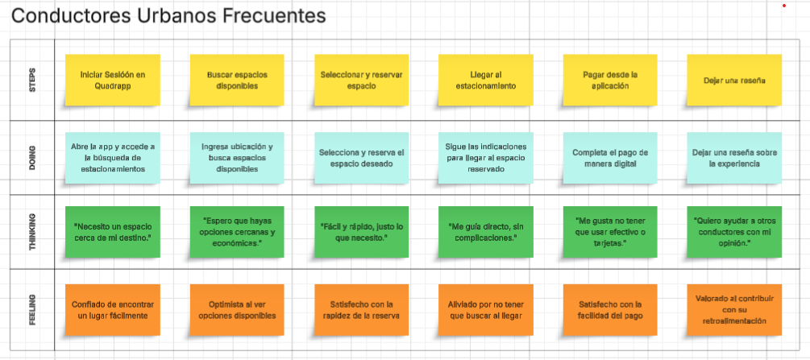

    <strong>Universidad Peruana de Ciencias Aplicadas</strong>     
    </img> 
    <strong>Ingeniería de Software</strong> 
     <strong>Diseño de Experimentos de Ingeniería de Software - 7500</strong> 
     <strong>Docente: Ivan Robles Fernández</strong>  

    <strong>Startup: PCC Team</strong> 
     <strong>Producto: Quadrapp</strong> 

    <h3 align="center">Team Members:</h3>

    <table align="center">
        <tr>
            <th style="text-align:center;">Nombre</th>
            <th style="text-align:center;">Código</th>
        </tr>
        <tr>
            <td style="text-align:center;">Solis Solis, Leonardo José</td>
            <td style="text-align:center;">U20211G163</td>
        </tr>
        <tr>
            <td style="text-align:center;">Nanfuñay Liza, Pedro Jesús</td>
            <td style="text-align:center;">U202215462</td>
        </tr>
        <tr>
            <td style="text-align:center;">Calisaya Sánchez, Juan Jesús</td>
            <td style="text-align:center;">U202121935</td>
        </tr>
        <tr>
            <td style="text-align:center;">Oneglio De Paz, Beth Shantal</td>
            <td style="text-align:center;">U202213423</td>
        </tr>
        <tr>
            <td style="text-align:center;">Lagos Aguilar, Luis Eduardo</td>
            <td style="text-align:center;">U202121975</td>
        </tr>
    </table>
    

</body>

 <strong>2025-02</strong>

 

# Registro de Versiones del Informe

| Versión | Fecha | Autor | Descripción de Modificación |
| ----------- | ----------- | ----------- | ----------- |
| 1.0 | 10/09/2025 | Solis, Nanfuñay, Calisaya, Oneglio, Lagos | Creación del documento de trabajo en formato Markdown. |
| 1.1 | 14/09/2025 | Solis, Nanfuñay, Calisaya, Oneglio, Lagos | Desarrollo del perfil de la startup y de la solución, identificación de segmentos objetivo y formulación de preguntas para el diseño de entrevistas. |
| 1.2 | 14/09/2025 | Solis, Nanfuñay, Calisaya, Oneglio, Lagos | Redacción de las guías de estilo e infraestructura de la información. |
| 1.3 | 15/09/2025 | Solis, Nanfuñay, Calisaya, Oneglio, Lagos | Realización y registro de entrevistas con los segmentos objetivo y análisis de los resultados. Creación del Impact Mapping. Redacción de las guías de estilo y la arquitectura de la información. |
| 1.4 | 16/09/2025 | Solis, Nanfuñay, Calisaya, Oneglio, Lagos | Elaboración de historias de usuario y del backlog del producto. |
| 1.5 | 16/09/2025 | Solis, Nanfuñay, Calisaya, Oneglio, Lagos | Creación del diagrama de base de datos, diagrama de clases, diccionario de clases, diagramas de contenedores, diagramas de contexto y diagramas de componentes. |
| 1.5 | 16/09/2025 | Solis, Nanfuñay, Calisaya, Oneglio, Lagos | Registro de las evidencias del Sprint. |

# Project Report Collaboration Insights

URL del repositorio para el Project Report en la organización de GitHub del equipo:

https://github.com/Experiemtos-SI0732-Group-3-PCC-Team/Final-Project-Documentation-Report/blob/Chapter-I/upc-pre-202520-1asi0732-7500-pcc-report-t.md 

**TB1**

Para la elaboración del informe correspondiente a la entrega TB1, la implementación de las secciones se distribuyó entre los miembros del equipo de la siguiente manera:

| Integrantes | Tareas Asignadas |
| ----------- | ---------------- |
| Solis Solis, Leonardo José | Product Implementation & Deployment, Video About-the-Product, Back-end |
| Nanfuñay Liza, Pedro Jesús | Ubiquitous Language, Requirements Specification, Front-end |
| Calisaya Sánchez, Juan Jesús | Product Implementation, Back-end |
| Oneglio De Paz, Beth Shantal | Introducción, Requirements Elicitation & Analysis, Front-end |
| Lagos Aguilar, Luis Eduardo | Product Design, Architecture Design |

La colaboración en el informe se llevó a cabo mediante commits frecuentes en el repositorio de la organización PCC Team.

**GitHub Collaboration Insights**

GitHub también muestra un historial de las ramas principales y los procesos de fusión realizados. Todas las ramas se crearon siguiendo el diseño de GitFlow para asegurar una adecuada organización al utilizar un sistema de control de versiones.

Los miembros del equipo son:

- Solis Solis, Leonardo José
- Nanfuñay Liza, Pedro Jesús
- Calisaya Sánchez, Juan Jesús
- Oneglio De Paz, Beth Shantal
- Lagos Aguilar, Luis Eduardo

Se describen las ramas más destacadas de la siguiente manera:

main: Representada en negro. Es la rama principal del proyecto y se actualiza con cada entregable.
develop: Representada en azul. Es la rama principal para el proceso de desarrollo del proyecto.
feature-product-design: Representada en verde. Incluye el contenido de flujos de usuario y wireframes.
feature-sprint1: Representada en amarillo. Contiene los artefactos relacionados con el sprint 1 en el informe.
Los gráficos siguientes muestran los análisis de commits en el repositorio del informe, incluyendo la cantidad de líneas de texto añadidas por cada miembro del equipo.

**TB1**

# Contenido

## Tabla de contenidos

[Registro de Versiones del Informe](#registro-de-versiones-del-informe)

[Project Report Collaboration Insights](#project-report-collaboration-insights)

[Student Outcome](#student-outcome)

[Capítulo I: Introducción](#capítulo-i-introducción)

[1.1 Startup Profile](#11-startup-profile)  
[1.1.1. Descripción de la Startup](#111-descripción-de-la-startup)  
[1.1.2. Perfiles de integrantes del equipo](#112-perfiles-de-integrantes-del-equipo)  

[1.2. Solution Profile](#12-solution-profile)  
[1.2.1 Antecedentes y problemática](#121-antecedentes-y-problemática)  
[1.2.2 Lean UX Process.](#122-lean-ux-process)  
[1.2.2.1. Lean UX Problem Statements.](#1221-lean-ux-problem-statements)  
[1.2.2.2. Lean UX Assumptions.](#1222-lean-ux-assumptions)  
[1.2.2.3. Lean UX Hypothesis Statements.](#1223-lean-ux-hypothesis-statements)  
[1.2.2.4. Lean UX Canvas.](#1224-lean-ux-canvas)  

[1.3. Segmentos objetivo.](#13-segmentos-objetivo)  

[Capítulo II: Requirements Elicitation & Analysis](#capítulo-ii-requirements-elicitation--analysis)  

[2.1. Competidores](#21-competidores)  
[2.1.1. Análisis competitivo](#211-análisis-competitivo)  
[2.1.2. Estrategias y tácticas frente a competidores](#211-análisis-competitivo)  

[2.2. Entrevistas](#22-entrevistas)  
[2.2.1. Diseño de entrevistas](#221-diseño-de-entrevistas)  
[2.2.2. Registro de entrevistas](#222-registro-de-entrevistas)  
[2.2.3. Análisis de entrevistas](#223-análisis-de-entrevistas)  

[2.3. Needfinding](#23-needfinding)  
[2.3.1. User Personas](#231-user-personas)  
[2.3.2. User Task Matrix](#232-user-task-matrix)  
[2.3.3. User Journey Mapping](#233-user-journey-mapping)  
[2.3.4. Empathy Mapping](#234-empathy-mapping)  
[2.3.5. As-is Scenario Mapping](#235-as-is-scenario-mapping)

[2.4. Ubiquitous Language](#25-ubiquitous-language)  

[Capítulo III: Requirements Specification](#capítulo-iii-requirements-specification)  

[3.1. To-Be Scenario Mapping](#31-to-be-scenario-mapping)  
[3.2. User Stories](#32-user-stories)  
[3.3. Product Backlog](#33-product-backlog)  
[3.4. Impact Mapping](#34-impact-mapping)  

[Capítulo IV: Product Design](#capítulo-v-product-design)  
[4.1. Style Guidelines.](#41-style-guidelines)  
[4.1.1. General Style Guidelines.](#411-general-style-guidelines)  
[4.1.2. Web, Mobile and IoT Style Guidelines.](#412-web-mobile-and-iot-style-guidelines)  
[4.2. Information Architecture.](#42-information-architecture)  
[4.2.1. Organization Systems.](#421-organization-systems)  
[4.2.2. Labeling Systems.](#422-labeling-systems)  
[4.2.3. SEO Tags and Meta Tags](#423-seo-tags-and-meta-tags)  
[4.2.4. Searching Systems.](#424-searching-systems)  
[4.2.5. Navigation Systems.](#425-navigation-systems)  
[4.3. Landing Page UI Design.](#43-landing-page-ui-design)  
[4.3.1. Landing Page Wireframe.](#431-landing-page-wireframe)  
[4.3.2. Landing Page Mock-up.](#432-landing-page-mock-up)  
[4.4. Mobile Applications UX/UI Design.](#44-mobile-applications-uxui-design)  
[4.4.1. Mobile Applications Wireframes.](#441-applications-wireframes)  
[4.4.2. Mobile Applications Wireflow Diagrams.](#442-applications-wireflow-diagrams)  
[4.4.3. Mobile Applications Mock-ups.](#443-applications-mock-ups)  
[4.4.4. Mobile Applications User Flow Diagrams.](#444-applications-user-flow-diagrams)  
[4.5. Mobile Applications Prototyping.](#45-applications-prototyping)  
[4.5.1. Android Mobile Applications Prototyping.](#451-android-mobile-applications-prototyping)  
[4.5.2. iOS Mobile Applications Prototyping.](#452-ios-mobile-applications-prototyping)  

[4.6. Web Applications UX/UI Design.](#46-web-applications-uxui-design)  
[4.6.1. Web Applications Wireframes.](#461-web-applications-wireframes)  
[4.6.2. Web Applications Wireflow Diagrams.](#462-web-applications-wireflow-diagrams)  
[4.6.3. Web Applications Mock-ups.](#463-web-applications-mock-ups)  
[4.6.4. Web Applications User Flow Diagrams.](#464-web-applications-user-flow-diagrams)  

[4.7. Web Applications Prototyping.](#47-web-applications-prototyping)  

[4.8. Domain-Driven Software Architecture.](#48-domain-driven-software-architecture)  
[4.8.1. Software Architecture Context Diagram.](#481-software-architecture-context-diagram)  
[4.8.2. Software Architecture Container Diagrams.](#482-software-architecture-container-diagrams)  
[4.8.3. Software Architecture Components Diagrams.](#483-software-architecture-components-diagrams)  

[4.9. Software Object-Oriented Design.](#49-software-object-oriented-design)  
[4.9.1. Class Diagrams.](#491-class-diagrams)  
[4.9.2. Class Dictionary.](#492-class-dictionary)  

[4.10. Database Design.](#410-database-design)  
[4.10.1. Relational/Non-Relational Database Diagram.](#4101-relational-non-relational-database-diagram)  

[Capítulo V: Product Implementation](#capítulo-v-product-implementation)  

[5.1. Software Configuration Management.](#51-software-configuration-management)  
[5.1.1. Software Development Environment Configuration.](#511-software-development-environment-configuration)  
[5.1.2. Source Code Management.](#512-source-code-management)  
[5.1.3. Source Code Style Guide & Conventions](#513-source-code-style-guide-conventions)  
[5.1.4. Software Deployment Configuration](#514-software-deployment-configuration)  

[5.2. Product Implementation & Deployment.](#52-product-implementation-deployment)  
[5.2.1. Sprint Backlogs.](#521-sprint-backlogs)  
[5.2.2. Implemented Landing Page Evidence.](#522-implemented-landing-page-evidence)  
[5.2.3. Implemented Frotend-Web Application Evidence.](#523-implemented-frontend-web-application-evidence)  
[5.2.4. Implemented Native-Mobile Application Evidence.](#524-implemented-native-mobile-application-evidence)  
[5.2.5. Implemented RESTful API and/or Serverless Backend Evidence.](#525-implemented-restful-api-and-or-serverless-backend-evidence)  
[5.2.6. RESTful API Documentation.](#526-restful-api-documentation)  
[5.2.7. Team Collaboration Insights.](#527-team-collaboration-insights)  

[5.3. Video About-the-Product](#54-video-about-the-product)  

[Conclusiones](#conclusiones)  
[Conclusiones y recomendaciones](#conclusiones-y-recomendaciones)  
[Bibliografía](#bibliografía)  
[Anexos](#anexos)  

# Student Outcome

| Criterio específico | Acciones Realizadas | Conclusiones |
|---------------------|----------------------|--------------|
| **4.c.1** Reconoce responsabilidad ética y profesional en situaciones de ingeniería de software | Solis Solis, Leonardo José  **TB1**  Para esta entrega demostré responsabilidad ética y profesional al diseñar y desarrollar los bounded contexts de IAM y Parking Management, haciendo uso de SpringBoot y Java para el manejo seguro de datos de usuario y el mantenimiento de la integridad del sistema.  Nanfuñay Liza, Pedro Jesús  **TB1**  Durante el desarrollo y documentación de la presente solución tecnológica, demostré la responsabilidad ética y profesional al cumplir con estándares de calidad, transparencia y buenas prácticas en ingeniería de software. Reconociendo la importancia de proteger la información y mantener un comportamiento responsable en cada etapa del proceso  Calisaya Sánchez, Juan Jesús  **TB1**  En el Capítulo V asumí responsabilidad ética y profesional al configurar el entorno de desarrollo, gestionar el código fuente y definir guías de estilo claras, garantizando un trabajo ordenado, transparente y de calidad en la implementación del software.  Oneglio De Paz, Beth Shantal  **TB1**  En los Capítulos I y II asumí responsabilidad ética y profesional al documentar de forma clara y estructurada el perfil de la startup, la problemática, el proceso Lean UX y los artefactos de Requirements Elicitation & Analysis, garantizando calidad y buenas prácticas en el trabajo.  Lagos Aguilar, Luis Eduardo  **TB1**  Se evidenció la capacidad de identificar dilemas éticos en la práctica de la ingeniería de software y de aplicar criterios de responsabilidad profesional. El trabajo permitió reflexionar sobre el impacto de las decisiones técnicas en los usuarios y la importancia de cumplir con estándares de calidad y buenas prácticas. | El trabajo realizado ha sido sobresaliente, cumpliendo con todos los segmentos del proyecto. El documento redactado ofrece un detallado informe sobre los pasos seguidos en la planificación, desarrollo y envío del proyecto a producción, garantizando así un resultado digno y completo. |
| **4.c.2** Emite juicios informados considerando el impacto de las soluciones de ingeniería de software en contextos globales, económicos, ambientales y sociales | Solis Solis, Leonardo José   **TB1**  En esta entrega, evalué el impacto de la solucion propuesta para el desarrollo de los bounded contexts de IAM y ParkingManagement, tomando en cuenta la seguridad de datos, eficiencia y accesibilidad.  Nanfuñay Liza, Pedro Jesús   **TB1**  Al desarrollar y documentar la solución tecnológica, realicé una evaluación crítica en cómo su implementación pueda generar beneficios en contextos globales, económicos, ambientales y sociales. Ello me permitió emitir juicios informados, valorando cómo la solución puede contribuir positivamente en diversos entornos.  Calisaya Sánchez, Juan Jesús  **TB1**  En el Capítulo V: Product Implementation trabajé en la configuración y gestión del software, estableciendo el entorno de desarrollo adecuado, la administración del código fuente y la definición de guías de estilo y convenciones para mantener la calidad y legibilidad del proyecto. Asimismo, documenté la configuración para el despliegue del software, asegurando un proceso ordenado, eficiente y alineado con las buenas prácticas de implementación.  Oneglio De Paz, Beth Shantal  **TB1**  En los Capítulos I y II emití juicios informados al analizar la problemática, los competidores y los segmentos objetivo, considerando el impacto de la solución propuesta en contextos globales, económicos, ambientales y sociales.  Lagos Aguilar, Luis Eduardo  **TB1**   Se logró emitir juicios críticos sustentados en análisis de casos reales, evaluando cómo las soluciones de software repercuten en diferentes contextos. El aprendizaje incluyó valorar el rol del ingeniero en la generación de soluciones sostenibles y responsables, reconociendo la necesidad de integrar factores sociales, ambientales y económicos en el diseño de software. | En conclusión, el trabajo realizado refleja un compromiso ético y profesional en cada etapa, asegurando calidad, organización y responsabilidad en la documentación, análisis y desarrollo de la solución propuesta, lo que garantiza una implementación sólida y confiable del proyecto. |

# Capítulo I: Introducción

## 1.1. Startup Profile

En esta sección se ofrece una descripción del startup y se detallan los perfiles de los integrantes del equipo.

### 1.1.1. Descripción de la Startup

Quadrapp surge como una respuesta innovadora ante la ineficiente gestión de estacionamientos en espacios públicos y privados de alto tráfico. En las ciudades, los conductores pierden tiempo buscando espacios disponibles, lo que genera congestión, contaminación y malestar en la experiencia de uso.

Lo que nos diferencia de otras aplicaciones es que no solo mostramos disponibilidad de espacios, sino que integramos tecnología IoT, cámaras de monitoreo, sensores y geolocalización para:

- Detectar en tiempo real los espacios libres.
- Permitir la reserva y el pago automatizado de estacionamientos.
- Optimizar las rutas hacia los estacionamientos cercanos.
- Brindar a los administradores una gestión eficiente y rentable de sus espacios.

Además, incluimos espacios particulares: cualquier usuario con una cochera o estacionamiento privado podrá registrarlo en la app y generar ingresos extra.

**Misión:** Facilitar el acceso a estacionamientos seguros, rápidos y confiables mediante el uso de tecnología, mejorando la movilidad urbana y la experiencia del conductor.

**Visión:** Convertirnos en la aplicación líder en gestión de estacionamientos inteligentes, contribuyendo a ciudades más sostenibles, organizadas y conectadas.

**Logotipo de la Startup:**

**Logotipo del Servicio:**

#### 1.1.2. Perfiles de integrantes del equipo

| Descripción de los Miembros del Equipo | Perfiles de los Miembros del Equipo |
|----------------------------------------|--------------------------------------|
| Mi nombre es Juan Jesús Calisaya Sánchez - u202121935, tengo 21 años y actualmente curso Ingeniería de Software. Me considero una persona responsable, amigable y empática. Poseo conocimientos en C++, SQL, Python, HTML/CSS, JavaScript, C#, entre otros lenguajes y tecnologías. Estas habilidades me serán de gran utilidad para llevar a cabo el proyecto. |  |
| Mi nombre es Luis, estudiante de la carrera de Ingeniería de Software, y estoy con muchas ganas de dar lo mejor de mí por este equipo. Me considero una persona curiosa, siempre dispuesta a escuchar y proponer ideas que aporten al grupo. A lo largo de mi formación, he desarrollado habilidades técnicas en el diseño guiado por el dominio (Domain Driven Design) y en el desarrollo front-end utilizando frameworks como Vue y Angular. Además, tengo experiencia intermedia programando en lenguajes como C++ y Python. |  |
| Mi nombre es Pedro Jesús Nanfuñay Liza, tengo 20 años y soy estudiante de la carrera de Ingeniería de Software. Me considero una persona creativa, responsable, perseverante y siempre dispuesto a trabajar en equipo. Tengo conocimientos en varios lenguajes de programación como C++, Java y Python; en el desarrollo web con frameworks Angular y Primevue, y en base de datos relacionales y no relacionales como SQL y MongoDB. Espero aportar de manera positiva al equipo y cumplir con los objetivos establecidos. |  |
| Mi nombre es Beth Shantal Oneglio De Paz - u202213423, tengo 20 años y estudio Ingeniería de Software en la UPC. Disfruto trabajar en equipo y resolver problemas digitales. Estoy capacitada para enfrentar situaciones estresantes con responsabilidad y liderazgo. Poseo conocimientos avanzados en gestión y programación, adquiridos en ciclos anteriores. Manejo lenguajes y tecnologías como Python, C++, HTML5, CSS3, .NET, Vue.js, C#, JavaScript, PHP, MongoDB y MySQL. |  |
| Mi nombre es Leonardo Solis - U20211G163, tengo 21 años y actualmente curso la carrera de Ingeniería de Software. Desde pequeño me gustan los videojuegos, y esto me llevó a investigar cómo estaban hechos, descubriendo la programación e impulsándome a seguir aprendiendo más acerca de este mundo. |  |

## 1.2. Solution Profile

Está compuesta por dos secciones:

### Antecedentes y Problemática:

Esta sección describe el problema que el proyecto busca resolver. Incluye el enunciado del problema, una descripción de los aspectos clave que la solución debe abordar, así como los objetivos y las restricciones del proyecto.

### Lean UX Process:

Esta sección aplica el proceso de Lean UX y detalla cómo se abordará la resolución del problema mediante el modelo de negocio.

### 1.2.1 Antecedentes y problemática

### Antecedentes:

En la última década, el crecimiento acelerado del parque automotor ha generado una presión sin precedentes sobre los espacios de estacionamiento. Según la Asociación Automotriz del Perú (2023), Lima incrementa en más de 100,000 vehículos por año, intensificando el tráfico sobre todo en horas pico (7:00–9:00 AM y 5:00–8:00 PM).

Además, estudios como el de Lima Cómo Vamos (2022) señalan que el 60% del tráfico en distritos como Miraflores y San Isidro se debe a vehículos en búsqueda de estacionamiento. Investigaciones internacionales como las de Shoup (2018) y Litman (2020) también destacan que la falta de estacionamientos inteligentes genera pérdidas económicas y un impacto ambiental considerable.

Ante este panorama, la necesidad de alternativas de gestión inteligente de estacionamientos es cada vez más urgente.

### Problemática (5Ws y 2Hs)

#### What (Qué)

**¿Cuál es el problema?**

La ineficiente gestión de estacionamientos en espacios públicos y privados de alto tráfico. Los conductores pierden tiempo buscando un espacio, lo que genera congestión vehicular, contaminación y frustración.

#### When (Cuándo)

**¿Cuándo se presenta el problema?**

- En horas pico (entrada/salida laboral, horarios escolares).
- Durante eventos masivos (conciertos, partidos, ferias, etc.).
- En zonas de alta demanda y poca oferta de estacionamientos.

#### Who (Quién)

**¿Quiénes están involucrados?**

- Conductores particulares.
- Propietarios/administradores de estacionamientos (comerciales y privados).

**¿A quién le sucede el problema?**

- A los conductores que pierden tiempo y dinero buscando estacionamiento.
- A los propietarios que no logran rentabilizar al máximo sus espacios.

**¿Quién lo utilizará?**

- Conductores que buscan estacionar rápido y seguro.
- Propietarios de cocheras, playas de estacionamiento o espacios privados que quieran generar ingresos extra.

#### Why (Por qué)

**¿Cuál es la causa del problema?**

- Crecimiento desordenado de las ciudades.
- Alta demanda y poca oferta de estacionamientos disponibles.
- Falta de herramientas tecnológicas de gestión y monitoreo en tiempo real.
- Ineficiencia en la administración de espacios privados no integrados al sistema.

#### ¿Cuáles son las 2H?

#### How (Cómo)

**¿En qué condiciones los usuarios usan nuestro producto?**

- Cuando necesitan estacionar en zonas de alto tráfico.
- Bajo presión de tiempo (citas, trabajo, estudios, eventos).
- Buscando reducir estrés, tiempo perdido y costos de transporte.

**¿Cómo nos conocieron los usuarios?**

- A través de campañas digitales (redes sociales, Google Maps, App Stores).
- Recomendaciones boca a boca.
- Al buscar soluciones a problemas de estacionamiento en apps móviles.

**¿Cómo prefieren los usuarios acceder a nuestro servicio?**

- Mediante aplicación móvil (Android/iOS).
- Con integración web para reservas previas.
- Opcionalmente con integración en sistemas de GPS o apps de movilidad.

#### How much (Cuánto)

**¿Cuánto impacta el problema?**

- Un conductor puede perder entre 15 a 30 minutos diarios buscando estacionamiento.
- Esto genera más del 30% del tráfico en zonas céntricas según estudios urbanos.
- Impacto económico: pérdida de productividad, gastos adicionales en combustible y contaminación ambiental.
- Impacto en propietarios: espacios desaprovechados que reducen ingresos potenciales.

### 1.2.2 Lean UX Process.

#### 1.2.2.1. Lean UX Problem Statements.

**Problem Statement**

Nuestro propósito es desarrollar una aplicación que conecte a conductores urbanos con espacios de estacionamiento disponibles, tanto públicos como privados, mediante tecnologías IoT, cámaras, sensores y una plataforma digital (web y móvil).

Hemos observado que los conductores pierden una cantidad significativa de tiempo y combustible buscando estacionamiento, lo cual genera congestión vehicular, contaminación ambiental y estrés. Asimismo, los propietarios de estacionamientos carecen de herramientas para gestionar, rentabilizar y optimizar sus espacios de manera eficiente.

Este problema refleja una ineficiencia estructural en la gestión de la movilidad urbana, que afecta tanto a usuarios como a autoridades y administradores de espacios.

La pregunta que nos planteamos es:

¿Cómo podemos diseñar una solución tecnológica que optimice la búsqueda, reserva y pago de estacionamientos en tiempo real, reduciendo el impacto en la movilidad y el medio ambiente, al mismo tiempo que brinda valor económico a los propietarios de espacios?

#### 1.2.2.2. Lean UX Assumptions.

**Business Assumptions**

**Necesidades de los Clientes**

**Creemos que nuestros clientes buscan** encontrar estacionamientos de forma rápida, segura y confiable, reducir el tiempo perdido y el estrés al buscar parqueo, acceder a tarifas claras con reservas anticipadas y pagos digitales, y contar con una alternativa sostenible que disminuya la congestión y la contaminación.

**Solución Propuesta**

Nuestra aplicación está diseñada para mostrar en tiempo real los espacios de estacionamiento disponibles mediante IoT y sensores, permitir la reserva anticipada y el pago digital inmediato, ofrecer a los propietarios de espacios una plataforma web para gestionar, optimizar y rentabilizar sus estacionamientos, e integrar seguridad y trazabilidad en cada transacción.

**Valor Principal**

El valor principal de la aplicación se basa en la optimización de la movilidad urbana al reducir el tiempo de búsqueda de estacionamiento y el tráfico, así como en la generación de ingresos adicionales para los propietarios de estacionamientos. Entre los beneficios adicionales se encuentra la disminución de emisiones de CO₂ al reducir las vueltas innecesarias, la mayor seguridad y confianza al estacionar en espacios validados y la digitalización de la fiscalización municipal.

**Beneficios Adicionales**

**Adquisición de Clientes**

La promoción de la aplicación se realizará a través de campañas en redes sociales y Google Ads, convenios con municipalidades y centros comerciales, estrategias de marketing con influencers y prensa digital especializada en movilidad urbana, además de un programa de referidos y recompensas para los usuarios iniciales.

**Modelo de Ingresos**

El modelo de ingresos se fundamenta en una comisión por cada reserva de estacionamiento confirmada, visible mediante un comprobante en pantalla, tarifas dinámicas en función de la demanda y la ubicación, y suscripciones premium para propietarios que deseen acceder a herramientas avanzadas de gestión.

**Competencia**

La competencia está representada por aplicaciones de estacionamiento como EasyPark o Parkopedia, que se centran principalmente en la búsqueda de espacios, pero carecen de integración local con municipalidades y propietarios particulares. La ventaja diferencial de Quadrapp es su modelo híbrido entre web y móvil, su integración de IoT en tiempo real y la inclusión de espacios particulares que actualmente no son explotados.

**Riesgos Principales**

**Estrategias para Mitigar Riesgos**

Los riesgos principales se relacionan con la baja adopción inicial por desconfianza en pagos digitales, los costos de instalación de sensores o cámaras de monitoreo y la posible competencia de soluciones internacionales que ingresen al mercado local. Para mitigar estos riesgos se consideran promociones iniciales con estacionamientos gratuitos o con descuento, alianzas con municipalidades para reducir costos de infraestructura, un fuerte enfoque en seguridad digital con pagos encriptados y comprobantes visibles, y campañas educativas sobre los beneficios de la aplicación.

**User Assumptions**

**¿Quién es el usuario?**

- Conductores urbanos (18–45 años).
- Propietarios de estacionamientos (comerciales o residenciales).

**¿Dónde encaja nuestro producto en sus trabajos o vidas?**

- Conductores: uso cotidiano en trayectos a trabajo, estudios o actividades sociales.
- Propietarios: gestión digital y en tiempo real de sus espacios desde la web.

**¿Qué problema resuelve nuestro producto?**

- Reduce el tiempo de búsqueda de parqueo.
- Mejora la seguridad y confianza al estacionar.
- Aumenta ingresos de propietarios.

**¿Cuándo y cómo es usado nuestro producto?**

- Conductores: antes y durante la salida, al planificar o llegar a un destino.
- Propietarios: de manera continua para registrar disponibilidad, tarifas y reservas.

**¿Qué características son importantes?**

- Reserva en tiempo real y pagos digitales seguros.
- Integración con mapas y geolocalización.
- Notificaciones de disponibilidad y tarifas.
- Panel web para gestión de espacios.

**Feature Assumptions**

- Los sensores IoT podrán detectar en tiempo real la disponibilidad de espacios.
- Los usuarios preferirán pagar digitalmente desde la app en lugar de efectivo.
- Los propietarios estarán dispuestos a digitalizar su gestión para aumentar ingresos.

**Business Outcomes**

- Reducción del 30% en tiempo de búsqueda de estacionamientos.
- Aumento del 20% en ingresos para propietarios y municipalidades.
- Disminución del 15% en emisiones contaminantes en zonas críticas.

**Users**

- Conductores urbanos con smartphone.
- Propietarios de espacios de estacionamiento.
- Municipalidades que administran espacios públicos.

**User Outcomes & Benefits**

- Ahorro de tiempo y combustible.
- Reducción del estrés y mejora en la experiencia de movilidad.
- Ingresos adicionales para propietarios de estacionamientos.

#### 1.2.2.3. Lean UX Hypothesis Statements.

- **Hypothesis Statement 01:**

**Creemos que** los conductores buscan una forma rápida y confiable de encontrar estacionamiento disponible en tiempo real.  
**Sabremos que** esto es cierto al observar un alto número de búsquedas de estacionamiento en la aplicación.  
**Cuando** al menos el 60% de los usuarios consulte la app al menos 3 veces por semana para ubicar espacios libres.  

- **Hypothesis Statement 02:**

**Creemos que** los dueños de estacionamientos necesitan una plataforma que les permita optimizar el uso de sus espacios vacíos.  
**Sabremos que** esto es cierto al medir la cantidad de espacios registrados y la frecuencia de reservas confirmadas.  
**Cuando** más del 50% de los estacionamientos registrados incrementen su ocupación en un 30% durante el primer trimestre.  

- **Hypothesis Statement 03:**

**Creemos que** los usuarios valoran la posibilidad de pagar y reservar estacionamiento desde la app para ahorrar tiempo.  
**Sabremos que** esto es cierto al rastrear el número de reservas y pagos realizados a través de la aplicación.  
**Cuando** al menos el 40% de los usuarios activos utilicen el sistema de pago en línea al menos una vez por semana.  

- **Hypothesis Statement 04:**

**Creemos que** ofrecer notificaciones en tiempo real sobre disponibilidad y tarifas aumentará la satisfacción del usuario.  
**Sabremos que** esto es cierto al analizar las calificaciones en la app y las reseñas positivas sobre la utilidad de las alertas.  
**Cuando** más del 70% de los usuarios activen y mantengan activadas las notificaciones de la aplicación.  

- **Hypothesis Statement 05:**

**Creemos que** una interfaz sencilla y visualmente clara hará que los usuarios adopten y recomienden la aplicación.  
**Sabremos que** esto es cierto al evaluar las métricas de retención de usuarios y la tasa de invitaciones compartidas.  
**Cuando** al menos el 50% de los nuevos usuarios regresen a la app en la primera semana y un 20% recomiende Quadrapp a otros.  

#### 1.2.2.4. Lean UX Canvas.

El Lean UX Canvas es una herramienta empleada en el ámbito del diseño centrado en el usuario (UX) y la metodología Lean, con el propósito de desarrollar productos de manera más eficiente y eficaz. Su finalidad es ofrecer un marco estructurado que facilita la colaboración entre equipos multidisciplinarios. A continuación, se presenta el Lean UX Canvas que el equipo ha trabajado utilizando Canva.

# Capítulo II: Requirements Elicitation & Analysis

## 2.1. Competidores.

### 2.1.1. Análisis competitivo.

El análisis competitivo es fundamental para la toma de decisiones estratégicas, ya que permite identificar oportunidades y amenazas, además de contribuir a la creación de ventajas competitivas sostenibles en el mercado. Esta herramienta es crucial para que las empresas se mantengan ágiles y tomen decisiones informadas en un entorno empresarial en constante evolución. A continuación, se muestra cómo se ha integrado esta herramienta en el desarrollo del proyecto y el análisis de los competidores.

# Competitive Analysis Landscape

| | | **Quadrapp**  | **Parkimeter**  | **ElParking**  | **Aparcados**  |
|---|---|---|---|---|---|
| **¿Por qué este análisis?** | | Identificar cómo Quadrapp se posiciona frente a sus competidores en términos de servicios, ventajas competitivas y estrategias de mercado, con el fin de fortalecer la propuesta de valor y captar más clientes. |
| **Perfil** | **Overview** | Respuesta innovadora a la ineficiente gestión de estacionamientos en espacios de alto tráfico. Integra IoT, cámaras, sensores, geolocalización y app móvil para optimizar la experiencia de conductores y administradores. | App web y móvil que ofrece reserva de plazas en Europa y América Latina. | App web y móvil para reservar aparcamientos en distintas ciudades de Europa y América Latina. | App web y móvil centrada en reservas en España, con planes de expansión internacional. |
| | **Ventaja Competitiva** | Detección en tiempo real de espacios libres, reserva y pago automatizado, optimización de rutas y gestión inteligente para administradores. | Descuentos de hasta el 70% y sin gastos de gestión. Disponible 24/7. | Incluye gestión de multas y pagos de parquímetros además de la reserva. | Geolocalización y notificaciones en tiempo real. |
| **Perfil de Marketing** | **Mercado Objetivo** | Conductores urbanos y propietarios de estacionamientos privados. | Conductores en áreas urbanas congestionadas. | Conductores en áreas urbanas congestionadas. | Conductores en áreas urbanas congestionadas. |
| | **Estrategias de Marketing** | Foco en ciudades de alta densidad vehicular (Lima, Arequipa, Trujillo). Campañas digitales + alianzas con municipalidades y dueños de estacionamientos. | Publicidad digital, redes sociales e influencers. | Publicidad digital, redes sociales e influencers. | Publicidad digital y redes sociales. |
| **Perfil del Producto** | **Productos & Servicios** | • Monitoreo en tiempo real • Reserva y pago automatizado • Optimización de rutas • Gestión para administradores | Reserva de parkings en España y principales ciudades globales. | Reserva de estacionamientos + gestión de multas y pagos. | Reserva de estacionamientos en áreas urbanas. |
| | **Precios** | Plataforma gratuita + tarifas de estacionamiento. Monetización adicional para administradores (suscripciones/gestión inteligente). | Plataforma gratuita + tarifas + suscripción VIP. | Plataforma gratuita + tarifas + descuentos especiales. | Plataforma gratuita + tarifas de estacionamiento. |
| | **Canales** | App móvil + Web. | Web + Móvil. | Web + Móvil. | Web + Móvil. |
| **Análisis SWOT** | **Fortalezas** | Tecnología IoT, detección en tiempo real, optimización de rutas, enfoque en sostenibilidad. | Presencia en Europa y América Latina. | Servicios adicionales (multas y pagos). | Expansión internacional (Europa y Asia). |
| | **Debilidades** | Alta inversión inicial en hardware (sensores/cámaras). | Competencia con servicios similares. | Mercado altamente competitivo. | Competencia con servicios similares. |
| | **Oportunidades** | Creciente parque automotor en Latinoamérica; interés municipal en soluciones de movilidad. | Mayor congestión vehicular = más demanda. | Expansión en España y mayor adopción urbana. | Crecimiento potencial en Latinoamérica. |
| | **Amenazas** | Regulaciones urbanas y barreras de adopción tecnológica. | Nuevas startups en el sector. | Nuevas startups en el sector. | Nuevas startups en el sector. |

### 2.1.2. Estrategias y tácticas frente a competidores.

Basado en el análisis competitivo previo, se identificaron claramente las fortalezas, oportunidades, debilidades y amenazas de los competidores. Esta información es fundamental para diseñar estrategias y tácticas que permitan superar a la competencia cuando el servicio se lance al mercado de manera rentable. A continuación, se presentan una serie de estrategias y tácticas planificadas para lograr este objetivo.

| **Fortalezas** | **Estrategias (Oportunidades)** | **Estrategias (Amenazas)** |
|----------------|---------------------------------|-----------------------------|
| Innovación tecnológica con IoT, cámaras, geolocalización y aplicación móvil; alcance a un público urbano amplio; soporte en tiempo real. | Brindar la mejor experiencia de usuario y servicio al cliente, destacando la facilidad de uso de la app. La propuesta de detección en tiempo real con sensores inteligentes será un factor diferenciador que generará interés y rápida adopción. | Implementar un sistema de monitoreo de regulaciones de movilidad urbana para adaptar la solución a cambios normativos, asegurando cumplimiento y sostenibilidad sin afectar su rentabilidad. |

| **Debilidades** | **Estrategias (Oportunidades)** | **Estrategias (Amenazas)** |
|-----------------|---------------------------------|-----------------------------|
| Mercado de aplicaciones de movilidad altamente competitivo y emergente. | Impulsar campañas de promoción resaltando los beneficios únicos de Quadrapp: reducción del tiempo de búsqueda de estacionamiento, reserva anticipada, comprobante digital y facilidad de pago. Esto posicionará a Quadrapp como la opción más innovadora y confiable. | Diferenciarnos con campañas que muestren cómo Quadrapp contribuye a la sostenibilidad urbana y a la gestión eficiente de espacios, mitigando el impacto de normativas que afectan por igual a los competidores. |

## 2.2. Entrevistas.

La sección detalla cómo investigamos nuestros segmentos objetivo mediante la recopilación de datos a través de entrevistas.

### 2.2.1. Diseño de entrevistas.

**Preguntas dirigidas a Conductores particulares**

----

**Preguntas demográficas**

- ¿Cuál es tu nombre?  
- ¿Cuál es tu edad?  
- ¿Dónde vives?  
- ¿A qué te dedicas?  
- ¿Cuáles consideras que son tus principales habilidades?  

**Preguntas principales**

- ¿Con qué frecuencia necesitas estacionamiento en la ciudad?  
- ¿Cuánto tiempo dedicas normalmente a buscar estacionamiento?  
- ¿Utilizas actualmente alguna aplicación o servicio para encontrar estacionamiento?  
- ¿Qué tan importante es para ti conocer la disponibilidad de estacionamiento en tiempo real?  
- ¿Estarías dispuesto/a a pagar una tarifa adicional por garantizar un espacio de estacionamiento reservado?  
- ¿Qué consideras más importante al elegir un estacionamiento: costo, proximidad, o seguridad?  
- ¿Te gustaría recibir recomendaciones de rutas hacia el estacionamiento más cercano basado en el tráfico en tiempo real?  

**Preguntas complementarias**

- ¿Has tenido experiencias frustrantes buscando estacionamiento en la ciudad?  
- ¿Qué mejoras te gustaría ver en los servicios de estacionamiento que utilizas actualmente?  

**Preguntas dirigidas a Propietarios de estacionamientos**

---

**Preguntas demográficas**

- ¿Cuál es tu nombre?  
- ¿Cuál es tu edad?  
- ¿Dónde vives?  
- ¿A qué te dedicas?  
- ¿Cuáles consideras que son tus principales habilidades?  

**Preguntas principales**

- ¿Consideras sencillo el proceso de gestionamiento de espacios en tu estacionamiento?  
- ¿Qué tan importante es para ti contar con información en tiempo real sobre los espacios disponibles?  
- ¿Utilizas algún sistema digital para administrar los pagos y reservas de los espacios de estacionamiento?  
- ¿Qué beneficios ves en la posibilidad de automatizar el proceso de reserva y pago de los espacios de estacionamiento?  
- ¿Qué tan relevante es para ti ofrecer opciones de pago seguras y rápidas a tus clientes?  
- ¿De qué manera crees que la integración de una app que gestione datos y pagos podría mejorar la eficiencia de tu negocio?  

**Preguntas complementarias**

- ¿Cuáles son los principales desafíos que enfrentas al administrar tu estacionamiento?  
- ¿Qué funcionalidades adicionales te gustaría que una app ofreciera para facilitar la gestión de tu negocio?  
- ¿Te gustaría recibir reportes o análisis sobre la ocupación y rotación de vehículos en tu estacionamiento?  

### 2.2.2. Registro de entrevistas.

**Segmento objetivo \#1: Conductores**

**Entrevista 1** 
**Nombres y Apellidos:** Joan Talizo Balbin 
**Edad:** 23 años 
**Distrito:** Surco 
**Timing:** 
**Duración:** 6:06 

   

**Resumen**

Resumen: Balbín utiliza su auto todos los días para ir a la universidad y a su trabajo como desarrollador web en una ONG. Esto lo obliga a buscar estacionamiento constantemente, lo cual puede tomarle entre 10 a 20 minutos, dependiendo del tráfico y la zona. Actualmente no usa ninguna aplicación para encontrar estacionamiento, pero considera que una app con información en tiempo real sería muy útil, ya que le ahorraría tiempo y evitaría dar vueltas innecesarias. También le gustaría que la app recomiende rutas según el tráfico, lo cual considera clave para optimizar sus desplazamientos. Está dispuesto a pagar una tarifa adicional por reservar un espacio, siempre que esto le garantice seguridad y cercanía. Aunque valora la seguridad, prioriza el costo y la proximidad al momento de elegir un estacionamiento. Ha vivido situaciones frustrantes, como perder tiempo en el tráfico, no encontrar espacios libres o que otro conductor le gane el lugar. Por ello, valora la posibilidad de saber en tiempo real si hay espacios disponibles e incluso recibir alertas si ocurre algo sospechoso con su vehículo.

**Entrevista 2** 
**Nombres y Apellidos:** Luis Ángel Anampa Lavado 
**Edad:** 21 años 
**Distrito:** San Borja 
**Timing:** 
**Duración:** 3:00 

  

**Resumen:**

Resumen: Ángel utiliza su vehículo todos los días, por lo que necesita estacionamiento de forma constante. El tiempo que le toma encontrar un espacio varía según la zona y el tráfico, pudiendo tardar entre 10 a 20 minutos o más en horas punta. Actualmente no usa ninguna aplicación para encontrar estacionamiento, pero considera que sería una herramienta muy útil. Destaca que conocer la disponibilidad de espacios en tiempo real es clave, ya que le permitiría ahorrar tiempo y evitar vueltas innecesarias. Está dispuesto a pagar una tarifa adicional por reservar un espacio, siempre y cuando no sea excesiva. Al elegir un estacionamiento, valora principalmente el costo y la proximidad, dejando la seguridad en un segundo plano aunque también le parece importante. Ángel estaría muy interesado en una aplicación que le recomiende rutas hacia estacionamientos disponibles evitando el tráfico. Ha tenido experiencias frustrantes buscando estacionamiento, como perder espacios a último momento o tener que maniobrar en lugares muy estrechos. Finalmente, sugiere como mejoras la posibilidad de recibir notificaciones en tiempo real cuando se libera un espacio cercano, y también alertas de seguridad en caso de movimientos sospechosos cerca del vehículo.

**Entrevista 3** 
**Nombres y Apellidos:** Manuel Vargas
**Edad:** 21 años 
**Distrito:** San Juan de Miraflores
**Timing:** 
**Duración:** 25:00

  

El entrevistado conduce a diario y encuentra mayores dificultades para estacionar en horas punta (3–4 p. m. y 7–8 p. m.). Busca estacionamiento con Google Maps (principal), Waze y Apple Maps, y pregunta a seguridad o locales si no conoce la zona; sin embargo, percibe que estas apps solo muestran el lugar y no brindan precio, horarios, “tiempo de gracia”, estado (abierto/mantenimiento) ni disponibilidad en tiempo real. Su satisfacción actual es 3–4/5. Sus criterios clave son seguridad del vehículo (prioridad), precio y distancia al destino. Considera razonables tarifas cercanas a S/ 7 por hora (centros comerciales) e inaceptables alrededor de S/ 40 (aeropuerto), con sensibilidad al “bolsillo común”. Prefiere pagar en efectivo o Yape en playas/calles y con tarjeta en centros comerciales. Confía sobre todo en reseñas de amigos/usuarios, además de iluminación, cámaras y personal de seguridad, y toma en cuenta el distrito. Antes de decidir necesita ver precio final, medidas/espacios amplios, plazas libres y horarios. Su principal dolor es la gente que se estaciona mal e invade espacios, con incidentes de golpes leves; además, a su padre le rompieron una luz por dejar el auto en la vía. Acepta compartir ubicación solo durante el uso de la app. Probaría una app con disponibilidad en tiempo real, reservas y pago en un toque, y pagaría comisión o suscripción si el precio es razonable, aunque reconoce que no siempre la usaría. Valora funciones como reservar espacio (prioritaria), recordatorios de tiempo, pago in-app, navegación directa al ingreso y notificaciones cercanas. Como implicaciones de producto, propone un MVP con disponibilidad en vivo, reserva, precio/hora claro, medidas/altura, señales de seguridad e identidad (iluminación/cámaras) y reseñas verificadas; un flujo “buscar cerca → ver precio final estimado → reservar → navegar al ingreso → pagar → alertas de tiempo”; pagos en efectivo/Yape y tarjeta, y un modo de privacidad que comparta la ubicación solo durante el uso.

**Segmento objetivo \#2: Propietario de estacionamiento**

**Entrevista 4** 
**Nombres y Apellidos:** Joaquín Abdias Trujillo Lizarbe 
**Edad:** 21 años 
**Distrito:** Comas 
**Timing:** 
**Duración:** 3:29 

  

**Resumen:**

Joaquín Trujillo es un propietario de estacionamiento, él comenta que muchas veces le resulta complicado gestionar y organizar la disponibilidad y reservación de espacios en su estacionamiento por la cantidad de clientes. Considera que la visualización en tiempo real de la disponibilidad de los espacios, así como la generación de reportes de disponibilidad es importante para acelerar la gestión y mejorar la experiencia de los clientes. Los métodos de pago que utiliza principalmente es el pago efectivo y por transacciones a través de servicios como Yape. A pesar de no haber utilizado una sistema que le permita automatizar estos procesos, estaría dispuesto a implementarlo para disminuir el tiempo requerido en estas tareas. En conclusión, Joaquín considera importante la implementación de funciones que le permitan mejorar la gestión de su estacionamiento y de sus clientes.

**Segmento objetivo \#2: Propietario de estacionamiento**

**Entrevista 5**  
**Nombres y Apellidos:** Luciano De la Torre Pay Pay  
**Edad:** 21 años   
**Distrito:** Ate  
**Timing:**   
**Duración:** 5:10  

  

**Resumen:**

Luciano De la Torre, propietario de un estacionamiento, señala que una de sus principales dificultades es la gestión y organización de la disponibilidad y las reservas de espacios debido a la gran cantidad de clientes. Considera fundamental contar con una visualización en tiempo real de los espacios disponibles y con reportes de disponibilidad, ya que estas herramientas agilizarían la administración y mejorarían la experiencia de los usuarios. Actualmente, los métodos de pago que utiliza con mayor frecuencia son el efectivo y las transacciones digitales a través de Yape. Aunque no ha empleado previamente un sistema automatizado, está dispuesto a implementarlo para reducir el tiempo invertido en estas tareas. En conclusión, Luciano destaca la importancia de incorporar funciones que optimicen la gestión de su estacionamiento y brinden un mejor servicio a sus clientes.

**Segmento objetivo \#1: Conductores**

**Entrevista 1** 
**Nombres y Apellidos:** Joan Talizo Balbin 
**Edad:** 23 años 
**Distrito:** Surco 
**Timing:** 
**Duración:** 6:06 

   

**Resumen**

Resumen: Balbín utiliza su auto todos los días para ir a la universidad y a su trabajo como desarrollador web en una ONG. Esto lo obliga a buscar estacionamiento constantemente, lo cual puede tomarle entre 10 a 20 minutos, dependiendo del tráfico y la zona. Actualmente no usa ninguna aplicación para encontrar estacionamiento, pero considera que una app con información en tiempo real sería muy útil, ya que le ahorraría tiempo y evitaría dar vueltas innecesarias. También le gustaría que la app recomiende rutas según el tráfico, lo cual considera clave para optimizar sus desplazamientos. Está dispuesto a pagar una tarifa adicional por reservar un espacio, siempre que esto le garantice seguridad y cercanía. Aunque valora la seguridad, prioriza el costo y la proximidad al momento de elegir un estacionamiento. Ha vivido situaciones frustrantes, como perder tiempo en el tráfico, no encontrar espacios libres o que otro conductor le gane el lugar. Por ello, valora la posibilidad de saber en tiempo real si hay espacios disponibles e incluso recibir alertas si ocurre algo sospechoso con su vehículo.

### 2.2.3. Análisis de entrevistas.

**Análisis del Segmento Conductores particulares**

Los entrevistados valoran la posibilidad de contar con una aplicación que les permita ahorrar tiempo en la búsqueda de estacionamientos, así como la seguridad de disponer de espacios confiables y bien gestionados. Además, destacan la importancia de que la plataforma sea intuitiva, rápida y que brinde información en tiempo real sobre la disponibilidad de espacios. También consideran relevante el soporte al cliente en caso de problemas durante el proceso de reserva o pago.  

Sin embargo, algunos manifestaron preocupación por los costos asociados al uso de la aplicación y por la confianza en la precisión de la información sobre la disponibilidad de estacionamientos. Otro aspecto mencionado fue la necesidad de una mayor transparencia en los términos de uso y en las tarifas, ya que temen cargos ocultos o comisiones adicionales.  

---

**Análisis del Segmento Propietario de estacionamientos**

De acuerdo con las entrevistas realizadas a propietarios de estacionamientos, se identificó que este segmento enfrenta desafíos relacionados con la gestión manual de espacios, la falta de información en tiempo real y las dificultades para controlar pagos y reservas. Muchos coincidieron en que aún dependen de métodos tradicionales como tickets en papel o registros en cuadernos, lo que genera errores y pérdidas económicas.

Los entrevistados señalaron que lo más importante para ellos es contar con un sistema digital confiable que les permita visualizar la ocupación de los espacios al instante, así como facilitar el proceso de pago de manera segura y rápida. Además, mostraron interés en que la herramienta ofrezca reportes sobre rotación y niveles de ocupación, ya que esto les permitiría tomar mejores decisiones en cuanto a tarifas y promociones.

En cuanto a motivaciones, destacaron la necesidad de optimizar ingresos, reducir la carga de trabajo del personal y brindar un servicio más moderno y competitivo. También se mencionó que una aplicación que centralice la información y los pagos podría generar confianza en los clientes y fidelizarlos a largo plazo.

En conclusión, los propietarios ven en la integración de una aplicación digital una oportunidad clara para modernizar su negocio, mejorar la eficiencia operativa y aumentar la rentabilidad, al mismo tiempo que ofrecen una mejor experiencia a los usuarios.

## 2.3. Needfinding.

### 2.3.1. User Personas.

- **Segmento Conductores particulares:**

- **Segmento Propietario de estacionamientos:**

### 2.3.2. User Task Matrix.

Se presenta el Task Matrix, una tabla que muestra las tareas realizadas por los User Personas, incluyendo su importancia y frecuencia. A continuación, se proporciona un resumen basado en la información presentada.

| **Segmento Objetivo**             | **Tarea**                                                                       | **Frecuencia** | **Importancia** |
|----------------------------------|----------------------------------------------------------------------------------|----------------|------------------|
| Conductores particulares         | Buscar estacionamientos disponibles                                              | Media          | Alta             |
| Conductores particulares         | Comparar precios de estacionamientos                                             | Alta           | Media            |
| Conductores particulares         | Reservar estacionamientos con anticipación                                      | Media          | Alta             |
| Conductores particulares         | Pagar por estacionamiento a través de la aplicación                              | Alta           | Alta             |
| Conductores particulares         | Recibir direcciones al estacionamiento reservado                                | Alta           | Alta             |
| Conductores particulares         | Filtrar estacionamientos por criterios (precio, seguridad, etc.)                | Alta           | Alta             |
| Conductores particulares         | Recibir notificaciones sobre descuentos y ofertas                               | Media          | Baja             |
| Conductores particulares         | Verificar disponibilidad de estacionamiento en tiempo real                      | Alta           | Alta             |
| Conductores particulares         | Consultar historial de estacionamientos utilizados                              | Media          | Baja             |
| Propietario de estacionamientos  | Administrar y actualizar la disponibilidad de espacios                           | Alta           | Alta             |
| Propietario de estacionamientos  | Ajustar precios de los espacios de estacionamiento                               | Media          | Alta             |
| Propietario de estacionamientos  | Gestionar reservas de estacionamientos                                           | Alta           | Alta             |
| Propietario de estacionamientos  | Procesar pagos de estacionamiento a través de la aplicación                      | Alta           | Media            |
| Propietario de estacionamientos  | Revisar y ajustar las características del estacionamiento (precio, seguridad, etc.) | Media       | Alta             |
| Propietario de estacionamientos  | Revisar reportes de uso y disponibilidad                                         | Media          | Media            |
| Propietario de estacionamientos  | Recibir y gestionar comentarios y valoraciones de los usuarios                   | Baja           | Media            |
| Propietario de estacionamientos  | Promocionar descuentos y ofertas especiales                                      | Media          | Media            |
| Propietario de estacionamientos  | Consultar el historial de transacciones y reservas                               | Baja           | Media            |

A través del *User Task Matrix*, podemos identificar las frecuencias e importancias entre los diferentes segmentos que presentamos y usar esta información como guía.

Al examinar los dos segmentos objetivo, se identifica que los conductores particulares priorizan la eficiencia y la comodidad en el uso de los estacionamientos, mientras que los propietarios de estacionamientos centran su atención en la administración y maximización de sus espacios. A pesar de tener metas diferentes, ambos grupos coinciden en la necesidad de una solución que simplifique la disponibilidad, la gestión y la experiencia general del estacionamiento.

### 2.3.3. User Journey Mapping.

En esta sección se ilustra el recorrido completo del usuario (end-to-end journey) de la aplicación para los segmentos objetivos. El User Journey Mapping comienza desde el momento en que el cliente toma conocimiento de la aplicación, pasando por el proceso de decidir usarla, registrarse, utilizarla y, finalmente, la posibilidad de dejar de usarla.

- **Segmento Conductores particulares:**

- **Segmento Propietario de estacionamientos:**

### 2.3.4. Empathy Mapping.

- **Segmento Conductores particulares:**

- **Segmento Propietario de estacionamientos:**

### 2.3.5. As-is Scenario Mapping.

- **Segmento Conductores particulares:**

- **Segmento Propietario de estacionamientos:**

## 2.5. Ubiquitous Language.

- **Parking space (Espacio de Estacionamiento):** Lugar específico dentro de un estacionamiento donde un vehículo puede ser aparcado.

- **Reservation (Reserva):** La acción de reservar un espacio de estacionamiento específico por un periodo de tiempo determinado, garantizando su disponibilidad.

- **Real-Time Availability (Disponibilidad en Tiempo Real):** Información actualizada instantáneamente sobre los espacios de estacionamiento libres y ocupados.

- **Geolocation (Geolocalización):** El uso de tecnologías de ubicación para determinar la posición geográfica del usuario y mostrar opciones de estacionamiento cercanas.

- **Interactive Map (Mapa Interactivo):** Un mapa digital dentro de la aplicación que muestra la ubicación de estacionamientos disponibles en tiempo real.

- **Hourly Rates (Tarifas por Hora):** El costo asociado con la reserva de un espacio de estacionamiento, calculado por horas de uso.

- **Online Payment (Pago en Línea):** El proceso de completar el pago para una reserva a través de métodos de pago digitales, como tarjetas de crédito, débito o billeteras electrónicas.

- **Booking History (Historial de Reservas):** Un registro de todas las reservas pasadas realizadas por el usuario, que incluye detalles como fecha, hora, ubicación y costo.

- **Real-Time Notifications (Notificaciones en Tiempo Real):** Alertas enviadas al usuario para informarles sobre cambios en la disponibilidad, confirmaciones de reserva, o vencimientos de tiempo de estacionamiento.

- **User (Usuario):** Persona que utiliza la aplicación para buscar, reservar y pagar por espacios de estacionamiento.

- **Parking Lot Owner (Propietario de Estacionamiento):** Persona o entidad que posee y administra un estacionamiento y que ofrece espacios para la reserva a través de la aplicación.

- **System Administrator (Administrador del Sistema):** Persona responsable de la gestión y mantenimiento de la aplicación, incluyendo la supervisión de la disponibilidad de los espacios y la gestión de usuarios y datos.

- **Check-in (Registro):** El proceso de confirmar la llegada al espacio de estacionamiento reservado, activando el tiempo de uso.

- **Check-out (Salida):** El proceso de marcar la salida del espacio de estacionamiento, finalizando el tiempo de uso y actualizando la disponibilidad.

- **Parking Zone (Zona de Estacionamiento):** Una área geográfica específica que contiene múltiples espacios de estacionamiento, gestionada dentro de la aplicación.

- **Time of Grace (Tiempo de Gracia):** Un periodo corto de tiempo permitido antes o después de la reserva, en el cual el usuario puede llegar sin incurrir en cargos adicionales.

- **Fine for Excess Time (Multa por Exceso de Tiempo):** Un cargo adicional aplicado si un usuario excede el tiempo de estacionamiento reservado.

- **Validation System (Sistema de Validación):** Mecanismo para verificar que un vehículo tenga una reserva válida para un espacio de estacionamiento específico.

# Capítulo III: Requirements Specification

## 3.1. To-Be Scenario Mapping.

Para la elaboración del To-Be Scenario Mapping, el equipo definió el flujo de trabajo esperado después de la implementación de la solución EcoMovil, considerando ambos segmentos objetivos. Este artefacto tiene como finalidad contrastar los resultados deseados con los aspectos negativos identificados en el As-is Scenario, proporcionando una visión clara de las mejoras proyectadas.
 

**Segmento Conductores Particulares:**

En el caso de los Conductores Particulares, el To-Be Scenario Mapping describe los beneficios esperados para los usuarios que requieren un acceso ágil y eficiente a los estacionamientos. Se plantea un escenario óptimo en el que los conductores habituales puedan estacionar de manera rápida, sencilla y sin complicaciones, mejorando significativamente su experiencia de uso en comparación con la situación actual.

 

**Propietarios de Estacionamientos:**

En relación con los Propietarios de Estacionamientos, el To-Be Scenario Mapping expone los resultados esperados tras la implementación de la solución Quadrapp, orientados a optimizar la gestión, el control de espacios y la eficiencia operativa. Este artefacto busca mostrar la manera en que se superan las limitaciones identificadas en el As-is Scenario, aportando mejoras tanto en la administración como en la experiencia de los usuarios.

El escenario ideal proyecta que los propietarios puedan administrar sus estacionamientos de forma ágil, rentable y sin complicaciones, garantizando un mayor aprovechamiento de los espacios y ofreciendo una experiencia de servicio más satisfactoria para los conductores.

## 3.2. User Stories.

Las *User Stories* del proyecto **Quadrapp** están diseñadas para optimizar la experiencia del usuario final y facilitar las tareas del equipo de desarrollo. Estas historias abarcan diversos aspectos de la plataforma, incluyendo la landing page, la integración y optimización del backend, así como el desarrollo de interfaces de usuario eficientes para el frontend y la aplicación móvil. Cada historia se redacta de manera clara y comprensible, e incluye criterios de aceptación específicos que orientan el desarrollo y garantizan que las funcionalidades implementadas cumplan con los requisitos del negocio y las expectativas del usuario final.

<table border="1" cellspacing="0" cellpadding="5">
  <tr>
    <td>Story ID</td>
    <td>User</td>
    <td>Priority</td>
    <td>Epic</td>
  </tr>
  <tr>
    <td>US01</td>
    <td>Visitante</td>
    <td>Alta</td>
    <td>EP01</td>
  </tr>
  <tr>
    <td>Title</td>
    <td colspan="3">Navegación Intuitiva en la Landing Page</td>
  </tr>
  <tr>
    <td colspan="4">Description</td>
  </tr>
  <tr>
    <td colspan="4">Como visitante de Quadrapp, quiero que la landing page tenga una barra de navegación clara y accesible para encontrar fácilmente las secciones importantes.</td>
  </tr>
  <tr>
    <td colspan="4">Acceptance Criteria</td>
  </tr>
  <tr>
    <td colspan="4">Escenario 01: </strong>  Given que estoy en la landing page, When hago clic en el menú de navegación, Then debería ver opciones claras como "Inicio", "Características", "Reservar Espacio" y "Contáctenos".   Escenario 02: Given que navego por la página, When paso el mouse por los elementos del menú, Then deberían resaltarse para indicar que son interactivos.</td>
  </tr>

  <tr>
    <td>US02</td>
    <td>Visitante</td>
    <td>Alta</td>
    <td>EP04</td>
  </tr>
  <tr>
    <td>Title</td>
    <td colspan="3">Visualización de Ciudades con Servicio</td>
  </tr>
  <tr>
    <td colspan="4">Description</td>
  </tr>
  <tr>
    <td colspan="4">Como visitante, quiero ver en la landing page las ciudades donde Quadrapp está disponible para saber si puedo utilizar el servicio en mi ubicación.</td>
  </tr>
  <tr>
    <td colspan="4">Acceptance Criteria</td>
  </tr>
  <tr>
    <td colspan="4">Escenario 01: Given que estoy en la landing page, When desplazo hacia la sección de ciudades, Then debería ver información sobre las ciudades como Lima, Arequipa y Cusco.   Escenario 02: Given que selecciono una ciudad, When hago clic en la información de la ciudad, Then debería ver detalles adicionales de esa ubicación.
  </tr>

  <tr>
    <td>US03</td>
    <td>Visitante</td>
    <td>Alta</td>
    <td>EP05</td>
  </tr>
  <tr>
    <td>Title</td>
    <td colspan="3">Promociones Destacadas</td>
  </tr>
  <tr>
    <td colspan="4">Description</td>
  </tr>
  <tr>
    <td colspan="4">Como visitante, quiero ver promociones destacadas en la landing page para aprovechar descuentos y beneficios en las ciudades disponibles.</td>
  </tr>
  <tr>
    <td colspan="4">Acceptance Criteria</td>
  </tr>
  <tr>
    <td colspan="4">Escenario 01: Given que estoy en la landing page, When desplazo hacia la sección de promociones, Then debería ver promociones específicas como "Promoción en Lima" y "Promoción en Cusco".   Escenario 02: Given que hago clic en una promoción, When selecciono una promoción específica, Then debería llevarme a una página de detalles de la promoción.
  </tr>

  <tr>
    <td>US04</td>
    <td>Visitante</td>
    <td>Alta</td>
    <td>EP04</td>
  </tr>
  <tr>
    <td>Title</td>
    <td colspan="3">Beneficios para Conductores y Dueños de estacionamiento</td>
  </tr>
  <tr>
    <td colspan="4">Description</td>
  </tr>
  <tr>
    <td colspan="4">Como visitante, quiero ver una sección en la landing page que me explique los beneficios de usar Quadrapp para entender las ventajas que ofrece.</td>
  </tr>
  <tr>
    <td colspan="4">Acceptance Criteria</td>
  </tr>
  <tr>
    <td colspan="4">Escenario 01: Given que estoy en la landing page, When desplazo hacia la sección de beneficios, Then debería ver información sobre beneficios para conductores y dueños de estacionamiento.   Escenario 02: Given que quiero más detalles, When hago clic en un beneficio específico, Then debería expandirse con más información.
  </tr>

  <tr>
    <td>US05</td>
    <td>Visitante</td>
    <td>Alta</td>
    <td>EP06</td>
  </tr>
  <tr>
    <td>Title</td>
    <td colspan="3">Visualización de Misión de la Empresa</td>
  </tr>
  <tr>
    <td colspan="4">Description</td>
  </tr>
  <tr>
    <td colspan="4">Como visitante, quiero ver una sección en la landing page que me explique los beneficios de usar Quadrapp para entender las ventajas que ofrece.</td>
  </tr>
  <tr>
    <td colspan="4">Acceptance Criteria</td>
  </tr>
  <tr>
    <td colspan="4">Escenario 01: Given que estoy en la landing page, When desplazo hacia la sección de beneficios, Then debería ver información sobre beneficios para conductores y dueños de estacionamiento.   Escenario 02: Given que quiero más detalles, When hago clic en un beneficio específico, Then debería expandirse con más información.
  </tr>

  <tr>
    <td>US06</td>
    <td>Visitante</td>
    <td>Alta</td>
    <td>EP06</td>
  </tr>
  <tr>
    <td>Title</td>
    <td colspan="3">Visualización de Visión de la Empresa</td>
  </tr>
  <tr>
    <td colspan="4">Description</td>
  </tr>
  <tr>
    <td colspan="4">Como visitante, quiero ver la visión de Quadrapp en la landing page para conocer sus metas futuras y crecimiento.</td>
  </tr>
  <tr>
    <td colspan="4">Acceptance Criteria</td>
  </tr>
  <tr>
    <td colspan="4">Escenario 01: Given que estoy en la landing page, When desplazo hacia la sección de"Visión",Then debería ver una breve descripción de la visión de la empresa.   Escenario 02: Given que quiero conocer más detalles, When hago clic en "Leer más" en la sección de visión, Then debería ver una descripción completa de los objetivos futuros.
  </tr>

  <tr>
    <td>US07</td>
    <td>Visitante</td>
    <td>Alta</td>
    <td>EP04</td>
  </tr>
  <tr>
    <td>Title</td>
    <td colspan="3">Visualización del Equipo</td>
  </tr>
  <tr>
    <td colspan="4">Description</td>
  </tr>
  <tr>
    <td colspan="4">Como visitante, quiero ver una sección que muestre a los miembros del equipo de Quadrapp para conocer quiénes están detrás del proyecto.</td>
  </tr>
  <tr>
    <td colspan="4">Acceptance Criteria</td>
  </tr>
  <tr>
    <td colspan="4">Escenario 01: Given que estoy en la landing page, When desplazo hacia la sección "Our Team", Then debería ver fotos y descripciones de cada miembro del equipo.   Escenario 02: Given que estoy en la sección del equipo, When hago clic en la imagen de un miembro, Then debería ver información detallada sobre sus roles y experiencia. 
  </tr>

  <tr>
    <td>US08</td>
    <td>Visitante</td>
    <td>Alta</td>
    <td>EP07</td>
  </tr>
  <tr>
    <td>Title</td>
    <td colspan="3">Información de Contacto</td>
  </tr>
  <tr>
    <td colspan="4">Description</td>
  </tr>
  <tr>
    <td colspan="4">Como visitante, quiero ver una sección de contacto en la landing page para saber cómo comunicarme con Quadrapp si tengo preguntas o comentarios.</td>
  </tr>
  <tr>
    <td colspan="4">Acceptance Criteria</td>
  </tr>
  <tr>
    <td colspan="4">Escenario 01: Given que estoy en la landing page, When desplazo hacia la sección "Contact Us", Then debería ver un formulario para ingresar nombre, correo electrónico y mensaje.   Escenario 02: Given que estoy en la sección de contacto, When hago clic en "Enviar Mensaje" sin llenar todos los campos, Then debería ver un mensaje de error indicando que todos los campos son obligatorios. 
  </tr>

  <tr>
    <td>US09</td>
    <td>Visitante</td>
    <td>Alta</td>
    <td>EP07</td>
  </tr>
  <tr>
    <td>Title</td>
    <td colspan="3">Envío de Mensaje de Contacto</td>
  </tr>
  <tr>
    <td colspan="4">Description</td>
  </tr>
  <tr>
    <td colspan="4">Como visitante, quiero poder enviar un mensaje a Quadrapp desde la landing page para hacer preguntas o dar feedback.</td>
  </tr>
  <tr>
    <td colspan="4">Acceptance Criteria</td>
  </tr>
  <tr>
    <td colspan="4">Escenario 01: Given que estoy en la sección de contacto, When ingreso mi nombre, correo y mensaje y hago clic en "Enviar Mensaje", Then debería ver una confirmación de que el mensaje fue enviado exitosamente.   Escenario 02: Given que he enviado un mensaje, When el envío es exitoso, Then debería recibir un correo de confirmación indicando que Quadrapp ha recibido mi mensaje.
  </tr>

<tr>
  <td>US10</td>
  <td>Visitante</td>
  <td>Alta</td>
  <td>EP04</td>
</tr>
<tr>
  <td>Title</td>
  <td colspan="3">Visualización de Información de Características</td>
</tr>
<tr>
  <td colspan="4">Description</td>
</tr>
<tr>
  <td colspan="4">Como visitante, quiero ver las características de Quadrapp en la landing page para entender qué ofrece el servicio.</td>
</tr>
<tr>
  <td colspan="4">Acceptance Criteria</td>
</tr>
<tr>
  <td colspan="4">Escenario 01: Given que estoy en la landing page, When desplazo hacia la sección de características, Then debería ver una descripción de las características principales de Quadrapp.   Escenario 02: Given que quiero conocer más detalles, When hago clic en una característica específica, Then debería abrirse una ventana emergente con información adicional.</td>
</tr>

<tr>
  <td>US11</td>
  <td>Visitante</td>
  <td>Alta</td>
  <td>EP02</td>
</tr>
<tr>
  <td>Title</td>
  <td colspan="3">Botón de Registro e Inicio de Sesión</td>
</tr>
<tr>
  <td colspan="4">Description</td>
</tr>
<tr>
  <td colspan="4">Como visitante, quiero ver botones destacados de "Registrarse" e "Iniciar Sesión" en la landing page para acceder a la plataforma o crear una cuenta fácilmente.</td>
</tr>
<tr>
  <td colspan="4">Acceptance Criteria</td>
</tr>
<tr>
  <td colspan="4">Escenario 01: Given que estoy en la landing page, When veo la sección superior de la página, Then deberían estar visibles los botones de "Iniciar Sesión" y "Registrarse".   Escenario 02: Given que hago clic en "Iniciar Sesión", When no tengo una cuenta creada, Then debería ver una opción para registrarme rápidamente.</td>
</tr>

<tr>
  <td>US12</td>
  <td>Visitante</td>
  <td>Media</td>
  <td>EP06</td>
</tr>
<tr>
  <td>Title</td>
  <td colspan="3">Enlace a Redes Sociales</td>
</tr>
<tr>
  <td colspan="4">Description</td>
</tr>
<tr>
  <td colspan="4">Como visitante, quiero ver enlaces a las redes sociales de Quadrapp en la landing page para seguir sus novedades y actualizaciones.</td>
</tr>
<tr>
  <td colspan="4">Acceptance Criteria</td>
</tr>
<tr>
  <td colspan="4">Escenario 01: Given que estoy en la landing page, When desplazo hacia el pie de página, Then debería ver íconos de redes sociales que me lleven a las cuentas oficiales de Quadrapp.   Escenario 02: Given que hago clic en un ícono de redes sociales, When selecciono Facebook, Then debería redirigirme a la página oficial de Quadrapp en Facebook.</td>
</tr>

<tr>
  <td>US13</td>
  <td>Visitante</td>
  <td>Media</td>
  <td>EP04</td>
</tr>
<tr>
  <td>Title</td>
  <td colspan="3">Visualización de Slogan</td>
</tr>
<tr>
  <td colspan="4">Description</td>
</tr>
<tr>
  <td colspan="4">Como visitante, quiero ver un slogan atractivo en la landing page de Quadrapp para entender de inmediato la propuesta del servicio.</td>
</tr>
<tr>
  <td colspan="4">Acceptance Criteria</td>
</tr>
<tr>
  <td colspan="4">Escenario 01: Given que estoy en la landing page, When veo la sección principal, Then debería encontrar un slogan o mensaje atractivo que me introduzca al servicio.   Escenario 02: Given que el slogan aparece en la sección principal, When paso a otra sección y vuelvo a la principal, Then el slogan debería mantenerse visible.</td>
</tr>

<tr>
  <td>US14</td>
  <td>Visitante</td>
  <td>Media</td>
  <td>EP13</td>
</tr>
<tr>
  <td>Title</td>
  <td colspan="3">Acceso a Información Legal</td>
</tr>
<tr>
  <td colspan="4">Description</td>
</tr>
<tr>
  <td colspan="4">Como visitante, quiero ver enlaces a la información legal y políticas de privacidad en la landing page para revisar los términos de uso y la protección de mis datos.</td>
</tr>
<tr>
  <td colspan="4">Acceptance Criteria</td>
</tr>
<tr>
  <td colspan="4">Escenario 01: Given que estoy en la landing page, When desplazo hacia el pie de página, Then debería ver enlaces a las políticas de privacidad y términos de servicio.   Escenario 02: Given que hago clic en el enlace de política de privacidad, When se abre el documento, Then debería ver la información completa de privacidad en una nueva página o ventana.</td>
</tr>

<tr>
  <td>US15</td>
  <td>Conductor</td>
  <td>Alta</td>
  <td>EP11</td>
</tr>
<tr>
  <td>Title</td>
  <td colspan="3">Inicio de Sesión para Conductores</td>
</tr>
<tr>
  <td colspan="4">Description</td>
</tr>
<tr>
  <td colspan="4">Como conductor interesado en usar Quadrapp, quiero iniciar sesión con mi cuenta registrada anteriormente para acceder a la aplicación.</td>
</tr>
<tr>
  <td colspan="4">Acceptance Criteria</td>
</tr>
<tr>
  <td colspan="4">Escenario 01: Given que el conductor ingresa su correo y contraseña, When hace clic en "Iniciar sesión", Then debe acceder a su dashboard de conductor si las credenciales son correctas.   Escenario 02: Given que el conductor ingresa credenciales incorrectas, When intenta iniciar sesión, Then debe mostrarse un mensaje de error indicando que las credenciales son inválidas.</td>
</tr>

<tr>
  <td>US16</td>
  <td>Conductor</td>
  <td>Alta</td>
  <td>EP02</td>
</tr>
<tr>
  <td>Title</td>
  <td colspan="3">Registro de Conductores</td>
</tr>
<tr>
  <td colspan="4">Description</td>
</tr>
<tr>
  <td colspan="4">Como conductor interesado en usar Quadrapp, quiero registrar mi cuenta para acceder a la plataforma.</td>
</tr>
<tr>
  <td colspan="4">Acceptance Criteria</td>
</tr>
<tr>
  <td colspan="4">Escenario 01: Given que un nuevo conductor quiere registrarse, When ingresa los datos necesarios y hace clic en "Registrarse", Then debe recibir un mensaje de confirmación de cuenta creada.   Escenario 02: Given que el conductor intenta registrarse sin llenar los campos requeridos, When intenta completar el registro, Then debe mostrarse un mensaje de error solicitando los datos faltantes.</td>
</tr>

<tr>
  <td>US17</td>
  <td>Propietario de estacionamiento</td>
  <td>Alta</td>
  <td>EP02</td>
</tr>
<tr>
  <td>Title</td>
  <td colspan="3">Registro de Propietarios de estacionamiento</td>
</tr>
<tr>
  <td colspan="4">Description</td>
</tr>
<tr>
  <td colspan="4">Como propietario de estacionamiento, quiero registrar mi cuenta para hacer uso de las funcionalidades que me ofrece Quadrapp.</td>
</tr>
<tr>
  <td colspan="4">Acceptance Criteria</td>
</tr>
<tr>
  <td colspan="4">Escenario 01: Given que un dueño de estacionamiento quiere registrarse, When llena el formulario de registro y hace clic en "Registrarse", Then debe recibir un mensaje de confirmación de cuenta creada.   Escenario 02: Given que el formulario no está completo, When intenta registrarse, Then debe mostrarse un mensaje de error indicando los campos faltantes.</td>
</tr>

<tr>
  <td>US18</td>
  <td>Conductor</td>
  <td>Media</td>
  <td>EP04</td>
</tr>
<tr>
  <td>Title</td>
  <td colspan="3">Búsqueda de Reservas para Conductores</td>
</tr>
<tr>
  <td colspan="4">Description</td>
</tr>
<tr>
  <td colspan="4">Como conductor, quiero hacer uso de la búsqueda de reservas para visualizar mis reservas activas y pasadas.</td>
</tr>
<tr>
  <td colspan="4">Acceptance Criteria</td>
</tr>
<tr>
  <td colspan="4">Escenario 01: Given que el conductor quiere ver sus reservas, When ingresa al menú de reservas, Then debe ver una lista de todas sus reservas activas y completadas.   Escenario 02: Given que el conductor busca una reserva específica, When ingresa un criterio de búsqueda, Then debe mostrarse la reserva correspondiente si existe.</td>
</tr>

<tr>
  <td>US19</td>
  <td>Conductor</td>
  <td>Alta</td>
  <td>EP12</td>
</tr>
<tr>
  <td>Title</td>
  <td colspan="3">Pago de Reservas por Transacción</td>
</tr>
<tr>
  <td colspan="4">Description</td>
</tr>
<tr>
  <td colspan="4">Como conductor, quiero realizar el pago de mis reservas por transacción para completar mis reservas.</td>
</tr>
<tr>
  <td colspan="4">Acceptance Criteria</td>
</tr>
<tr>
  <td colspan="4">Escenario 01: Given que el conductor realiza una reserva, When selecciona "Pagar", Then debe ser dirigido a la pasarela de pago para completar la transacción.   Escenario 02: Given que el pago es exitoso, When se procesa el pago, Then debe recibir una confirmación de reserva y recibo de pago.</td>
</tr>

<tr>
  <td>US20</td>
  <td>Conductor</td>
  <td>Alta</td>
  <td>EP12</td>
</tr>
<tr>
  <td>Title</td>
  <td colspan="3">Confirmación de Reserva Registrada</td>
</tr>
<tr>
  <td colspan="4">Description</td>
</tr>
<tr>
  <td colspan="4">Como conductor, quiero que se muestre una pantalla de confirmación para asegurarme de que la reserva fue registrada correctamente.</td>
</tr>
<tr>
  <td colspan="4">Acceptance Criteria</td>
</tr>
<tr>
  <td colspan="4">Escenario 01: Given que el conductor completa una reserva, When el sistema confirma la transacción, Then debe ver una pantalla indicando que su reserva fue registrada con éxito.   Escenario 02: Given que el sistema no puede confirmar la reserva, When se produce un error en el pago, Then debe mostrarse un mensaje solicitando un nuevo intento de pago.</td>
</tr>

<tr>
  <td>US21</td>
  <td>Usuario</td>
  <td>Media</td>
  <td>EP11</td>
</tr>
<tr>
  <td>Title</td>
  <td colspan="3">Registro de Opiniones</td>
</tr>
<tr>
  <td colspan="4">Description</td>
</tr>
<tr>
  <td colspan="4">Como usuario, quiero registrar mis opiniones para dar mi retroalimentación sobre mis experiencias con las funcionalidades de la plataforma.</td>
</tr>
<tr>
  <td colspan="4">Acceptance Criteria</td>
</tr>
<tr>
  <td colspan="4">Escenario 01: Given que el usuario quiere dejar una opinión, When completa el formulario de opinión y hace clic en "Enviar", Then debe ver un mensaje de confirmación de que su opinión fue enviada.   Escenario 02: Given que el usuario intenta enviar una opinión sin completar los campos requeridos, When hace clic en "Enviar", Then debe recibir un mensaje indicando que los campos son obligatorios.</td>
</tr>

<tr>
  <td>US22</td>
  <td>Conductor</td>
  <td>Media</td>
  <td>EP09</td>
</tr>
<tr>
  <td>Title</td>
  <td colspan="3">Notificaciones en el Dashboard del Conductor</td>
</tr>
<tr>
  <td colspan="4">Description</td>
</tr>
<tr>
  <td colspan="4">Como conductor, quiero recibir notificaciones en mi dashboard para recibir alertas relevantes como ofertas o recordatorios de reservas.</td>
</tr>
<tr>
  <td colspan="4">Acceptance Criteria</td>
</tr>
<tr>
  <td colspan="4">Escenario 01: Given que el conductor ingresa a su dashboard, When hay notificaciones pendientes, Then debe ver un ícono indicando nuevas notificaciones.   Escenario 02: Given que el conductor visualiza una notificación, When hace clic en ella, Then debe acceder a detalles adicionales o redirigirse a la página correspondiente.</td>
</tr>

<tr>
  <td>US23</td>
  <td>Usuario</td>
  <td>Media</td>
  <td>EP08</td>
</tr>
<tr>
  <td>Title</td>
  <td colspan="3">Configuración de Preferencias de Usuario</td>
</tr>
<tr>
  <td colspan="4">Description</td>
</tr>
<tr>
  <td colspan="4">Como usuario, quiero configurar mis preferencias de uso para personalizar mi experiencia en la plataforma.</td>
</tr>
<tr>
  <td colspan="4">Acceptance Criteria</td>
</tr>
<tr>
  <td colspan="4">Escenario 01: Given que el usuario quiere modificar sus preferencias, When accede a "Configuración" y guarda los cambios, Then su perfil debe actualizarse con las nuevas preferencias.   Escenario 02: Given que el usuario cambia sus preferencias de notificación, When guarda la configuración, Then debe recibir notificaciones de acuerdo con sus preferencias.</td>
</tr>

<tr>
  <td>US24</td>
  <td>Conductor</td>
  <td>Media</td>
  <td>EP04</td>
</tr>
<tr>
  <td>Title</td>
  <td colspan="3">Historial de Reservas en el Dashboard del Conductor</td>
</tr>
<tr>
  <td colspan="4">Description</td>
</tr>
<tr>
  <td colspan="4">Como conductor, quiero visualizar mi historial de reservas para consultar mis reservas realizadas.</td>
</tr>
<tr>
  <td colspan="4">Acceptance Criteria</td>
</tr>
<tr>
  <td colspan="4">Escenario 01: Given que el conductor quiere revisar su historial, When accede a la sección de historial de reservas, Then debe ver una lista de todas sus reservas previas.   Escenario 02: Given que el conductor busca una reserva específica en el historial, When ingresa una fecha o nombre de estacionamiento, Then debería encontrar la reserva correspondiente.</td>
</tr>

<tr>
  <td>US25</td>
  <td>Conductor</td>
  <td>Media</td>
  <td>EP04</td>
</tr>
<tr>
  <td>Title</td>
  <td colspan="3">Alerta de Espacio Disponible</td>
</tr>
<tr>
  <td colspan="4">Description</td>
</tr>
<tr>
  <td colspan="4">Como conductor, quiero recibir alertas de disponibilidad de espacios para ser notificado cuando un espacio de mi interés esté disponible.</td>
</tr>
<tr>
  <td colspan="4">Acceptance Criteria</td>
</tr>
<tr>
  <td colspan="4">Escenario 01: Given que el conductor marca un estacionamiento como favorito, When un espacio en ese estacionamiento se desocupa, Then debería recibir una notificación en su dashboard.   Escenario 02: Given que el conductor recibe una alerta de disponibilidad, When hace clic en la notificación, Then debería ser redirigido a la página de reserva para ese espacio.</td>
</tr>

<tr> 
  <td>US26</td> 
  <td>Conductor</td> 
  <td>Alta</td> 
  <td>EP07</td> 
</tr> 
<tr> 
  <td>Title</td> 
  <td colspan="3">Soporte en Tiempo Real en el Dashboard del Conductor</td> 
</tr> 
<tr> 
  <td colspan="4">Description</td> 
</tr> 
<tr> 
  <td colspan="4">Como conductor, quiero un sistema de soporte en tiempo real para poder resolver mis dudas o problemas rápidamente.</td> 
</tr> 
<tr> 
  <td colspan="4">Acceptance Criteria</td> 
</tr> 
<tr> 
  <td colspan="4">Escenario 01: Given que el conductor necesita ayuda, When accede a la sección de soporte en el dashboard, Then debería ver opciones de contacto o un chat en tiempo real.   Escenario 02: Given que el conductor inicia una consulta de soporte, When envía su mensaje, Then debería recibir una respuesta o ver un mensaje de confirmación de recibido.</td> 
</tr>

<tr> 
  <td>US27</td> 
  <td>Conductor</td> 
  <td>Alta</td> 
  <td>EP04</td> 
</tr> 
<tr> 
  <td>Title</td> 
  <td colspan="3">Favoritos para Conductores</td> 
</tr> 
<tr> 
  <td colspan="4">Description</td> 
</tr> 
<tr> 
  <td colspan="4">Como conductor, quiero marcar estacionamientos de mi interés como favoritos para facilitar futuras reservas.</td> 
</tr> 
<tr> 
  <td colspan="4">Acceptance Criteria</td> 
</tr> 
<tr> 
  <td colspan="4">Escenario 01: Given que el conductor quiere agregar un estacionamiento a sus favoritos, When hace clic en el botón "Favorito" en el detalle del estacionamiento, Then debería ver el estacionamiento en su lista de favoritos.   Escenario 02: Given que el conductor quiere reservar un estacionamiento favorito, When accede a su lista de favoritos, Then debería ver una opción para hacer la reserva directamente.</td> 
</tr>

<tr> 
  <td>US28</td> 
  <td>Conductor</td> 
  <td>Alta</td> 
  <td>EP05</td> 
</tr> 
<tr> 
  <td>Title</td> 
  <td colspan="3">Verificación de Reserva en el Dashboard del Conductor</td> 
</tr> 
<tr> 
  <td colspan="4">Description</td> 
</tr> 
<tr> 
  <td colspan="4">Como conductor, quiero verificar el estado de mi reserva para confirmar si el espacio que deseo está listo para ocuparse.</td> 
</tr> 
<tr> 
  <td colspan="4">Acceptance Criteria</td> 
</tr> 
<tr> 
  <td colspan="4">Escenario 01: Given que el conductor quiere verificar el estado de su reserva, When accede a la sección de reservas activas, Then debe ver un estado que indique si la reserva está confirmada o en proceso.   Escenario 02: Given que el estado de la reserva cambia, When el conductor accede a la reserva, Then debe ver la información actualizada de inmediato.</td> 
</tr>

<tr> 
  <td>US29</td> 
  <td>Conductor</td> 
  <td>Alta</td> 
  <td>EP05</td> 
</tr> 
<tr> 
  <td>Title</td> 
  <td colspan="3">Cancelación de Reserva en el Dashboard</td> 
</tr> 
<tr> 
  <td colspan="4">Description</td> 
</tr> 
<tr> 
  <td colspan="4">Como conductor, quiero acceder a la opción de cancelar mi reserva para evitar inconvenientes en caso de cambio de planes.</td> 
</tr> 
<tr> 
  <td colspan="4">Acceptance Criteria</td> 
</tr> 
<tr> 
  <td colspan="4">Escenario 01: Given que el conductor tiene una reserva activa, When selecciona la opción de cancelación, Then debería ver una confirmación de cancelación y una notificación de reembolso si aplica.   Escenario 02: Given que el conductor cancela una reserva, When intenta reservar el mismo espacio de nuevo, Then el sistema debe permitir la nueva reserva si el espacio sigue disponible.</td> 
</tr>

<tr> 
  <td>US30</td> 
  <td>Conductor</td> 
  <td>Alta</td> 
  <td>EP09</td> 
</tr> 
<tr> 
  <td>Title</td> 
  <td colspan="3">Gestión de Alertas para Conductores</td> 
</tr> 
<tr> 
  <td colspan="4">Description</td> 
</tr> 
<tr> 
  <td colspan="4">Como conductor, quiero visualizar las alertas en mi dashboard para gestionar mis alertas de seguridad o disponibilidad.</td> 
</tr> 
<tr> 
  <td colspan="4">Acceptance Criteria</td> 
</tr> 
<tr> 
  <td colspan="4">Escenario 01: Given que el conductor tiene alertas pendientes, When accede a la sección de alertas en su dashboard, Then debe ver una lista de alertas recientes.   Escenario 02: Given que el conductor revisa una alerta específica, When hace clic en ella, Then debería ver detalles adicionales o sugerencias de acción.</td> 
</tr>

<tr> 
  <td>US31</td> 
  <td>Conductor</td> 
  <td>Alta</td> 
  <td>EP08</td> 
</tr> 
<tr> 
  <td>Title</td> 
  <td colspan="3">Personalización de Notificaciones para Conductores</td> 
</tr> 
<tr> 
  <td colspan="4">Description</td> 
</tr> 
<tr> 
  <td colspan="4">Como conductor, quiero personalizar mis preferencias de notificación para recibir solo las alertas que me interesan.</td> 
</tr> 
<tr> 
  <td colspan="4">Acceptance Criteria</td> 
</tr> 
<tr> 
  <td colspan="4">Escenario 01: Given que el conductor quiere personalizar sus notificaciones, When ajusta sus preferencias en la configuración, Then solo debería recibir las notificaciones seleccionadas.   Escenario 02: Given que el conductor cambia sus preferencias, When guarda la configuración, Then las futuras notificaciones deberían respetar estas preferencias.</td> 
</tr>

<tr> 
  <td>US32</td> 
  <td>Conductor</td> 
  <td>Alta</td> 
  <td>EP10</td> 
</tr> 
<tr> 
  <td>Title</td> 
  <td colspan="3">Visualización de Mapa en el Dashboard del Conductor</td> 
</tr> 
<tr> 
  <td colspan="4">Description</td> 
</tr> 
<tr> 
  <td colspan="4">Como conductor, quiero acceder a un mapa interactivo en el dashboard para ver ubicaciones de estacionamientos cercanos en tiempo real.</td> 
</tr> 
<tr> 
  <td colspan="4">Acceptance Criteria</td> 
</tr> 
<tr> 
  <td colspan="4">Escenario 01: Given que el conductor accede a su dashboard, When abre la sección de mapa, Then debería ver ubicaciones de estacionamientos cercanos con disponibilidad en tiempo real.   Escenario 02: Given que el conductor selecciona una ubicación en el mapa, When hace clic en ella, Then debería ver opciones para realizar una reserva en esa ubicación.</td> 
</tr>

<tr> 
  <td>US33</td> 
  <td>Conductor</td> 
  <td>Alta</td> 
  <td>EP05</td> 
</tr> 
<tr> 
  <td>Title</td> 
  <td colspan="3">Seguimiento de Reserva en Tiempo Real</td> 
</tr> 
<tr> 
  <td colspan="4">Description</td> 
</tr> 
<tr> 
  <td colspan="4">Como conductor, quiero hacer seguimiento en tiempo real de mi reserva para ver el estado del mismo en todo momento.</td> 
</tr> 
<tr> 
  <td colspan="4">Acceptance Criteria</td> 
</tr> 
<tr> 
  <td colspan="4">Escenario 01: Given que el conductor tiene una reserva activa, When accede a la sección de seguimiento, Then debería ver el estado en tiempo real de su reserva.   Escenario 02: Given que el estado de la reserva cambia, When el conductor revisa la reserva, Then debería ver el cambio reflejado de inmediato.</td> 
</tr>

<tr> 
  <td>TS01</td> 
  <td>Developer</td> 
  <td>Gestión de Clientes en Servicio al Cliente</td> 
  <td>EP07</td> 
</tr> 
<tr> 
  <td>Title</td> 
  <td colspan="3">Gestión de Clientes en Servicio al Cliente</td> 
</tr> 
<tr> 
  <td colspan="4">Description</td> 
</tr> 
<tr> 
  <td colspan="4">Como developer, quiero crear un endpoint para gestionar consultas y solicitudes de servicio al cliente para permitir soporte eficaz a los usuarios.</td> 
</tr> 
<tr> 
  <td colspan="4">Acceptance Criteria</td> 
</tr> 
<tr> 
  <td colspan="4">Escenario 01: Given que se recibe una consulta de un cliente, When el administrador accede al endpoint `/api/client-service`, Then debería ver todas las solicitudes pendientes con detalles.   Escenario 02: Given que un cliente envía una nueva solicitud, When se crea una nueva consulta en el endpoint, Then debería notificarse al equipo de servicio al cliente.</td> 
</tr>

<tr> 
  <td>TS02</td> 
  <td>Developer</td> 
  <td>Notificación de Cambios en la Disponibilidad de Espacios</td> 
  <td>EP09</td> 
</tr> 
<tr> 
  <td>Title</td> 
  <td colspan="3">Notificación de Cambios en la Disponibilidad de Espacios</td> 
</tr> 
<tr> 
  <td colspan="4">Description</td> 
</tr> 
<tr> 
  <td colspan="4">Como developer, quiero implementar un endpoint que envíe notificaciones automáticas cuando un espacio cambie de estado para mantener a los usuarios informados en tiempo real.</td> 
</tr> 
<tr> 
  <td colspan="4">Acceptance Criteria</td> 
</tr> 
<tr> 
  <td colspan="4">Escenario 01: Given que un espacio de estacionamiento se desocupa, When el sistema detecta el cambio en el endpoint `/api/space-notifications`, Then debería enviar una notificación a los usuarios interesados.   Escenario 02: Given que un usuario tiene una reserva, When su espacio cambia de estado, Then debería recibir una notificación push y por correo electrónico.</td> 
</tr>

<tr> 
  <td>TS03</td> 
  <td>Developer</td> 
  <td>Historial de Transacciones para Usuarios</td> 
  <td>EP13</td> 
</tr> 
<tr> 
  <td>Title</td> 
  <td colspan="3">Historial de Transacciones para Usuarios</td> 
</tr> 
<tr> 
  <td colspan="4">Description</td> 
</tr> 
<tr> 
  <td colspan="4">Como developer, quiero desarrollar un endpoint para consultar el historial de transacciones de cada usuario para permitir la revisión de pagos y reservas anteriores.</td> 
</tr> 
<tr> 
  <td colspan="4">Acceptance Criteria</td> 
</tr> 
<tr> 
  <td colspan="4">Escenario 01: Given que un usuario desea ver su historial de transacciones, When accede al endpoint `/api/user-transactions`, Then debería ver una lista de todas sus transacciones ordenadas por fecha.   Escenario 02: Given que el administrador necesita revisar las transacciones de un usuario específico, When ingresa el ID del usuario en el endpoint, Then debería obtener el historial detallado del usuario.</td> 
</tr>

<tr> 
  <td>TS04</td> 
  <td>Developer</td> 
  <td>Gestión de Ocupación de Espacios en Tiempo Real</td> 
  <td>EP09</td> 
</tr> 
<tr> 
  <td>Title</td> 
  <td colspan="3">Gestión de Ocupación de Espacios en Tiempo Real</td> 
</tr> 
<tr> 
  <td colspan="4">Description</td> 
</tr> 
<tr> 
  <td colspan="4">Como developer, quiero implementar un endpoint para actualizar automáticamente la disponibilidad de espacios para reflejar cambios en tiempo real según las cámaras de monitoreo visual.</td> 
</tr> 
<tr> 
  <td colspan="4">Acceptance Criteria</td> 
</tr> 
<tr> 
  <td colspan="4">Escenario 01: Given que un espacio cambia de estado, When el sistema detecta el cambio mediante las cámaras de monitoreo visual en el endpoint `/api/space-occupancy`, Then el sistema debería reflejar el estado actualizado en tiempo real.   Escenario 02: Given que se ocupa un espacio sin reserva, When las cámaras detectan la ocupación, Then el sistema debería generar una alerta automática al administrador.</td> 
</tr>

<tr> 
  <td>TS05</td> 
  <td>Developer</td> 
  <td>Configuración de Alertas de Seguridad</td> 
  <td>EP13</td> 
</tr> 
<tr> 
  <td>Title</td> 
  <td colspan="3">Configuración de Alertas de Seguridad</td> 
</tr> 
<tr> 
  <td colspan="4">Description</td> 
</tr> 
<tr> 
  <td colspan="4">Como developer, quiero implementar un endpoint para que los administradores configuren alertas de seguridad para responder rápidamente a eventos sospechosos en los espacios de estacionamiento.</td> 
</tr> 
<tr> 
  <td colspan="4">Acceptance Criteria</td> 
</tr> 
<tr> 
  <td colspan="4">Escenario 01: Given que un administrador configura alertas, When ingresa criterios de alerta en el endpoint `/api/security-alerts`, Then debería poder definir parámetros específicos como hora, ubicación y tipo de alerta.   Escenario 02: Given que se detecta un evento de seguridad, When se activa una alerta, Then el sistema debe enviar notificaciones automáticas a los responsables.</td> 
</tr>

<tr> 
  <td>TS06</td> 
  <td>Developer</td> 
  <td>Administración de Tarifas por Ubicación</td> 
  <td>EP12</td> 
</tr> 
<tr> 
  <td>Title</td> 
  <td colspan="3">Administración de Tarifas por Ubicación</td> 
</tr> 
<tr> 
  <td colspan="4">Description</td> 
</tr> 
<tr> 
  <td colspan="4">Como developer, quiero implementar un endpoint para configurar tarifas de estacionamiento basadas en la ubicación para que los administradores ajusten precios según la demanda.</td> 
</tr> 
<tr> 
  <td colspan="4">Acceptance Criteria</td> 
</tr> 
<tr> 
  <td colspan="4">Escenario 01: Given que un administrador necesita ajustar tarifas, When accede al endpoint `/api/parking-rates`, Then debería poder configurar tarifas por ciudad o zona.   Escenario 02: Given que una tarifa es modificada, When se actualiza en el sistema, Then todos los precios de los espacios correspondientes deberían reflejar el cambio automáticamente.</td> 
</tr>

<tr> 
  <td>TS07</td> 
  <td>Developer</td> 
  <td>Registro de Alertas de Seguridad</td> 
  <td>EP13</td> 
</tr> 
<tr> 
  <td>Title</td> 
  <td colspan="3">Registro de Alertas de Seguridad</td> 
</tr> 
<tr> 
  <td colspan="4">Description</td> 
</tr> 
<tr> 
  <td colspan="4">Como developer, quiero un endpoint para registrar todas las alertas de seguridad detectadas en los estacionamientos para que los administradores revisen incidentes pasados.</td> 
</tr> 
<tr> 
  <td colspan="4">Acceptance Criteria</td> 
</tr> 
<tr> 
  <td colspan="4">Escenario 01: Given que ocurre un incidente de seguridad, When el sistema lo registra en el endpoint `/api/security-log`, Then debería almacenar la fecha, hora, ubicación y tipo de incidente.   Escenario 02: Given que un administrador revisa el historial de alertas, When solicita los registros, Then debería ver una lista cronológica de los eventos de seguridad.</td> 
</tr>

<tr> 
  <td>TS08</td> 
  <td>Developer</td> 
  <td>Gestión de Datos de Vehículos</td> 
  <td>EP10</td> 
</tr> 
<tr> 
  <td>Title</td> 
  <td colspan="3">Gestión de Datos de Vehículos</td> 
</tr> 
<tr> 
  <td colspan="4">Description</td> 
</tr> 
<tr> 
  <td colspan="4">Como developer, quiero un endpoint para almacenar y gestionar información de los vehículos registrados para poder hacer seguimiento y gestionar accesos.</td> 
</tr> 
<tr> 
  <td colspan="4">Acceptance Criteria</td> 
</tr> 
<tr> 
  <td colspan="4">Escenario 01: Given que un usuario registra un vehículo, When ingresa los detalles en el endpoint `/api/vehicle-management`, Then debería guardarse en la base de datos.   Escenario 02: Given que un administrador necesita actualizar datos de un vehículo, When accede a este endpoint, Then debería poder editar o eliminar la información del vehículo.</td> 
</tr>

<tr> 
  <td>TS09</td> 
  <td>Developer</td> 
  <td>Reportes de Promociones Utilizadas</td> 
  <td>EP05</td> 
</tr> 
<tr> 
  <td>Title</td> 
  <td colspan="3">Reportes de Promociones Utilizadas</td> 
</tr> 
<tr> 
  <td colspan="4">Description</td> 
</tr> 
<tr> 
  <td colspan="4">Como developer, quiero un endpoint para generar reportes de promociones utilizadas para analizar la efectividad de las promociones y optimizar futuras campañas.</td> 
</tr> 
<tr> 
  <td colspan="4">Acceptance Criteria</td> 
</tr> 
<tr> 
  <td colspan="4">Escenario 01: Given que un administrador solicita un reporte de promociones, When accede al endpoint `/api/promotion-reports`, Then debería ver un resumen con el uso de cada promoción.   Escenario 02: Given que se requiere un reporte detallado, When el administrador filtra por fecha y ubicación, Then debería obtener un desglose por cada categoría seleccionada.</td> 
</tr>

<tr> 
  <td>TS10</td> 
  <td>Developer</td> 
  <td>Auditoría de Acciones en la Plataforma</td> 
  <td>EP13</td> 
</tr> 
<tr> 
  <td>Title</td> 
  <td colspan="3">Auditoría de Acciones en la Plataforma</td> 
</tr> 
<tr> 
  <td colspan="4">Description</td> 
</tr> 
<tr> 
  <td colspan="4">Como developer, quiero un endpoint para registrar y auditar todas las acciones críticas de los usuarios y administradores para garantizar la seguridad y trazabilidad de las operaciones.</td> 
</tr> 
<tr> 
  <td colspan="4">Acceptance Criteria</td> 
</tr> 
<tr> 
  <td colspan="4">Escenario 01: Given que un usuario realiza una acción crítica, When el sistema registra la acción en el endpoint `/api/audit-log`, Then debería almacenarse con detalles de la fecha, hora, usuario y tipo de acción.   Escenario 02: Given que un auditor revisa el historial, When filtra por tipo de acción o usuario, Then debería obtener un listado preciso de todas las acciones que cumplen con los filtros.</td> 
</tr>

<tr> 
  <td>TS11</td> 
  <td>Developer</td> 
  <td>Historial de Opiniones de Usuarios</td> 
  <td>EP11</td> 
</tr> 
<tr> 
  <td>Title</td> 
  <td colspan="3">Historial de Opiniones de Usuarios</td> 
</tr> 
<tr> 
  <td colspan="4">Description</td> 
</tr> 
<tr> 
  <td colspan="4">Como developer, quiero implementar un endpoint para registrar y consultar el historial de opiniones de los usuarios para mejorar la experiencia de usuario a través del feedback.</td> 
</tr> 
<tr> 
  <td colspan="4">Acceptance Criteria</td> 
</tr> 
<tr> 
  <td colspan="4">Escenario 01: Given que un usuario deja una opinión, When el sistema la guarda en el endpoint `/api/user-reviews`, Then debería incluir detalles del usuario, calificación y comentario.   Escenario 02: Given que un administrador consulta el historial de opiniones, When accede al endpoint, Then debería ver una lista cronológica de todas las opiniones con detalles.</td> 
</tr>

<tr> 
  <td>TS12</td> 
  <td>Developer</td> 
  <td>Integración con el Sistema de Pago</td> 
  <td>EP13</td> 
</tr> 
<tr> 
  <td>Title</td> 
  <td colspan="3">Integración con el Sistema de Pago</td> 
</tr> 
<tr> 
  <td colspan="4">Description</td> 
</tr> 
<tr> 
  <td colspan="4">Como developer, quiero un endpoint para procesar pagos y verificar transacciones para asegurar que todos los pagos de reservas se realicen de forma segura.</td> 
</tr> 
<tr> 
  <td colspan="4">Acceptance Criteria</td> 
</tr> 
<tr> 
  <td colspan="4">Escenario 01: Given que un usuario realiza un pago, When procesa la transacción en el endpoint `/api/payment-processing`, Then debería generar una respuesta de éxito o error según el resultado.   Escenario 02: Given que ocurre un error en el pago, When el sistema detecta la falla, Then debería enviar un mensaje de error detallado y sugerencias de resolución.</td> 
</tr>

<tr> 
  <td>TS13</td> 
  <td>Developer</td> 
  <td>Generación de Reportes de Ocupación</td> 
  <td>EP06</td> 
</tr> 
<tr> 
  <td>Title</td> 
  <td colspan="3">Generación de Reportes de Ocupación</td> 
</tr> 
<tr> 
  <td colspan="4">Description</td> 
</tr> 
<tr> 
  <td colspan="4">Como developer, quiero un endpoint para generar reportes de ocupación de los estacionamientos para analizar el uso y optimizar la disponibilidad de espacios.</td> 
</tr> 
<tr> 
  <td colspan="4">Acceptance Criteria</td> 
</tr> 
<tr> 
  <td colspan="4">Escenario 01: Given que un administrador solicita un reporte, When accede al endpoint `/api/occupancy-reports`, Then debería ver el porcentaje de ocupación por ubicación y fecha.   Escenario 02: Given que se necesita un análisis de tendencias, When el administrador filtra por período, Then debería obtener una representación gráfica de la ocupación.</td> 
</tr>

<tr> 
  <td>TS14</td> 
  <td>Developer</td> 
  <td>Configuración de Opciones de Notificaciones</td> 
  <td>EP09</td> 
</tr> 
<tr> 
  <td>Title</td> 
  <td colspan="3">Configuración de Opciones de Notificaciones</td> 
</tr> 
<tr> 
  <td colspan="4">Description</td> 
</tr> 
<tr> 
  <td colspan="4">Como developer, quiero implementar un endpoint para que los usuarios configuren sus preferencias de notificaciones para personalizar los avisos que desean recibir.</td> 
</tr> 
<tr> 
  <td colspan="4">Acceptance Criteria</td> 
</tr> 
<tr> 
  <td colspan="4">Escenario 01: Given que un usuario ajusta sus preferencias de notificaciones, When accede al endpoint `/api/notification-preferences`, Then debería poder activar o desactivar tipos de notificación específicos.   Escenario 02: Given que el sistema envía notificaciones, When las preferencias están activadas, Then el usuario debería recibir solo las notificaciones configuradas en su perfil.</td> 
</tr>

<tr> 
  <td>TS15</td> 
  <td>Developer</td> 
  <td>API de Feedback Automático</td> 
  <td>EP11</td> 
</tr> 
<tr> 
  <td>Title</td> 
  <td colspan="3">API de Feedback Automático</td> 
</tr> 
<tr> 
  <td colspan="4">Description</td> 
</tr> 
<tr> 
  <td colspan="4">Como developer, quiero implementar un endpoint para recopilar feedback de los usuarios al finalizar su reserva para obtener insights sobre su experiencia de usuario.</td> 
</tr> 
<tr> 
  <td colspan="4">Acceptance Criteria</td> 
</tr> 
<tr> 
  <td colspan="4">Escenario 01: Given que un usuario completa una reserva, When el sistema solicita feedback en el endpoint `/api/automatic-feedback`, Then debería almacenar los comentarios para análisis posterior.   Escenario 02: Given que el administrador consulta el feedback, When revisa los comentarios en el endpoint, Then debería ver un resumen con estadísticas de satisfacción.</td> 
</tr>

<tr> 
  <td>TS16</td> 
  <td>Developer</td> 
  <td>Gestión de Reembolsos</td> 
  <td>EP13</td> 
</tr> 
<tr> 
  <td>Title</td> 
  <td colspan="3">Gestión de Reembolsos</td> 
</tr> 
<tr> 
  <td colspan="4">Description</td> 
</tr> 
<tr> 
  <td colspan="4">Como developer, quiero implementar un endpoint para gestionar solicitudes de reembolso para asegurar que los usuarios puedan solicitar reembolsos fácilmente en caso de problemas.</td> 
</tr> 
<tr> 
  <td colspan="4">Acceptance Criteria</td> 
</tr> 
<tr> 
  <td colspan="4">Escenario 01: Given que un usuario solicita un reembolso, When el sistema procesa la solicitud en el endpoint `/api/refunds`, Then debería generar una respuesta de éxito o error según el caso.   Escenario 02: Given que se requiere seguimiento de reembolsos, When el administrador consulta el historial de reembolsos, Then debería ver un listado con detalles de cada solicitud.</td> 
</tr>

<tr> 
  <td>TS17</td> 
  <td>Developer</td> 
  <td>Auditoría de Cambios de Tarifas</td> 
  <td>EP12</td> 
</tr> 
<tr> 
  <td>Title</td> 
  <td colspan="3">Auditoría de Cambios de Tarifas</td> 
</tr> 
<tr> 
  <td colspan="4">Description</td> 
</tr> 
<tr> 
  <td colspan="4">Como developer, quiero un endpoint para auditar todas las modificaciones de tarifas en la plataforma para asegurar un control y seguimiento sobre los cambios de precios.</td> 
</tr> 
<tr> 
  <td colspan="4">Acceptance Criteria</td> 
</tr> 
<tr> 
  <td colspan="4">Escenario 01: Given que un administrador modifica una tarifa, When se registra el cambio en el endpoint `/api/rate-audit`, Then debería almacenar la fecha, hora y detalles de la tarifa modificada.   Escenario 02: Given que un auditor revisa el historial de cambios de tarifas, When solicita un reporte, Then debería obtener un listado con todas las modificaciones realizadas.</td> 
</tr>

<tr>
  <td>SP01</td>
  <td>Developer</td>
  <td>Alta</td>
  <td>EP15</td>
</tr>
<tr>
  <td>Title</td>
  <td colspan="3">Investigación sobre integración de OAuth2</td>
</tr>
<tr>
  <td colspan="4">Description</td>
</tr>
<tr>
  <td colspan="4">
    Como developer, quiero investigar bibliotecas de autenticación OAuth2 disponibles, con el fin de garantizar una integración segura y compatible con la arquitectura del sistema.
  </td>
</tr>
<tr>
  <td colspan="4">Acceptance Criteria</td>
</tr>
<tr>
  <td colspan="4">
    Escenario 01:  
    Given que el developer debe evaluar opciones de autenticación, When se evaluán criterios de compatilidad, seguridad y facilidad de integración y se realizan al menos dos pruebas de librerías OAuth2, Then se debe documentar su compatibilidad y facilidad de integración.  Escenario 02:  
    Given que se implementa un prototipo mínimo, When se realiza un inicio de sesión de prueba, 
    Then el sistema debe autenticar correctamente y emitir un token válido.
  </td>
</tr>

<tr>
  <td>SP02</td>
  <td>Developer</td>
  <td>Alta</td>
  <td>EP19</td>
</tr>
<tr>
  <td>Title</td>
  <td colspan="3">Evaluación de pasarelas de pago</td>
</tr>
<tr>
  <td colspan="4">Description</td>
</tr>
<tr>
  <td colspan="4">
    Como developer, quiero investigar distintas pasarelas de pago (PayPal, MercadoPago, Yape), para identificar la opción más adecuada para la plataforma.
  </td>
</tr>
<tr>
  <td colspan="4">Acceptance Criteria</td>
</tr>
<tr>
  <td colspan="4">
    Escenario 01:   Given que se seleccionan al menos dos pasarelas de pago, When se simula un pago exitoso en cada una, Then la transacción debe completarse correctamente y quedar registrada.   Escenario 02:   Given que se comparan las APIs de las pasarelas, When se revisa documentación y costos, Then se debe entregar un informe con ventajas y desventajas de cada una. 
  </td>
</tr>

<tr>
  <td>SP03</td>
  <td>Developer</td>
  <td>Alta</td>
  <td>EP12</td>
</tr>
<tr>
  <td>Title</td>
  <td colspan="3">Investigación de mapas en tiempo real</td>
</tr>
<tr>
  <td colspan="4">Description</td>
</tr>
<tr>
  <td colspan="4">
    Como developer, quiero evaluar servicios de mapas en tiempo real (Google Maps, Mapbox, OpenStreetMap), para determinar cuál permite mostrar ubicaciones y trayectorias de reservas activas con mejor rendimiento.
  </td>
</tr>
<tr>
  <td colspan="4">Acceptance Criteria</td>
</tr>
<tr>
  <td colspan="4">
    Escenario 01:   Given que se integra una librería de mapas,  When se visualiza la ubicación de un dispositivo en tiempo real, Then el mapa debe actualizarse sin retraso significativo.  Escenario 02:   Given que se prueban las opciones seleccionadas en un dispositivo, When se mide consumo de datos y rendimiento, Then se debe documentar cuál ofrece mejor balance entre costo y eficiencia. 
  </td>
</tr>

<tr>
  <td>SP04</td>
  <td>Developer</td>
  <td>Media</td>
  <td>EP11</td>
</tr>
<tr>
  <td>Title</td>
  <td colspan="3">Evaluación de notificaciones push y alertas</td>
</tr>
<tr>
  <td colspan="4">Description</td>
</tr>
<tr>
  <td colspan="4">
    Como developer, quiero investigar servicios de notificaciones push (Firebase, OneSignal, WebPush), con el fin de identificar la solución más confiable y con menor latencia para propietarios de estacionamiento y conductores.
  </td>
</tr>
<tr>
  <td colspan="4">Acceptance Criteria</td>
</tr>
<tr>
  <td colspan="4">
    Escenario 01:   Given que el sistema envía una notificación de prueba, When un usuario con dispositivo Android la recibe, Then la notificación debe mostrarse de forma inmediata.   Escenario 02:   Given que se configuran distintos proveedores de push notifications, When se ejecutan pruebas de latencia, Then se debe documentar cuál presenta mejor tiempo de entrega y personalización. 
  </td>
</tr>

<tr>
  <td>SP05</td>
  <td>Developer</td>
  <td>Alta</td>
  <td>EP18</td>
</tr>
<tr>
  <td>Title</td>
  <td colspan="3">Investigación de escalabilidad para múltiples reservas simultáneas</td>
</tr>
<tr>
  <td colspan="4">Description</td>
</tr>
<tr>
  <td colspan="4">
    Como developer, quiero analizar cómo manejar múltiples reservas simultáneas, con el fin de evitar conflictos en la asignación de reservas y garantizar la integridad de los datos.
  </td>
</tr>
<tr>
  <td colspan="4">Acceptance Criteria</td>
</tr>
<tr>
  <td colspan="4">
    Escenario 01:   Given que se simulan múltiples conductores solicitando reservas, When dos solicitudes intentan reservar el mismo espacio, Then solo una debe confirmarse y la otra ser rechazada.   Escenario 02:   Given que se utiliza una estrategia de concurrencia, When se ejecuta una prueba de carga, Then los resultados deben demostrar que los datos de las reservas se mantienen consistentes. 
  </td>
</tr>

<tr>
  <td>SP06</td>
  <td>Developer</td>
  <td>Alta</td>
  <td>EP15</td>
</tr>
<tr>
  <td>Title</td>
  <td colspan="3">Evaluación de seguridad y cifrado de datos sensibles</td>
</tr>
<tr>
  <td colspan="4">Description</td>
</tr>
<tr>
  <td colspan="4">
    Como developer, quiero implementar el cifrado de datos, para cumplir con los estándares de seguridad y proteger la información de usuarios y pagos.
  </td>
</tr>
<tr>
  <td colspan="4">Acceptance Criteria</td>
</tr>
<tr>
  <td colspan="4">
    Escenario 01:   Given que se configura cifrado en base de datos, When se guarda información sensible, Then los registros no deben almacenarse en texto plano.   Escenario 02:   Given que se activa protocolos TLS para las comunicaciones, When un cliente se conecta al servidor, Then la transferencia de datos debe estar encriptada de extremo a extremo. 
  </td>
</tr>

<tr>
  <td>SP07</td>
  <td>Developer</td>
  <td>Alta</td>
  <td>EP18</td>
</tr>
<tr>
  <td>Title</td>
  <td colspan="3">Pruebas de rendimiento de la aplicación</td>
</tr>
<tr>
  <td colspan="4">Description</td>
</tr>
<tr>
  <td colspan="4">
    Como developer, quiero realizar pruebas de rendimiento en la aplicación, para garantizar que el sistema soporte un alto volumen de usuarios concurrentes.
  </td>
</tr>
<tr>
  <td colspan="4">Acceptance Criteria</td>
</tr>
<tr>
  <td colspan="4">
    Escenario 01:   Given que se configuran pruebas de carga con al menos 500 usuarios simultáneos, When se ejecuta la simulación, Then el sistema debe responder sin errores críticos y manteniendo un tiempo de respuesta aceptable.   Escenario 02:   Given que se ejecutan pruebas bajo condiciones de red inestables, When el sistema procesa solicitudes de usuarios con pérdida de paquetes, Then debe seguir funcionando sin afectar la integridad de los datos.
  </td>
</tr>
</table>

## 3.3. Product Backlog.

| # Orden | User Story ID | Título | Descripción | Story Points |
| ------ | ------------- | ------ | ----------- | ------------------------ |
| 1 | US01 | Navegación Intuitiva en la Landing Page | Como visitante, quiero navegar la landing page para encontrar secciones importantes fácilmente. | 5 |
| 2 | US02 | Visualización de Ciudades con Servicio | Como visitante, quiero ver en qué ciudades está disponible Quadrapp para saber si puedo usar el servicio. | 3 |
| 3 | US03 | Promociones Destacadas | Como visitante, quiero ver promociones destacadas para aprovechar descuentos y beneficios. | 5 |
| 4 | US04 | Beneficios para Conductores y Dueños de Estacionamiento | Como visitante, quiero ver los beneficios de usar Quadrapp para entender sus ventajas. | 3 |
| 5 | US05 | Visualización de Misión de la Empresa | Como visitante, quiero ver la misión de Quadrapp para conocer sus objetivos. | 2 |
| 6 | US06 | Visualización de Visión de la Empresa | Como visitante, quiero conocer la visión de Quadrapp para entender su crecimiento futuro. | 2 |
| 7 | US07 | Visualización del Equipo | Como visitante, quiero ver quiénes forman el equipo para conocer al personal detrás del proyecto. | 3 |
| 8 | US08 | Información de Contacto | Como visitante, quiero ver información de contacto para comunicarme con Quadrapp fácilmente. | 3 |
| 9 | US09 | Envío de Mensaje de Contacto | Como visitante, quiero enviar un mensaje a Quadrapp para hacer preguntas o dar feedback. | 5 |
| 10 | US10 | Visualización de Información de Características | Como visitante, quiero ver las características del servicio para entender lo que ofrece Quadrapp. | 3 |
| 11 | US11 | Botón de Registro e Inicio de Sesión | Como visitante, quiero registrarme o iniciar sesión para acceder a la plataforma. | 5 |
| 12 | US12 | Enlace a Redes Sociales | Como visitante, quiero seguir a Quadrapp en redes sociales para recibir novedades y actualizaciones. | 2 |
| 13 | US13 | Visualización de Slogan | Como visitante, quiero ver un slogan atractivo para comprender la propuesta del servicio rápidamente. | 2 |
| 14 | US14 | Acceso a Información Legal | Como visitante, quiero revisar términos y políticas de privacidad para entender las reglas de uso y protección de datos. | 3 |
| 15 | US15 | Inicio de Sesión para Conductores | Como conductor, quiero iniciar sesión con mi cuenta para acceder a la aplicación. | 5 |
| 16 | US16 | Registro de Conductores | Como conductor, quiero registrar mi cuenta para poder usar la plataforma. | 5 |
| 17 | US17 | Registro de Propietarios de Estacionamiento | Como propietario, quiero registrar mi cuenta para acceder a las funcionalidades de Quadrapp. | 5 |
| 18 | US18 | Búsqueda de Reservas para Conductores | Como conductor, quiero buscar mis reservas para visualizarlas y gestionarlas fácilmente. | 3 |
| 19 | US19 | Pago de Reservas por Transacción | Como conductor, quiero pagar mis reservas por transacción para completar mis reservas. | 5 |
| 20 | US20 | Confirmación de Reserva Registrada | Como conductor, quiero recibir confirmación de mi reserva para asegurarme que fue registrada correctamente. | 3 |
| 21 | US21 | Registro de Opiniones | Como usuario, quiero registrar mis opiniones para dar retroalimentación sobre mi experiencia en la plataforma. | 3 |
| 22 | US22 | Notificaciones en el Dashboard del Conductor | Como conductor, quiero recibir notificaciones en mi dashboard para estar al tanto de ofertas y recordatorios. | 5 |
| 23 | US23 | Configuración de Preferencias de Usuario | Como usuario, quiero configurar mis preferencias para personalizar mi experiencia en la plataforma. | 3 |
| 24 | US24 | Historial de Reservas en el Dashboard del Conductor | Como conductor, quiero ver mi historial de reservas para consultar mis reservas pasadas. | 3 |
| 25 | US25 | Alerta de Espacio Disponible | Como conductor, quiero recibir alertas de disponibilidad de espacios para saber cuándo un espacio está libre. | 5 |
| 26 | US26 | Soporte en Tiempo Real en el Dashboard del Conductor | Como conductor, quiero un soporte en tiempo real para resolver dudas o problemas rápidamente. | 5 |
| 27 | US27 | Favoritos para Conductores | Como conductor, quiero marcar estacionamientos como favoritos para facilitar futuras reservas. | 3 |
| 28 | US28 | Verificación de Reserva en el Dashboard del Conductor | Como conductor, quiero verificar el estado de mi reserva para confirmar si el espacio está listo. | 3 |
| 29 | US29 | Cancelación de Reserva en el Dashboard | Como conductor, quiero cancelar mi reserva para evitar inconvenientes si cambian mis planes. | 5 |
| 30 | US30 | Gestión de Alertas para Conductores | Como conductor, quiero ver todas mis alertas en el dashboard para gestionarlas fácilmente. | 5 |
| 31 | US31 | Personalización de Notificaciones para Conductores | Como conductor, quiero personalizar mis notificaciones para recibir solo alertas relevantes. | 3 |
| 32 | US32 | Visualización de Mapa en el Dashboard del Conductor | Como conductor, quiero acceder a un mapa interactivo para ver ubicaciones de estacionamientos cercanos. | 5 |
| 33 | US33 | Seguimiento de Reserva en Tiempo Real | Como conductor, quiero hacer seguimiento de mi reserva en tiempo real para conocer su estado. | 5 |
| 34 | TS01 | Gestión de Clientes en Servicio al Cliente | Como developer, quiero crear un endpoint para gestionar consultas de servicio al cliente para permitir soporte eficaz. | 3 |
| 35 | TS02 | Notificación de Cambios en la Disponibilidad de Espacios | Como developer, quiero un endpoint que envíe notificaciones automáticas de cambios de estado de espacios para mantener a los usuarios informados. | 5 |
| 36 | TS03 | Historial de Transacciones para Usuarios | Como developer, quiero un endpoint para consultar el historial de transacciones para permitir la revisión de pagos y reservas. | 3 |
| 37 | TS04 | Gestión de Ocupación de Espacios en Tiempo Real | Como developer, quiero un endpoint que actualice la disponibilidad de espacios en tiempo real para reflejar cambios según sensores y cámaras. | 5 |
| 38 | TS05 | Configuración de Alertas de Seguridad | Como developer, quiero un endpoint para configurar alertas de seguridad para responder rápidamente a eventos sospechosos. | 5 |
| 39 | TS06 | Administración de Tarifas por Ubicación | Como developer, quiero un endpoint para configurar tarifas según ubicación para ajustar precios según demanda. | 5 |
| 40 | TS07 | Registro de Alertas de Seguridad | Como developer, quiero un endpoint que registre todas las alertas de seguridad para que los administradores revisen incidentes pasados. | 3 |
| 41 | TS08 | Gestión de Datos de Vehículos | Como developer, quiero un endpoint para almacenar y gestionar información de vehículos para hacer seguimiento y gestionar accesos. | 3 |
| 42 | TS09 | Reportes de Promociones Utilizadas | Como developer, quiero un endpoint que genere reportes de promociones usadas para analizar efectividad y optimizar campañas. | 3 |
| 43 | TS10 | Auditoría de Acciones en la Plataforma | Como developer, quiero un endpoint que registre todas las acciones críticas para garantizar seguridad y trazabilidad. | 5 |
| 44 | TS11 | Historial de Opiniones de Usuarios | Como developer, quiero un endpoint para registrar y consultar opiniones de usuarios para mejorar la experiencia con feedback. | 3 |
| 45 | TS12 | Integración con el Sistema de Pago | Como developer, quiero un endpoint para procesar pagos y verificar transacciones para garantizar pagos seguros. | 5 |
| 46 | TS13 | Generación de Reportes de Ocupación | Como developer, quiero un endpoint que genere reportes de ocupación para analizar el uso y optimizar la disponibilidad de espacios. | 3 |
| 47 | TS14 | Configuración de Opciones de Notificaciones | Como developer, quiero un endpoint para que los usuarios configuren sus preferencias de notificaciones para personalizar avisos. | 3 |
| 48 | TS15 | API de Feedback Automático | Como developer, quiero un endpoint para recopilar feedback de usuarios al finalizar reservas para obtener insights de experiencia. | 3 |
| 49 | TS16 | Gestión de Reembolsos | Como developer, quiero un endpoint para gestionar solicitudes de reembolso para asegurar que los usuarios puedan solicitarlos fácilmente. | 3 |
| 50 | TS17 | Auditoría de Cambios de Tarifas | Como developer, quiero un endpoint que audite todas las modificaciones de tarifas para asegurar control y seguimiento de precios. | 8 |
| 51 | SP01 | Investigación sobre integración de OAuth2 | Como developer, quiero investigar bibliotecas de autenticación OAuth2 para garantizar una integración segura y compatible con el sistema. | 5 |
| 52 | SP02 | Evaluación de pasarelas de pago | Como developer, quiero investigar distintas pasarelas de pago para identificar la opción más adecuada para la plataforma. | 5 |
| 53 | SP03 | Investigación de mapas en tiempo real | Como developer, quiero evaluar servicios de mapas en tiempo real para determinar cuál ofrece mejor rendimiento y visualización de reservas. | 8 |
| 54 | SP04 | Evaluación de notificaciones push y alertas | Como developer, quiero investigar servicios de notificaciones push para identificar la solución más confiable y con menor latencia. | 5 |
| 55 | SP05 | Investigación de escalabilidad para múltiples reservas simultáneas | Como developer, quiero analizar cómo manejar múltiples reservas simultáneas para evitar conflictos y garantizar integridad de datos. | 5 |
| 56 | SP06 | Evaluación de seguridad y cifrado de datos sensibles | Como developer, quiero implementar cifrado de datos para cumplir con estándares de seguridad y proteger información de usuarios y pagos. | 8 |
| 57 | SP07 | Pruebas de rendimiento de la aplicación | Como developer, quiero realizar pruebas de rendimiento en la aplicación para garantizar que soporte un alto volumen de usuarios concurrentes. | 8 |

Enlace: https://trello.com/invite/b/68cb76046c3ed8b6f0fc18c2/ATTI91035f3a2c18dc5abbb742838e8d0be8E6AB6959/quadrapp-product-backlog-tb1-sprint-1

## 3.4. Impact Mapping.

En esta sección, presentamos el Impact Mapping para el proyecto de Quadrapp, cuyo objetivo es desarrollar e implementar un mapa interactivo que facilite la localización. Este mapa es esencial para optimizar la experiencia de nuestros usuarios y alcanzar los objetivos comerciales.

El Impact Mapping ofrece una visión clara de cómo los objetivos de negocio, las necesidades de los usuarios y las funcionalidades propuestas se interconectan. Asegura que cada elemento del desarrollo esté alineado con nuestras metas, contribuyendo al éxito de Quadrapp y mejorando tanto la experiencia de los universitarios como la de los adquirientes.
 

- **Segmento Conductores Urbanos:**

El Impact Map de Quadrapp se centra en incrementar el número de conductores urbanos frecuentes que utilizan la plataforma, mejorando la seguridad y accesibilidad en los estacionamientos de zonas urbanas. El objetivo es aumentar el uso del servicio en un 30%, implementando soluciones como rutas de navegación más eficientes, cámaras de monitoreo en tiempo real y notificaciones automáticas sobre disponibilidad de espacios. Las historias de usuario están orientadas a optimizar rutas, garantizar la seguridad y gestionar alertas, brindando así una experiencia más fluida y confiable para los conductores.

----

- **Segmento Propietarios de Estacionamiento:**

El Impact Map para propietarios de estacionamientos está diseñado para optimizar la gestión de sus espacios y aumentar la satisfacción de los clientes en un 30% durante los próximos seis meses. Las soluciones incluyen reservas en tiempo real, herramientas visuales de monitoreo mediante cámaras y funcionalidades para recopilar opiniones de los usuarios. Estas funciones permiten a los propietarios maximizar la ocupación de sus espacios, reducir los tiempos de espera y mejorar la calidad del servicio a partir del feedback directo de los clientes.

# Capítulo IV: Product Design

Este capítulo cubre todos los aspectos relacionados con el diseño de la solución, incluyendo el estilo visual, los diagramas C4, los diagramas de clases y los modelos de base de datos.

## 4.1. Style Guidelines

La aplicación *Quadrapp* se fundamenta en un diseño intuitivo, limpio y accesible, priorizando la legibilidad y la simplicidad en la interacción. Su propósito es ofrecer una experiencia coherente y uniforme en todas las plataformas, evitando la sobrecarga visual y utilizando de manera estratégica los espacios en blanco para optimizar la navegación. La tipografía principal seleccionada es Roboto, una fuente Sans Serif moderna que garantiza claridad y comodidad de lectura en pantallas de distintos tamaños.

### 4.1.1. General Style Guidelines

Es un conjunto de normas y directrices que determinan cómo se deben redactar, diseñar o presentar documentos, contenido en línea, software u otros trabajos creativos. A continuación, se detallan los parámetros implementados en la estructura del proyecto.

- **Branding:**

El branding de Quadrapp está diseñado para transmitir confianza, inclusión y eficiencia urbana.
Su identidad visual se sustenta en una paleta violeta–azul con acentos en naranja, que refuerza la idea de innovación accesible y potencia las llamadas a la acción. Los fondos claros y el alto contraste garantizan una experiencia visual clara y accesible para todos los usuarios.

De esta forma, Quadrapp se presenta como una marca moderna, coherente y orientada a la acción, plenamente alineada con su propósito de optimizar y facilitar la movilidad urbana.

**Misión:** Facilitar el acceso a estacionamientos seguros, rápidos y confiables mediante el uso de tecnología, mejorando la movilidad urbana y la experiencia del conductor.

**Visión:** Convertirnos en la aplicación líder en gestión de estacionamientos inteligentes, contribuyendo a ciudades más sostenibles, organizadas y conectadas.

- **Tipografía:**

La tipografía de Quadrapp se basa en una Sans Serif moderna, elegida por su legibilidad, versatilidad multiplataforma y estética minimalista.
Se establece una jerarquía tipográfica clara, acompañada de un interlineado amplio y tamaños mínimos accesibles, con el fin de garantizar una experiencia de lectura cómoda y consistente tanto en web como en dispositivos móviles.

#### Tamaños

- H1 → 32 px · 600 · violeta `#6B46C1` | uso: títulos principales  
- H2 → 24 px · 600 · azul `#2563EB` | uso: subtítulos  
- H3 → 20 px · 600 · violeta `#6B46C1` | uso: encabezados de tarjetas/módulos  
- P → 16–18 px · 400 · `#111827` | uso: texto y descripciones  

- Ajustes móviles → H1 (28–32 px) · H2 (22–24 px) · H3 (18–20 px) · P (16–18 px)  

- Interlineado → H1 (40 px) · H2 (32 px) · H3 (28 px) · P (24–28 px)  

#### Colores aplicados a tipografía

- Primario (violeta): `#6B46C1`  
- Secundario (azul): `#2563EB`  
- Texto principal: `#111827`  

#### Color Palette

| Color Name       | Hex Code | Uso Principal |
|------------------|----------|-------------------------------------------------------------------|
| **Violeta Claro**   | `#C4B5FD` | Fondos de tarjetas suaves, estados “hover” sutiles |
| **Violeta Primario**| `#6B46C1` | Encabezados destacados, énfasis de marca |
| **Violeta Oscuro**  | `#4C1D95` | Fondos de secciones clave, barras y overlays oscuros |
| **Azul Claro**      | `#93C5FD` | Badges informativos, resaltados secundarios |
| **Azul Primario**   | `#2563EB` | Enlaces, botones secundarios, títulos de módulo |
| **Azul Muy Oscuro** | `#1E3A8A` | Color primario de texto sobre fondos claros, iconografía sólida |
| **Naranja CTA**     | `#F59E0B` | Botones primarios de acción (Call To Action) |
| **Naranja (Hover)** | `#D97706` | Estados hover/pressed del CTA, advertencias suaves |
| **Éxito (Green)**   | `#16A34A` | Confirmaciones, estados OK, indicadores positivos |
| **Alerta (Red)**    | `#DC2626` | Errores, estados críticos, validación fallida |
| **Texto Principal** | `#111827` | Párrafos y contenidos largos (alta legibilidad) |
| **Texto Secundario**| `#4B5563` | Etiquetas, meta-información, placeholders |
| **Bordes/Divisores**| `#E5E7EB` | Líneas de separación, contornos de inputs |
| **Fondo**           | `#FFFFFF` | Fondo base de la interfaz |
| **Fondo Alt**       | `#F9FAFB` | Paneles alternos, listas, tarjetas |

- **Spacing:**

Usamos una escala de 8 px para asegurar ritmo visual, coherencia entre web y móvil y mejor legibilidad. La regla es construir márgenes, paddings y gaps con múltiplos de 8.

- **Escala base:**

`8 · 16 · 24 · 32 · 40 · 48 · 64 · 96 px`

#### Reglas generales

- Márgenes y paddings estándar: 8 / 16 / 24 / 32 px (según jerarquía del contenido)  
- Separación entre bloques mayores (secciones, hero, módulos): 64–96 px · móvil 48–64 px  
- Gaps entre componentes hermanos (tarjetas, gráficos, tablas): 24–32 px · móvil 16–24 px  
- Espacio negativo: uso intencional para dar respiración visual, evitando valores improvisados  

#### Iconografía

- Línea: minimal, reconocible y consistente  
- Tamaño mínimo: 24 px (web) · 24–32 px (móvil)  
- Área táctil: ≥ 44 px  
- Peso de trazo: 1.5–2 px  
- Contraste: nivel AA  

#### Estados (color)

- Default: `#4B5563` (texto secundario)  
- Hover / Focus: `#2563EB` (azul primario)  
- Activo / Seleccionado: `#6B46C1` (violeta primario)  
- En botón CTA naranja: `#F59E0B` → icono blanco `#FFFFFF`  
- Deshabilitado: `#E5E7EB`  

#### Paleta aplicada

- Primarios: violeta `#6B46C1`, azul `#2563EB`  
- Éxito: `#16A34A`  
- Error: `#DC2626`  
- Texto: `#111827`  

#### Iconografía de Acciones

| Acción              | Icono (Material)   | Color por defecto             | Notas de uso |
|---------------------|--------------------|-------------------------------|--------------|
| **Guardar**         | `save`             | `#6B46C1`                     | En botones primarios: blanco sobre CTA. |
| **Reservar**        | `calendar_month`   | `#2563EB`                     | En “crear reserva” usar CTA naranja. |
| **Email**           | `mail`             | `#2563EB`                     | En enlaces/contacto. |
| **Buscar**          | `search`           | `#4B5563` → hover `#2563EB`   | Input con icono leading. |
| **Filtrar**         | `filter_list`      | `#4B5563`                     | Chips de filtro activos en `#6B46C1`. |
| **Lista/Mapa (toggle)** | `list` / `map` | `#4B5563`                     | Estado activo en `#6B46C1`. |
| **Parking**         | `local_parking`    | `#2563EB`                     | Marca/identificador de estacionamiento. |
| **Ubicación**       | `pin_drop`         | `#2563EB`                     | En cards y detalle. |
| **Disponibilidad libre** | `check_circle` | `#16A34A`                     | Ocupado: `block #DC2626`; Reservado: `schedule #D97706`. |
| **Reseñas/Rating**  | `star`             | `#F59E0B`                     | Media estrella: `star_half`. |
| **Notificaciones**  | `notifications`    | `#4B5563`                     | No leído en `#2563EB`. |
| **Perfil**          | `person`           | `#4B5563`                     | Activo en tab bar: `#6B46C1`. |
| **Dashboard**       | `dashboard`        | `#2563EB`                     | Tarjetas/resúmenes. |
| **QR**              | `qr_code_2`        | `#4B5563`                     | Acciones: descargar/mostrar. |
| **Editar**          | `edit`             | `#4B5563`                     | En tabla: acción secundaria. |
| **Eliminar**        | `delete`           | `#DC2626`                     | Confirmación obligatoria. |
| **Volver**          | `arrow_back`       | `#4B5563`                     | Navegación superior. |
| **Inicio**          | `home`             | `#2563EB`                     | Página principal. |
| **Pago**            | `credit_card`      | `#2563EB`                     | Éxito de pago: `check_circle #16A34A`. |

#### Personalidad

- Claro, cercano y orientado a la acción  
- Inclusivo y sereno  
- Profesional sin ser frío  

#### Objetivo

Que el usuario se sienta acompañado y en control (confianza + eficiencia)  

#### Principios

1. Claridad primero: frases cortas, verbos en activo, sin tecnicismos  
2. Cercanía respetuosa: segunda persona (“tú”) en móvil; tono profesional cercano en panel web (dueños/operadores)  
3. Honestidad y calma: informa qué pasó, por qué y qué hacer después  
4. Inclusivo y accesible: lenguaje sencillo, sin jerga local ni género marcado  
5. Consistencia: *sentence case*, sin mayúsculas sostenidas; evita signos y emojis en exceso  

#### Guía de estilo

- CTA concretos y accionables  
  Ej: “Reservar ahora”, “Pagar”, “Ver detalles”  

- Mensajes breves: máximo 1–2 oraciones por bloque  

- Prioriza lo útil: primero la acción o solución, luego el contexto  

### 4.1.2. Web Style Guidelines

- **Lineamientos UI – Quadrapp:**

Base → branding violeta–azul con CTA naranja · escala 8 px · accesibilidad AA  

#### Diseño responsivo

- Grid/ritmo: escala 8 px (8/16/24/32/64)  
  · Gutters: 24 px desktop · 16 px tablet · 12–16 px móvil  
- Lectura en F/Z: títulos claros + subtítulos + párrafos 16–18 px  
- Breakpoints:
  · ≥1280 px: 12 col, máx. 1200–1280 px  
  · ≥960 px: 12 col, centrado  
  · <960 px: 4–8 col, nav colapsada  
- Imágenes/tablas responsivas, sin scroll horizontal  

#### Navegación

- *App shell (panel operador)*  
  · Top App Bar: título de módulo + acciones globales (Soporte, Cuenta)  
  · Sidenav izq. ~280 px: Dashboard, Reservas, Reseñas, Perfil (+ otras)  
  · Estado activo: violeta `#6B46C1` + fondo sutil  
  · Móvil: hamburguesa abre/cierra sidenav  
  · Breadcrumbs si >2 niveles  

- *Landing (marketing)*  
  · Navbar minimal: Inicio, Beneficios, Planes, Contacto  
  · CTA visible siempre  

#### Componentes UI (Angular Material)

- *Botones*  
  · Primario: `mat-flat-button` naranja `#F59E0B` · texto blanco  
  · Secundario: `mat-stroked-button` azul `#2563EB`  
  · Terciario/Ghost: `mat-button` texto azul `#2563EB`  
  · Hover/pressed/focus visibles · deshabilitado con contraste  

- *Formularios*  
  · `mat-form-field` con label arriba · ayuda breve · error bajo campo  
  · Espaciado: label→campo 8 px · campos 16–24 px · grupos 32 px  
  · Validación clara (al blur o submit fallido)  

- *Tablas*  
  · `mat-table` con paginación, orden, filtros  
  · Altura fila: 44–48 px (cómoda) · 36–40 px (compacta)  
  · Columnas críticas fijas en desktop  
  · Acciones al final con icon buttons  

- *Tarjetas*  
  · `mat-card` fondo blanco · bordes 12–16 px · sombra sutil  
  · Títulos H3: 20 px  

- *Chips/Filtros*  
  · `mat-chip` activo en violeta `#6B46C1`  
  · Texto con contraste suficiente  

- *Gráficos*  
  · Paleta consistente (violeta/azul)  
  · Leyendas legibles  
  · Líneas/áreas con contraste  

#### Accesibilidad

- Contraste: AA mínimo para texto/íconos  
- Teclado: focus visible en todos los controles · tab orden lógico  
- ARIA:  
  · Formularios con `aria-describedby` en errores/ayudas  
  · Tablas con `scope` en headers  
- “Skip to content” al inicio  
- Títulos únicos por página  
- Alt text en imágenes  
- Motion: respeta `prefers-reduced-motion` · transiciones 150–200 ms  

### 4.1.3. Mobile Style Guidelines

#### Objetivo

Brindar una interacción ágil y sencilla al tacto, manteniendo la coherencia visual de la web pero adaptada a pantallas reducidas y al uso en movilidad.

#### Principios generales

- **Touch-first y accesible:** objetivos táctiles ≥ 44 px, foco visible, contrastes AA.
- **Ritmo 8 px:** márgenes/paddings y gaps en múltiplos de 8 (8/16/24/32/64).
- **Prioridad de funciones:** acceso directo a *Explorar/Reservar*, *Mis reservas*, *Notificaciones* y *Perfil* desde **tab bar**.
- **Legibilidad:** Sans Serif (Inter/Roboto en Flutter).
    - Tamaños base: H1 28–32, H2 22–24, H3 18–20, P 16–18.
    - Interlineado cómodo.
- **Paleta Quadrapp:**
    - Primarios: violeta `#6B46C1`, azul `#2563EB`
    - CTA naranja `#F59E0B`
    - Texto `#111827`
- **Jerarquía visual:** tarjetas blancas con bordes 12–16 px, sombras suaves; CTA naranja destacado.
- **Motion sutil:** transiciones 150–200 ms; respeta *reduce motion*.
- **Safe areas y notch:** contenido evita recortes (status bar, gesto home) y respeta teclado (*scroll insets*).

#### Patrones de UI

- **Navegación:**
    - Tab bar inferior: Inicio/Explorar, Reservas, Notificaciones, Perfil.
    - Pila de navegación con gesto “back”.

- **Listas y detalle:**
    - Listas en tarjetas con icono/estado.
    - Detalle con CTA fijo (ej. “Reservar”).

- **Búsqueda y filtros:**
    - Campo de búsqueda con debounce.
    - Chips de filtros arriba.
    - Resultados en tiempo real.

- **Formularios:**
    - Labels claros, ayudas breves.
    - Errores bajo el campo (8 px).
    - Grupos separados (24–32 px).

- **Estados vacíos:** mensaje claro + CTA contextual.

- **Feedback:**
    - Toasts no intrusivos para éxito.
    - Diálogos solo para confirmaciones críticas.

#### Colores y estados (móvil)

- **Activos/selección:** violeta `#6B46C1` (tab activo, chips activos).
- **Enlaces/acciones secundarias:** azul `#2563EB`.
- **CTA:** naranja `#F59E0B` (texto blanco); hover/pressed `#D97706`.
- **Éxito/Error:** verde `#16A34A` / rojo `#DC2626`.
- **Fondos:** blanco `#FFFFFF` / alterno `#F9FAFB`.

#### 4.1.3.1. iOS Mobile Style Guidelines

#### Navegación

- **Tab bar inferior** con labels visibles; icono activo en violeta `#6B46C1`.
- **Large Title opcional** en vistas raíz (ej. “Explorar”); toolbar limpia.
- **Gesto back** desde el borde izquierdo habilitado en vistas apiladas.

#### Controles y listas
- **Botones filled** para acciones primarias (CTA naranja).
- **Botones plain** para acciones secundarias.
- **Listas con separación sutil**; chevrons para navegación a detalle.
- **Action Sheets / Bottom Sheets** para selecciones rápidas (horarios, métodos de pago).

#### Formularios

- Labels sobre el campo.
- Teclado adecuado al tipo (email, numérico).
- Botón **“Continuar” / “Pagar ahora”** siempre visible (*bottom anchored*) en pasos críticos.

#### Tipografía y espaciado

- Títulos: 28–32 px con interlineado amplio.
- Párrafos: 16–18 px.
- Espacios:
    - 8/16 px dentro de tarjetas.
    - 24–32 px entre secciones.

#### Haptics y microinteracciones

- **Light impact** al confirmar.
- **Warning** en errores críticos.

#### Accesibilidad

- Soporte **VoiceOver** (orden lógico, `semanticsLabel` en Flutter).
- Tamaños dinámicos (*text scaling*) sin romper layout.
- Focus visible para mandos de hardware / teclado externo.

#### 4.1.3.2. Android Mobile Style Guidelines

#### Navegación

- **Bottom navigation bar** con 3–4 destinos; icono y label siempre visibles.
- **Top App Bar** (center o small) con acciones contextuales (buscar, filtrar).
- **Back** mediante botón del sistema o App Bar.

#### Componentes M3

- **FAB:** solo si agrega valor (acción primaria contextual, ej. “Nueva reserva” en *Mis reservas*).
- **Cards:** elevación sutil y radios 12–16 px.
- **Chips:** para filtros.
- **Snackbars:** para confirmaciones.
- **Dialogs:** para confirmaciones destructivas.

#### Formularios

- **TextField** con label claro.
- **Helper/error:** en 8 px bajo el campo.
- **Grupos por pasos:**
    1. Resumen
    2. Método de pago
    3. Confirmación

#### Tipografía y espaciado

- **H1:** 28–32 px
- **H2:** 22–24 px
- **H3:** 18–20 px
- **P:** 16–18 px

#### Gaps

- 16–24 px intra-sección
- 32 px entre grupos
- 64 px entre bloques mayores

#### Accesibilidad

- Soporte **TalkBack** y `semantics` en controles.
- Estados **enabled/disabled** con contraste suficiente.
- **Touch targets ≥44 px**.
- **Foco visible:** ripple + outline.

#### Motion y temas

- **Transiciones:** 150–200 ms (fade/slide).
- Respeta **Dynamic Color** si se habilita, manteniendo la identidad Quadrapp.
- Prioriza los **colores primarios definidos**.

## 4.2. Information Architecture

### 4.2.1. Organization Systems

#### Módulos principales

- **Autenticación (Auth):** Sign In / Sign Up / Recuperar clave.
- **Explorar / Directorio:** búsqueda por lista ↔ mapa; filtros por distancia, precio, rating y horario.
- **Parking:** Home del parking, Perfil/Configuración, Tarifas/Horarios, Servicios.
- **Reservas:** listar, detalle, creación y pago.
- **Reseñas:** feed y creación de reseña.
- **Perfil de usuario/owner:** datos, seguridad, preferencias.
- **Dashboard & Analytics (web):** KPIs, tablas y gráficos.
- **IoT (futuro, solo mención):** monitoreo conceptual de dispositivos/ocupación.

#### Procesos secuenciales (task-flows)
- **Reserva:** Explorar → Detalle parking → Crear reserva → Pago → Comprobante/QR.
- **Gestión (web):** Registro/edición de parking → Tarifas → Publicación.

#### Estructura de contenidos
- **Web (operador/owner):**  
  App Shell con Top App Bar + Sidenav → Dashboard, Reservas, Reseñas, Perfil, Configuración.

- **Móvil (conductor):**  
  Tab bar → Inicio/Explorar, Reservas, Notificaciones, Perfil.

#### Sitemaps (resumen)

##### Web (Angular)

- `/sign-in`, `/sign-up`
- `/dashboard`
- `/reservations` (tabla + detalle/modal)
- `/parking/directory/:ownerId`
- `/parking/home/:parkingId`
- `/parking/profile`
- `/parking/registration`
- `/parking/reviews`
- `/profile/:ownerId`
- `/devices` (IoT conceptual)
- `/**` (404)

##### Móvil (Flutter)
- **Tabs:** Explorar | Reservas | Notificaciones | Perfil
- **Flujos:** Login/Registro → Explorar (lista/mapa) → Detalle → Reserva → Pago → Éxito → Mis reservas

### 4.2.2. Labeling Systems

#### Principios

- **Claridad y consistencia:** usar *sentence case*, sin tecnicismos.
- **Etiquetas cortas:** máximo 2–3 palabras, accionables cuando aplica.

#### Convenciones

- **Navegación global (web):** Dashboard, Reservas, Reseñas, Perfil, Configuración.
- **Móvil (tab bar):** Inicio, Reservas, Notificaciones, Perfil.
- **Acciones:** *Reservar ahora*, *Pagar*, *Ver detalle*, *Editar*, *Descargar*.
- **Formularios:**
    - Labels con sustantivo claro (*Correo electrónico*, *Contraseña*).
    - Ayudas breves (1 línea).
    - Errores directos (*Este campo es obligatorio.*).
- **Icono + texto siempre** (evitar *icon-only* en navegación principal).
- **i18n listo:**
    - No incrustar variables en medio de frases si se puede evitar.
    - Preferir placeholders al final:
        - Ejemplo: *“Reservas de {month}”*.

#### URLs y slugs (web)

- **Formato:** kebab-case, semánticos.
- **Ejemplos:**
    - `/parking/home/{id-o-slug}`
    - `/reservations?from=2025-09-01&to=2025-09-10&status=active`
    - `/parking/directory/{owner-id}`
- **Regla:** evitar IDs sensibles en query strings; usar slugs cuando haya nombres públicos.

### 4.2.3. SEO Tags and Meta Tags

#### Básicos

- **Title (≤60 caracteres):**  
  `Quadrapp | Reserva de estacionamiento fácil en [Ciudad]`

- **Meta description (≤160 caracteres):**  
  `Encuentra, reserva y paga estacionamientos cercanos en minutos. Disponibilidad en tiempo real, reseñas y comprobante QR.`

- **Viewport:**  
  `width=device-width, initial-scale=1`

- **Robots:**
    - `index, follow` → solo en landing y páginas públicas.
    - `noindex` → en `/app/*`.

#### Social (Open Graph / Twitter)

- **Open Graph:**
    - `og:title`
    - `og:description`
    - `og:image` (1200×630)
    - `og:type=website`
    - `og:url`

- **Twitter:**
    - `summary_large_image`

#### Canonical

- Usar etiqueta:  
  `<link rel="canonical" href="https://quadrapp.com/">`
- Aplicar en landing y listados con filtros para **evitar contenido duplicado**.

#### Estructurados (opcional)

- **JSON-LD:**
    - Organización / Marca.
    - Listado de parkings (si hay páginas públicas).
- Mantenerlo **simple y consistente**.

### 4.2.4. Searching Systems

#### Objetivo

Localizar estacionamientos y reservas **rápido y con pocos pasos**.

#### Patrones

##### Búsqueda principal (Explorar)

- Campo con **debounce (~300 ms)**.
- Sugerencias por barrio/avenida.
- Detección de ubicación (permiso explícito).
- Toggle **Lista/Mapa**.

##### Facetas / filtros (chips arriba)

- Distancia (cercanía).
- Precio/hora.
- Horario.
- Disponibilidad.
- Calificación (★).
- Servicios (techado, vigilancia).
- Método de pago.

##### Ordenar por

- Distancia.
- Precio.
- Mejor valorado.
- Más cercano.

##### Resultados

- Tarjetas con nombre, dirección, distancia, precio y estado.
- En mapa: **markers** + *bottom sheet* al seleccionar.

##### Estados

- **No results:** mostrar sugerencias → limpiar filtros, ampliar radio.

##### Reservas (web)

- Búsqueda por **ID / usuario / fecha**.
- Filtros por **estado** y **rango de fechas**.
- Exportación **CSV**.

##### Accesibilidad

- Campo con **label visible**.
- `aria-describedby` para ayudas/errores.
- Resultados **navegables por teclado**.
- **Foco visible** en chips y lista.

### 4.2.5. Navigation Systems

El sistema de navegación es esencial para permitir que los usuarios se muevan con facilidad por la aplicación, asegurando una experiencia de usuario agradable. La aplicación web tendrá una barra de navegación con diversas opciones para guiar al usuario a la sección que le interese. También contará con un pie de página (footer) que proporcionará enlaces adicionales a secciones como "Sobre Nosotros", donde los usuarios podrán conocer nuestra visión y al equipo detrás de la aplicación.

#### Web (Angular + Material)

- **Top App Bar:** título de módulo, acciones globales (Soporte, Cuenta).
- **Sidenav:** secciones principales (activo en violeta); colapsable en `<960 px` (hamburguesa).
- **Breadcrumbs:** cuando exista profundidad >2 (ej. *Reservas > Detalle*).
- **Enlaces profundos:** rutas directas a detalle de reserva/parking.
- **Estados de ruta:** loading skeletons al navegar; toasts para confirmaciones.

#### Móvil (Flutter)

- **Tab bar:** 4 destinos → Inicio/Explorar, Reservas, Notificaciones, Perfil.
- **Stack por tab:** gesto back y App Bar con acciones contextuales (buscar, filtrar).
- **Bottom sheet:** para selecciones rápidas (horarios, métodos de pago).
- **CTA anclado en detalle:** *Reservar / Pagar ahora*.

#### Reglas de navegación

- Mantener **consistencia cross-platform** en nombres y jerarquía.
- Minimizar pasos en flujos críticos (**reserva/pago**); CTA siempre visible.
- Evitar **callejones sin salida**: siempre ofrecer *Volver* o *Ir al inicio*.
- **404 y vacíos** con CTA de salida (ej. *Explorar parkings*).

#### IoT (mención escalable)

- En **web**, entrada de *Dispositivos* solo como vista conceptual:
    - Lista de sensores con estado (ON/OFF, última señal).
    - No se implementa lógica embebida en este alcance.

## 4.3. Landing Page UI Design

Esta interfaz fue diseñada con simplicidad en mente, empleando colores para subrayar nuestro compromiso. Está optimizada para garantizar que los usuarios puedan leer cómodamente en cualquier dispositivo, con un tamaño de letra adecuado. Además, la interfaz es completamente responsive, adaptándose a cualquier dispositivo para ofrecer una experiencia de usuario óptima.

### 4.3.1. Landing Page Wireframe

En el marco del proyecto Quadrapp, se ha diseñado una landing page como puerta de entrada principal para los usuarios. Su propósito es transmitir la propuesta de valor, guiar al visitante hacia la acción de reservar estacionamientos y generar confianza en la aplicación. El diseño se inició con un wireframe en baja fidelidad, que definió estructura y jerarquía visual. Posteriormente, se aplicará la guía de estilos establecida para producir mockups en alta fidelidad. De esta manera, la landing integra coherencia estética y funcionalidad acorde al branding de Quadrapp.

### 4.3.2. Landing Page Mock-up

En el marco del proyecto Quadrapp, se desarrolló el mockup en alta fidelidad de la landing page, aplicando la guía de estilos definida (colores, tipografía, iconografía y componentes). Este mockup refleja de manera visual el branding de la aplicación, transmitiendo modernidad y confianza. A partir del wireframe inicial, se incorporaron mejoras en la jerarquía, usabilidad y atractivo visual. El resultado es una propuesta clara y coherente que guía al usuario hacia la acción de reservar estacionamientos. De esta forma, el mockup consolida la estética final y la experiencia esperada de Quadrapp.

## 4.4. Mobile Applications UX/UI Design

### 4.4.1. Mobile Applications Wireframes

En el marco del proyecto Quadrapp, se elaboraron los wireframes móviles como base para la aplicación destinada a conductores. Estos prototipos en baja fidelidad permiten definir la estructura de navegación, distribución de pantallas y principales flujos de interacción. Se incluyen vistas clave como login, registro, búsqueda de estacionamientos, reservas y perfil de usuario. Su objetivo es validar la usabilidad y lógica de la aplicación antes de aplicar el diseño visual final. Así, los wireframes móviles sirven como punto de partida para los mockups en alta fidelidad.

Inicio de sesión:

Crear cuenta:

Información de estacionamiento:

Filtrar búsqueda: 

Perfil de usuario:

  
### 4.4.2. Mobile Applications Wireflow Diagrams

En el desarrollo de Quadrapp, se diseñaron los wireflow diagrams móviles para representar de manera clara los flujos de navegación entre pantallas. Estos diagramas combinan wireframes con conexiones que muestran las acciones del usuario y sus posibles recorridos. Permiten visualizar cómo se realiza una reserva desde la búsqueda hasta el pago, incluyendo casos alternativos. Su propósito es validar la coherencia y simplicidad de la experiencia antes de la implementación. De este modo, los wireflows complementan a los wireframes y enriquecen el proceso de diseño de la app

Primeros pasos del usuario:

Reserva de estacionamiento:

### 4.4.3. Mobile Applications Mock-ups

En el marco del proyecto Quadrapp, se desarrollaron los mockups móviles en alta fidelidad como evolución de los wireframes iniciales. Estos prototipos incorporan el sistema de diseño definido (colores, tipografía, iconografía y componentes) para reflejar la identidad visual de la aplicación. Se presentan las vistas clave de login, registro, búsqueda de estacionamientos, reservas y perfil de usuario con un estilo consistente y atractivo. Su finalidad es mostrar cómo será la experiencia real del usuario en la app. De esta manera, los mockups móviles consolidan la propuesta final antes de la etapa de desarrollo.

Tiempo de espera:

Inicio de sesión:

Busqueda en el mapa:

Resultado de Parkings Cercanos:

Reserva de Parking:

Perfil de Conductor:

### 4.4.4. Mobile Applications User Flow Diagrams

En el marco del proyecto Quadrapp, se elaboraron los User Flow Diagrams en mockups móviles, con el fin de representar los principales recorridos del usuario dentro de la aplicación. Estos diagramas muestran de manera visual y detallada cómo el usuario avanza desde el inicio de sesión, la búsqueda de estacionamientos y la reserva, hasta el pago y la visualización del pase QR. Al estar basados en los mockups de alta fidelidad, permiten validar la coherencia del diseño, la facilidad de navegación y la efectividad de los flujos planteados. Así, los User Flow Diagrams sirven como guía clara para el desarrollo e implementación de la experiencia de usuario en la app.

Inicio de Sesion:

---

---

Perfil de Conductor:

---

---

Visualizar Reserva:

---

Realizar Reserva:

---

---

## 4.5. Mobile Applications Prototyping

### 4.5.1. Android Mobile Applications Prototyping

A continuación, se visualizara un prototipo creado en figma de la aplicación movil.

[PROTOTIPO MOVIL FIGMA](https://www.figma.com/proto/v2CGFTXCBSLdjVzKeUbhfI/Untitled?node-id=1127-6453&t=nMGDtb9oLjwWZlC5-1&scaling=min-zoom&content-scaling=fixed&page-id=0%3A1&starting-point-node-id=1127%3A6453&show-proto-sidebar=1)

## 4.6. Web Applications UX/UI Design

### 4.6.1. Web Applications Wireframes

En el marco del proyecto Quadrapp, se elaboraron los wireframes webs como base para la aplicación destinada a propietarios. Estos prototipos en baja fidelidad permiten definir la estructura de navegación, distribución de pantallas y principales flujos de interacción. Se incluyen vistas clave como login, registro, registro de parking, gestion de reservas y perfil de usuario. Su objetivo es validar la usabilidad y lógica de la aplicación antes de aplicar el diseño visual final. Así, los wireframes webs sirven como punto de partida para los mockups en alta fidelidad.

Inicio de sesión:

Registro de Usuario:

Perfil de Propietario:

Registro de Estacionamiento:

Editar el perfil del estacionamiento:

Reseña de los estacionamientos:

### 4.6.2. Web Applications Wireflow Diagrams

En el desarrollo de Quadrapp, se diseñaron los wireflow diagrams web para representar de manera clara los flujos de navegación entre pantallas. Estos diagramas combinan wireframes con conexiones que muestran las acciones del usuario y sus posibles recorridos. Permiten visualizar cómo se realiza un registro de parking, incluyendo casos alternativos. Su propósito es validar la coherencia y simplicidad de la experiencia antes de la implementación. De este modo, los wireflows complementan a los wireframes y enriquecen el proceso de diseño de la app.

Inicio de sesión:

Gestion de reservas:

Perfil de Propietario:

Registro de Estacionamiento:

Editar el perfil del estacionamiento y ver detalles:

Reseña de los estacionamientos:

### 4.6.3. Web Applications Mock-ups

En el marco del proyecto Quadrapp, se desarrollaron los mockups webs en alta fidelidad como evolución de los wireframes iniciales. Estos prototipos incorporan el sistema de diseño definido (colores, tipografía, iconografía y componentes) para reflejar la identidad visual de la aplicación. Se presentan las vistas clave de login, registro, registro de parkings, gestion de reservas y perfil de usuario con un estilo consistente y atractivo. Su finalidad es mostrar cómo será la experiencia real del usuario en la app. De esta manera, los mockups webs consolidan la propuesta final antes de la etapa de desarrollo.

Inicio de sesión:

Crear Cuenta:

Perfil de Propietario:

Registro de Parking:

Editar Perfil de Parking:

Reseña de Parking:

### 4.6.4. Web Applications User Flow Diagrams

En el marco del proyecto Quadrapp, se elaboraron los User Flow Diagrams en mockups webs, con el fin de representar los principales recorridos del usuario dentro de la aplicación. Estos diagramas muestran de manera visual y detallada cómo el usuario avanza desde el inicio de sesión, el registro de parkings y la gestion de reserva. Al estar basados en los mockups de alta fidelidad, permiten validar la coherencia del diseño, la facilidad de navegación y la efectividad de los flujos planteados. Así, los User Flow Diagrams sirven como guía clara para el desarrollo e implementación de la experiencia de usuario en la app.

Inicio de sesión:

Gestions de reservas:

Perfil de Propietario:

Registro de Parking:

Editar Perfil de Parking:

Reseña de Parking:

## 4.7. Web Applications Prototyping

A continuación, se visualizara un prototipo creado en figma de la aplicación web.

[PROTOTIPO WEB FIGMA](https://www.figma.com/proto/v2CGFTXCBSLdjVzKeUbhfI/Untitled?node-id=1127-6248&t=M8zpNzlvuVHtU2No-1&scaling=min-zoom&content-scaling=fixed&page-id=0%3A1&starting-point-node-id=1127%3A6248&show-proto-sidebar=1)

## 4.8. Domain-Driven Software Architecture

### 4.8.1. Software Architecture Context Diagram

En el marco del proyecto Quadrapp, se elaboró el Software Architecture Context Diagram, el cual muestra una visión de alto nivel de la plataforma y su relación con los actores externos. Este diagrama identifica a los principales usuarios (conductores, operadores y administradores), así como los sistemas externos con los que interactúa (autenticación, pasarela de pagos, mapas y notificaciones). Su objetivo es establecer los límites del sistema, evidenciar las dependencias tecnológicas y brindar una comprensión clara del ecosistema donde se desarrollará la solución.

### 4.8.2. Software Architecture Container Diagrams

En el marco del proyecto Quadrapp, se desarrollaron los Container Diagrams, que descomponen el sistema en sus principales contenedores de software. Estos diagramas muestran cómo se organizan la aplicación web, la aplicación móvil, el backend API, los servicios de soporte y la base de datos. Su objetivo es detallar la responsabilidad de cada contenedor, las tecnologías empleadas y las interacciones entre ellos, brindando una visión clara de la arquitectura lógica y de despliegue de la solución.

### 4.8.3. Software Architecture Components Diagrams

En el marco del proyecto Quadrapp, se elaboraron los Component Diagrams con el fin de detallar la organización interna de los contenedores principales, en especial el API Backend. Estos diagramas permiten visualizar los componentes clave (controladores, servicios, repositorios y adaptadores) y su relación con los bounded contexts definidos (Bookings, Payments, Directory, Reviews, Auth, Notifications, etc.). El objetivo es mostrar cómo se implementan las reglas de negocio, la interacción entre capas y la comunicación con sistemas externos, aportando un nivel de detalle esencial para el diseño, desarrollo y mantenimiento del sistema.

Component IAM:

Component Reservation:

Component Profile:

Component Payment:

Component Review:

Component Parking Management:

Component Notification:

## 4.9. Software Object-Oriented Design

### 4.9.1. Class Diagrams

En el marco del proyecto Quadrapp, se desarrollaron los Class Diagrams con el propósito de modelar las estructuras de datos y sus relaciones dentro de los distintos módulos de la aplicación. Estos diagramas representan las clases principales, sus atributos, métodos y asociaciones, permitiendo visualizar la lógica interna del sistema y cómo los objetos colaboran entre sí. De esta manera, los Class Diagrams sirven como puente entre el diseño conceptual y la implementación, asegurando consistencia, mantenibilidad y alineación con los bounded contexts previamente definidos.

Iam Class Diagram:

Review Class Diagram:

Notification  Class Diagram:

Parking Management Class Diagram: 

Payment Class Diagram:

Profile Class Diagram:

Reservation Class Diagram:

### 4.9.2. Class Dictionary

En el marco del proyecto Quadrapp, se elaboró el Class Dictionary con el objetivo de documentar de manera precisa las clases definidas en el sistema. Este diccionario describe los nombres de las clases, sus atributos, tipos de datos, métodos principales y relaciones, brindando un nivel de detalle técnico que complementa a los Class Diagrams. Su función es servir como una guía de referencia clara y estructurada para el equipo de desarrollo, garantizando consistencia en la implementación y facilitando el mantenimiento del sistema a lo largo del tiempo.

#### Reservation

**Atributos**

* id: Long

* userId: Long

* vehiclePlate: String

* parkingId: Long

* parkingSpotId: UUID

* startTime: LocalDateTime

* endTime: LocalDateTime

* totalPrice: Float

* status: ReservationStatus

**Métodos**

* Reservation(command: CreateReservationCommand)

* calculateTotalPrice(): void

* getDurationInHours(): Long

* confirm(): void

* cancel(): void

* complete(): void

**Relaciones**

* 1..1 con ReservationPayment

**ReservationPayment**

**Atributos**

* reservationId: Long

**Métodos**

* ReservationPayment(reservationId: Long, amount: Double)

----

#### IAM (Identity & Access Management)

**Role**

**Atributos**

* id: Long
* name: Roles

**Métodos**

* Role(), Role(name: Roles)

* getStringName(): String

* getDefaultRole(): Role

* toRoleFromName(name: String): Role

* validateRoleSet(roles: List<Role>): List<Role>

* getId(), setId(id: Long)

* getName(), setName(name: Roles)

**User**

**Atributos**

* id: Long
* email: String
* password: String
* role: Set<Role>
* createdAt: Date
* updatedAt: Date

**Métodos**

* Constructores con email/password/roles

* addRole(role: Role)

* addRoles(roles: List<Role>)

* getSerializedRoles(): List<String>

* getEmail(), getPassword(), getRoles()

**Role (Enumeration)**

**Valores**

* ROLE_ADMIN

* ROLE_PARKING_OWNER

* ROLE_DRIVER

----

#### Notification

**Atributos**

* id: Long

* userId: Long

* type: String

* message: String

**Métodos**

* Notification(command: CreateNotificationCommand)

**Relaciones**

* 1..* con User

**User**

**Atributos**

* id: Long
* email: String
* password: String
* role: Set<Role>
* createdAt: Date
* updatedAt: Date

**Métodos**

* Constructores con email/password/roles

* addRole(role: Role)

* addRoles(roles: List<Role>)

* getSerializedRoles(): List<String>

* getEmail(), getPassword(), getRoles()

----

#### Parking Management

**Atributos**

* id: Long

* ownerId: OwnerId

* name: String

* description: String

* address: String

* lat: Double, lng: Double

* ratePerHour: Float

* rating: Float

* totalSpots, availableSpots: Integer

* totalRows, totalColumns: Integer

* imageUrl: String

* parkingSpotManager: SpotManager

**Métodos**

* Parking(command: CreateParkingCommand)
* addParkingSpot(command: AddParkingSpotCommand)
* getParkingSpots(): List<ParkingSpot>
* getParkingSpot(UUID): ParkingSpot

**ParkingSpotManager (Value Object)**

**Atributos**

* parkingSpots: List<ParkingSpot>

**Métodos**

* addParkingSpot(parking, row, column, label)

* getParkingSpotById(UUID)

* updateParkingSpot(ParkingSpot, UUID)

**ParkingSpot**

**Atributos**

* id: UUID

* parkingId: Long

* available: Boolean

* rowIndex, columnIndex: Integer

* label: String

**Métodos**

* setAvailability(state: Boolean)

----

#### Payment

   **Payment (Value Object)**

**Atributos**

* id: Long
* amount: Double
* paidAt: LocalDateTime
* status: PaymentStatus

**Métodos**

* Payment(amount: Double)

* markAsPaid(): void

* isForSubscription(): boolean

* isForReservation(): boolean

**ReservationPayment**

**Atributos**

* reservationId: Long

**SubscriptionPayment**

**Atributos**

* subscriptionId: Long

**PaymentStatus (Enumeration)**

**Valores**

* PENDING

* PROCESSING

* CANCELLED

* COMPLETED

* FAILED

----

#### Review

**Atributos**

* id: Long

* userId: Long

* parkingId: Long

* rating: Integer

* comment: String

**Métodos**

* Review(command: CreateReviewCommand)

**Relaciones**

* *..1 con User

* 1..* con Parking

**Parking**

**Atributos**

* id: Long

* ownerId: OwnerId

* name: String

* description: String

* address: String

* lat: Double, lng: Double

* ratePerHour: Float

* rating: Float

* totalSpots, availableSpots: Integer

* totalRows, totalColumns: Integer

* imageUrl: String

* parkingSpotManager: SpotManager

**Métodos**

* Parking(command: CreateParkingCommand)
* addParkingSpot(command: AddParkingSpotCommand)
* getParkingSpots(): List<ParkingSpot>
* getParkingSpot(UUID): ParkingSpot

**User**

**Atributos**

* id: Long
* email: String
* password: String
* role: Set<Role>
* createdAt: Date
* updatedAt: Date

**Métodos**

* Constructores con email/password/roles

* addRole(role: Role)

* addRoles(roles: List<Role>)

* getSerializedRoles(): List<String>

* getEmail(), getPassword(), getRoles()

----

#### Profile

**User**

**Atributos**

* id: Long
* email: String
* password: String
* role: Set<Role>
* createdAt: Date
* updatedAt: Date

**Métodos**

* Constructores con email/password/roles

* addRole(role: Role)

* addRoles(roles: List<Role>)

* getSerializedRoles(): List<String>

* getEmail(), getPassword(), getRoles()

**ParkingOwner**

**Atributos**

* id: Long

* fullName: String

* city, country: String

* phone: Phone

* companyName: String

* ruc: Ruc

* userId: Long

* createdAt, updatedAt: Date

**Métodos**

* ParkingOwner(command, userId)

* getPhone(), getRuc(), getCompanyName(), getCity(), getCountry(), getUserId()

**Driver**

**Atributos**

* id: Long

* fullName: String

* city, country: String

* phone: Phone

* dni: Dni

* userId: Long

* createdAt, updatedAt: Date

**Métodos**

* Driver(command, userId)
* getDni(), getPhone(), getFullName(), getCity(), getCountry(), getUserId()

## 4.10. Database Design

### 4.10.1. Relational/Non-Relational Database Diagram

En el marco del proyecto Quadrapp, se desarrolló el Relational Database Diagram (ERD) con el propósito de representar de forma estructurada las entidades del sistema, sus atributos y las relaciones entre ellas. Este diagrama permite visualizar la lógica de la base de datos, facilitando la comprensión de la arquitectura de datos que sustenta funcionalidades críticas como la gestión de usuarios, reservas, pagos, reseñas y administración de estacionamientos.

  
- **Reservation (Reserva):** La acción de reservar un espacio de estacionamiento específico por un periodo de tiempo determinado, garantizando su disponibilidad.

- **Real-Time Availability (Disponibilidad en Tiempo Real):** Información actualizada instantáneamente sobre los espacios de estacionamiento libres y ocupados.

- **Geolocation (Geolocalización):** El uso de tecnologías de ubicación para determinar la posición geográfica del usuario y mostrar opciones de estacionamiento cercanas.

- **Interactive Map (Mapa Interactivo):** Un mapa digital dentro de la aplicación que muestra la ubicación de estacionamientos disponibles en tiempo real.

- **Hourly Rates (Tarifas por Hora):** El costo asociado con la reserva de un espacio de estacionamiento, calculado por horas de uso.

- **Online Payment (Pago en Línea):** El proceso de completar el pago para una reserva a través de métodos de pago digitales, como tarjetas de crédito, débito o billeteras electrónicas.

- **Booking History (Historial de Reservas):** Un registro de todas las reservas pasadas realizadas por el usuario, que incluye detalles como fecha, hora, ubicación y costo.

- **Real-Time Notifications (Notificaciones en Tiempo Real):** Alertas enviadas al usuario para informarles sobre cambios en la disponibilidad, confirmaciones de reserva, o vencimientos de tiempo de estacionamiento.

- **User (Usuario):** Persona que utiliza la aplicación para buscar, reservar y pagar por espacios de estacionamiento.

- **Parking Lot Owner (Propietario de Estacionamiento):** Persona o entidad que posee y administra un estacionamiento y que ofrece espacios para la reserva a través de la aplicación.

- **System Administrator (Administrador del Sistema):** Persona responsable de la gestión y mantenimiento de la aplicación, incluyendo la supervisión de la disponibilidad de los espacios y la gestión de usuarios y datos.

- **Check-in (Registro):** El proceso de confirmar la llegada al espacio de estacionamiento reservado, activando el tiempo de uso.

- **Check-out (Salida):** El proceso de marcar la salida del espacio de estacionamiento, finalizando el tiempo de uso y actualizando la disponibilidad.

- **Parking Zone (Zona de Estacionamiento):** Una área geográfica específica que contiene múltiples espacios de estacionamiento, gestionada dentro de la aplicación.

- **Time of Grace (Tiempo de Gracia):** Un periodo corto de tiempo permitido antes o después de la reserva, en el cual el usuario puede llegar sin incurrir en cargos adicionales.

- **Fine for Excess Time (Multa por Exceso de Tiempo):** Un cargo adicional aplicado si un usuario excede el tiempo de estacionamiento reservado.

- **Validation System (Sistema de Validación):** Mecanismo para verificar que un vehículo tenga una reserva válida para un espacio de estacionamiento específico.
  
  # Capítulo V: Product Implementation

### 5.1. Software Configuration Management

En esta sección se establecen las decisiones técnicas y convenciones fundamentales adoptadas para garantizar la consistencia y calidad durante todo el ciclo de vida del proyecto Quadrapp. Abarcamos tres aspectos cruciales: la gestión efectiva del código fuente, la configuración estandarizada del entorno de desarrollo y el proceso robusto de despliegue. Como ejes transversales, implementamos principios de internacionalización (i18n) y accesibilidad (a11y) en todos los componentes del sistema.

### 5.1.1. Software Development Environment Configuration

A continuación, presentamos el ecosistema completo de herramientas y tecnologías seleccionadas estratégicamente por el equipo. Cada elemento ha sido escogido considerando su propósito específico, integración con el flujo de trabajo y facilidad de uso. Se incluyen las rutas de referencia o descarga para asegurar la consistencia en la configuración del entorno de desarrollo:

#### Herramientas de Gestión y Diseño

- **Project Management**

  - Trello ([https://trello.com](https://trello.com))
  - Propósito: Gestión ágil de tareas y sprints

   
  
  
   

  - Structurizr ([https://structurizr.com](https://structurizr.com))
  - Vertabelo ([https://vertabelo.com](https://vertabelo.com))
  - Propósito: Modelado de arquitectura y base de datos
 
    

#### Herramientas de UX Research

- **Investigación de Usuario**
  - UXPressia ([https://uxpressia.com](https://uxpressia.com))
  - Propósito: Creación de Personas, Empathy Maps, Journey Maps e Impact Maps
  - Alcance: Investigación y análisis de usuarios
 

- **Mapeo de Escenarios**
  - LucidChart ([https://lucidchart.com](https://lucidchart.com))
  - Miro ([https://miro.com](https://miro.com))
  - Propósito: Visualización de escenarios de usuario y flujos de trabajo
 

- **Flujos de Usuario**
  - LucidChart ([https://lucidchart.com](https://lucidchart.com))
  - Overflow ([https://overflow.io](https://overflow.io))
  - Propósito: Documentación de Wireflows y User Flows interactivos

#### Herramientas de Desarrollo

- **Entorno de Desarrollo**
  - Visual Studio Code ([https://code.visualstudio.com](https://code.visualstudio.com))
  - Propósito: IDE principal con soporte para múltiples lenguajes y extensiones
 

- **Stack Frontend**
  - Node.js ([https://nodejs.org](https://nodejs.org))
  - Propósito: Runtime JavaScript y gestión de dependencias frontend
 

- **Stack Backend**
  - Java JDK 17+ ([https://adoptium.net](https://adoptium.net))
  - Spring Boot ([https://spring.io/projects/spring-boot](https://spring.io/projects/spring-boot))
  - Propósito: Desarrollo de APIs RESTful y lógica de negocio
 

- **Virtualización**
  - Docker Desktop ([https://www.docker.com/products/docker-desktop](https://www.docker.com/products/docker-desktop))
  - Propósito: Contenedorización y orquestación de servicios

#### Herramientas de Testing

- **Testing Frontend**
  - Jest ([https://jestjs.io](https://jestjs.io))
  - Propósito: Framework de testing unitario para JavaScript/TypeScript
 

- **Testing Backend**
  - JUnit ([https://junit.org](https://junit.org))
  - Propósito: Framework de testing unitario para Java

#### Herramientas de Despliegue

- **Plataforma Cloud**
  - Azure Portal ([https://portal.azure.com](https://portal.azure.com))
  - Propósito: Infraestructura y servicios cloud
  
 

- **Automatización CI/CD**
  - GitHub Actions ([https://github.com/features/actions](https://github.com/features/actions))
  - Propósito: Pipelines de integración y despliegue continuo
  

#### Herramientas de Documentación

- **Documentación de Código**
  - Markdown ([https://www.markdownguide.org](https://www.markdownguide.org))
  - Propósito: Documentación técnica y guías de desarrollo
 

- **Documentación Visual**
  - Draw.io ([https://app.diagrams.net](https://app.diagrams.net))
  - Propósito: Diagramas técnicos y de arquitectura
 

- **Documentación de API**
  - Swagger/OpenAPI ([https://swagger.io](https://swagger.io))
  - Propósito: Documentación interactiva de endpoints REST

## 5.1.2. Source Code Management

La gestión del código fuente se centraliza en GitHub, implementando un sistema robusto de control de versiones bajo la organización [Experiemtos-SI0732-Group-3-PCC-Team](https://github.com/Experiemtos-SI0732-Group-3-PCC-Team). Esta estructura nos permite mantener un flujo de trabajo colaborativo y organizado:

- **Repositorios:**
  - [Quadrapp-Backend](https://github.com/Experiemtos-SI0732-Group-3-PCC-Team/Quadrapp-Backend)
  - [Quadrapp-Frontend-Web](https://github.com/Experiemtos-SI0732-Group-3-PCC-Team/Quadrapp-Frontend-Web)
  - [Quadrapp-Frontend-Mobile](https://github.com/Experiemtos-SI0732-Group-3-PCC-Team/Quadrapp-Frontend-Mobile)
  - [Landing-Page-Quadrapp](https://github.com/Experiemtos-SI0732-Group-3-PCC-Team/Landing-Page-Quadrapp)
  - [Final-Project-Documentation-Report](https://github.com/Experiemtos-SI0732-Group-3-PCC-Team/Final-Project-Documentation-Report)
   

- **Workflow GitFlow:** 
 
  - Ramas principales: `main` (producción), `develop` (integración).
  - Ramas de features: `feature/nombre-descriptivo`.
  - Ramas de releases: `release/x.y.z` (Semantic Versioning 2.0.0).
  - Ramas de hotfixes: `hotfix/x.y.z`.
  - Convenciones de commits: Conventional Commits (ejemplo: `feat: add booking API`, `fix: correct payment bug`).

   

### 5.1.3. Source Code Style Guide & Conventions

Para mantener la consistencia y calidad del código a través de todo el proyecto, hemos adoptado un conjunto integral de guías de estilo y convenciones estandarizadas. Estas normas facilitan la colaboración efectiva entre los miembros del equipo y aseguran la mantenibilidad del código:

- **HTML/CSS:** Google HTML/CSS Style Guide.
- **JavaScript:** Google JavaScript Style Guide, MDN JavaScript guidelines, ESLint.
- **Java:** Google Java Style Guide, Spring Boot Best Practices, Checkstyle.
- **Gherkin:** Gherkin Conventions for Readable Specifications.
- **Nomenclatura:** Todo el código y los identificadores se escriben en inglés.
- **Internacionalización (i18n):** Todos los productos soportan inglés (en_US) y español latinoamericano (es_419) como idiomas configurables. El idioma por defecto es inglés.
- **Accesibilidad (a11y):** Se implementan atributos ARIA y buenas prácticas de accesibilidad en Landing Page y Frontend Web Applications.
- **Herramientas de linting:** ESLint para JavaScript, Checkstyle para Java.

### 5.1.4. Software Deployment Configuration

La estrategia de despliegue de Quadrapp ha sido diseñada para garantizar un proceso confiable, seguro y automatizado. Implementamos una arquitectura cloud-native que asegura alta disponibilidad y escalabilidad, mientras mantenemos la integración consistente de internacionalización (i18n) y accesibilidad (a11y) en todos los componentes del sistema:

#### Configuración de Entornos

- **Desarrollo Local**
  - Tecnología: Docker Desktop
  - Propósito: Estandarización del entorno de desarrollo
  - Beneficios: Consistencia entre desarrolladores y aislamiento de dependencias
 

- **Staging**
  - Plataforma: Azure App Service
  - Propósito: Validación de cambios previa a producción
  - Características: Entorno espejo de producción para pruebas de integración
 

- **Producción**
  - Plataforma: Azure App Service y GitHub Pages
  - Propósito: Despliegue de aplicaciones en producción
  - Configuración: Alta disponibilidad y escalado automático

#### Pipeline de CI/CD

- **Automatización**
  - Tecnología: GitHub Actions
  - Propósito: Integración y despliegue continuo
  - Repositorios con Pipelines:
    - [Quadrapp-Backend](https://github.com/Experiemtos-SI0732-Group-3-PCC-Team/Quadrapp-Backend) - Servicios REST
    - [Quadrapp-Frontend-Web](https://github.com/Experiemtos-SI0732-Group-3-PCC-Team/Quadrapp-Frontend-Web) - Aplicación Web
    - [Quadrapp-Frontend-Mobile](https://github.com/Experiemtos-SI0732-Group-3-PCC-Team/Quadrapp-Frontend-Mobile) - App Móvil
    - [Landing-Page-Quadrapp](https://github.com/Experiemtos-SI0732-Group-3-PCC-Team/Landing-Page-Quadrapp) - Página Principal

#### Componentes del Sistema

- **Landing Page**
  - Plataforma: GitHub Pages
  - Características:
    - Soporte multilenguaje (en_US, es_419)
    - Accesibilidad WCAG 2.1
    - Optimización SEO
  
 

- **Frontend (Web y Mobile)**
  - Tecnologías: Node.js/Vue CLI
  - Plataforma: Azure Static Web Apps
  - Características:
    - Interfaces adaptativas
    - Internacionalización i18n
    - Accesibilidad ARIA
  
 

- **Backend (Web Services)**
  - Framework: Spring Boot
  - Plataforma: Azure App Service
  - Características:
    - APIs RESTful documentadas
    - Mensajes multilenguaje
    - Logging estructurado
  

#### Seguridad y Monitoreo

- **Gestión de Secretos**
  - Herramienta: Azure Key Vault
  - Alcance: Credenciales y configuraciones sensibles
  - Integración: Variables de entorno en CI/CD
 

- **Control de Versiones**
  - Sistema: Git tags y releases
  - Capacidad: Rollback automático
  - Estrategia: Blue-Green Deployment
 

- **Observabilidad**
  - Plataforma: Azure Application Insights
  - Características:
    - Monitoreo en tiempo real
    - Alertas automatizadas
    - Análisis de rendimiento

#### Gestión de Documentación

- **Documentación Técnica**
  - Formato: Markdown
  - Ubicación: Repositorio centralizado
  - Repositorio: [Final-Project-Documentation-Report](https://github.com/Experiemtos-SI0732-Group-3-PCC-Team/Final-Project-Documentation-Report)
  - Alcance:
    - Guías de desarrollo
    - Procedimientos de despliegue
    - Documentación de arquitectura

Esta arquitectura de despliegue integral garantiza que Quadrapp opere de manera segura, inclusiva y eficiente. La automatización de procesos, junto con las prácticas de DevOps implementadas, asegura despliegues consistentes y repetibles, minimizando errores humanos y facilitando la recuperación ante posibles incidencias. La monitorización continua y la gestión centralizada de la configuración nos permiten mantener un alto nivel de calidad y disponibilidad en todos los componentes del sistema.

## 5.2. Product Implementation & Deployment.

### 5.2.1. Sprint Backlogs.

## Sprint 1 Backlog

El objetivo principal del Sprint 1 fue establecer la base funcional y visual de Quadrapp, 
desarrollando la Landing Page y las primeras funcionalidades del MVP relacionadas con la 
autenticación de usuarios, la gestión de estacionamientos, las reservas y el perfil del usuario.

<table>
  <tr>
    <th colspan="8">Sprint # &nbsp;&nbsp; Sprint 1</th>
  </tr>
  <tr>
    <th colspan="2">User Story</th>
    <th colspan="2">Work-Item / Task</th>
    <th rowspan="2">Description</th>
    <th rowspan="2">Estimation (Hours)</th>
    <th rowspan="2">Assigned To</th>
    <th rowspan="2">Status  (To-do / In-Process / To-Review / Done)</th>
  </tr>
  <tr>
    <th>Id</th>
    <th>Title</th>
    <th>Id</th>
    <th>Title</th>
  </tr>

  <tr>
    <td>US01</td>
    <td>Navegación intuitiva</td>
    <td>T01</td>
    <td>Implementar navbar</td>
    <td>Crear barra de navegación responsiva con links principales</td>
    <td>5</td>
    <td>Beth Oneglio</td>
    <td>Done</td>
  </tr>

  <tr>
    <td>US02</td>
    <td>Visualización de ciudades con servicio</td>
    <td>T02</td>
    <td>Sección de ciudades</td>
    <td>Diseñar e implementar listado dinámico de ciudades disponibles</td>
    <td>3</td>
    <td>Beth Oneglio</td>
    <td>To-do</td>
  </tr>

  <tr>
    <td>US03</td>
    <td>Promociones destacadas</td>
    <td>T03</td>
    <td>Banner de promociones</td>
    <td>Diseñar carrusel/banners para mostrar promociones activas</td>
    <td>4</td>
    <td>Beth Oneglio</td>
    <td>To-do</td>
  </tr>

  <tr>
    <td>US04</td>
    <td>Beneficios para conductores y dueños</td>
    <td>T04</td>
    <td>Sección beneficios</td>
    <td>Crear sección explicativa con íconos e imágenes ilustrativas</td>
    <td>3</td>
    <td>Beth Oneglio</td>
    <td>Done</td>
  </tr>

  <tr>
    <td>US05</td>
    <td>Visualización de misión</td>
    <td>T05</td>
    <td>Sección misión</td>
    <td>Agregar misión institucional con estilo visual atractivo</td>
    <td>2</td>
    <td>Beth Oneglio</td>
    <td>Done</td>
  </tr>

  <tr>
    <td>US06</td>
    <td>Visualización de visión</td>
    <td>T06</td>
    <td>Sección visión</td>
    <td>Incorporar visión de la empresa en la landing</td>
    <td>2</td>
    <td>Beth Oneglio</td>
    <td>Done</td>
  </tr>

  <tr>
    <td>US07</td>
    <td>Visualización del equipo</td>
    <td>T07</td>
    <td>Sección equipo</td>
    <td>Mostrar miembros del equipo con fotos y roles</td>
    <td>3</td>
    <td>Beth Oneglio</td>
    <td>In-Progress</td>
  </tr>

  <tr>
    <td>US08</td>
    <td>Información de contacto</td>
    <td>T08</td>
    <td>Sección contacto</td>
    <td>Implementar sección con email, teléfono y dirección</td>
    <td>3</td>
    <td>Beth Oneglio</td>
    <td>Done</td>
  </tr>

  <tr>
    <td>US09</td>
    <td>Envío de mensaje de contacto</td>
    <td>T09</td>
    <td>Formulario de contacto</td>
    <td>Crear formulario que envíe mensaje al backend</td>
    <td>5</td>
    <td>Beth Oneglio</td>
    <td>In-Process</td>
  </tr>

  <tr>
    <td>US10</td>
    <td>Información de características</td>
    <td>T10</td>
    <td>Sección características</td>
    <td>Mostrar funcionalidades principales con íconos y textos</td>
    <td>3</td>
    <td>Beth Oneglio</td>
    <td>Done</td>
  </tr>

  <tr>
    <td>US11</td>
    <td>Botón de registro e inicio de sesión</td>
    <td>T11</td>
    <td>Botones Auth</td>
    <td>Agregar botones visibles de Registro e Inicio de Sesión</td>
    <td>2</td>
    <td>Beth Oneglio</td>
    <td>Done</td>
  </tr>

  <tr>
    <td>US12</td>
    <td>Enlace a redes sociales</td>
    <td>T12</td>
    <td>Footer redes sociales</td>
    <td>Implementar íconos con links a Facebook, Instagram y LinkedIn</td>
    <td>2</td>
    <td>Beth Oneglio</td>
    <td>Done</td>
  </tr>

  <tr>
    <td>US13</td>
    <td>Visualización de slogan</td>
    <td>T13</td>
    <td>Header slogan</td>
    <td>Incorporar slogan atractivo en el header principal</td>
    <td>2</td>
    <td>Beth Oneglio</td>
    <td>Done</td>
  </tr>

  <tr>
    <td>US14</td>
    <td>Acceso a información legal</td>
    <td>T14</td>
    <td>Footer legal</td>
    <td>Agregar enlaces a términos de uso y políticas de privacidad</td>
    <td>2</td>
    <td>Beth Oneglio</td>
    <td>Done</td>
  </tr>

<tr>
    <td>US15</td>
    <td>Inicio de sesión para conductores</td>
    <td>T15</td>
    <td>Implementar login</td>
    <td>Desarrollar backend y frontend para inicio de sesión de conductores</td>
    <td>5</td>
    <td>Leonardo Solis</td>
    <td>Done</td>
  </tr>

  <tr>
    <td>US16</td>
    <td>Registro de conductores</td>
    <td>T16</td>
    <td>Implementar registro conductor</td>
    <td>Desarrollar backend y frontend para registro de conductores</td>
    <td>5</td>
    <td>Leonardo Solis</td>
    <td>Done</td>
  </tr>

  <tr>
    <td>US17</td>
    <td>Registro de propietarios de estacionamiento</td>
    <td>T17</td>
    <td>Implementar registro propietario</td>
    <td>Desarrollar backend y frontend para registro de propietarios</td>
    <td>5</td>
    <td>Leonardo Solis</td>
    <td>In-Progress</td>
  </tr>

  <tr>
    <td>US18</td>
    <td>Búsqueda de reservas</td>
    <td>T18</td>
    <td>Implementar búsqueda de reservas</td>
    <td>Desarrollar lógica de búsqueda de reservas en backend y UI en frontend</td>
    <td>6</td>
    <td>Leonardo Solis</td>
    <td>To-do</td>
  </tr>

  <tr>
    <td>US19</td>
    <td>Pago de reservas por transacción</td>
    <td>T19</td>
    <td>Implementar pago de reservas</td>
    <td>Integrar flujo de pago y registrar transacciones</td>
    <td>8</td>
    <td>Leonardo Solis</td>
    <td>To-Do</td>
  </tr>

  <tr>
    <td>US20</td>
    <td>Confirmación de reserva registrada</td>
    <td>T20</td>
    <td>Implementar confirmación de reserva</td>
    <td>Generar confirmación automática al registrar una reserva</td>
    <td>4</td>
    <td>Leonardo Solis</td>
    <td>In-Progress</td>
  </tr>

  <tr>
    <td>US23</td>
    <td>Configuración de preferencias de usuario</td>
    <td>T23</td>
    <td>Implementar configuración de preferencias</td>
    <td>Desarrollar módulo para que el usuario configure sus preferencias</td>
    <td>6</td>
    <td></td>
    <td>Done</td>
  </tr>

</table>

### 5.2.2. Implemented Landing Page Evidence.

### 5.2.3. Implemented Frotend-Web Application Evidence.

### 5.2.4. Implemented Native-Mobile Application Evidence.

### 5.2.5. Implemented RESTful API and/or Serverless Backend Evidence.

### 5.2.6. RESTful API Documentation.

### 5.2.7. Team Collaboration Insights.

## 6.4. Video About-the-Product.

Enlace del Video About-the-Product: https://youtu.be/Kl0oUidnp8U

# Conclusiones

El desarrollo de Quadrapp permitió identificar y atender necesidades clave tanto de los conductores urbanos como de los propietarios de estacionamientos. A través de la definición de historias de usuario, epics e impact maps, se logró establecer un marco de funcionalidades orientado a mejorar la accesibilidad, la seguridad y la eficiencia en la gestión de estacionamientos. Asimismo, la incorporación de tecnologías como sensores, cámaras de monitoreo y notificaciones en tiempo real aporta soluciones innovadoras que responden a la problemática de congestión y pérdida de tiempo en zonas urbanas.  

En general, el proyecto evidencia que una adecuada planificación, acompañada de metodologías ágiles, facilita la construcción de un producto escalable y adaptable a las necesidades del mercado.  

# Conclusiones y recomendaciones

El análisis realizado demuestra que Quadrapp tiene un alto potencial para transformar la experiencia de los usuarios y la gestión de los propietarios. No obstante, se recomienda:  

1. Priorizar la seguridad de los datos de los usuarios mediante estándares de cifrado y cumplimiento normativo (p. ej., GDPR, CCPA).  
2. Implementar pruebas de usabilidad constantes con usuarios reales para optimizar la experiencia en la aplicación móvil y la landing page.  
3. Invertir en estrategias de marketing digital que aumenten la visibilidad y fomenten la adopción del sistema en nuevas ciudades.  
4. Incorporar mecanismos de feedback continuo que permitan a los usuarios y propietarios sugerir mejoras de manera sistemática.  

De esta manera, Quadrapp no solo podrá aumentar en un 30% el uso del servicio en seis meses, sino también consolidar una ventaja competitiva sostenible en el mercado de movilidad urbana.  

# Bibliografía

Ainsalu, J., Arffman, V., Bellone, M., Ellner, M., Haapamäki, T., Haavisto, N., ... & Öörni, R. (2018). State of the art of automated buses. *Sustainability, 10*(9), 3118. https://doi.org/10.3390/su10093118  

Badii, C., Belay, E., Bellini, P., Cenni, D., Difino, A., Nesi, P., & Paolucci, M. (2018). Smart city IoT platform respecting GDPR privacy and security aspects. *IEEE Access, 6*, 72702–72723. https://doi.org/10.1109/ACCESS.2018.2882073  

Behl, A., & Dutta, P. (2020). Smart parking technologies and solutions for smart cities. *IEEE Internet of Things Journal, 7*(5), 4272–4285. https://doi.org/10.1109/JIOT.2019.2954341  

Cano, J. A., Collazos, C. A., & Granollers, T. (2018). Usabilidad en sistemas interactivos: de la teoría a la práctica. *Revista Ibérica de Sistemas e Tecnologias de Informação, E16*, 63–76. https://www.proquest.com/docview/2130375121  

Cockburn, A. (2001). *Writing effective use cases*. Addison-Wesley.  

International Organization for Standardization. (2019). *ISO 9241-210: Human-centred design for interactive systems*. ISO. https://www.iso.org/standard/77520.html  

Munawar, H. S., Ullah, F., Qadir, Z., Saeed, A., & Al-Turjman, F. (2021). Smart IoT for smart cities: Opportunities and challenges. *Journal of Sensor and Actuator Networks, 10*(3), 42. https://doi.org/10.3390/jsan10030042  

Pressman, R. S., & Maxim, B. R. (2020). *Software engineering: A practitioner’s approach* (9.ª ed.). McGraw-Hill.  

Schwaber, K., & Sutherland, J. (2020). *The Scrum guide: The definitive guide to Scrum*. Scrum.org. https://scrumguides.org/  

Villagra-Arnedo, C. J., Satorre-Cuerda, R., Molina-Carmona, R., Llorens-Largo, F., & Compañ-Rosique, P. (2019). Parking space management system based on IoT sensors: A smart city use case. *Sensors, 19*(2), 361. https://doi.org/10.3390/s19020361  

# Anexos

Enlace del Trello: https://trello.com/invite/b/68cb76046c3ed8b6f0fc18c2/ATTI91035f3a2c18dc5abbb742838e8d0be8E6AB6959/quadrapp-product-backlog-tb1-sprint-1

Enlace del Video About the Product: https://discord.com/channels/@me/1274158419292586106/1417715867222933504

Enlace del Landing Page: https://experiemtos-si0732-group-3-pcc-team.github.io/Landing-Page-Quadrapp/

Enlace del Figma: https://www.figma.com/design/v2CGFTXCBSLdjVzKeUbhfI/Untitled?node-id=0-1&t=f4MEQSrX7t8LfGka-1

