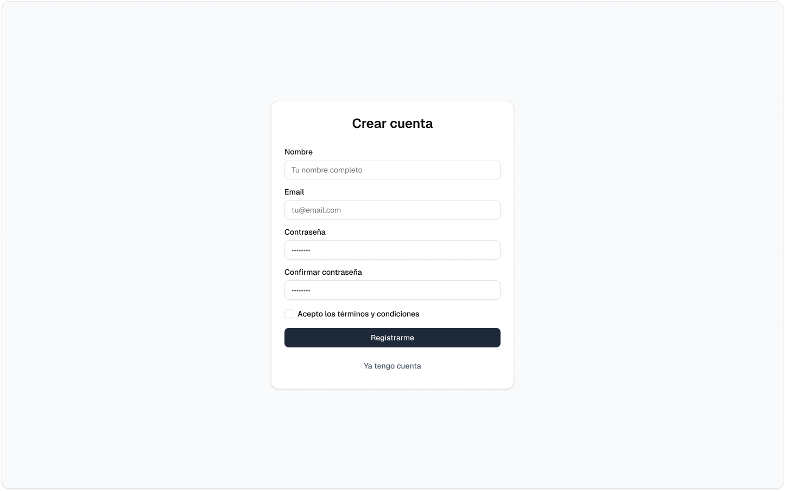

# Capítulo IV: Product Design

Este capítulo cubre todos los aspectos relacionados con el diseño de la solución, incluyendo el estilo visual, los diagramas C4, los diagramas de clases y los modelos de base de datos.

## 4.1. Style Guidelines

La aplicación *Quadrapp* se fundamenta en un diseño intuitivo, limpio y accesible, priorizando la legibilidad y la simplicidad en la interacción. Su propósito es ofrecer una experiencia coherente y uniforme en todas las plataformas, evitando la sobrecarga visual y utilizando de manera estratégica los espacios en blanco para optimizar la navegación. La tipografía principal seleccionada es Roboto, una fuente Sans Serif moderna que garantiza claridad y comodidad de lectura en pantallas de distintos tamaños.

### 4.1.1. General Style Guidelines

Es un conjunto de normas y directrices que determinan cómo se deben redactar, diseñar o presentar documentos, contenido en línea, software u otros trabajos creativos. A continuación, se detallan los parámetros implementados en la estructura del proyecto.

- **Branding:**

El branding de Quadrapp está diseñado para transmitir confianza, inclusión y eficiencia urbana.
Su identidad visual se sustenta en una paleta violeta–azul con acentos en naranja, que refuerza la idea de innovación accesible y potencia las llamadas a la acción. Los fondos claros y el alto contraste garantizan una experiencia visual clara y accesible para todos los usuarios.

De esta forma, Quadrapp se presenta como una marca moderna, coherente y orientada a la acción, plenamente alineada con su propósito de optimizar y facilitar la movilidad urbana.

**Misión:** Facilitar el acceso a estacionamientos seguros, rápidos y confiables mediante el uso de tecnología, mejorando la movilidad urbana y la experiencia del conductor.

**Visión:** Convertirnos en la aplicación líder en gestión de estacionamientos inteligentes, contribuyendo a ciudades más sostenibles, organizadas y conectadas.

- **Tipografía:**

La tipografía de Quadrapp se basa en una Sans Serif moderna, elegida por su legibilidad, versatilidad multiplataforma y estética minimalista.
Se establece una jerarquía tipográfica clara, acompañada de un interlineado amplio y tamaños mínimos accesibles, con el fin de garantizar una experiencia de lectura cómoda y consistente tanto en web como en dispositivos móviles.

#### Tamaños

- H1 → 32 px · 600 · violeta `#6B46C1` | uso: títulos principales  
- H2 → 24 px · 600 · azul `#2563EB` | uso: subtítulos  
- H3 → 20 px · 600 · violeta `#6B46C1` | uso: encabezados de tarjetas/módulos  
- P → 16–18 px · 400 · `#111827` | uso: texto y descripciones  

- Ajustes móviles → H1 (28–32 px) · H2 (22–24 px) · H3 (18–20 px) · P (16–18 px)  

- Interlineado → H1 (40 px) · H2 (32 px) · H3 (28 px) · P (24–28 px)  

#### Colores aplicados a tipografía

- Primario (violeta): `#6B46C1`  
- Secundario (azul): `#2563EB`  
- Texto principal: `#111827`  

#### Color Palette

| Color Name       | Hex Code | Uso Principal |
|------------------|----------|-------------------------------------------------------------------|
| **Violeta Claro**   | `#C4B5FD` | Fondos de tarjetas suaves, estados “hover” sutiles |
| **Violeta Primario**| `#6B46C1` | Encabezados destacados, énfasis de marca |
| **Violeta Oscuro**  | `#4C1D95` | Fondos de secciones clave, barras y overlays oscuros |
| **Azul Claro**      | `#93C5FD` | Badges informativos, resaltados secundarios |
| **Azul Primario**   | `#2563EB` | Enlaces, botones secundarios, títulos de módulo |
| **Azul Muy Oscuro** | `#1E3A8A` | Color primario de texto sobre fondos claros, iconografía sólida |
| **Naranja CTA**     | `#F59E0B` | Botones primarios de acción (Call To Action) |
| **Naranja (Hover)** | `#D97706` | Estados hover/pressed del CTA, advertencias suaves |
| **Éxito (Green)**   | `#16A34A` | Confirmaciones, estados OK, indicadores positivos |
| **Alerta (Red)**    | `#DC2626` | Errores, estados críticos, validación fallida |
| **Texto Principal** | `#111827` | Párrafos y contenidos largos (alta legibilidad) |
| **Texto Secundario**| `#4B5563` | Etiquetas, meta-información, placeholders |
| **Bordes/Divisores**| `#E5E7EB` | Líneas de separación, contornos de inputs |
| **Fondo**           | `#FFFFFF` | Fondo base de la interfaz |
| **Fondo Alt**       | `#F9FAFB` | Paneles alternos, listas, tarjetas |

- **Spacing:**

Usamos una escala de 8 px para asegurar ritmo visual, coherencia entre web y móvil y mejor legibilidad. La regla es construir márgenes, paddings y gaps con múltiplos de 8.

- **Escala base:**

`8 · 16 · 24 · 32 · 40 · 48 · 64 · 96 px`

#### Reglas generales

- Márgenes y paddings estándar: 8 / 16 / 24 / 32 px (según jerarquía del contenido)  
- Separación entre bloques mayores (secciones, hero, módulos): 64–96 px · móvil 48–64 px  
- Gaps entre componentes hermanos (tarjetas, gráficos, tablas): 24–32 px · móvil 16–24 px  
- Espacio negativo: uso intencional para dar respiración visual, evitando valores improvisados  

#### Iconografía

- Línea: minimal, reconocible y consistente  
- Tamaño mínimo: 24 px (web) · 24–32 px (móvil)  
- Área táctil: ≥ 44 px  
- Peso de trazo: 1.5–2 px  
- Contraste: nivel AA  

#### Estados (color)

- Default: `#4B5563` (texto secundario)  
- Hover / Focus: `#2563EB` (azul primario)  
- Activo / Seleccionado: `#6B46C1` (violeta primario)  
- En botón CTA naranja: `#F59E0B` → icono blanco `#FFFFFF`  
- Deshabilitado: `#E5E7EB`  

#### Paleta aplicada

- Primarios: violeta `#6B46C1`, azul `#2563EB`  
- Éxito: `#16A34A`  
- Error: `#DC2626`  
- Texto: `#111827`  

#### Iconografía de Acciones

| Acción              | Icono (Material)   | Color por defecto             | Notas de uso |
|---------------------|--------------------|-------------------------------|--------------|
| **Guardar**         | `save`             | `#6B46C1`                     | En botones primarios: blanco sobre CTA. |
| **Reservar**        | `calendar_month`   | `#2563EB`                     | En “crear reserva” usar CTA naranja. |
| **Email**           | `mail`             | `#2563EB`                     | En enlaces/contacto. |
| **Buscar**          | `search`           | `#4B5563` → hover `#2563EB`   | Input con icono leading. |
| **Filtrar**         | `filter_list`      | `#4B5563`                     | Chips de filtro activos en `#6B46C1`. |
| **Lista/Mapa (toggle)** | `list` / `map` | `#4B5563`                     | Estado activo en `#6B46C1`. |
| **Parking**         | `local_parking`    | `#2563EB`                     | Marca/identificador de estacionamiento. |
| **Ubicación**       | `pin_drop`         | `#2563EB`                     | En cards y detalle. |
| **Disponibilidad libre** | `check_circle` | `#16A34A`                     | Ocupado: `block #DC2626`; Reservado: `schedule #D97706`. |
| **Reseñas/Rating**  | `star`             | `#F59E0B`                     | Media estrella: `star_half`. |
| **Notificaciones**  | `notifications`    | `#4B5563`                     | No leído en `#2563EB`. |
| **Perfil**          | `person`           | `#4B5563`                     | Activo en tab bar: `#6B46C1`. |
| **Dashboard**       | `dashboard`        | `#2563EB`                     | Tarjetas/resúmenes. |
| **QR**              | `qr_code_2`        | `#4B5563`                     | Acciones: descargar/mostrar. |
| **Editar**          | `edit`             | `#4B5563`                     | En tabla: acción secundaria. |
| **Eliminar**        | `delete`           | `#DC2626`                     | Confirmación obligatoria. |
| **Volver**          | `arrow_back`       | `#4B5563`                     | Navegación superior. |
| **Inicio**          | `home`             | `#2563EB`                     | Página principal. |
| **Pago**            | `credit_card`      | `#2563EB`                     | Éxito de pago: `check_circle #16A34A`. |

#### Personalidad

- Claro, cercano y orientado a la acción  
- Inclusivo y sereno  
- Profesional sin ser frío  

#### Objetivo

Que el usuario se sienta acompañado y en control (confianza + eficiencia)  

#### Principios

1. Claridad primero: frases cortas, verbos en activo, sin tecnicismos  
2. Cercanía respetuosa: segunda persona (“tú”) en móvil; tono profesional cercano en panel web (dueños/operadores)  
3. Honestidad y calma: informa qué pasó, por qué y qué hacer después  
4. Inclusivo y accesible: lenguaje sencillo, sin jerga local ni género marcado  
5. Consistencia: *sentence case*, sin mayúsculas sostenidas; evita signos y emojis en exceso  

#### Guía de estilo

- CTA concretos y accionables  
  Ej: “Reservar ahora”, “Pagar”, “Ver detalles”  

- Mensajes breves: máximo 1–2 oraciones por bloque  

- Prioriza lo útil: primero la acción o solución, luego el contexto  

### 4.1.2. Web Style Guidelines

- **Lineamientos UI – Quadrapp:**

Base → branding violeta–azul con CTA naranja · escala 8 px · accesibilidad AA  

#### Diseño responsivo

- Grid/ritmo: escala 8 px (8/16/24/32/64)  
  · Gutters: 24 px desktop · 16 px tablet · 12–16 px móvil  
- Lectura en F/Z: títulos claros + subtítulos + párrafos 16–18 px  
- Breakpoints:
  · ≥1280 px: 12 col, máx. 1200–1280 px  
  · ≥960 px: 12 col, centrado  
  · <960 px: 4–8 col, nav colapsada  
- Imágenes/tablas responsivas, sin scroll horizontal  

#### Navegación

- *App shell (panel operador)*  
  · Top App Bar: título de módulo + acciones globales (Soporte, Cuenta)  
  · Sidenav izq. ~280 px: Dashboard, Reservas, Reseñas, Perfil (+ otras)  
  · Estado activo: violeta `#6B46C1` + fondo sutil  
  · Móvil: hamburguesa abre/cierra sidenav  
  · Breadcrumbs si >2 niveles  

- *Landing (marketing)*  
  · Navbar minimal: Inicio, Beneficios, Planes, Contacto  
  · CTA visible siempre  

#### Componentes UI (Angular Material)

- *Botones*  
  · Primario: `mat-flat-button` naranja `#F59E0B` · texto blanco  
  · Secundario: `mat-stroked-button` azul `#2563EB`  
  · Terciario/Ghost: `mat-button` texto azul `#2563EB`  
  · Hover/pressed/focus visibles · deshabilitado con contraste  

- *Formularios*  
  · `mat-form-field` con label arriba · ayuda breve · error bajo campo  
  · Espaciado: label→campo 8 px · campos 16–24 px · grupos 32 px  
  · Validación clara (al blur o submit fallido)  

- *Tablas*  
  · `mat-table` con paginación, orden, filtros  
  · Altura fila: 44–48 px (cómoda) · 36–40 px (compacta)  
  · Columnas críticas fijas en desktop  
  · Acciones al final con icon buttons  

- *Tarjetas*  
  · `mat-card` fondo blanco · bordes 12–16 px · sombra sutil  
  · Títulos H3: 20 px  

- *Chips/Filtros*  
  · `mat-chip` activo en violeta `#6B46C1`  
  · Texto con contraste suficiente  

- *Gráficos*  
  · Paleta consistente (violeta/azul)  
  · Leyendas legibles  
  · Líneas/áreas con contraste  

#### Accesibilidad

- Contraste: AA mínimo para texto/íconos  
- Teclado: focus visible en todos los controles · tab orden lógico  
- ARIA:  
  · Formularios con `aria-describedby` en errores/ayudas  
  · Tablas con `scope` en headers  
- “Skip to content” al inicio  
- Títulos únicos por página  
- Alt text en imágenes  
- Motion: respeta `prefers-reduced-motion` · transiciones 150–200 ms  

### 4.1.3. Mobile Style Guidelines

#### Objetivo

Brindar una interacción ágil y sencilla al tacto, manteniendo la coherencia visual de la web pero adaptada a pantallas reducidas y al uso en movilidad.

#### Principios generales

- **Touch-first y accesible:** objetivos táctiles ≥ 44 px, foco visible, contrastes AA.
- **Ritmo 8 px:** márgenes/paddings y gaps en múltiplos de 8 (8/16/24/32/64).
- **Prioridad de funciones:** acceso directo a *Explorar/Reservar*, *Mis reservas*, *Notificaciones* y *Perfil* desde **tab bar**.
- **Legibilidad:** Sans Serif (Inter/Roboto en Flutter).
    - Tamaños base: H1 28–32, H2 22–24, H3 18–20, P 16–18.
    - Interlineado cómodo.
- **Paleta Quadrapp:**
    - Primarios: violeta `#6B46C1`, azul `#2563EB`
    - CTA naranja `#F59E0B`
    - Texto `#111827`
- **Jerarquía visual:** tarjetas blancas con bordes 12–16 px, sombras suaves; CTA naranja destacado.
- **Motion sutil:** transiciones 150–200 ms; respeta *reduce motion*.
- **Safe areas y notch:** contenido evita recortes (status bar, gesto home) y respeta teclado (*scroll insets*).

#### Patrones de UI

- **Navegación:**
    - Tab bar inferior: Inicio/Explorar, Reservas, Notificaciones, Perfil.
    - Pila de navegación con gesto “back”.

- **Listas y detalle:**
    - Listas en tarjetas con icono/estado.
    - Detalle con CTA fijo (ej. “Reservar”).

- **Búsqueda y filtros:**
    - Campo de búsqueda con debounce.
    - Chips de filtros arriba.
    - Resultados en tiempo real.

- **Formularios:**
    - Labels claros, ayudas breves.
    - Errores bajo el campo (8 px).
    - Grupos separados (24–32 px).

- **Estados vacíos:** mensaje claro + CTA contextual.

- **Feedback:**
    - Toasts no intrusivos para éxito.
    - Diálogos solo para confirmaciones críticas.

#### Colores y estados (móvil)

- **Activos/selección:** violeta `#6B46C1` (tab activo, chips activos).
- **Enlaces/acciones secundarias:** azul `#2563EB`.
- **CTA:** naranja `#F59E0B` (texto blanco); hover/pressed `#D97706`.
- **Éxito/Error:** verde `#16A34A` / rojo `#DC2626`.
- **Fondos:** blanco `#FFFFFF` / alterno `#F9FAFB`.

#### 4.1.3.1. iOS Mobile Style Guidelines

#### Navegación

- **Tab bar inferior** con labels visibles; icono activo en violeta `#6B46C1`.
- **Large Title opcional** en vistas raíz (ej. “Explorar”); toolbar limpia.
- **Gesto back** desde el borde izquierdo habilitado en vistas apiladas.

#### Controles y listas
- **Botones filled** para acciones primarias (CTA naranja).
- **Botones plain** para acciones secundarias.
- **Listas con separación sutil**; chevrons para navegación a detalle.
- **Action Sheets / Bottom Sheets** para selecciones rápidas (horarios, métodos de pago).

#### Formularios

- Labels sobre el campo.
- Teclado adecuado al tipo (email, numérico).
- Botón **“Continuar” / “Pagar ahora”** siempre visible (*bottom anchored*) en pasos críticos.

#### Tipografía y espaciado

- Títulos: 28–32 px con interlineado amplio.
- Párrafos: 16–18 px.
- Espacios:
    - 8/16 px dentro de tarjetas.
    - 24–32 px entre secciones.

#### Haptics y microinteracciones

- **Light impact** al confirmar.
- **Warning** en errores críticos.

#### Accesibilidad

- Soporte **VoiceOver** (orden lógico, `semanticsLabel` en Flutter).
- Tamaños dinámicos (*text scaling*) sin romper layout.
- Focus visible para mandos de hardware / teclado externo.

#### 4.1.3.2. Android Mobile Style Guidelines

#### Navegación

- **Bottom navigation bar** con 3–4 destinos; icono y label siempre visibles.
- **Top App Bar** (center o small) con acciones contextuales (buscar, filtrar).
- **Back** mediante botón del sistema o App Bar.

#### Componentes M3

- **FAB:** solo si agrega valor (acción primaria contextual, ej. “Nueva reserva” en *Mis reservas*).
- **Cards:** elevación sutil y radios 12–16 px.
- **Chips:** para filtros.
- **Snackbars:** para confirmaciones.
- **Dialogs:** para confirmaciones destructivas.

#### Formularios

- **TextField** con label claro.
- **Helper/error:** en 8 px bajo el campo.
- **Grupos por pasos:**
    1. Resumen
    2. Método de pago
    3. Confirmación

#### Tipografía y espaciado

- **H1:** 28–32 px
- **H2:** 22–24 px
- **H3:** 18–20 px
- **P:** 16–18 px

#### Gaps

- 16–24 px intra-sección
- 32 px entre grupos
- 64 px entre bloques mayores

#### Accesibilidad

- Soporte **TalkBack** y `semantics` en controles.
- Estados **enabled/disabled** con contraste suficiente.
- **Touch targets ≥44 px**.
- **Foco visible:** ripple + outline.

#### Motion y temas

- **Transiciones:** 150–200 ms (fade/slide).
- Respeta **Dynamic Color** si se habilita, manteniendo la identidad Quadrapp.
- Prioriza los **colores primarios definidos**.

## 4.2. Information Architecture

### 4.2.1. Organization Systems

#### Módulos principales

- **Autenticación (Auth):** Sign In / Sign Up / Recuperar clave.
- **Explorar / Directorio:** búsqueda por lista ↔ mapa; filtros por distancia, precio, rating y horario.
- **Parking:** Home del parking, Perfil/Configuración, Tarifas/Horarios, Servicios.
- **Reservas:** listar, detalle, creación y pago.
- **Reseñas:** feed y creación de reseña.
- **Perfil de usuario/owner:** datos, seguridad, preferencias.
- **Dashboard & Analytics (web):** KPIs, tablas y gráficos.
- **IoT (futuro, solo mención):** monitoreo conceptual de dispositivos/ocupación.

#### Procesos secuenciales (task-flows)
- **Reserva:** Explorar → Detalle parking → Crear reserva → Pago → Comprobante/QR.
- **Gestión (web):** Registro/edición de parking → Tarifas → Publicación.

#### Estructura de contenidos
- **Web (operador/owner):**  
  App Shell con Top App Bar + Sidenav → Dashboard, Reservas, Reseñas, Perfil, Configuración.

- **Móvil (conductor):**  
  Tab bar → Inicio/Explorar, Reservas, Notificaciones, Perfil.

#### Sitemaps (resumen)

##### Web (Angular)

- `/sign-in`, `/sign-up`
- `/dashboard`
- `/reservations` (tabla + detalle/modal)
- `/parking/directory/:ownerId`
- `/parking/home/:parkingId`
- `/parking/profile`
- `/parking/registration`
- `/parking/reviews`
- `/profile/:ownerId`
- `/devices` (IoT conceptual)
- `/**` (404)

##### Móvil (Flutter)
- **Tabs:** Explorar | Reservas | Notificaciones | Perfil
- **Flujos:** Login/Registro → Explorar (lista/mapa) → Detalle → Reserva → Pago → Éxito → Mis reservas

### 4.2.2. Labeling Systems

#### Principios

- **Claridad y consistencia:** usar *sentence case*, sin tecnicismos.
- **Etiquetas cortas:** máximo 2–3 palabras, accionables cuando aplica.

#### Convenciones

- **Navegación global (web):** Dashboard, Reservas, Reseñas, Perfil, Configuración.
- **Móvil (tab bar):** Inicio, Reservas, Notificaciones, Perfil.
- **Acciones:** *Reservar ahora*, *Pagar*, *Ver detalle*, *Editar*, *Descargar*.
- **Formularios:**
    - Labels con sustantivo claro (*Correo electrónico*, *Contraseña*).
    - Ayudas breves (1 línea).
    - Errores directos (*Este campo es obligatorio.*).
- **Icono + texto siempre** (evitar *icon-only* en navegación principal).
- **i18n listo:**
    - No incrustar variables en medio de frases si se puede evitar.
    - Preferir placeholders al final:
        - Ejemplo: *“Reservas de {month}”*.

#### URLs y slugs (web)

- **Formato:** kebab-case, semánticos.
- **Ejemplos:**
    - `/parking/home/{id-o-slug}`
    - `/reservations?from=2025-09-01&to=2025-09-10&status=active`
    - `/parking/directory/{owner-id}`
- **Regla:** evitar IDs sensibles en query strings; usar slugs cuando haya nombres públicos.

### 4.2.3. SEO Tags and Meta Tags

#### Básicos

- **Title (≤60 caracteres):**  
  `Quadrapp | Reserva de estacionamiento fácil en [Ciudad]`

- **Meta description (≤160 caracteres):**  
  `Encuentra, reserva y paga estacionamientos cercanos en minutos. Disponibilidad en tiempo real, reseñas y comprobante QR.`

- **Viewport:**  
  `width=device-width, initial-scale=1`

- **Robots:**
    - `index, follow` → solo en landing y páginas públicas.
    - `noindex` → en `/app/*`.

#### Social (Open Graph / Twitter)

- **Open Graph:**
    - `og:title`
    - `og:description`
    - `og:image` (1200×630)
    - `og:type=website`
    - `og:url`

- **Twitter:**
    - `summary_large_image`

#### Canonical

- Usar etiqueta:  
  `<link rel="canonical" href="https://quadrapp.com/">`
- Aplicar en landing y listados con filtros para **evitar contenido duplicado**.

#### Estructurados (opcional)

- **JSON-LD:**
    - Organización / Marca.
    - Listado de parkings (si hay páginas públicas).
- Mantenerlo **simple y consistente**.

### 4.2.4. Searching Systems

#### Objetivo

Localizar estacionamientos y reservas **rápido y con pocos pasos**.

#### Patrones

##### Búsqueda principal (Explorar)

- Campo con **debounce (~300 ms)**.
- Sugerencias por barrio/avenida.
- Detección de ubicación (permiso explícito).
- Toggle **Lista/Mapa**.

##### Facetas / filtros (chips arriba)

- Distancia (cercanía).
- Precio/hora.
- Horario.
- Disponibilidad.
- Calificación (★).
- Servicios (techado, vigilancia).
- Método de pago.

##### Ordenar por

- Distancia.
- Precio.
- Mejor valorado.
- Más cercano.

##### Resultados

- Tarjetas con nombre, dirección, distancia, precio y estado.
- En mapa: **markers** + *bottom sheet* al seleccionar.

##### Estados

- **No results:** mostrar sugerencias → limpiar filtros, ampliar radio.

##### Reservas (web)

- Búsqueda por **ID / usuario / fecha**.
- Filtros por **estado** y **rango de fechas**.
- Exportación **CSV**.

##### Accesibilidad

- Campo con **label visible**.
- `aria-describedby` para ayudas/errores.
- Resultados **navegables por teclado**.
- **Foco visible** en chips y lista.

### 4.2.5. Navigation Systems

El sistema de navegación es esencial para permitir que los usuarios se muevan con facilidad por la aplicación, asegurando una experiencia de usuario agradable. La aplicación web tendrá una barra de navegación con diversas opciones para guiar al usuario a la sección que le interese. También contará con un pie de página (footer) que proporcionará enlaces adicionales a secciones como "Sobre Nosotros", donde los usuarios podrán conocer nuestra visión y al equipo detrás de la aplicación.

#### Web (Angular + Material)

- **Top App Bar:** título de módulo, acciones globales (Soporte, Cuenta).
- **Sidenav:** secciones principales (activo en violeta); colapsable en `<960 px` (hamburguesa).
- **Breadcrumbs:** cuando exista profundidad >2 (ej. *Reservas > Detalle*).
- **Enlaces profundos:** rutas directas a detalle de reserva/parking.
- **Estados de ruta:** loading skeletons al navegar; toasts para confirmaciones.

#### Móvil (Flutter)

- **Tab bar:** 4 destinos → Inicio/Explorar, Reservas, Notificaciones, Perfil.
- **Stack por tab:** gesto back y App Bar con acciones contextuales (buscar, filtrar).
- **Bottom sheet:** para selecciones rápidas (horarios, métodos de pago).
- **CTA anclado en detalle:** *Reservar / Pagar ahora*.

#### Reglas de navegación

- Mantener **consistencia cross-platform** en nombres y jerarquía.
- Minimizar pasos en flujos críticos (**reserva/pago**); CTA siempre visible.
- Evitar **callejones sin salida**: siempre ofrecer *Volver* o *Ir al inicio*.
- **404 y vacíos** con CTA de salida (ej. *Explorar parkings*).

#### IoT (mención escalable)

- En **web**, entrada de *Dispositivos* solo como vista conceptual:
    - Lista de sensores con estado (ON/OFF, última señal).
    - No se implementa lógica embebida en este alcance.

## 4.3. Landing Page UI Design

Esta interfaz fue diseñada con simplicidad en mente, empleando colores para subrayar nuestro compromiso. Está optimizada para garantizar que los usuarios puedan leer cómodamente en cualquier dispositivo, con un tamaño de letra adecuado. Además, la interfaz es completamente responsive, adaptándose a cualquier dispositivo para ofrecer una experiencia de usuario óptima.

### 4.3.1. Landing Page Wireframe

En el marco del proyecto Quadrapp, se ha diseñado una landing page como puerta de entrada principal para los usuarios. Su propósito es transmitir la propuesta de valor, guiar al visitante hacia la acción de reservar estacionamientos y generar confianza en la aplicación. El diseño se inició con un wireframe en baja fidelidad, que definió estructura y jerarquía visual. Posteriormente, se aplicará la guía de estilos establecida para producir mockups en alta fidelidad. De esta manera, la landing integra coherencia estética y funcionalidad acorde al branding de Quadrapp.

### 4.3.2. Landing Page Mock-up

En el marco del proyecto Quadrapp, se desarrolló el mockup en alta fidelidad de la landing page, aplicando la guía de estilos definida (colores, tipografía, iconografía y componentes). Este mockup refleja de manera visual el branding de la aplicación, transmitiendo modernidad y confianza. A partir del wireframe inicial, se incorporaron mejoras en la jerarquía, usabilidad y atractivo visual. El resultado es una propuesta clara y coherente que guía al usuario hacia la acción de reservar estacionamientos. De esta forma, el mockup consolida la estética final y la experiencia esperada de Quadrapp.

## 4.4. Mobile Applications UX/UI Design

### 4.4.1. Mobile Applications Wireframes

En el marco del proyecto Quadrapp, se elaboraron los wireframes móviles como base para la aplicación destinada a conductores. Estos prototipos en baja fidelidad permiten definir la estructura de navegación, distribución de pantallas y principales flujos de interacción. Se incluyen vistas clave como login, registro, búsqueda de estacionamientos, reservas y perfil de usuario. Su objetivo es validar la usabilidad y lógica de la aplicación antes de aplicar el diseño visual final. Así, los wireframes móviles sirven como punto de partida para los mockups en alta fidelidad.

Inicio de sesión:

Crear cuenta:

Información de estacionamiento:

Filtrar búsqueda: 

Perfil de usuario:

  
### 4.4.2. Mobile Applications Wireflow Diagrams

En el desarrollo de Quadrapp, se diseñaron los wireflow diagrams móviles para representar de manera clara los flujos de navegación entre pantallas. Estos diagramas combinan wireframes con conexiones que muestran las acciones del usuario y sus posibles recorridos. Permiten visualizar cómo se realiza una reserva desde la búsqueda hasta el pago, incluyendo casos alternativos. Su propósito es validar la coherencia y simplicidad de la experiencia antes de la implementación. De este modo, los wireflows complementan a los wireframes y enriquecen el proceso de diseño de la app

Primeros pasos del usuario:

Reserva de estacionamiento:

### 4.4.3. Mobile Applications Mock-ups

En el marco del proyecto Quadrapp, se desarrollaron los mockups móviles en alta fidelidad como evolución de los wireframes iniciales. Estos prototipos incorporan el sistema de diseño definido (colores, tipografía, iconografía y componentes) para reflejar la identidad visual de la aplicación. Se presentan las vistas clave de login, registro, búsqueda de estacionamientos, reservas y perfil de usuario con un estilo consistente y atractivo. Su finalidad es mostrar cómo será la experiencia real del usuario en la app. De esta manera, los mockups móviles consolidan la propuesta final antes de la etapa de desarrollo.

Tiempo de espera:

Inicio de sesión:

Busqueda en el mapa:

Resultado de Parkings Cercanos:

Reserva de Parking:

Perfil de Conductor:

### 4.4.4. Mobile Applications User Flow Diagrams

En el marco del proyecto Quadrapp, se elaboraron los User Flow Diagrams en mockups móviles, con el fin de representar los principales recorridos del usuario dentro de la aplicación. Estos diagramas muestran de manera visual y detallada cómo el usuario avanza desde el inicio de sesión, la búsqueda de estacionamientos y la reserva, hasta el pago y la visualización del pase QR. Al estar basados en los mockups de alta fidelidad, permiten validar la coherencia del diseño, la facilidad de navegación y la efectividad de los flujos planteados. Así, los User Flow Diagrams sirven como guía clara para el desarrollo e implementación de la experiencia de usuario en la app.

## 4.5. Mobile Applications Prototyping

### 4.5.1. Android Mobile Applications Prototyping

### 4.5.2. iOS Mobile Applications Prototyping

## 4.6. Web Applications UX/UI Design

### 4.6.1. Web Applications Wireframes

Inicio de sesión:

Registro de Usuario:

Perfil de Propietario:

Registro de Estacionamiento:

Editar el perfil del estacionamiento:

Reseña de los estacionamientos:

### 4.6.2. Web Applications Wireflow Diagrams

### 4.6.3. Web Applications Mock-ups

Inicio de sesión:

Crear Cuenta:

Perfil de Propietario:

Registro de Parking:

Editar Perfil de Parking:

Reseña de Parking:

### 4.6.4. Web Applications User Flow Diagrams

## 4.7. Web Applications Prototyping

## 4.8. Domain-Driven Software Architecture

### 4.8.1. Software Architecture Context Diagram

En el marco del proyecto Quadrapp, se elaboró el Software Architecture Context Diagram, el cual muestra una visión de alto nivel de la plataforma y su relación con los actores externos. Este diagrama identifica a los principales usuarios (conductores, operadores y administradores), así como los sistemas externos con los que interactúa (autenticación, pasarela de pagos, mapas y notificaciones). Su objetivo es establecer los límites del sistema, evidenciar las dependencias tecnológicas y brindar una comprensión clara del ecosistema donde se desarrollará la solución.

### 4.8.2. Software Architecture Container Diagrams

En el marco del proyecto Quadrapp, se desarrollaron los Container Diagrams, que descomponen el sistema en sus principales contenedores de software. Estos diagramas muestran cómo se organizan la aplicación web, la aplicación móvil, el backend API, los servicios de soporte y la base de datos. Su objetivo es detallar la responsabilidad de cada contenedor, las tecnologías empleadas y las interacciones entre ellos, brindando una visión clara de la arquitectura lógica y de despliegue de la solución.

### 4.8.3. Software Architecture Components Diagrams

En el marco del proyecto Quadrapp, se elaboraron los Component Diagrams con el fin de detallar la organización interna de los contenedores principales, en especial el API Backend. Estos diagramas permiten visualizar los componentes clave (controladores, servicios, repositorios y adaptadores) y su relación con los bounded contexts definidos (Bookings, Payments, Directory, Reviews, Auth, Notifications, etc.). El objetivo es mostrar cómo se implementan las reglas de negocio, la interacción entre capas y la comunicación con sistemas externos, aportando un nivel de detalle esencial para el diseño, desarrollo y mantenimiento del sistema.

Component IAM:

Component Reservation:

Component Profile:

Component Payment:

Component Review:

Component Parking Management:

Component Notification:

## 4.9. Software Object-Oriented Design

### 4.9.1. Class Diagrams

En el marco del proyecto Quadrapp, se desarrollaron los Class Diagrams con el propósito de modelar las estructuras de datos y sus relaciones dentro de los distintos módulos de la aplicación. Estos diagramas representan las clases principales, sus atributos, métodos y asociaciones, permitiendo visualizar la lógica interna del sistema y cómo los objetos colaboran entre sí. De esta manera, los Class Diagrams sirven como puente entre el diseño conceptual y la implementación, asegurando consistencia, mantenibilidad y alineación con los bounded contexts previamente definidos.

Iam Class Diagram:

Review Class Diagram:

Notification  Class Diagram:

Parking Management Class Diagram: 

Payment Class Diagram:

Profile Class Diagram:

Reservation Class Diagram:

### 4.9.2. Class Dictionary

En el marco del proyecto Quadrapp, se elaboró el Class Dictionary con el objetivo de documentar de manera precisa las clases definidas en el sistema. Este diccionario describe los nombres de las clases, sus atributos, tipos de datos, métodos principales y relaciones, brindando un nivel de detalle técnico que complementa a los Class Diagrams. Su función es servir como una guía de referencia clara y estructurada para el equipo de desarrollo, garantizando consistencia en la implementación y facilitando el mantenimiento del sistema a lo largo del tiempo.

#### Reservation

**Atributos**

* id: Long

* userId: Long

* vehiclePlate: String

* parkingId: Long

* parkingSpotId: UUID

* startTime: LocalDateTime

* endTime: LocalDateTime

* totalPrice: Float

* status: ReservationStatus

**Métodos**

* Reservation(command: CreateReservationCommand)

* calculateTotalPrice(): void

* getDurationInHours(): Long

* confirm(): void

* cancel(): void

* complete(): void

**Relaciones**

* 1..1 con ReservationPayment

**ReservationPayment**

**Atributos**

* reservationId: Long

**Métodos**

* ReservationPayment(reservationId: Long, amount: Double)

----

#### IAM (Identity & Access Management)

**Role**

**Atributos**

* id: Long
* name: Roles

**Métodos**

* Role(), Role(name: Roles)

* getStringName(): String

* getDefaultRole(): Role

* toRoleFromName(name: String): Role

* validateRoleSet(roles: List<Role>): List<Role>

* getId(), setId(id: Long)

* getName(), setName(name: Roles)

**User**

**Atributos**

* id: Long
* email: String
* password: String
* role: Set<Role>
* createdAt: Date
* updatedAt: Date

**Métodos**

* Constructores con email/password/roles

* addRole(role: Role)

* addRoles(roles: List<Role>)

* getSerializedRoles(): List<String>

* getEmail(), getPassword(), getRoles()

**Role (Enumeration)**

**Valores**

* ROLE_ADMIN

* ROLE_PARKING_OWNER

* ROLE_DRIVER

----

#### Notification

**Atributos**

* id: Long

* userId: Long

* type: String

* message: String

**Métodos**

* Notification(command: CreateNotificationCommand)

**Relaciones**

* 1..* con User

**User**

**Atributos**

* id: Long
* email: String
* password: String
* role: Set<Role>
* createdAt: Date
* updatedAt: Date

**Métodos**

* Constructores con email/password/roles

* addRole(role: Role)

* addRoles(roles: List<Role>)

* getSerializedRoles(): List<String>

* getEmail(), getPassword(), getRoles()

----

#### Parking Management

**Atributos**

* id: Long

* ownerId: OwnerId

* name: String

* description: String

* address: String

* lat: Double, lng: Double

* ratePerHour: Float

* rating: Float

* totalSpots, availableSpots: Integer

* totalRows, totalColumns: Integer

* imageUrl: String

* parkingSpotManager: SpotManager

**Métodos**

* Parking(command: CreateParkingCommand)
* addParkingSpot(command: AddParkingSpotCommand)
* getParkingSpots(): List<ParkingSpot>
* getParkingSpot(UUID): ParkingSpot

**ParkingSpotManager (Value Object)**

**Atributos**

* parkingSpots: List<ParkingSpot>

**Métodos**

* addParkingSpot(parking, row, column, label)

* getParkingSpotById(UUID)

* updateParkingSpot(ParkingSpot, UUID)

**ParkingSpot**

**Atributos**

* id: UUID

* parkingId: Long

* available: Boolean

* rowIndex, columnIndex: Integer

* label: String

**Métodos**

* setAvailability(state: Boolean)

----

#### Payment

   **Payment (Value Object)**

**Atributos**

* id: Long
* amount: Double
* paidAt: LocalDateTime
* status: PaymentStatus

**Métodos**

* Payment(amount: Double)

* markAsPaid(): void

* isForSubscription(): boolean

* isForReservation(): boolean

**ReservationPayment**

**Atributos**

* reservationId: Long

**SubscriptionPayment**

**Atributos**

* subscriptionId: Long

**PaymentStatus (Enumeration)**

**Valores**

* PENDING

* PROCESSING

* CANCELLED

* COMPLETED

* FAILED

----

#### Review

**Atributos**

* id: Long

* userId: Long

* parkingId: Long

* rating: Integer

* comment: String

**Métodos**

* Review(command: CreateReviewCommand)

**Relaciones**

* *..1 con User

* 1..* con Parking

**Parking**

**Atributos**

* id: Long

* ownerId: OwnerId

* name: String

* description: String

* address: String

* lat: Double, lng: Double

* ratePerHour: Float

* rating: Float

* totalSpots, availableSpots: Integer

* totalRows, totalColumns: Integer

* imageUrl: String

* parkingSpotManager: SpotManager

**Métodos**

* Parking(command: CreateParkingCommand)
* addParkingSpot(command: AddParkingSpotCommand)
* getParkingSpots(): List<ParkingSpot>
* getParkingSpot(UUID): ParkingSpot

**User**

**Atributos**

* id: Long
* email: String
* password: String
* role: Set<Role>
* createdAt: Date
* updatedAt: Date

**Métodos**

* Constructores con email/password/roles

* addRole(role: Role)

* addRoles(roles: List<Role>)

* getSerializedRoles(): List<String>

* getEmail(), getPassword(), getRoles()

----

#### Profile

**User**

**Atributos**

* id: Long
* email: String
* password: String
* role: Set<Role>
* createdAt: Date
* updatedAt: Date

**Métodos**

* Constructores con email/password/roles

* addRole(role: Role)

* addRoles(roles: List<Role>)

* getSerializedRoles(): List<String>

* getEmail(), getPassword(), getRoles()

**ParkingOwner**

**Atributos**

* id: Long

* fullName: String

* city, country: String

* phone: Phone

* companyName: String

* ruc: Ruc

* userId: Long

* createdAt, updatedAt: Date

**Métodos**

* ParkingOwner(command, userId)

* getPhone(), getRuc(), getCompanyName(), getCity(), getCountry(), getUserId()

**Driver**

**Atributos**

* id: Long

* fullName: String

* city, country: String

* phone: Phone

* dni: Dni

* userId: Long

* createdAt, updatedAt: Date

**Métodos**

* Driver(command, userId)
* getDni(), getPhone(), getFullName(), getCity(), getCountry(), getUserId()

## 4.10. Database Design

### 4.10.1. Relational/Non-Relational Database Diagram

En el marco del proyecto Quadrapp, se desarrolló el Relational Database Diagram (ERD) con el propósito de representar de forma estructurada las entidades del sistema, sus atributos y las relaciones entre ellas. Este diagrama permite visualizar la lógica de la base de datos, facilitando la comprensión de la arquitectura de datos que sustenta funcionalidades críticas como la gestión de usuarios, reservas, pagos, reseñas y administración de estacionamientos.

