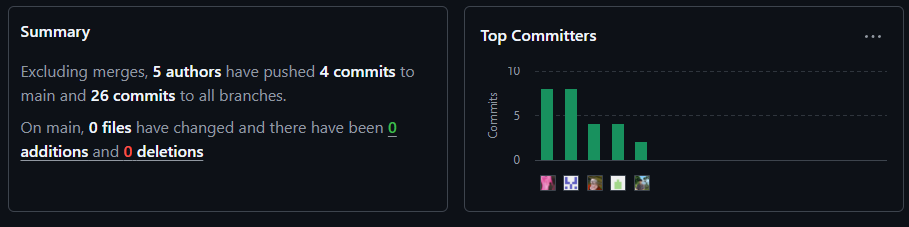

<p align="center">
    <strong>Universidad Peruana de Ciencias Aplicadas</strong><br>    
    </img><br>
    <strong>Ingeniería de Software</strong><br>
    <br><strong>Diseño de Experimentos de Ingeniería de Software - 7500</strong><br>
    <br><strong>Docente: Ivan Robles Fernández</strong><br> 
</p>

<p align="center">
    <strong>Startup: PCC Team</strong><br>
    <br><strong>Producto: Quadrapp</strong><br>
</p>

<div>
    <h3 align="center">Team Members:</h3>
</div>

<div>
    <table align="center">
        <tr>
            <th style="text-align:center;">Nombre</th>
            <th style="text-align:center;">Código</th>
        </tr>
        <tr>
            <td style="text-align:center;">Solis Solis, Leonardo José</td>
            <td style="text-align:center;">U20211G163</td>
        </tr>
        <tr>
            <td style="text-align:center;">Nanfuñay Liza, Pedro Jesús</td>
            <td style="text-align:center;">U202215462</td>
        </tr>
        <tr>
            <td style="text-align:center;">Calisaya Sánchez, Juan Jesús</td>
            <td style="text-align:center;">U202121935</td>
        </tr>
        <tr>
            <td style="text-align:center;">Oneglio De Paz, Beth Shantal</td>
            <td style="text-align:center;">U202213423</td>
        </tr>
        <tr>
            <td style="text-align:center;">Lagos Aguilar, Luis Eduardo</td>
            <td style="text-align:center;">U202121975</td>
        </tr>
    </table>
    </div>
</body>

<p align="center">
<br><strong>2025-02</strong></p>
<br>

# Registro de Versiones del Informe

| Versión | Fecha | Autor | Descripción de Modificación |
| ----------- | ----------- | ----------- | ----------- |
| 1.0 | 10/09/2025 | Solis, Nanfuñay, Calisaya, Oneglio, Lagos | Creación del documento de trabajo en formato Markdown. |
| 1.1 | 14/09/2025 | Solis, Nanfuñay, Calisaya, Oneglio, Lagos | Desarrollo del perfil de la startup y de la solución, identificación de segmentos objetivo y formulación de preguntas para el diseño de entrevistas. |
| 1.2 | 14/09/2025 | Solis, Nanfuñay, Calisaya, Oneglio, Lagos | Redacción de las guías de estilo e infraestructura de la información. |
| 1.3 | 15/09/2025 | Solis, Nanfuñay, Calisaya, Oneglio, Lagos | Realización y registro de entrevistas con los segmentos objetivo y análisis de los resultados. Creación del Impact Mapping. Redacción de las guías de estilo y la arquitectura de la información. |
| 1.4 | 16/09/2025 | Solis, Nanfuñay, Calisaya, Oneglio, Lagos | Elaboración de historias de usuario y del backlog del producto. |
| 1.5 | 16/09/2025 | Solis, Nanfuñay, Calisaya, Oneglio, Lagos | Creación del diagrama de base de datos, diagrama de clases, diccionario de clases, diagramas de contenedores, diagramas de contexto y diagramas de componentes. |
| 1.6 | 16/09/2025 | Solis, Nanfuñay, Calisaya, Oneglio, Lagos | Registro de las evidencias del Sprint. |
| 1.7 | 14/11/2025 | Solis, Nanfuñay, Calisaya, Oneglio, Lagos | Verificación y Validación del Producto, junto con la Validación de Conexiones. Además, se realizaron entrevistas sobre la aplicación para obtener información que permita implementar mejoras futuras. |
| 1.8 | 29/11/2025 | Solis, Nanfuñay, Calisaya, Oneglio, Lagos | Validación del Trabajo Final. |

# Project Report Collaboration Insights

URL del repositorio para el Project Report en la organización de GitHub del equipo:

https://github.com/Experiemtos-SI0732-Group-3-PCC-Team/Final-Project-Documentation-Report/blob/Chapter-I/upc-pre-202520-1asi0732-7500-pcc-report-t.md 

**TB1**

Para la elaboración del informe correspondiente a la entrega TB1, la implementación de las secciones se distribuyó entre los miembros del equipo de la siguiente manera:

| Integrantes | Tareas Asignadas |
| ----------- | ---------------- |
| Solis Solis, Leonardo José | Product Implementation & Deployment, Video About-the-Product, Back-end |
| Nanfuñay Liza, Pedro Jesús | Ubiquitous Language, Requirements Specification, Front-end |
| Calisaya Sánchez, Juan Jesús | Product Implementation, Back-end |
| Oneglio De Paz, Beth Shantal | Introducción, Requirements Elicitation & Analysis, Front-end |
| Lagos Aguilar, Luis Eduardo | Product Design, Architecture Design |

La colaboración en el informe se llevó a cabo mediante commits frecuentes en el repositorio de la organización PCC Team.

**GitHub Collaboration Insights**

GitHub también muestra un historial de las ramas principales y los procesos de fusión realizados. Todas las ramas se crearon siguiendo el diseño de GitFlow para asegurar una adecuada organización al utilizar un sistema de control de versiones.

Los miembros del equipo son:

- Solis Solis, Leonardo José
- Nanfuñay Liza, Pedro Jesús
- Calisaya Sánchez, Juan Jesús
- Oneglio De Paz, Beth Shantal
- Lagos Aguilar, Luis Eduardo

Se describen las ramas más destacadas de la siguiente manera:

main: Representada en negro. Es la rama principal del proyecto y se actualiza con cada entregable.
develop: Representada en azul. Es la rama principal para el proceso de desarrollo del proyecto.
feature-product-design: Representada en verde. Incluye el contenido de flujos de usuario y wireframes.
feature-sprint1: Representada en amarillo. Contiene los artefactos relacionados con el sprint 1 en el informe.
Los gráficos siguientes muestran los análisis de commits en el repositorio del informe, incluyendo la cantidad de líneas de texto añadidas por cada miembro del equipo.

**Trabajo Parcial**

Para la elaboración del informe correspondiente a la entrega TP, la implementación de las secciones se distribuyó entre los miembros del equipo de la siguiente manera:

| **Integrantes**    | **Tareas Asignadas**    |
| ----- | ---------------------- |
| **Calisaya Sánchez, Juan Jesús** | Implementó *Continuous Deployment*, detallando las herramientas y prácticas utilizadas, así como los componentes del pipeline de despliegue en producción para garantizar actualizaciones seguras y sin interrupciones. |
| **Lagos Aguilar, Luis Eduardo**  | Implementó *Continuous Integration*, documentando las herramientas y prácticas aplicadas, además de los componentes del pipeline de construcción y pruebas automatizadas que aseguran entregas constantes y de calidad. |
| **Nanfuñay Liza, Pedro Jesús**   | Desarrolló la documentación y ejecución de pruebas BDD y de sistema, enfocándose en validar el cumplimiento de los criterios de aceptación, el rendimiento y la estabilidad de la aplicación.                           |
| **Oneglio De Paz, Beth Shantal** | Aplicó *Continuous Delivery*, describiendo las herramientas, prácticas y etapas del pipeline de despliegue en entornos controlados, garantizando versiones listas para ser liberadas de forma segura y eficiente.       |
| **Solis Solis, Leonardo José**   | Realizó pruebas unitarias e integradas sobre las entidades principales, asegurando la correcta comunicación entre los servicios y validando la estabilidad y confiabilidad del sistema.                                 |

**TB2**

Para la elaboración del informe correspondiente a la entrega, la implementación de las secciones se distribuyó entre los miembros del equipo de la siguiente manera:

| **Integrantes**    | **Tareas Asignadas**    |
| ----- | ---------------------- |
| **Calisaya Sánchez, Juan Jesús** | Implementó la auditoría correspondiente, incluyendo la información del grupo auditado, el cronograma y el contenido evaluado. Asimismo, se implementó la auditoría recibida, considerando la información del grupo auditor, su cronograma y el contenido revisado. |
| **Lagos Aguilar, Luis Eduardo**  | Se implementaron las herramientas y prácticas necesarias para el proyecto, incluyendo el monitoreo de los componentes del pipeline, la configuración de alertas y el sistema de notificaciones para garantizar un seguimiento continuo y una respuesta rápida ante cualquier incidencia. |
| **Nanfuñay Liza, Pedro Jesús**   | Se implementó el Análisis de Código Estático, asegurando el cumplimiento de los estándares y convenciones de codificación, así como la calidad y seguridad del código. Además, se realizaron revisiones para garantizar la correcta aplicación de buenas prácticas y detectar posibles mejoras.                         |
| **Oneglio De Paz, Beth Shantal** | Se elaboró el resumen del estado actual (As-Is) y se recopilaron los insumos iniciales, incluyendo supuestos, brechas de conocimiento, ideas y afirmaciones. A partir de ello, se formularon preguntas listas para experimentación y se organizó un backlog de preguntas. Finalmente, se desarrollaron las tarjetas de experimentos para orientar las pruebas y validaciones posteriores.       |
| **Solis Solis, Leonardo José**   | Se definieron las hipótesis y se identificaron las métricas de negocio del dominio. Se establecieron las medidas y condiciones necesarias, se realizaron cálculos de escalamiento y decisiones pertinentes, y se seleccionaron los métodos adecuados. Además, se planificó el análisis de datos, definiendo objetivos, KPIs y métricas, así como un plan de seguimiento para plataformas web y móviles.                           |

La colaboración en el informe se llevó a cabo mediante commits frecuentes en el repositorio de la organización PCC Team.

**GitHub Collaboration Insights**

GitHub también muestra un historial de las ramas principales y los procesos de fusión realizados. Todas las ramas se crearon siguiendo el diseño de GitFlow para asegurar una adecuada organización al utilizar un sistema de control de versiones.

Los miembros del equipo son:

- Solis Solis, Leonardo José
- Nanfuñay Liza, Pedro Jesús
- Calisaya Sánchez, Juan Jesús
- Oneglio De Paz, Beth Shantal
- Lagos Aguilar, Luis Eduardo

Se describen las ramas más destacadas de la siguiente manera:

main: Representada en negro. Es la rama principal del proyecto y se actualiza con cada entregable.
develop: Representada en azul. Es la rama principal para el proceso de desarrollo del proyecto.
feature-product-design: Representada en verde. Incluye el contenido de flujos de usuario y wireframes.
feature-sprint1: Representada en amarillo. Contiene los artefactos relacionados con el sprint 1 en el informe.
Los gráficos siguientes muestran los análisis de commits en el repositorio del informe, incluyendo la cantidad de líneas de texto añadidas por cada miembro del equipo.

**Trabajo Final**

Los miembros del equipo son:

- Solis Solis, Leonardo José
- Nanfuñay Liza, Pedro Jesús
- Calisaya Sánchez, Juan Jesús
- Oneglio De Paz, Beth Shantal
- Lagos Aguilar, Luis Eduardo


# Contenido

## Tabla de contenidos

[Registro de Versiones del Informe](#registro-de-versiones-del-informe)

[Project Report Collaboration Insights](#project-report-collaboration-insights)

[Student Outcome](#student-outcome)

[Capítulo I: Introducción](#capítulo-i-introducción)

[1.1 Startup Profile](#11-startup-profile)  
[1.1.1. Descripción de la Startup](#111-descripción-de-la-startup)  
[1.1.2. Perfiles de integrantes del equipo](#112-perfiles-de-integrantes-del-equipo)  

[1.2. Solution Profile](#12-solution-profile)  
[1.2.1 Antecedentes y problemática](#121-antecedentes-y-problemática)  
[1.2.2 Lean UX Process.](#122-lean-ux-process)  
[1.2.2.1. Lean UX Problem Statements.](#1221-lean-ux-problem-statements)  
[1.2.2.2. Lean UX Assumptions.](#1222-lean-ux-assumptions)  
[1.2.2.3. Lean UX Hypothesis Statements.](#1223-lean-ux-hypothesis-statements)  
[1.2.2.4. Lean UX Canvas.](#1224-lean-ux-canvas)  

[1.3. Segmentos objetivo.](#13-segmentos-objetivo)  

[Capítulo II: Requirements Elicitation & Analysis](#capítulo-ii-requirements-elicitation--analysis)  

[2.1. Competidores](#21-competidores)  
[2.1.1. Análisis competitivo](#211-análisis-competitivo)  
[2.1.2. Estrategias y tácticas frente a competidores](#211-análisis-competitivo)  

[2.2. Entrevistas](#22-entrevistas)  
[2.2.1. Diseño de entrevistas](#221-diseño-de-entrevistas)  
[2.2.2. Registro de entrevistas](#222-registro-de-entrevistas)  
[2.2.3. Análisis de entrevistas](#223-análisis-de-entrevistas)  

[2.3. Needfinding](#23-needfinding)  
[2.3.1. User Personas](#231-user-personas)  
[2.3.2. User Task Matrix](#232-user-task-matrix)  
[2.3.3. User Journey Mapping](#233-user-journey-mapping)  
[2.3.4. Empathy Mapping](#234-empathy-mapping)  
[2.3.5. As-is Scenario Mapping](#235-as-is-scenario-mapping)

[2.4. Ubiquitous Language](#25-ubiquitous-language)  

[Capítulo III: Requirements Specification](#capítulo-iii-requirements-specification)  

[3.1. To-Be Scenario Mapping](#31-to-be-scenario-mapping)  
[3.2. User Stories](#32-user-stories)  
[3.3. Product Backlog](#33-product-backlog)  
[3.4. Impact Mapping](#34-impact-mapping)  

[Capítulo IV: Product Design](#capítulo-v-product-design)  
[4.1. Style Guidelines.](#41-style-guidelines)  
[4.1.1. General Style Guidelines.](#411-general-style-guidelines)  
[4.1.2. Web, Mobile and IoT Style Guidelines.](#412-web-mobile-and-iot-style-guidelines)  
[4.2. Information Architecture.](#42-information-architecture)  
[4.2.1. Organization Systems.](#421-organization-systems)  
[4.2.2. Labeling Systems.](#422-labeling-systems)  
[4.2.3. SEO Tags and Meta Tags](#423-seo-tags-and-meta-tags)  
[4.2.4. Searching Systems.](#424-searching-systems)  
[4.2.5. Navigation Systems.](#425-navigation-systems)  
[4.3. Landing Page UI Design.](#43-landing-page-ui-design)  
[4.3.1. Landing Page Wireframe.](#431-landing-page-wireframe)  
[4.3.2. Landing Page Mock-up.](#432-landing-page-mock-up)  
[4.4. Mobile Applications UX/UI Design.](#44-mobile-applications-uxui-design)  
[4.4.1. Mobile Applications Wireframes.](#441-applications-wireframes)  
[4.4.2. Mobile Applications Wireflow Diagrams.](#442-applications-wireflow-diagrams)  
[4.4.3. Mobile Applications Mock-ups.](#443-applications-mock-ups)  
[4.4.4. Mobile Applications User Flow Diagrams.](#444-applications-user-flow-diagrams)  
[4.5. Mobile Applications Prototyping.](#45-applications-prototyping)  
[4.5.1. Android Mobile Applications Prototyping.](#451-android-mobile-applications-prototyping)  
[4.5.2. iOS Mobile Applications Prototyping.](#452-ios-mobile-applications-prototyping)  

[4.6. Web Applications UX/UI Design.](#46-web-applications-uxui-design)  
[4.6.1. Web Applications Wireframes.](#461-web-applications-wireframes)  
[4.6.2. Web Applications Wireflow Diagrams.](#462-web-applications-wireflow-diagrams)  
[4.6.3. Web Applications Mock-ups.](#463-web-applications-mock-ups)  
[4.6.4. Web Applications User Flow Diagrams.](#464-web-applications-user-flow-diagrams)  

[4.7. Web Applications Prototyping.](#47-web-applications-prototyping)  

[4.8. Domain-Driven Software Architecture.](#48-domain-driven-software-architecture)  
[4.8.1. Software Architecture Context Diagram.](#481-software-architecture-context-diagram)  
[4.8.2. Software Architecture Container Diagrams.](#482-software-architecture-container-diagrams)  
[4.8.3. Software Architecture Components Diagrams.](#483-software-architecture-components-diagrams)  

[4.9. Software Object-Oriented Design.](#49-software-object-oriented-design)  
[4.9.1. Class Diagrams.](#491-class-diagrams)  
[4.9.2. Class Dictionary.](#492-class-dictionary)  

[4.10. Database Design.](#410-database-design)  
[4.10.1. Relational/Non-Relational Database Diagram.](#4101-relational-non-relational-database-diagram)  

[Capítulo V: Product Implementation](#capítulo-v-product-implementation)  

[5.1. Software Configuration Management.](#51-software-configuration-management)  
[5.1.1. Software Development Environment Configuration.](#511-software-development-environment-configuration)  
[5.1.2. Source Code Management.](#512-source-code-management)  
[5.1.3. Source Code Style Guide & Conventions](#513-source-code-style-guide-conventions)  
[5.1.4. Software Deployment Configuration](#514-software-deployment-configuration)  

[5.2. Product Implementation & Deployment.](#52-product-implementation-deployment)  
[5.2.1. Sprint Backlogs.](#521-sprint-backlogs)  
[5.2.2. Implemented Landing Page Evidence.](#522-implemented-landing-page-evidence)  
[5.2.3. Implemented Frotend-Web Application Evidence.](#523-implemented-frontend-web-application-evidence)  
[5.2.4. Implemented Native-Mobile Application Evidence.](#524-implemented-native-mobile-application-evidence)  
[5.2.5. Implemented RESTful API and/or Serverless Backend Evidence.](#525-implemented-restful-api-and-or-serverless-backend-evidence)  
[5.2.6. RESTful API Documentation.](#526-restful-api-documentation)  
[5.2.7. Team Collaboration Insights.](#527-team-collaboration-insights)  

[5.3. Product Implementation & Deployment (Sprint 2)](#53-product-implementation--deployment-sprint-2)  
[5.3.1. Sprint Backlogs](#531-sprint-backlogs)  
[5.3.2. Implemented Landing Page Evidence](#532-implemented-landing-page-evidence)  
[5.3.3. Implemented Frontend-Web Application Evidence](#533-implemented-frontend-web-application-evidence)  
[5.3.4. Implemented Native-Mobile Application Evidence](#534-implemented-native-mobile-application-evidence)  
[5.3.5. Implemented RESTful API and/or Serverless Backend Evidence](#535-implemented-restful-api-andor-serverless-backend-evidence)  
[5.3.6. RESTful API Documentation](#536-restful-api-documentation)  
[5.3.7. Team Collaboration Insights](#537-team-collaboration-insights)  

[5.4. Video About-the-Product](#54-video-about-the-product)  

[Capítulo VI: Product Verification & Validation](#capítulo-vi-product-verification--validation)

[6.1. Testing Suites & Validation](#61-testing-suites--validation)  
[6.1.1. Core Entities Unit Tests](#611-core-entities-unit-tests)  
[6.1.2. Core Integration Tests](#612-core-integration-tests)  
[6.1.3. Core Behavior-Driven Development](#613-core-behavior-driven-development)  
[6.1.4. Core System Tests](#614-core-system-tests)  

[Capítulo VII: DevOps Practices](#capítulo-vii-devops-practices)

[7.1. Continuous Integration](#71-continuous-integration)  
[7.1.1. Tools and Practices](#711-tools-and-practices)  
[7.1.2. Build & Test Suite Pipeline Components](#712-build--test-suite-pipeline-components)  

[7.2. Continuous Delivery](#72-continuous-delivery)  
[7.2.1. Tools and Practices](#721-tools-and-practices)  
[7.2.2. Stages Deployment Pipeline Components](#722-stages-deployment-pipeline-components)  

[7.3. Continuous Deployment](#73-continuous-deployment)  
[7.3.1. Tools and Practices](#731-tools-and-practices)  
[7.3.2. Production Deployment Pipeline Components](#732-production-deployment-pipeline-components)  

[7.4. Continuous Monitoring](#74-continuous-monitoring)
[7.4.1. Tools and Practices](#741-tools-and-practices) 
[7.4.2. Monitoring Pipeline Components](#742-monitoring-pipeline-components)
[7.4.3. Alerting Pipeline Components](#743-alerting-pipeline-components)
[7.4.4. Notification Pipeline Components](#744-notification-pipeline-components)

[Capítulo VIII: Experiment-Driven Development](#capítulo-viii-experiment-driven-development)

[8.1. Experiment Planning](#81-experiment-planning)  
[8.1.1. As-Is Summary](#811-as-is-summary)  
[8.1.2. Raw Material: Assumptions, Knowledge Gaps, Ideas, Claims](#812-raw-material-assumptions-knowledge-gaps-ideas-claims)  
[8.1.3. Experiment-Ready Questions](#813-experiment-ready-questions)  
[8.1.4. Question Backlog](#814-question-backlog)  
[8.1.5. Experiment Cards](#815-experiment-cards)  

[8.2. Hypotheses & Metrics](#82-hypotheses--metrics)  
[8.2.1. Hypotheses](#821-hypotheses)  
[8.2.2. Domain Business Metrics](#822-domain-business-metrics)  
[8.2.3. Measures](#823-measures)  
[8.2.4. Conditions](#824-conditions)  
[8.2.5. Scale Calculations and Decisions](#825-scale-calculations-and-decisions)  
[8.2.6. Methods Selection](#826-methods-selection)  
[8.2.7. Data Analytics: Goals, KPIs and Metrics Selection](#827-data-analytics-goals-kpis-and-metrics-selection)  
[8.2.8. Web and Mobile Tracking Plan](#828-web-and-mobile-tracking-plan)  

[8.3. Experimentation](#83-experimentation)  
[8.3.1. To-Be User Stories](#831-to-be-user-stories)  
[8.3.2. To-Be Product Backlog](#832-to-be-product-backlog)

[Conclusiones y recomendaciones](#conclusiones-y-recomendaciones)  
[Bibliografía](#bibliografía)  
[Anexos](#anexos)  

# Student Outcome
| Criterio específico                          | Acciones Realizadas                                       | Conclusiones                                                                   |
| ----------------------------------------------------------------------------------------------------------------- | --------------------------------------------------------------------------------------------------------------------------------------------------------------- | ------------------------------------------------------------------------------------ |
| **4.c.1** Reconoce responsabilidad ética y profesional en situaciones de ingeniería de software                                                                  | Solis Solis, Leonardo José<br><br>**TB1**<br><br>Para esta entrega demostré responsabilidad ética y profesional al diseñar y desarrollar los bounded contexts de IAM y Parking Management, haciendo uso de SpringBoot y Java para el manejo seguro de datos de usuario y el mantenimiento de la integridad del sistema.<br><br>**TP**<br><br>Demostré responsabilidad ética y profesional al realizar pruebas unitarias e integrales, validando la correcta comunicación entre los servicios y reforzando la estabilidad y confiabilidad del sistema.<br><br>**TB2**<br><br>En esta entrega asumí responsabilidad ética y profesional al desarrollar el Experiment Design del proyecto, definiendo hipótesis claras, métricas de negocio del dominio y métodos de medición que permitan evaluar el comportamiento del sistema de forma objetiva y transparente. Al establecer las condiciones experimentales, los cálculos de escala y las decisiones de validación, aseguré que cada diseño mantuviera la integridad técnica, evitando sesgos y garantizando que la toma de decisiones se base en evidencia confiable. Además, al preparar el Web and Mobile Tracking Plan, consideré principios éticos relacionados con la recolección y protección de datos, velando por que las métricas registradas sean pertinentes, necesarias y respeten la privacidad del usuario final.<br><br>**Trabajo Final**<br><br>Progreso satisfactorio del proyecto final.<br><br>Nanfuñay Liza, Pedro Jesús<br><br>**TB1**<br><br>Durante el desarrollo y documentación de la presente solución tecnológica, demostré la responsabilidad ética y profesional al cumplir con estándares de calidad, transparencia y buenas prácticas en ingeniería de software. Reconociendo la importancia de proteger la información y mantener un comportamiento responsable en cada etapa del proceso<br><br>**TP**<br><br>Demostré responsabilidad ética al ejecutar pruebas BDD y de sistema para validar los criterios de aceptación y el rendimiento general del software, garantizando que la aplicación cumpla con los estándares de calidad establecidos.<br><br>**TB2**<br><br>Durante el desarrollo de está entrega, identifiqué y reflexioné sobre la importancia de desarrollar código seguro para proteger los datos del usuarios, manteniendo al mismo tiempo buenas prácticas de desarrollo. Ello me permitió actuar de manera ética y profesional y comprendí en mayor medida que implica crear soluciones seguras y respetuosas con los usuarios.<br><br>**Trabajo Final**<br><br>Progreso satisfactorio del proyecto final.<br><br>Calisaya Sánchez, Juan Jesús<br><br>**TB1**<br><br>En el Capítulo V asumí responsabilidad ética y profesional al configurar el entorno de desarrollo, gestionar el código fuente y definir guías de estilo claras, garantizando un trabajo ordenado, transparente y de calidad en la implementación del software.<br><br>**TP**<br><br>En esta entrega demostré responsabilidad ética y profesional al implementar el proceso de despliegue continuo, garantizando actualizaciones seguras, estables y sin interrupciones del servicio en producción.<br><br>**TB2**<br><br>Se implementó la auditoría correspondiente, incluyendo la información del grupo auditado, el cronograma y el contenido evaluado. Asimismo, se implementó la auditoría recibida, considerando la información del grupo auditor, su cronograma y el contenido revisado.<br><br>**Trabajo Final**<br><br>Progreso satisfactorio del proyecto final.<br><br>Oneglio De Paz, Beth Shantal<br><br>**TB1**<br><br>En los Capítulos I y II asumí responsabilidad ética y profesional al documentar de forma clara y estructurada el perfil de la startup, la problemática, el proceso Lean UX y los artefactos de Requirements Elicitation & Analysis, garantizando calidad y buenas prácticas en el trabajo.<br><br>**TP**<br><br>Ejercí responsabilidad profesional al aplicar entrega continua en entornos controlados, asegurando que cada versión validada sea liberada de forma segura y eficiente, manteniendo la integridad del sistema.<br><br>**TB2**<br><br>Se elaboró el resumen del estado actual (As-Is) y se recopilaron los insumos iniciales, incluyendo supuestos, brechas de conocimiento, ideas y afirmaciones. A partir de ello, se formularon preguntas listas para experimentación y se organizó un backlog de preguntas. Finalmente, se desarrollaron las tarjetas de experimentos para orientar las pruebas y validaciones posteriores.<br><br>**Trabajo Final**<br><br>Progreso satisfactorio del proyecto final.<br><br>**Lagos Aguilar, Luis Eduardo**<br><br>**TB1**<br><br>Se evidenció la capacidad de identificar dilemas éticos en la práctica de la ingeniería de software y de aplicar criterios de responsabilidad profesional. El trabajo permitió reflexionar sobre el impacto de las decisiones técnicas en los usuarios y la importancia de cumplir con estándares de calidad y buenas prácticas.<br><br>**TP**<br><br>Asumí responsabilidad profesional al implementar integración continua para automatizar la construcción, pruebas y validación del código, asegurando la confiabilidad de cada actualización y promoviendo la transparencia en el ciclo de desarrollo.<br><br>**TB2**<br><br>Definí la disponibilidad, tiempos, reservas y pagos, configuré alertas claras (P1/P2/P3) para avisar rápido y a la persona correcta, probé la disponibilidad desde varias ubicaciones y dejé pasos de atención y cierre.<br><br>**Trabajo Final**<br><br>Progreso satisfactorio del proyecto final.                        | El trabajo realizado ha sido sobresaliente, cumpliendo con todos los segmentos del proyecto. El documento redactado ofrece un detallado informe sobre los pasos seguidos en la planificación, desarrollo y envío del proyecto a producción, garantizando así un resultado digno y completo. <br> El equipo demostró responsabilidad ética y profesional al mantener un enfoque riguroso en la calidad del software, aplicando buenas prácticas de desarrollo, despliegue y validación. Cada integrante asumió un rol técnico que reforzó la integridad, seguridad y confiabilidad del sistema en todas las etapas del ciclo de vida del proyecto. | 
| **4.c.2** Emite juicios informados considerando el impacto de las soluciones de ingeniería de software en contextos globales, económicos, ambientales y sociales | Solis Solis, Leonardo José <br><br>**TB1**<br><br>En esta entrega, evalué el impacto de la solucion propuesta para el desarrollo de los bounded contexts de IAM y ParkingManagement, tomando en cuenta la seguridad de datos, eficiencia y accesibilidad.<br><br>**TP**<br><br>Emití juicios informados al reconocer que las pruebas unitarias e integrales contribuyen directamente a reducir fallos y costos de mantenimiento, generando beneficios sostenibles para la organización.<br><br>**TB2**<br><br>Durante la elaboración del Experiment Design emití juicios informados al seleccionar las métricas, KPIs y métodos de análisis que permiten evaluar el impacto real de la solución en términos de eficiencia, escalabilidad y valor generado para los usuarios. La definición de hipótesis, métricas de negocio y condiciones experimentales consideró el impacto económico y social, permitiendo anticipar beneficios asociados a la optimización del sistema, la reducción de costos operativos y la mejora de la experiencia del usuario. Asimismo, el Tracking Plan fue diseñado teniendo en cuenta la recolección mínima necesaria de datos, lo que contribuye a un uso responsable de recursos tecnológicos y a la reducción del impacto ambiental asociado al procesamiento y almacenamiento de información.<br><br>**Trabajo Final**<br><br>Progreso satisfactorio del proyecto final.<br><br>Nanfuñay Liza, Pedro Jesús <br><br>**TB1**<br><br>Al desarrollar y documentar la solución tecnológica, realicé una evaluación crítica en cómo su implementación pueda generar beneficios en contextos globales, económicos, ambientales y sociales. Ello me permitió emitir juicios informados, valorando cómo la solución puede contribuir positivamente en diversos entornos.<br><br>**TP**<br><br>Reflexioné sobre el impacto positivo que las pruebas BDD y de sistema generan en la confianza del usuario final, comprendiendo que un software bien validado incrementa el valor social y técnico de la solución.<br><br>**TB2**<br><br>Reflexioné sobre cómo nuestra solución puede mejorar la situación actual del transporte urbano, reduciendo el tráfico y emisiones que afectan al medio ambiente. Así como, generar oportunidades a propietarios de estacionamientos para mejorar su gestión económica y logística. De esta manera, comprendí que cada decisión técnica tiene un impacto social y ambiental, buscando que nuestra solución aporte valor a la comunidad.<br><br>**Trabajo Final**<br><br>Progreso satisfactorio del proyecto final.<br><br>Calisaya Sánchez, Juan Jesús<br><br>**TB1**<br><br>En el Capítulo V: Product Implementation trabajé en la configuración y gestión del software, estableciendo el entorno de desarrollo adecuado, la administración del código fuente y la definición de guías de estilo y convenciones para mantener la calidad y legibilidad del proyecto. Asimismo, documenté la configuración para el despliegue del software, asegurando un proceso ordenado, eficiente y alineado con las buenas prácticas de implementación.<br><br>**TP**<br><br>Emití juicios informados al reconocer el impacto del despliegue continuo en la eficiencia operativa y la reducción de costos, contribuyendo a un desarrollo sostenible y competitivo del sistema a nivel global.<br><br>**TB2**<br><br>Se implementó la auditoría correspondiente, incluyendo la información del grupo auditado, el cronograma y el contenido evaluado. Asimismo, se implementó la auditoría recibida, considerando la información del grupo auditor, su cronograma y el contenido revisado.<br><br>**Trabajo Final**<br><br>Progreso satisfactorio del proyecto final.<br><br>Oneglio De Paz, Beth Shantal<br><br>**TB1**<br><br>En los Capítulos I y II emití juicios informados al analizar la problemática, los competidores y los segmentos objetivo, considerando el impacto de la solución propuesta en contextos globales, económicos, ambientales y sociales.<br><br>**TP**<br><br>Analicé cómo la entrega continua promueve la eficiencia y reduce el desperdicio de recursos, comprendiendo el impacto ambiental y económico de la automatización de despliegues.<br><br>**TB2**<br><br>Se elaboró el resumen del estado actual (As-Is) y se recopilaron los insumos iniciales, incluyendo supuestos, brechas de conocimiento, ideas y afirmaciones. A partir de ello, se formularon preguntas listas para experimentación y se organizó un backlog de preguntas. Finalmente, se desarrollaron las tarjetas de experimentos para orientar las pruebas y validaciones posteriores.<br><br>**Trabajo Final**<br><br>Progreso satisfactorio del proyecto final.<br><br>**Lagos Aguilar, Luis Eduardo**<br><br>**TB1**<br><br>Se logró emitir juicios críticos sustentados en análisis de casos reales, evaluando cómo las soluciones de software repercuten en diferentes contextos. El aprendizaje incluyó valorar el rol del ingeniero en la generación de soluciones sostenibles y responsables, reconociendo la necesidad de integrar factores sociales, ambientales y económicos en el diseño de software.<br><br>**TP**<br><br>Evalué cómo la integración continua mejora la productividad del equipo y la calidad de las entregas, comprendiendo su relevancia económica y social al optimizar recursos y fomentar sostenibilidad.<br><br>**TB2**<br><br>Tomé decisiones prácticas pensando en costo/beneficio y en la experiencia del usuario: puse metas claras de servicio y alertas alineadas a esas metas para evitar ruido, cuidé no guardar datos innecesarios y ajustar cuánto tiempo se guardan, revisé el equilibrio entre las nubes que usamos para que el monitoreo sea útil sin encarecerlo, y busqué que la app esté más disponible y responda más rápido para el usuario final.<br><br>**Trabajo Final**<br><br>Progreso satisfactorio del proyecto final. | En conclusión, el trabajo realizado refleja un compromiso ético y profesional en cada etapa, asegurando calidad, organización y responsabilidad en la documentación, análisis y desarrollo de la solución propuesta, lo que garantiza una implementación sólida y confiable del proyecto. <br> El trabajo en equipo permitió aplicar juicios técnicos fundamentados, evaluando el impacto de las decisiones de ingeniería en contextos globales, económicos y sociales. Las acciones evidencian un enfoque consciente, sostenible y responsable del desarrollo tecnológico.   |

# Capítulo I: Introducción

## 1.1. Startup Profile

En esta sección se ofrece una descripción del startup y se detallan los perfiles de los integrantes del equipo.

### 1.1.1. Descripción de la Startup

Quadrapp surge como una respuesta innovadora ante la ineficiente gestión de estacionamientos en espacios públicos y privados de alto tráfico. En las ciudades, los conductores pierden tiempo buscando espacios disponibles, lo que genera congestión, contaminación y malestar en la experiencia de uso.

Lo que nos diferencia de otras aplicaciones es que no solo mostramos disponibilidad de espacios, sino que integramos tecnología IoT, cámaras de monitoreo, sensores y geolocalización para:

- Detectar en tiempo real los espacios libres.
- Permitir la reserva y el pago automatizado de estacionamientos.
- Optimizar las rutas hacia los estacionamientos cercanos.
- Brindar a los administradores una gestión eficiente y rentable de sus espacios.

Además, incluimos espacios particulares: cualquier usuario con una cochera o estacionamiento privado podrá registrarlo en la app y generar ingresos extra.

**Misión:** Facilitar el acceso a estacionamientos seguros, rápidos y confiables mediante el uso de tecnología, mejorando la movilidad urbana y la experiencia del conductor.

**Visión:** Convertirnos en la aplicación líder en gestión de estacionamientos inteligentes, contribuyendo a ciudades más sostenibles, organizadas y conectadas.

**Logotipo de la Startup:**


**Logotipo del Servicio:**


#### 1.1.2. Perfiles de integrantes del equipo

| Descripción de los Miembros del Equipo | Perfiles de los Miembros del Equipo |
|----------------------------------------|--------------------------------------|
| Mi nombre es Juan Jesús Calisaya Sánchez - u202121935, tengo 21 años y actualmente curso Ingeniería de Software. Me considero una persona responsable, amigable y empática. Poseo conocimientos en C++, SQL, Python, HTML/CSS, JavaScript, C#, entre otros lenguajes y tecnologías. Estas habilidades me serán de gran utilidad para llevar a cabo el proyecto. |  |
| Mi nombre es Luis, estudiante de la carrera de Ingeniería de Software, y estoy con muchas ganas de dar lo mejor de mí por este equipo. Me considero una persona curiosa, siempre dispuesta a escuchar y proponer ideas que aporten al grupo. A lo largo de mi formación, he desarrollado habilidades técnicas en el diseño guiado por el dominio (Domain Driven Design) y en el desarrollo front-end utilizando frameworks como Vue y Angular. Además, tengo experiencia intermedia programando en lenguajes como C++ y Python. |  |
| Mi nombre es Pedro Jesús Nanfuñay Liza, tengo 20 años y soy estudiante de la carrera de Ingeniería de Software. Me considero una persona creativa, responsable, perseverante y siempre dispuesto a trabajar en equipo. Tengo conocimientos en varios lenguajes de programación como C++, Java y Python; en el desarrollo web con frameworks Angular y Primevue, y en base de datos relacionales y no relacionales como SQL y MongoDB. Espero aportar de manera positiva al equipo y cumplir con los objetivos establecidos. |  |
| Mi nombre es Beth Shantal Oneglio De Paz - u202213423, tengo 20 años y estudio Ingeniería de Software en la UPC. Disfruto trabajar en equipo y resolver problemas digitales. Estoy capacitada para enfrentar situaciones estresantes con responsabilidad y liderazgo. Poseo conocimientos avanzados en gestión y programación, adquiridos en ciclos anteriores. Manejo lenguajes y tecnologías como Python, C++, HTML5, CSS3, .NET, Vue.js, C#, JavaScript, PHP, MongoDB y MySQL. |  |
| Mi nombre es Leonardo Solis - U20211G163, tengo 21 años y actualmente curso la carrera de Ingeniería de Software. Desde pequeño me gustan los videojuegos, y esto me llevó a investigar cómo estaban hechos, descubriendo la programación e impulsándome a seguir aprendiendo más acerca de este mundo. |  |

## 1.2. Solution Profile

Está compuesta por dos secciones:

### Antecedentes y Problemática:

Esta sección describe el problema que el proyecto busca resolver. Incluye el enunciado del problema, una descripción de los aspectos clave que la solución debe abordar, así como los objetivos y las restricciones del proyecto.

### Lean UX Process:

Esta sección aplica el proceso de Lean UX y detalla cómo se abordará la resolución del problema mediante el modelo de negocio.

### 1.2.1 Antecedentes y problemática

### Antecedentes:

En la última década, el crecimiento acelerado del parque automotor ha generado una presión sin precedentes sobre los espacios de estacionamiento. Según la Asociación Automotriz del Perú (2023), Lima incrementa en más de 100,000 vehículos por año, intensificando el tráfico sobre todo en horas pico (7:00–9:00 AM y 5:00–8:00 PM).

Además, estudios como el de Lima Cómo Vamos (2022) señalan que el 60% del tráfico en distritos como Miraflores y San Isidro se debe a vehículos en búsqueda de estacionamiento. Investigaciones internacionales como las de Shoup (2018) y Litman (2020) también destacan que la falta de estacionamientos inteligentes genera pérdidas económicas y un impacto ambiental considerable.

Ante este panorama, la necesidad de alternativas de gestión inteligente de estacionamientos es cada vez más urgente.

### Problemática (5Ws y 2Hs)

#### What (Qué)

**¿Cuál es el problema?**

La ineficiente gestión de estacionamientos en espacios públicos y privados de alto tráfico. Los conductores pierden tiempo buscando un espacio, lo que genera congestión vehicular, contaminación y frustración.

#### When (Cuándo)

**¿Cuándo se presenta el problema?**

- En horas pico (entrada/salida laboral, horarios escolares).
- Durante eventos masivos (conciertos, partidos, ferias, etc.).
- En zonas de alta demanda y poca oferta de estacionamientos.

#### Who (Quién)

**¿Quiénes están involucrados?**

- Conductores particulares.
- Propietarios/administradores de estacionamientos (comerciales y privados).

**¿A quién le sucede el problema?**

- A los conductores que pierden tiempo y dinero buscando estacionamiento.
- A los propietarios que no logran rentabilizar al máximo sus espacios.

**¿Quién lo utilizará?**

- Conductores que buscan estacionar rápido y seguro.
- Propietarios de cocheras, playas de estacionamiento o espacios privados que quieran generar ingresos extra.

#### Why (Por qué)

**¿Cuál es la causa del problema?**

- Crecimiento desordenado de las ciudades.
- Alta demanda y poca oferta de estacionamientos disponibles.
- Falta de herramientas tecnológicas de gestión y monitoreo en tiempo real.
- Ineficiencia en la administración de espacios privados no integrados al sistema.

#### ¿Cuáles son las 2H?

#### How (Cómo)

**¿En qué condiciones los usuarios usan nuestro producto?**

- Cuando necesitan estacionar en zonas de alto tráfico.
- Bajo presión de tiempo (citas, trabajo, estudios, eventos).
- Buscando reducir estrés, tiempo perdido y costos de transporte.

**¿Cómo nos conocieron los usuarios?**

- A través de campañas digitales (redes sociales, Google Maps, App Stores).
- Recomendaciones boca a boca.
- Al buscar soluciones a problemas de estacionamiento en apps móviles.

**¿Cómo prefieren los usuarios acceder a nuestro servicio?**

- Mediante aplicación móvil (Android/iOS).
- Con integración web para reservas previas.
- Opcionalmente con integración en sistemas de GPS o apps de movilidad.

#### How much (Cuánto)

**¿Cuánto impacta el problema?**

- Un conductor puede perder entre 15 a 30 minutos diarios buscando estacionamiento.
- Esto genera más del 30% del tráfico en zonas céntricas según estudios urbanos.
- Impacto económico: pérdida de productividad, gastos adicionales en combustible y contaminación ambiental.
- Impacto en propietarios: espacios desaprovechados que reducen ingresos potenciales.

### 1.2.2 Lean UX Process.

#### 1.2.2.1. Lean UX Problem Statements.

**Problem Statement**

Nuestro propósito es desarrollar una aplicación que conecte a conductores urbanos con espacios de estacionamiento disponibles, tanto públicos como privados, mediante tecnologías IoT, cámaras, sensores y una plataforma digital (web y móvil).

Hemos observado que los conductores pierden una cantidad significativa de tiempo y combustible buscando estacionamiento, lo cual genera congestión vehicular, contaminación ambiental y estrés. Asimismo, los propietarios de estacionamientos carecen de herramientas para gestionar, rentabilizar y optimizar sus espacios de manera eficiente.

Este problema refleja una ineficiencia estructural en la gestión de la movilidad urbana, que afecta tanto a usuarios como a autoridades y administradores de espacios.

La pregunta que nos planteamos es:

¿Cómo podemos diseñar una solución tecnológica que optimice la búsqueda, reserva y pago de estacionamientos en tiempo real, reduciendo el impacto en la movilidad y el medio ambiente, al mismo tiempo que brinda valor económico a los propietarios de espacios?

#### 1.2.2.2. Lean UX Assumptions.

**Business Assumptions**

**Necesidades de los Clientes**

**Creemos que nuestros clientes buscan** encontrar estacionamientos de forma rápida, segura y confiable, reducir el tiempo perdido y el estrés al buscar parqueo, acceder a tarifas claras con reservas anticipadas y pagos digitales, y contar con una alternativa sostenible que disminuya la congestión y la contaminación.

**Solución Propuesta**

Nuestra aplicación está diseñada para mostrar en tiempo real los espacios de estacionamiento disponibles mediante IoT y sensores, permitir la reserva anticipada y el pago digital inmediato, ofrecer a los propietarios de espacios una plataforma web para gestionar, optimizar y rentabilizar sus estacionamientos, e integrar seguridad y trazabilidad en cada transacción.

**Valor Principal**

El valor principal de la aplicación se basa en la optimización de la movilidad urbana al reducir el tiempo de búsqueda de estacionamiento y el tráfico, así como en la generación de ingresos adicionales para los propietarios de estacionamientos. Entre los beneficios adicionales se encuentra la disminución de emisiones de CO₂ al reducir las vueltas innecesarias, la mayor seguridad y confianza al estacionar en espacios validados y la digitalización de la fiscalización municipal.

**Beneficios Adicionales**

**Adquisición de Clientes**

La promoción de la aplicación se realizará a través de campañas en redes sociales y Google Ads, convenios con municipalidades y centros comerciales, estrategias de marketing con influencers y prensa digital especializada en movilidad urbana, además de un programa de referidos y recompensas para los usuarios iniciales.

**Modelo de Ingresos**

El modelo de ingresos se fundamenta en una comisión por cada reserva de estacionamiento confirmada, visible mediante un comprobante en pantalla, tarifas dinámicas en función de la demanda y la ubicación, y suscripciones premium para propietarios que deseen acceder a herramientas avanzadas de gestión.

**Competencia**

La competencia está representada por aplicaciones de estacionamiento como EasyPark o Parkopedia, que se centran principalmente en la búsqueda de espacios, pero carecen de integración local con municipalidades y propietarios particulares. La ventaja diferencial de Quadrapp es su modelo híbrido entre web y móvil, su integración de IoT en tiempo real y la inclusión de espacios particulares que actualmente no son explotados.

**Riesgos Principales**

**Estrategias para Mitigar Riesgos**

Los riesgos principales se relacionan con la baja adopción inicial por desconfianza en pagos digitales, los costos de instalación de sensores o cámaras de monitoreo y la posible competencia de soluciones internacionales que ingresen al mercado local. Para mitigar estos riesgos se consideran promociones iniciales con estacionamientos gratuitos o con descuento, alianzas con municipalidades para reducir costos de infraestructura, un fuerte enfoque en seguridad digital con pagos encriptados y comprobantes visibles, y campañas educativas sobre los beneficios de la aplicación.

**User Assumptions**

**¿Quién es el usuario?**

- Conductores urbanos (18–45 años).
- Propietarios de estacionamientos (comerciales o residenciales).

**¿Dónde encaja nuestro producto en sus trabajos o vidas?**

- Conductores: uso cotidiano en trayectos a trabajo, estudios o actividades sociales.
- Propietarios: gestión digital y en tiempo real de sus espacios desde la web.

**¿Qué problema resuelve nuestro producto?**

- Reduce el tiempo de búsqueda de parqueo.
- Mejora la seguridad y confianza al estacionar.
- Aumenta ingresos de propietarios.

**¿Cuándo y cómo es usado nuestro producto?**

- Conductores: antes y durante la salida, al planificar o llegar a un destino.
- Propietarios: de manera continua para registrar disponibilidad, tarifas y reservas.

**¿Qué características son importantes?**

- Reserva en tiempo real y pagos digitales seguros.
- Integración con mapas y geolocalización.
- Notificaciones de disponibilidad y tarifas.
- Panel web para gestión de espacios.

**Feature Assumptions**

- Los sensores IoT podrán detectar en tiempo real la disponibilidad de espacios.
- Los usuarios preferirán pagar digitalmente desde la app en lugar de efectivo.
- Los propietarios estarán dispuestos a digitalizar su gestión para aumentar ingresos.

**Business Outcomes**

- Reducción del 30% en tiempo de búsqueda de estacionamientos.
- Aumento del 20% en ingresos para propietarios y municipalidades.
- Disminución del 15% en emisiones contaminantes en zonas críticas.

**Users**

- Conductores urbanos con smartphone.
- Propietarios de espacios de estacionamiento.
- Municipalidades que administran espacios públicos.

**User Outcomes & Benefits**

- Ahorro de tiempo y combustible.
- Reducción del estrés y mejora en la experiencia de movilidad.
- Ingresos adicionales para propietarios de estacionamientos.

#### 1.2.2.3. Lean UX Hypothesis Statements.

- **Hypothesis Statement 01:**

**Creemos que** los conductores buscan una forma rápida y confiable de encontrar estacionamiento disponible en tiempo real.  
**Sabremos que** esto es cierto al observar un alto número de búsquedas de estacionamiento en la aplicación.  
**Cuando** al menos el 60% de los usuarios consulte la app al menos 3 veces por semana para ubicar espacios libres.  

- **Hypothesis Statement 02:**

**Creemos que** los dueños de estacionamientos necesitan una plataforma que les permita optimizar el uso de sus espacios vacíos.  
**Sabremos que** esto es cierto al medir la cantidad de espacios registrados y la frecuencia de reservas confirmadas.  
**Cuando** más del 50% de los estacionamientos registrados incrementen su ocupación en un 30% durante el primer trimestre.  

- **Hypothesis Statement 03:**

**Creemos que** los usuarios valoran la posibilidad de pagar y reservar estacionamiento desde la app para ahorrar tiempo.  
**Sabremos que** esto es cierto al rastrear el número de reservas y pagos realizados a través de la aplicación.  
**Cuando** al menos el 40% de los usuarios activos utilicen el sistema de pago en línea al menos una vez por semana.  

- **Hypothesis Statement 04:**

**Creemos que** ofrecer notificaciones en tiempo real sobre disponibilidad y tarifas aumentará la satisfacción del usuario.  
**Sabremos que** esto es cierto al analizar las calificaciones en la app y las reseñas positivas sobre la utilidad de las alertas.  
**Cuando** más del 70% de los usuarios activen y mantengan activadas las notificaciones de la aplicación.  

- **Hypothesis Statement 05:**

**Creemos que** una interfaz sencilla y visualmente clara hará que los usuarios adopten y recomienden la aplicación.  
**Sabremos que** esto es cierto al evaluar las métricas de retención de usuarios y la tasa de invitaciones compartidas.  
**Cuando** al menos el 50% de los nuevos usuarios regresen a la app en la primera semana y un 20% recomiende Quadrapp a otros.  

#### 1.2.2.4. Lean UX Canvas.

El Lean UX Canvas es una herramienta empleada en el ámbito del diseño centrado en el usuario (UX) y la metodología Lean, con el propósito de desarrollar productos de manera más eficiente y eficaz. Su finalidad es ofrecer un marco estructurado que facilita la colaboración entre equipos multidisciplinarios. A continuación, se presenta el Lean UX Canvas que el equipo ha trabajado utilizando Canva.


# Capítulo II: Requirements Elicitation & Analysis

## 2.1. Competidores.

### 2.1.1. Análisis competitivo.

El análisis competitivo es fundamental para la toma de decisiones estratégicas, ya que permite identificar oportunidades y amenazas, además de contribuir a la creación de ventajas competitivas sostenibles en el mercado. Esta herramienta es crucial para que las empresas se mantengan ágiles y tomen decisiones informadas en un entorno empresarial en constante evolución. A continuación, se muestra cómo se ha integrado esta herramienta en el desarrollo del proyecto y el análisis de los competidores.

# Competitive Analysis Landscape

| | | **Quadrapp**  | **Parkimeter**  | **ElParking**  | **Aparcados**  |
|---|---|---|---|---|---|
| **¿Por qué este análisis?** | | Identificar cómo Quadrapp se posiciona frente a sus competidores en términos de servicios, ventajas competitivas y estrategias de mercado, con el fin de fortalecer la propuesta de valor y captar más clientes. |
| **Perfil** | **Overview** | Respuesta innovadora a la ineficiente gestión de estacionamientos en espacios de alto tráfico. Integra IoT, cámaras, sensores, geolocalización y app móvil para optimizar la experiencia de conductores y administradores. | App web y móvil que ofrece reserva de plazas en Europa y América Latina. | App web y móvil para reservar aparcamientos en distintas ciudades de Europa y América Latina. | App web y móvil centrada en reservas en España, con planes de expansión internacional. |
| | **Ventaja Competitiva** | Detección en tiempo real de espacios libres, reserva y pago automatizado, optimización de rutas y gestión inteligente para administradores. | Descuentos de hasta el 70% y sin gastos de gestión. Disponible 24/7. | Incluye gestión de multas y pagos de parquímetros además de la reserva. | Geolocalización y notificaciones en tiempo real. |
| **Perfil de Marketing** | **Mercado Objetivo** | Conductores urbanos y propietarios de estacionamientos privados. | Conductores en áreas urbanas congestionadas. | Conductores en áreas urbanas congestionadas. | Conductores en áreas urbanas congestionadas. |
| | **Estrategias de Marketing** | Foco en ciudades de alta densidad vehicular (Lima, Arequipa, Trujillo). Campañas digitales + alianzas con municipalidades y dueños de estacionamientos. | Publicidad digital, redes sociales e influencers. | Publicidad digital, redes sociales e influencers. | Publicidad digital y redes sociales. |
| **Perfil del Producto** | **Productos & Servicios** | • Monitoreo en tiempo real<br>• Reserva y pago automatizado<br>• Optimización de rutas<br>• Gestión para administradores | Reserva de parkings en España y principales ciudades globales. | Reserva de estacionamientos + gestión de multas y pagos. | Reserva de estacionamientos en áreas urbanas. |
| | **Precios** | Plataforma gratuita + tarifas de estacionamiento. Monetización adicional para administradores (suscripciones/gestión inteligente). | Plataforma gratuita + tarifas + suscripción VIP. | Plataforma gratuita + tarifas + descuentos especiales. | Plataforma gratuita + tarifas de estacionamiento. |
| | **Canales** | App móvil + Web. | Web + Móvil. | Web + Móvil. | Web + Móvil. |
| **Análisis SWOT** | **Fortalezas** | Tecnología IoT, detección en tiempo real, optimización de rutas, enfoque en sostenibilidad. | Presencia en Europa y América Latina. | Servicios adicionales (multas y pagos). | Expansión internacional (Europa y Asia). |
| | **Debilidades** | Alta inversión inicial en hardware (sensores/cámaras). | Competencia con servicios similares. | Mercado altamente competitivo. | Competencia con servicios similares. |
| | **Oportunidades** | Creciente parque automotor en Latinoamérica; interés municipal en soluciones de movilidad. | Mayor congestión vehicular = más demanda. | Expansión en España y mayor adopción urbana. | Crecimiento potencial en Latinoamérica. |
| | **Amenazas** | Regulaciones urbanas y barreras de adopción tecnológica. | Nuevas startups en el sector. | Nuevas startups en el sector. | Nuevas startups en el sector. |

### 2.1.2. Estrategias y tácticas frente a competidores.

Basado en el análisis competitivo previo, se identificaron claramente las fortalezas, oportunidades, debilidades y amenazas de los competidores. Esta información es fundamental para diseñar estrategias y tácticas que permitan superar a la competencia cuando el servicio se lance al mercado de manera rentable. A continuación, se presentan una serie de estrategias y tácticas planificadas para lograr este objetivo.

| **Fortalezas** | **Estrategias (Oportunidades)** | **Estrategias (Amenazas)** |
|----------------|---------------------------------|-----------------------------|
| Innovación tecnológica con IoT, cámaras, geolocalización y aplicación móvil; alcance a un público urbano amplio; soporte en tiempo real. | Brindar la mejor experiencia de usuario y servicio al cliente, destacando la facilidad de uso de la app. La propuesta de detección en tiempo real con sensores inteligentes será un factor diferenciador que generará interés y rápida adopción. | Implementar un sistema de monitoreo de regulaciones de movilidad urbana para adaptar la solución a cambios normativos, asegurando cumplimiento y sostenibilidad sin afectar su rentabilidad. |

| **Debilidades** | **Estrategias (Oportunidades)** | **Estrategias (Amenazas)** |
|-----------------|---------------------------------|-----------------------------|
| Mercado de aplicaciones de movilidad altamente competitivo y emergente. | Impulsar campañas de promoción resaltando los beneficios únicos de Quadrapp: reducción del tiempo de búsqueda de estacionamiento, reserva anticipada, comprobante digital y facilidad de pago. Esto posicionará a Quadrapp como la opción más innovadora y confiable. | Diferenciarnos con campañas que muestren cómo Quadrapp contribuye a la sostenibilidad urbana y a la gestión eficiente de espacios, mitigando el impacto de normativas que afectan por igual a los competidores. |

## 2.2. Entrevistas.

La sección detalla cómo investigamos nuestros segmentos objetivo mediante la recopilación de datos a través de entrevistas.

### 2.2.1. Diseño de entrevistas.

**Preguntas dirigidas a Conductores particulares**

----

**Preguntas demográficas**

- ¿Cuál es tu nombre?  
- ¿Cuál es tu edad?  
- ¿Dónde vives?  
- ¿A qué te dedicas?  
- ¿Cuáles consideras que son tus principales habilidades?  

**Preguntas principales**

- ¿Con qué frecuencia necesitas estacionamiento en la ciudad?  
- ¿Cuánto tiempo dedicas normalmente a buscar estacionamiento?  
- ¿Utilizas actualmente alguna aplicación o servicio para encontrar estacionamiento?  
- ¿Qué tan importante es para ti conocer la disponibilidad de estacionamiento en tiempo real?  
- ¿Estarías dispuesto/a a pagar una tarifa adicional por garantizar un espacio de estacionamiento reservado?  
- ¿Qué consideras más importante al elegir un estacionamiento: costo, proximidad, o seguridad?  
- ¿Te gustaría recibir recomendaciones de rutas hacia el estacionamiento más cercano basado en el tráfico en tiempo real?  

**Preguntas complementarias**

- ¿Has tenido experiencias frustrantes buscando estacionamiento en la ciudad?  
- ¿Qué mejoras te gustaría ver en los servicios de estacionamiento que utilizas actualmente?  

**Preguntas dirigidas a Propietarios de estacionamientos**

---

**Preguntas demográficas**

- ¿Cuál es tu nombre?  
- ¿Cuál es tu edad?  
- ¿Dónde vives?  
- ¿A qué te dedicas?  
- ¿Cuáles consideras que son tus principales habilidades?  

**Preguntas principales**

- ¿Consideras sencillo el proceso de gestionamiento de espacios en tu estacionamiento?  
- ¿Qué tan importante es para ti contar con información en tiempo real sobre los espacios disponibles?  
- ¿Utilizas algún sistema digital para administrar los pagos y reservas de los espacios de estacionamiento?  
- ¿Qué beneficios ves en la posibilidad de automatizar el proceso de reserva y pago de los espacios de estacionamiento?  
- ¿Qué tan relevante es para ti ofrecer opciones de pago seguras y rápidas a tus clientes?  
- ¿De qué manera crees que la integración de una app que gestione datos y pagos podría mejorar la eficiencia de tu negocio?  

**Preguntas complementarias**

- ¿Cuáles son los principales desafíos que enfrentas al administrar tu estacionamiento?  
- ¿Qué funcionalidades adicionales te gustaría que una app ofreciera para facilitar la gestión de tu negocio?  
- ¿Te gustaría recibir reportes o análisis sobre la ocupación y rotación de vehículos en tu estacionamiento?  

### 2.2.2. Registro de entrevistas.

**Segmentos objetivos: Conductores y Propietarios de Estacionamiento**

| **Entrevista** | **Datos del entrevistado** | **Imagen** | **Resumen** |
|----------------|----------------------------|-----------|-------------|
| **Entrevista 1** | **Nombre:** Joan Talizo Balbin  <br> **Edad:** 23 años <br> **Distrito:** Surco <br> **Duración:** 6:06 |  | Balbín usa su auto diariamente para la universidad y el trabajo, tardando entre 10 y 20 minutos en encontrar estacionamiento. No usa apps, pero considera necesaria una que muestre disponibilidad en tiempo real y recomiende rutas según tráfico. Está dispuesto a pagar por una reserva si asegura cercanía; prioriza costo y proximidad. Ha tenido experiencias frustrantes al perder espacios y valora alertas de disponibilidad y seguridad para su vehículo. |
| **Entrevista 2** | **Nombre:** Luis Ángel Anampa Lavado <br> **Edad:** 21 años <br> **Distrito:** San Borja <br> **Duración:** 3:00 |  | Ángel conduce diariamente y puede tardar 10–20 min o más en horas punta buscando estacionamiento. No usa aplicaciones, pero considera clave conocer la disponibilidad en tiempo real. Está dispuesto a pagar una tarifa adicional razonable. Prioriza costo y cercanía; seguridad es secundaria. Ha perdido espacios y enfrentado maniobras difíciles. Sugiere recibir alertas cuando se liberen espacios y notificaciones de seguridad. |
| **Entrevista 3** | **Nombre:** Manuel Vargas <br> **Edad:** 21 años <br> **Distrito:** San Juan de Miraflores <br> **Duración:** 25:00 |  | Conduce a diario con dificultades en horas punta. Usa Google Maps, Waze y Apple Maps, pero carecen de precios, horarios y disponibilidad en tiempo real. Prioriza seguridad, precio y cercanía. Considera razonable S/ 7 por hora y rechaza tarifas muy elevadas. Ha sufrido incidentes por mal estacionamiento de otros. Necesita ver precio final, plazas libres y dimensiones. Usaría una app con disponibilidad en vivo, reservas, pago rápido y navegación. Sugiere un MVP con precios claros, medidas, reseñas verificadas y modo de privacidad. |
| **Entrevista 4** | **Nombre:** Joaquín Abdias Trujillo Lizarbe <br> **Edad:** 21 años <br> **Distrito:** Comas <br> **Duración:** 3:29 |  | Propietario de estacionamiento. Le resulta difícil gestionar disponibilidad y reservas por la alta afluencia de clientes. Considera esencial disponer de visualización en tiempo real y reportes de ocupación para agilizar la gestión. Acepta pagos en efectivo y Yape. Aunque no ha usado sistemas automatizados, está dispuesto a implementarlos para reducir carga operativa. Valora herramientas que mejoren la administración y la experiencia del cliente. |
| **Entrevista 5** | **Nombre:** Luciano De la Torre Pay Pay <br> **Edad:** 21 años <br> **Distrito:** Ate <br> **Duración:** 5:10 |  | Propietario de un estacionamiento. Sus principales desafíos son gestionar disponibilidad y reservas por la cantidad de clientes. Considera indispensable la visualización en tiempo real y reportes que faciliten la administración. Sus métodos de pago más frecuentes son efectivo y Yape. No ha usado sistemas automatizados, pero está dispuesto a implementarlos para reducir tiempos de gestión. Reconoce la importancia de funciones que optimicen el servicio al cliente y la operación del estacionamiento. |

### 2.2.3. Análisis de entrevistas.

**Análisis del Segmento Conductores particulares**

Los entrevistados valoran la posibilidad de contar con una aplicación que les permita ahorrar tiempo en la búsqueda de estacionamientos, así como la seguridad de disponer de espacios confiables y bien gestionados. Además, destacan la importancia de que la plataforma sea intuitiva, rápida y que brinde información en tiempo real sobre la disponibilidad de espacios. También consideran relevante el soporte al cliente en caso de problemas durante el proceso de reserva o pago.  

Sin embargo, algunos manifestaron preocupación por los costos asociados al uso de la aplicación y por la confianza en la precisión de la información sobre la disponibilidad de estacionamientos. Otro aspecto mencionado fue la necesidad de una mayor transparencia en los términos de uso y en las tarifas, ya que temen cargos ocultos o comisiones adicionales.  

---

**Análisis del Segmento Propietario de estacionamientos**

De acuerdo con las entrevistas realizadas a propietarios de estacionamientos, se identificó que este segmento enfrenta desafíos relacionados con la gestión manual de espacios, la falta de información en tiempo real y las dificultades para controlar pagos y reservas. Muchos coincidieron en que aún dependen de métodos tradicionales como tickets en papel o registros en cuadernos, lo que genera errores y pérdidas económicas.

Los entrevistados señalaron que lo más importante para ellos es contar con un sistema digital confiable que les permita visualizar la ocupación de los espacios al instante, así como facilitar el proceso de pago de manera segura y rápida. Además, mostraron interés en que la herramienta ofrezca reportes sobre rotación y niveles de ocupación, ya que esto les permitiría tomar mejores decisiones en cuanto a tarifas y promociones.

En cuanto a motivaciones, destacaron la necesidad de optimizar ingresos, reducir la carga de trabajo del personal y brindar un servicio más moderno y competitivo. También se mencionó que una aplicación que centralice la información y los pagos podría generar confianza en los clientes y fidelizarlos a largo plazo.

En conclusión, los propietarios ven en la integración de una aplicación digital una oportunidad clara para modernizar su negocio, mejorar la eficiencia operativa y aumentar la rentabilidad, al mismo tiempo que ofrecen una mejor experiencia a los usuarios.

## 2.3. Needfinding.

### 2.3.1. User Personas.

- **Segmento Conductores particulares:**


- **Segmento Propietario de estacionamientos:**


### 2.3.2. User Task Matrix.

Se presenta el Task Matrix, una tabla que muestra las tareas realizadas por los User Personas, incluyendo su importancia y frecuencia. A continuación, se proporciona un resumen basado en la información presentada.

| **Segmento Objetivo**             | **Tarea**                                                                       | **Frecuencia** | **Importancia** |
|----------------------------------|----------------------------------------------------------------------------------|----------------|------------------|
| Conductores particulares         | Buscar estacionamientos disponibles                                              | Media          | Alta             |
| Conductores particulares         | Comparar precios de estacionamientos                                             | Alta           | Media            |
| Conductores particulares         | Reservar estacionamientos con anticipación                                      | Media          | Alta             |
| Conductores particulares         | Pagar por estacionamiento a través de la aplicación                              | Alta           | Alta             |
| Conductores particulares         | Recibir direcciones al estacionamiento reservado                                | Alta           | Alta             |
| Conductores particulares         | Filtrar estacionamientos por criterios (precio, seguridad, etc.)                | Alta           | Alta             |
| Conductores particulares         | Recibir notificaciones sobre descuentos y ofertas                               | Media          | Baja             |
| Conductores particulares         | Verificar disponibilidad de estacionamiento en tiempo real                      | Alta           | Alta             |
| Conductores particulares         | Consultar historial de estacionamientos utilizados                              | Media          | Baja             |
| Propietario de estacionamientos  | Administrar y actualizar la disponibilidad de espacios                           | Alta           | Alta             |
| Propietario de estacionamientos  | Ajustar precios de los espacios de estacionamiento                               | Media          | Alta             |
| Propietario de estacionamientos  | Gestionar reservas de estacionamientos                                           | Alta           | Alta             |
| Propietario de estacionamientos  | Procesar pagos de estacionamiento a través de la aplicación                      | Alta           | Media            |
| Propietario de estacionamientos  | Revisar y ajustar las características del estacionamiento (precio, seguridad, etc.) | Media       | Alta             |
| Propietario de estacionamientos  | Revisar reportes de uso y disponibilidad                                         | Media          | Media            |
| Propietario de estacionamientos  | Recibir y gestionar comentarios y valoraciones de los usuarios                   | Baja           | Media            |
| Propietario de estacionamientos  | Promocionar descuentos y ofertas especiales                                      | Media          | Media            |
| Propietario de estacionamientos  | Consultar el historial de transacciones y reservas                               | Baja           | Media            |

A través del *User Task Matrix*, podemos identificar las frecuencias e importancias entre los diferentes segmentos que presentamos y usar esta información como guía.

Al examinar los dos segmentos objetivo, se identifica que los conductores particulares priorizan la eficiencia y la comodidad en el uso de los estacionamientos, mientras que los propietarios de estacionamientos centran su atención en la administración y maximización de sus espacios. A pesar de tener metas diferentes, ambos grupos coinciden en la necesidad de una solución que simplifique la disponibilidad, la gestión y la experiencia general del estacionamiento.

### 2.3.3. User Journey Mapping.

En esta sección se ilustra el recorrido completo del usuario (end-to-end journey) de la aplicación para los segmentos objetivos. El User Journey Mapping comienza desde el momento en que el cliente toma conocimiento de la aplicación, pasando por el proceso de decidir usarla, registrarse, utilizarla y, finalmente, la posibilidad de dejar de usarla.

- **Segmento Conductores particulares:**


- **Segmento Propietario de estacionamientos:**


### 2.3.4. Empathy Mapping.

- **Segmento Conductores particulares:**


- **Segmento Propietario de estacionamientos:**


### 2.3.5. As-is Scenario Mapping.

- **Segmento Conductores particulares:**


- **Segmento Propietario de estacionamientos:**


## 2.5. Ubiquitous Language.

- **Parking space (Espacio de Estacionamiento):** Lugar específico dentro de un estacionamiento donde un vehículo puede ser aparcado.

- **Reservation (Reserva):** La acción de reservar un espacio de estacionamiento específico por un periodo de tiempo determinado, garantizando su disponibilidad.

- **Real-Time Availability (Disponibilidad en Tiempo Real):** Información actualizada instantáneamente sobre los espacios de estacionamiento libres y ocupados.

- **Geolocation (Geolocalización):** El uso de tecnologías de ubicación para determinar la posición geográfica del usuario y mostrar opciones de estacionamiento cercanas.

- **Interactive Map (Mapa Interactivo):** Un mapa digital dentro de la aplicación que muestra la ubicación de estacionamientos disponibles en tiempo real.

- **Hourly Rates (Tarifas por Hora):** El costo asociado con la reserva de un espacio de estacionamiento, calculado por horas de uso.

- **Online Payment (Pago en Línea):** El proceso de completar el pago para una reserva a través de métodos de pago digitales, como tarjetas de crédito, débito o billeteras electrónicas.

- **Booking History (Historial de Reservas):** Un registro de todas las reservas pasadas realizadas por el usuario, que incluye detalles como fecha, hora, ubicación y costo.

- **Real-Time Notifications (Notificaciones en Tiempo Real):** Alertas enviadas al usuario para informarles sobre cambios en la disponibilidad, confirmaciones de reserva, o vencimientos de tiempo de estacionamiento.

- **User (Usuario):** Persona que utiliza la aplicación para buscar, reservar y pagar por espacios de estacionamiento.

- **Parking Lot Owner (Propietario de Estacionamiento):** Persona o entidad que posee y administra un estacionamiento y que ofrece espacios para la reserva a través de la aplicación.

- **System Administrator (Administrador del Sistema):** Persona responsable de la gestión y mantenimiento de la aplicación, incluyendo la supervisión de la disponibilidad de los espacios y la gestión de usuarios y datos.

- **Check-in (Registro):** El proceso de confirmar la llegada al espacio de estacionamiento reservado, activando el tiempo de uso.

- **Check-out (Salida):** El proceso de marcar la salida del espacio de estacionamiento, finalizando el tiempo de uso y actualizando la disponibilidad.

- **Parking Zone (Zona de Estacionamiento):** Una área geográfica específica que contiene múltiples espacios de estacionamiento, gestionada dentro de la aplicación.

- **Time of Grace (Tiempo de Gracia):** Un periodo corto de tiempo permitido antes o después de la reserva, en el cual el usuario puede llegar sin incurrir en cargos adicionales.

- **Fine for Excess Time (Multa por Exceso de Tiempo):** Un cargo adicional aplicado si un usuario excede el tiempo de estacionamiento reservado.

- **Validation System (Sistema de Validación):** Mecanismo para verificar que un vehículo tenga una reserva válida para un espacio de estacionamiento específico.

# Capítulo III: Requirements Specification

## 3.1. To-Be Scenario Mapping.

Para la elaboración del To-Be Scenario Mapping, el equipo definió el flujo de trabajo esperado después de la implementación de la solución EcoMovil, considerando ambos segmentos objetivos. Este artefacto tiene como finalidad contrastar los resultados deseados con los aspectos negativos identificados en el As-is Scenario, proporcionando una visión clara de las mejoras proyectadas.
<br>

**Segmento Conductores Particulares:**

En el caso de los Conductores Particulares, el To-Be Scenario Mapping describe los beneficios esperados para los usuarios que requieren un acceso ágil y eficiente a los estacionamientos. Se plantea un escenario óptimo en el que los conductores habituales puedan estacionar de manera rápida, sencilla y sin complicaciones, mejorando significativamente su experiencia de uso en comparación con la situación actual.


<br>

**Propietarios de Estacionamientos:**

En relación con los Propietarios de Estacionamientos, el To-Be Scenario Mapping expone los resultados esperados tras la implementación de la solución Quadrapp, orientados a optimizar la gestión, el control de espacios y la eficiencia operativa. Este artefacto busca mostrar la manera en que se superan las limitaciones identificadas en el As-is Scenario, aportando mejoras tanto en la administración como en la experiencia de los usuarios.

El escenario ideal proyecta que los propietarios puedan administrar sus estacionamientos de forma ágil, rentable y sin complicaciones, garantizando un mayor aprovechamiento de los espacios y ofreciendo una experiencia de servicio más satisfactoria para los conductores.


## 3.2. User Stories.

Las *User Stories* del proyecto **Quadrapp** están diseñadas para optimizar la experiencia del usuario final y facilitar las tareas del equipo de desarrollo. Estas historias abarcan diversos aspectos de la plataforma, incluyendo la landing page, la integración y optimización del backend, así como el desarrollo de interfaces de usuario eficientes para el frontend y la aplicación móvil. Cada historia se redacta de manera clara y comprensible, e incluye criterios de aceptación específicos que orientan el desarrollo y garantizan que las funcionalidades implementadas cumplan con los requisitos del negocio y las expectativas del usuario final.

<table border="1" cellspacing="0" cellpadding="5">
  <tr>
    <td>Story ID</td>
    <td>User</td>
    <td>Priority</td>
    <td>Epic</td>
  </tr>
  <tr>
    <td>US01</td>
    <td>Visitante</td>
    <td>Alta</td>
    <td>EP01</td>
  </tr>
  <tr>
    <td>Title</td>
    <td colspan="3">Navegación Intuitiva en la Landing Page</td>
  </tr>
  <tr>
    <td colspan="4">Description</td>
  </tr>
  <tr>
    <td colspan="4">Como visitante de Quadrapp, quiero que la landing page tenga una barra de navegación clara y accesible para encontrar fácilmente las secciones importantes.</td>
  </tr>
  <tr>
    <td colspan="4">Acceptance Criteria</td>
  </tr>
  <tr>
    <td colspan="4">Escenario 01: </strong>  Given que estoy en la landing page, When hago clic en el menú de navegación, Then debería ver opciones claras como "Inicio", "Características", "Reservar Espacio" y "Contáctenos". <br> Escenario 02: Given que navego por la página, When paso el mouse por los elementos del menú, Then deberían resaltarse para indicar que son interactivos.</td>
  </tr>

  <tr>
    <td>US02</td>
    <td>Visitante</td>
    <td>Alta</td>
    <td>EP04</td>
  </tr>
  <tr>
    <td>Title</td>
    <td colspan="3">Visualización de Ciudades con Servicio</td>
  </tr>
  <tr>
    <td colspan="4">Description</td>
  </tr>
  <tr>
    <td colspan="4">Como visitante, quiero ver en la landing page las ciudades donde Quadrapp está disponible para saber si puedo utilizar el servicio en mi ubicación.</td>
  </tr>
  <tr>
    <td colspan="4">Acceptance Criteria</td>
  </tr>
  <tr>
    <td colspan="4">Escenario 01: Given que estoy en la landing page, When desplazo hacia la sección de ciudades, Then debería ver información sobre las ciudades como Lima, Arequipa y Cusco. <br> Escenario 02: Given que selecciono una ciudad, When hago clic en la información de la ciudad, Then debería ver detalles adicionales de esa ubicación.
  </tr>

  <tr>
    <td>US03</td>
    <td>Visitante</td>
    <td>Alta</td>
    <td>EP05</td>
  </tr>
  <tr>
    <td>Title</td>
    <td colspan="3">Promociones Destacadas</td>
  </tr>
  <tr>
    <td colspan="4">Description</td>
  </tr>
  <tr>
    <td colspan="4">Como visitante, quiero ver promociones destacadas en la landing page para aprovechar descuentos y beneficios en las ciudades disponibles.</td>
  </tr>
  <tr>
    <td colspan="4">Acceptance Criteria</td>
  </tr>
  <tr>
    <td colspan="4">Escenario 01: Given que estoy en la landing page, When desplazo hacia la sección de promociones, Then debería ver promociones específicas como "Promoción en Lima" y "Promoción en Cusco". <br> Escenario 02: Given que hago clic en una promoción, When selecciono una promoción específica, Then debería llevarme a una página de detalles de la promoción.
  </tr>

  <tr>
    <td>US04</td>
    <td>Visitante</td>
    <td>Alta</td>
    <td>EP04</td>
  </tr>
  <tr>
    <td>Title</td>
    <td colspan="3">Beneficios para Conductores y Dueños de estacionamiento</td>
  </tr>
  <tr>
    <td colspan="4">Description</td>
  </tr>
  <tr>
    <td colspan="4">Como visitante, quiero ver una sección en la landing page que me explique los beneficios de usar Quadrapp para entender las ventajas que ofrece.</td>
  </tr>
  <tr>
    <td colspan="4">Acceptance Criteria</td>
  </tr>
  <tr>
    <td colspan="4">Escenario 01: Given que estoy en la landing page, When desplazo hacia la sección de beneficios, Then debería ver información sobre beneficios para conductores y dueños de estacionamiento. <br> Escenario 02: Given que quiero más detalles, When hago clic en un beneficio específico, Then debería expandirse con más información.
  </tr>

  <tr>
    <td>US05</td>
    <td>Visitante</td>
    <td>Alta</td>
    <td>EP06</td>
  </tr>
  <tr>
    <td>Title</td>
    <td colspan="3">Visualización de Misión de la Empresa</td>
  </tr>
  <tr>
    <td colspan="4">Description</td>
  </tr>
  <tr>
    <td colspan="4">Como visitante, quiero ver una sección en la landing page que me explique los beneficios de usar Quadrapp para entender las ventajas que ofrece.</td>
  </tr>
  <tr>
    <td colspan="4">Acceptance Criteria</td>
  </tr>
  <tr>
    <td colspan="4">Escenario 01: Given que estoy en la landing page, When desplazo hacia la sección de beneficios, Then debería ver información sobre beneficios para conductores y dueños de estacionamiento. <br> Escenario 02: Given que quiero más detalles, When hago clic en un beneficio específico, Then debería expandirse con más información.
  </tr>

  <tr>
    <td>US06</td>
    <td>Visitante</td>
    <td>Alta</td>
    <td>EP06</td>
  </tr>
  <tr>
    <td>Title</td>
    <td colspan="3">Visualización de Visión de la Empresa</td>
  </tr>
  <tr>
    <td colspan="4">Description</td>
  </tr>
  <tr>
    <td colspan="4">Como visitante, quiero ver la visión de Quadrapp en la landing page para conocer sus metas futuras y crecimiento.</td>
  </tr>
  <tr>
    <td colspan="4">Acceptance Criteria</td>
  </tr>
  <tr>
    <td colspan="4">Escenario 01: Given que estoy en la landing page, When desplazo hacia la sección de"Visión",Then debería ver una breve descripción de la visión de la empresa. <br> Escenario 02: Given que quiero conocer más detalles, When hago clic en "Leer más" en la sección de visión, Then debería ver una descripción completa de los objetivos futuros.
  </tr>

  <tr>
    <td>US07</td>
    <td>Visitante</td>
    <td>Alta</td>
    <td>EP04</td>
  </tr>
  <tr>
    <td>Title</td>
    <td colspan="3">Visualización del Equipo</td>
  </tr>
  <tr>
    <td colspan="4">Description</td>
  </tr>
  <tr>
    <td colspan="4">Como visitante, quiero ver una sección que muestre a los miembros del equipo de Quadrapp para conocer quiénes están detrás del proyecto.</td>
  </tr>
  <tr>
    <td colspan="4">Acceptance Criteria</td>
  </tr>
  <tr>
    <td colspan="4">Escenario 01: Given que estoy en la landing page, When desplazo hacia la sección "Our Team", Then debería ver fotos y descripciones de cada miembro del equipo. <br> Escenario 02: Given que estoy en la sección del equipo, When hago clic en la imagen de un miembro, Then debería ver información detallada sobre sus roles y experiencia. 
  </tr>

  <tr>
    <td>US08</td>
    <td>Visitante</td>
    <td>Alta</td>
    <td>EP07</td>
  </tr>
  <tr>
    <td>Title</td>
    <td colspan="3">Información de Contacto</td>
  </tr>
  <tr>
    <td colspan="4">Description</td>
  </tr>
  <tr>
    <td colspan="4">Como visitante, quiero ver una sección de contacto en la landing page para saber cómo comunicarme con Quadrapp si tengo preguntas o comentarios.</td>
  </tr>
  <tr>
    <td colspan="4">Acceptance Criteria</td>
  </tr>
  <tr>
    <td colspan="4">Escenario 01: Given que estoy en la landing page, When desplazo hacia la sección "Contact Us", Then debería ver un formulario para ingresar nombre, correo electrónico y mensaje. <br> Escenario 02: Given que estoy en la sección de contacto, When hago clic en "Enviar Mensaje" sin llenar todos los campos, Then debería ver un mensaje de error indicando que todos los campos son obligatorios. 
  </tr>

  <tr>
    <td>US09</td>
    <td>Visitante</td>
    <td>Alta</td>
    <td>EP07</td>
  </tr>
  <tr>
    <td>Title</td>
    <td colspan="3">Envío de Mensaje de Contacto</td>
  </tr>
  <tr>
    <td colspan="4">Description</td>
  </tr>
  <tr>
    <td colspan="4">Como visitante, quiero poder enviar un mensaje a Quadrapp desde la landing page para hacer preguntas o dar feedback.</td>
  </tr>
  <tr>
    <td colspan="4">Acceptance Criteria</td>
  </tr>
  <tr>
    <td colspan="4">Escenario 01: Given que estoy en la sección de contacto, When ingreso mi nombre, correo y mensaje y hago clic en "Enviar Mensaje", Then debería ver una confirmación de que el mensaje fue enviado exitosamente. <br> Escenario 02: Given que he enviado un mensaje, When el envío es exitoso, Then debería recibir un correo de confirmación indicando que Quadrapp ha recibido mi mensaje.
  </tr>

<tr>
  <td>US10</td>
  <td>Visitante</td>
  <td>Alta</td>
  <td>EP04</td>
</tr>
<tr>
  <td>Title</td>
  <td colspan="3">Visualización de Información de Características</td>
</tr>
<tr>
  <td colspan="4">Description</td>
</tr>
<tr>
  <td colspan="4">Como visitante, quiero ver las características de Quadrapp en la landing page para entender qué ofrece el servicio.</td>
</tr>
<tr>
  <td colspan="4">Acceptance Criteria</td>
</tr>
<tr>
  <td colspan="4">Escenario 01: Given que estoy en la landing page, When desplazo hacia la sección de características, Then debería ver una descripción de las características principales de Quadrapp. <br> Escenario 02: Given que quiero conocer más detalles, When hago clic en una característica específica, Then debería abrirse una ventana emergente con información adicional.</td>
</tr>

<tr>
  <td>US11</td>
  <td>Visitante</td>
  <td>Alta</td>
  <td>EP02</td>
</tr>
<tr>
  <td>Title</td>
  <td colspan="3">Botón de Registro e Inicio de Sesión</td>
</tr>
<tr>
  <td colspan="4">Description</td>
</tr>
<tr>
  <td colspan="4">Como visitante, quiero ver botones destacados de "Registrarse" e "Iniciar Sesión" en la landing page para acceder a la plataforma o crear una cuenta fácilmente.</td>
</tr>
<tr>
  <td colspan="4">Acceptance Criteria</td>
</tr>
<tr>
  <td colspan="4">Escenario 01: Given que estoy en la landing page, When veo la sección superior de la página, Then deberían estar visibles los botones de "Iniciar Sesión" y "Registrarse". <br> Escenario 02: Given que hago clic en "Iniciar Sesión", When no tengo una cuenta creada, Then debería ver una opción para registrarme rápidamente.</td>
</tr>

<tr>
  <td>US12</td>
  <td>Visitante</td>
  <td>Media</td>
  <td>EP06</td>
</tr>
<tr>
  <td>Title</td>
  <td colspan="3">Enlace a Redes Sociales</td>
</tr>
<tr>
  <td colspan="4">Description</td>
</tr>
<tr>
  <td colspan="4">Como visitante, quiero ver enlaces a las redes sociales de Quadrapp en la landing page para seguir sus novedades y actualizaciones.</td>
</tr>
<tr>
  <td colspan="4">Acceptance Criteria</td>
</tr>
<tr>
  <td colspan="4">Escenario 01: Given que estoy en la landing page, When desplazo hacia el pie de página, Then debería ver íconos de redes sociales que me lleven a las cuentas oficiales de Quadrapp. <br> Escenario 02: Given que hago clic en un ícono de redes sociales, When selecciono Facebook, Then debería redirigirme a la página oficial de Quadrapp en Facebook.</td>
</tr>

<tr>
  <td>US13</td>
  <td>Visitante</td>
  <td>Media</td>
  <td>EP04</td>
</tr>
<tr>
  <td>Title</td>
  <td colspan="3">Visualización de Slogan</td>
</tr>
<tr>
  <td colspan="4">Description</td>
</tr>
<tr>
  <td colspan="4">Como visitante, quiero ver un slogan atractivo en la landing page de Quadrapp para entender de inmediato la propuesta del servicio.</td>
</tr>
<tr>
  <td colspan="4">Acceptance Criteria</td>
</tr>
<tr>
  <td colspan="4">Escenario 01: Given que estoy en la landing page, When veo la sección principal, Then debería encontrar un slogan o mensaje atractivo que me introduzca al servicio. <br> Escenario 02: Given que el slogan aparece en la sección principal, When paso a otra sección y vuelvo a la principal, Then el slogan debería mantenerse visible.</td>
</tr>

<tr>
  <td>US14</td>
  <td>Visitante</td>
  <td>Media</td>
  <td>EP13</td>
</tr>
<tr>
  <td>Title</td>
  <td colspan="3">Acceso a Información Legal</td>
</tr>
<tr>
  <td colspan="4">Description</td>
</tr>
<tr>
  <td colspan="4">Como visitante, quiero ver enlaces a la información legal y políticas de privacidad en la landing page para revisar los términos de uso y la protección de mis datos.</td>
</tr>
<tr>
  <td colspan="4">Acceptance Criteria</td>
</tr>
<tr>
  <td colspan="4">Escenario 01: Given que estoy en la landing page, When desplazo hacia el pie de página, Then debería ver enlaces a las políticas de privacidad y términos de servicio. <br> Escenario 02: Given que hago clic en el enlace de política de privacidad, When se abre el documento, Then debería ver la información completa de privacidad en una nueva página o ventana.</td>
</tr>

<tr>
  <td>US15</td>
  <td>Conductor</td>
  <td>Alta</td>
  <td>EP11</td>
</tr>
<tr>
  <td>Title</td>
  <td colspan="3">Inicio de Sesión para Conductores</td>
</tr>
<tr>
  <td colspan="4">Description</td>
</tr>
<tr>
  <td colspan="4">Como conductor interesado en usar Quadrapp, quiero iniciar sesión con mi cuenta registrada anteriormente para acceder a la aplicación.</td>
</tr>
<tr>
  <td colspan="4">Acceptance Criteria</td>
</tr>
<tr>
  <td colspan="4">Escenario 01: Given que el conductor ingresa su correo y contraseña, When hace clic en "Iniciar sesión", Then debe acceder a su dashboard de conductor si las credenciales son correctas. <br> Escenario 02: Given que el conductor ingresa credenciales incorrectas, When intenta iniciar sesión, Then debe mostrarse un mensaje de error indicando que las credenciales son inválidas.</td>
</tr>

<tr>
  <td>US16</td>
  <td>Conductor</td>
  <td>Alta</td>
  <td>EP02</td>
</tr>
<tr>
  <td>Title</td>
  <td colspan="3">Registro de Conductores</td>
</tr>
<tr>
  <td colspan="4">Description</td>
</tr>
<tr>
  <td colspan="4">Como conductor interesado en usar Quadrapp, quiero registrar mi cuenta para acceder a la plataforma.</td>
</tr>
<tr>
  <td colspan="4">Acceptance Criteria</td>
</tr>
<tr>
  <td colspan="4">Escenario 01: Given que un nuevo conductor quiere registrarse, When ingresa los datos necesarios y hace clic en "Registrarse", Then debe recibir un mensaje de confirmación de cuenta creada. <br> Escenario 02: Given que el conductor intenta registrarse sin llenar los campos requeridos, When intenta completar el registro, Then debe mostrarse un mensaje de error solicitando los datos faltantes.</td>
</tr>

<tr>
  <td>US17</td>
  <td>Propietario de estacionamiento</td>
  <td>Alta</td>
  <td>EP02</td>
</tr>
<tr>
  <td>Title</td>
  <td colspan="3">Registro de Propietarios de estacionamiento</td>
</tr>
<tr>
  <td colspan="4">Description</td>
</tr>
<tr>
  <td colspan="4">Como propietario de estacionamiento, quiero registrar mi cuenta para hacer uso de las funcionalidades que me ofrece Quadrapp.</td>
</tr>
<tr>
  <td colspan="4">Acceptance Criteria</td>
</tr>
<tr>
  <td colspan="4">Escenario 01: Given que un dueño de estacionamiento quiere registrarse, When llena el formulario de registro y hace clic en "Registrarse", Then debe recibir un mensaje de confirmación de cuenta creada. <br> Escenario 02: Given que el formulario no está completo, When intenta registrarse, Then debe mostrarse un mensaje de error indicando los campos faltantes.</td>
</tr>

<tr>
  <td>US18</td>
  <td>Conductor</td>
  <td>Media</td>
  <td>EP04</td>
</tr>
<tr>
  <td>Title</td>
  <td colspan="3">Búsqueda de Reservas para Conductores</td>
</tr>
<tr>
  <td colspan="4">Description</td>
</tr>
<tr>
  <td colspan="4">Como conductor, quiero hacer uso de la búsqueda de reservas para visualizar mis reservas activas y pasadas.</td>
</tr>
<tr>
  <td colspan="4">Acceptance Criteria</td>
</tr>
<tr>
  <td colspan="4">Escenario 01: Given que el conductor quiere ver sus reservas, When ingresa al menú de reservas, Then debe ver una lista de todas sus reservas activas y completadas. <br> Escenario 02: Given que el conductor busca una reserva específica, When ingresa un criterio de búsqueda, Then debe mostrarse la reserva correspondiente si existe.</td>
</tr>

<tr>
  <td>US19</td>
  <td>Conductor</td>
  <td>Alta</td>
  <td>EP12</td>
</tr>
<tr>
  <td>Title</td>
  <td colspan="3">Pago de Reservas por Transacción</td>
</tr>
<tr>
  <td colspan="4">Description</td>
</tr>
<tr>
  <td colspan="4">Como conductor, quiero realizar el pago de mis reservas por transacción para completar mis reservas.</td>
</tr>
<tr>
  <td colspan="4">Acceptance Criteria</td>
</tr>
<tr>
  <td colspan="4">Escenario 01: Given que el conductor realiza una reserva, When selecciona "Pagar", Then debe ser dirigido a la pasarela de pago para completar la transacción. <br> Escenario 02: Given que el pago es exitoso, When se procesa el pago, Then debe recibir una confirmación de reserva y recibo de pago.</td>
</tr>

<tr>
  <td>US20</td>
  <td>Conductor</td>
  <td>Alta</td>
  <td>EP12</td>
</tr>
<tr>
  <td>Title</td>
  <td colspan="3">Confirmación de Reserva Registrada</td>
</tr>
<tr>
  <td colspan="4">Description</td>
</tr>
<tr>
  <td colspan="4">Como conductor, quiero que se muestre una pantalla de confirmación para asegurarme de que la reserva fue registrada correctamente.</td>
</tr>
<tr>
  <td colspan="4">Acceptance Criteria</td>
</tr>
<tr>
  <td colspan="4">Escenario 01: Given que el conductor completa una reserva, When el sistema confirma la transacción, Then debe ver una pantalla indicando que su reserva fue registrada con éxito. <br> Escenario 02: Given que el sistema no puede confirmar la reserva, When se produce un error en el pago, Then debe mostrarse un mensaje solicitando un nuevo intento de pago.</td>
</tr>

<tr>
  <td>US21</td>
  <td>Usuario</td>
  <td>Media</td>
  <td>EP11</td>
</tr>
<tr>
  <td>Title</td>
  <td colspan="3">Registro de Opiniones</td>
</tr>
<tr>
  <td colspan="4">Description</td>
</tr>
<tr>
  <td colspan="4">Como usuario, quiero registrar mis opiniones para dar mi retroalimentación sobre mis experiencias con las funcionalidades de la plataforma.</td>
</tr>
<tr>
  <td colspan="4">Acceptance Criteria</td>
</tr>
<tr>
  <td colspan="4">Escenario 01: Given que el usuario quiere dejar una opinión, When completa el formulario de opinión y hace clic en "Enviar", Then debe ver un mensaje de confirmación de que su opinión fue enviada. <br> Escenario 02: Given que el usuario intenta enviar una opinión sin completar los campos requeridos, When hace clic en "Enviar", Then debe recibir un mensaje indicando que los campos son obligatorios.</td>
</tr>

<tr>
  <td>US22</td>
  <td>Conductor</td>
  <td>Media</td>
  <td>EP09</td>
</tr>
<tr>
  <td>Title</td>
  <td colspan="3">Notificaciones en el Dashboard del Conductor</td>
</tr>
<tr>
  <td colspan="4">Description</td>
</tr>
<tr>
  <td colspan="4">Como conductor, quiero recibir notificaciones en mi dashboard para recibir alertas relevantes como ofertas o recordatorios de reservas.</td>
</tr>
<tr>
  <td colspan="4">Acceptance Criteria</td>
</tr>
<tr>
  <td colspan="4">Escenario 01: Given que el conductor ingresa a su dashboard, When hay notificaciones pendientes, Then debe ver un ícono indicando nuevas notificaciones. <br> Escenario 02: Given que el conductor visualiza una notificación, When hace clic en ella, Then debe acceder a detalles adicionales o redirigirse a la página correspondiente.</td>
</tr>

<tr>
  <td>US23</td>
  <td>Usuario</td>
  <td>Media</td>
  <td>EP08</td>
</tr>
<tr>
  <td>Title</td>
  <td colspan="3">Configuración de Preferencias de Usuario</td>
</tr>
<tr>
  <td colspan="4">Description</td>
</tr>
<tr>
  <td colspan="4">Como usuario, quiero configurar mis preferencias de uso para personalizar mi experiencia en la plataforma.</td>
</tr>
<tr>
  <td colspan="4">Acceptance Criteria</td>
</tr>
<tr>
  <td colspan="4">Escenario 01: Given que el usuario quiere modificar sus preferencias, When accede a "Configuración" y guarda los cambios, Then su perfil debe actualizarse con las nuevas preferencias. <br> Escenario 02: Given que el usuario cambia sus preferencias de notificación, When guarda la configuración, Then debe recibir notificaciones de acuerdo con sus preferencias.</td>
</tr>

<tr>
  <td>US24</td>
  <td>Conductor</td>
  <td>Media</td>
  <td>EP04</td>
</tr>
<tr>
  <td>Title</td>
  <td colspan="3">Historial de Reservas en el Dashboard del Conductor</td>
</tr>
<tr>
  <td colspan="4">Description</td>
</tr>
<tr>
  <td colspan="4">Como conductor, quiero visualizar mi historial de reservas para consultar mis reservas realizadas.</td>
</tr>
<tr>
  <td colspan="4">Acceptance Criteria</td>
</tr>
<tr>
  <td colspan="4">Escenario 01: Given que el conductor quiere revisar su historial, When accede a la sección de historial de reservas, Then debe ver una lista de todas sus reservas previas. <br> Escenario 02: Given que el conductor busca una reserva específica en el historial, When ingresa una fecha o nombre de estacionamiento, Then debería encontrar la reserva correspondiente.</td>
</tr>

<tr>
  <td>US25</td>
  <td>Conductor</td>
  <td>Media</td>
  <td>EP04</td>
</tr>
<tr>
  <td>Title</td>
  <td colspan="3">Alerta de Espacio Disponible</td>
</tr>
<tr>
  <td colspan="4">Description</td>
</tr>
<tr>
  <td colspan="4">Como conductor, quiero recibir alertas de disponibilidad de espacios para ser notificado cuando un espacio de mi interés esté disponible.</td>
</tr>
<tr>
  <td colspan="4">Acceptance Criteria</td>
</tr>
<tr>
  <td colspan="4">Escenario 01: Given que el conductor marca un estacionamiento como favorito, When un espacio en ese estacionamiento se desocupa, Then debería recibir una notificación en su dashboard. <br> Escenario 02: Given que el conductor recibe una alerta de disponibilidad, When hace clic en la notificación, Then debería ser redirigido a la página de reserva para ese espacio.</td>
</tr>

<tr> 
  <td>US26</td> 
  <td>Conductor</td> 
  <td>Alta</td> 
  <td>EP07</td> 
</tr> 
<tr> 
  <td>Title</td> 
  <td colspan="3">Soporte en Tiempo Real en el Dashboard del Conductor</td> 
</tr> 
<tr> 
  <td colspan="4">Description</td> 
</tr> 
<tr> 
  <td colspan="4">Como conductor, quiero un sistema de soporte en tiempo real para poder resolver mis dudas o problemas rápidamente.</td> 
</tr> 
<tr> 
  <td colspan="4">Acceptance Criteria</td> 
</tr> 
<tr> 
  <td colspan="4">Escenario 01: Given que el conductor necesita ayuda, When accede a la sección de soporte en el dashboard, Then debería ver opciones de contacto o un chat en tiempo real. <br> Escenario 02: Given que el conductor inicia una consulta de soporte, When envía su mensaje, Then debería recibir una respuesta o ver un mensaje de confirmación de recibido.</td> 
</tr>

<tr> 
  <td>US27</td> 
  <td>Conductor</td> 
  <td>Alta</td> 
  <td>EP04</td> 
</tr> 
<tr> 
  <td>Title</td> 
  <td colspan="3">Favoritos para Conductores</td> 
</tr> 
<tr> 
  <td colspan="4">Description</td> 
</tr> 
<tr> 
  <td colspan="4">Como conductor, quiero marcar estacionamientos de mi interés como favoritos para facilitar futuras reservas.</td> 
</tr> 
<tr> 
  <td colspan="4">Acceptance Criteria</td> 
</tr> 
<tr> 
  <td colspan="4">Escenario 01: Given que el conductor quiere agregar un estacionamiento a sus favoritos, When hace clic en el botón "Favorito" en el detalle del estacionamiento, Then debería ver el estacionamiento en su lista de favoritos. <br> Escenario 02: Given que el conductor quiere reservar un estacionamiento favorito, When accede a su lista de favoritos, Then debería ver una opción para hacer la reserva directamente.</td> 
</tr>

<tr> 
  <td>US28</td> 
  <td>Conductor</td> 
  <td>Alta</td> 
  <td>EP05</td> 
</tr> 
<tr> 
  <td>Title</td> 
  <td colspan="3">Verificación de Reserva en el Dashboard del Conductor</td> 
</tr> 
<tr> 
  <td colspan="4">Description</td> 
</tr> 
<tr> 
  <td colspan="4">Como conductor, quiero verificar el estado de mi reserva para confirmar si el espacio que deseo está listo para ocuparse.</td> 
</tr> 
<tr> 
  <td colspan="4">Acceptance Criteria</td> 
</tr> 
<tr> 
  <td colspan="4">Escenario 01: Given que el conductor quiere verificar el estado de su reserva, When accede a la sección de reservas activas, Then debe ver un estado que indique si la reserva está confirmada o en proceso. <br> Escenario 02: Given que el estado de la reserva cambia, When el conductor accede a la reserva, Then debe ver la información actualizada de inmediato.</td> 
</tr>

<tr> 
  <td>US29</td> 
  <td>Conductor</td> 
  <td>Alta</td> 
  <td>EP05</td> 
</tr> 
<tr> 
  <td>Title</td> 
  <td colspan="3">Cancelación de Reserva en el Dashboard</td> 
</tr> 
<tr> 
  <td colspan="4">Description</td> 
</tr> 
<tr> 
  <td colspan="4">Como conductor, quiero acceder a la opción de cancelar mi reserva para evitar inconvenientes en caso de cambio de planes.</td> 
</tr> 
<tr> 
  <td colspan="4">Acceptance Criteria</td> 
</tr> 
<tr> 
  <td colspan="4">Escenario 01: Given que el conductor tiene una reserva activa, When selecciona la opción de cancelación, Then debería ver una confirmación de cancelación y una notificación de reembolso si aplica. <br> Escenario 02: Given que el conductor cancela una reserva, When intenta reservar el mismo espacio de nuevo, Then el sistema debe permitir la nueva reserva si el espacio sigue disponible.</td> 
</tr>

<tr> 
  <td>US30</td> 
  <td>Conductor</td> 
  <td>Alta</td> 
  <td>EP09</td> 
</tr> 
<tr> 
  <td>Title</td> 
  <td colspan="3">Gestión de Alertas para Conductores</td> 
</tr> 
<tr> 
  <td colspan="4">Description</td> 
</tr> 
<tr> 
  <td colspan="4">Como conductor, quiero visualizar las alertas en mi dashboard para gestionar mis alertas de seguridad o disponibilidad.</td> 
</tr> 
<tr> 
  <td colspan="4">Acceptance Criteria</td> 
</tr> 
<tr> 
  <td colspan="4">Escenario 01: Given que el conductor tiene alertas pendientes, When accede a la sección de alertas en su dashboard, Then debe ver una lista de alertas recientes. <br> Escenario 02: Given que el conductor revisa una alerta específica, When hace clic en ella, Then debería ver detalles adicionales o sugerencias de acción.</td> 
</tr>

<tr> 
  <td>US31</td> 
  <td>Conductor</td> 
  <td>Alta</td> 
  <td>EP08</td> 
</tr> 
<tr> 
  <td>Title</td> 
  <td colspan="3">Personalización de Notificaciones para Conductores</td> 
</tr> 
<tr> 
  <td colspan="4">Description</td> 
</tr> 
<tr> 
  <td colspan="4">Como conductor, quiero personalizar mis preferencias de notificación para recibir solo las alertas que me interesan.</td> 
</tr> 
<tr> 
  <td colspan="4">Acceptance Criteria</td> 
</tr> 
<tr> 
  <td colspan="4">Escenario 01: Given que el conductor quiere personalizar sus notificaciones, When ajusta sus preferencias en la configuración, Then solo debería recibir las notificaciones seleccionadas. <br> Escenario 02: Given que el conductor cambia sus preferencias, When guarda la configuración, Then las futuras notificaciones deberían respetar estas preferencias.</td> 
</tr>

<tr> 
  <td>US32</td> 
  <td>Conductor</td> 
  <td>Alta</td> 
  <td>EP10</td> 
</tr> 
<tr> 
  <td>Title</td> 
  <td colspan="3">Visualización de Mapa en el Dashboard del Conductor</td> 
</tr> 
<tr> 
  <td colspan="4">Description</td> 
</tr> 
<tr> 
  <td colspan="4">Como conductor, quiero acceder a un mapa interactivo en el dashboard para ver ubicaciones de estacionamientos cercanos en tiempo real.</td> 
</tr> 
<tr> 
  <td colspan="4">Acceptance Criteria</td> 
</tr> 
<tr> 
  <td colspan="4">Escenario 01: Given que el conductor accede a su dashboard, When abre la sección de mapa, Then debería ver ubicaciones de estacionamientos cercanos con disponibilidad en tiempo real. <br> Escenario 02: Given que el conductor selecciona una ubicación en el mapa, When hace clic en ella, Then debería ver opciones para realizar una reserva en esa ubicación.</td> 
</tr>

<tr> 
  <td>US33</td> 
  <td>Conductor</td> 
  <td>Alta</td> 
  <td>EP05</td> 
</tr> 
<tr> 
  <td>Title</td> 
  <td colspan="3">Seguimiento de Reserva en Tiempo Real</td> 
</tr> 
<tr> 
  <td colspan="4">Description</td> 
</tr> 
<tr> 
  <td colspan="4">Como conductor, quiero hacer seguimiento en tiempo real de mi reserva para ver el estado del mismo en todo momento.</td> 
</tr> 
<tr> 
  <td colspan="4">Acceptance Criteria</td> 
</tr> 
<tr> 
  <td colspan="4">Escenario 01: Given que el conductor tiene una reserva activa, When accede a la sección de seguimiento, Then debería ver el estado en tiempo real de su reserva. <br> Escenario 02: Given que el estado de la reserva cambia, When el conductor revisa la reserva, Then debería ver el cambio reflejado de inmediato.</td> 
</tr>

<tr> 
  <td>TS01</td> 
  <td>Developer</td> 
  <td>Gestión de Clientes en Servicio al Cliente</td> 
  <td>EP07</td> 
</tr> 
<tr> 
  <td>Title</td> 
  <td colspan="3">Gestión de Clientes en Servicio al Cliente</td> 
</tr> 
<tr> 
  <td colspan="4">Description</td> 
</tr> 
<tr> 
  <td colspan="4">Como developer, quiero crear un endpoint para gestionar consultas y solicitudes de servicio al cliente para permitir soporte eficaz a los usuarios.</td> 
</tr> 
<tr> 
  <td colspan="4">Acceptance Criteria</td> 
</tr> 
<tr> 
  <td colspan="4">Escenario 01: Given que se recibe una consulta de un cliente, When el administrador accede al endpoint `/api/client-service`, Then debería ver todas las solicitudes pendientes con detalles. <br> Escenario 02: Given que un cliente envía una nueva solicitud, When se crea una nueva consulta en el endpoint, Then debería notificarse al equipo de servicio al cliente.</td> 
</tr>

<tr> 
  <td>TS02</td> 
  <td>Developer</td> 
  <td>Notificación de Cambios en la Disponibilidad de Espacios</td> 
  <td>EP09</td> 
</tr> 
<tr> 
  <td>Title</td> 
  <td colspan="3">Notificación de Cambios en la Disponibilidad de Espacios</td> 
</tr> 
<tr> 
  <td colspan="4">Description</td> 
</tr> 
<tr> 
  <td colspan="4">Como developer, quiero implementar un endpoint que envíe notificaciones automáticas cuando un espacio cambie de estado para mantener a los usuarios informados en tiempo real.</td> 
</tr> 
<tr> 
  <td colspan="4">Acceptance Criteria</td> 
</tr> 
<tr> 
  <td colspan="4">Escenario 01: Given que un espacio de estacionamiento se desocupa, When el sistema detecta el cambio en el endpoint `/api/space-notifications`, Then debería enviar una notificación a los usuarios interesados. <br> Escenario 02: Given que un usuario tiene una reserva, When su espacio cambia de estado, Then debería recibir una notificación push y por correo electrónico.</td> 
</tr>

<tr> 
  <td>TS03</td> 
  <td>Developer</td> 
  <td>Historial de Transacciones para Usuarios</td> 
  <td>EP13</td> 
</tr> 
<tr> 
  <td>Title</td> 
  <td colspan="3">Historial de Transacciones para Usuarios</td> 
</tr> 
<tr> 
  <td colspan="4">Description</td> 
</tr> 
<tr> 
  <td colspan="4">Como developer, quiero desarrollar un endpoint para consultar el historial de transacciones de cada usuario para permitir la revisión de pagos y reservas anteriores.</td> 
</tr> 
<tr> 
  <td colspan="4">Acceptance Criteria</td> 
</tr> 
<tr> 
  <td colspan="4">Escenario 01: Given que un usuario desea ver su historial de transacciones, When accede al endpoint `/api/user-transactions`, Then debería ver una lista de todas sus transacciones ordenadas por fecha. <br> Escenario 02: Given que el administrador necesita revisar las transacciones de un usuario específico, When ingresa el ID del usuario en el endpoint, Then debería obtener el historial detallado del usuario.</td> 
</tr>

<tr> 
  <td>TS04</td> 
  <td>Developer</td> 
  <td>Gestión de Ocupación de Espacios en Tiempo Real</td> 
  <td>EP09</td> 
</tr> 
<tr> 
  <td>Title</td> 
  <td colspan="3">Gestión de Ocupación de Espacios en Tiempo Real</td> 
</tr> 
<tr> 
  <td colspan="4">Description</td> 
</tr> 
<tr> 
  <td colspan="4">Como developer, quiero implementar un endpoint para actualizar automáticamente la disponibilidad de espacios para reflejar cambios en tiempo real según las cámaras de monitoreo visual.</td> 
</tr> 
<tr> 
  <td colspan="4">Acceptance Criteria</td> 
</tr> 
<tr> 
  <td colspan="4">Escenario 01: Given que un espacio cambia de estado, When el sistema detecta el cambio mediante las cámaras de monitoreo visual en el endpoint `/api/space-occupancy`, Then el sistema debería reflejar el estado actualizado en tiempo real. <br> Escenario 02: Given que se ocupa un espacio sin reserva, When las cámaras detectan la ocupación, Then el sistema debería generar una alerta automática al administrador.</td> 
</tr>

<tr> 
  <td>TS05</td> 
  <td>Developer</td> 
  <td>Configuración de Alertas de Seguridad</td> 
  <td>EP13</td> 
</tr> 
<tr> 
  <td>Title</td> 
  <td colspan="3">Configuración de Alertas de Seguridad</td> 
</tr> 
<tr> 
  <td colspan="4">Description</td> 
</tr> 
<tr> 
  <td colspan="4">Como developer, quiero implementar un endpoint para que los administradores configuren alertas de seguridad para responder rápidamente a eventos sospechosos en los espacios de estacionamiento.</td> 
</tr> 
<tr> 
  <td colspan="4">Acceptance Criteria</td> 
</tr> 
<tr> 
  <td colspan="4">Escenario 01: Given que un administrador configura alertas, When ingresa criterios de alerta en el endpoint `/api/security-alerts`, Then debería poder definir parámetros específicos como hora, ubicación y tipo de alerta. <br> Escenario 02: Given que se detecta un evento de seguridad, When se activa una alerta, Then el sistema debe enviar notificaciones automáticas a los responsables.</td> 
</tr>

<tr> 
  <td>TS06</td> 
  <td>Developer</td> 
  <td>Administración de Tarifas por Ubicación</td> 
  <td>EP12</td> 
</tr> 
<tr> 
  <td>Title</td> 
  <td colspan="3">Administración de Tarifas por Ubicación</td> 
</tr> 
<tr> 
  <td colspan="4">Description</td> 
</tr> 
<tr> 
  <td colspan="4">Como developer, quiero implementar un endpoint para configurar tarifas de estacionamiento basadas en la ubicación para que los administradores ajusten precios según la demanda.</td> 
</tr> 
<tr> 
  <td colspan="4">Acceptance Criteria</td> 
</tr> 
<tr> 
  <td colspan="4">Escenario 01: Given que un administrador necesita ajustar tarifas, When accede al endpoint `/api/parking-rates`, Then debería poder configurar tarifas por ciudad o zona. <br> Escenario 02: Given que una tarifa es modificada, When se actualiza en el sistema, Then todos los precios de los espacios correspondientes deberían reflejar el cambio automáticamente.</td> 
</tr>

<tr> 
  <td>TS07</td> 
  <td>Developer</td> 
  <td>Registro de Alertas de Seguridad</td> 
  <td>EP13</td> 
</tr> 
<tr> 
  <td>Title</td> 
  <td colspan="3">Registro de Alertas de Seguridad</td> 
</tr> 
<tr> 
  <td colspan="4">Description</td> 
</tr> 
<tr> 
  <td colspan="4">Como developer, quiero un endpoint para registrar todas las alertas de seguridad detectadas en los estacionamientos para que los administradores revisen incidentes pasados.</td> 
</tr> 
<tr> 
  <td colspan="4">Acceptance Criteria</td> 
</tr> 
<tr> 
  <td colspan="4">Escenario 01: Given que ocurre un incidente de seguridad, When el sistema lo registra en el endpoint `/api/security-log`, Then debería almacenar la fecha, hora, ubicación y tipo de incidente. <br> Escenario 02: Given que un administrador revisa el historial de alertas, When solicita los registros, Then debería ver una lista cronológica de los eventos de seguridad.</td> 
</tr>

<tr> 
  <td>TS08</td> 
  <td>Developer</td> 
  <td>Gestión de Datos de Vehículos</td> 
  <td>EP10</td> 
</tr> 
<tr> 
  <td>Title</td> 
  <td colspan="3">Gestión de Datos de Vehículos</td> 
</tr> 
<tr> 
  <td colspan="4">Description</td> 
</tr> 
<tr> 
  <td colspan="4">Como developer, quiero un endpoint para almacenar y gestionar información de los vehículos registrados para poder hacer seguimiento y gestionar accesos.</td> 
</tr> 
<tr> 
  <td colspan="4">Acceptance Criteria</td> 
</tr> 
<tr> 
  <td colspan="4">Escenario 01: Given que un usuario registra un vehículo, When ingresa los detalles en el endpoint `/api/vehicle-management`, Then debería guardarse en la base de datos. <br> Escenario 02: Given que un administrador necesita actualizar datos de un vehículo, When accede a este endpoint, Then debería poder editar o eliminar la información del vehículo.</td> 
</tr>

<tr> 
  <td>TS09</td> 
  <td>Developer</td> 
  <td>Reportes de Promociones Utilizadas</td> 
  <td>EP05</td> 
</tr> 
<tr> 
  <td>Title</td> 
  <td colspan="3">Reportes de Promociones Utilizadas</td> 
</tr> 
<tr> 
  <td colspan="4">Description</td> 
</tr> 
<tr> 
  <td colspan="4">Como developer, quiero un endpoint para generar reportes de promociones utilizadas para analizar la efectividad de las promociones y optimizar futuras campañas.</td> 
</tr> 
<tr> 
  <td colspan="4">Acceptance Criteria</td> 
</tr> 
<tr> 
  <td colspan="4">Escenario 01: Given que un administrador solicita un reporte de promociones, When accede al endpoint `/api/promotion-reports`, Then debería ver un resumen con el uso de cada promoción. <br> Escenario 02: Given que se requiere un reporte detallado, When el administrador filtra por fecha y ubicación, Then debería obtener un desglose por cada categoría seleccionada.</td> 
</tr>

<tr> 
  <td>TS10</td> 
  <td>Developer</td> 
  <td>Auditoría de Acciones en la Plataforma</td> 
  <td>EP13</td> 
</tr> 
<tr> 
  <td>Title</td> 
  <td colspan="3">Auditoría de Acciones en la Plataforma</td> 
</tr> 
<tr> 
  <td colspan="4">Description</td> 
</tr> 
<tr> 
  <td colspan="4">Como developer, quiero un endpoint para registrar y auditar todas las acciones críticas de los usuarios y administradores para garantizar la seguridad y trazabilidad de las operaciones.</td> 
</tr> 
<tr> 
  <td colspan="4">Acceptance Criteria</td> 
</tr> 
<tr> 
  <td colspan="4">Escenario 01: Given que un usuario realiza una acción crítica, When el sistema registra la acción en el endpoint `/api/audit-log`, Then debería almacenarse con detalles de la fecha, hora, usuario y tipo de acción. <br> Escenario 02: Given que un auditor revisa el historial, When filtra por tipo de acción o usuario, Then debería obtener un listado preciso de todas las acciones que cumplen con los filtros.</td> 
</tr>

<tr> 
  <td>TS11</td> 
  <td>Developer</td> 
  <td>Historial de Opiniones de Usuarios</td> 
  <td>EP11</td> 
</tr> 
<tr> 
  <td>Title</td> 
  <td colspan="3">Historial de Opiniones de Usuarios</td> 
</tr> 
<tr> 
  <td colspan="4">Description</td> 
</tr> 
<tr> 
  <td colspan="4">Como developer, quiero implementar un endpoint para registrar y consultar el historial de opiniones de los usuarios para mejorar la experiencia de usuario a través del feedback.</td> 
</tr> 
<tr> 
  <td colspan="4">Acceptance Criteria</td> 
</tr> 
<tr> 
  <td colspan="4">Escenario 01: Given que un usuario deja una opinión, When el sistema la guarda en el endpoint `/api/user-reviews`, Then debería incluir detalles del usuario, calificación y comentario. <br> Escenario 02: Given que un administrador consulta el historial de opiniones, When accede al endpoint, Then debería ver una lista cronológica de todas las opiniones con detalles.</td> 
</tr>

<tr> 
  <td>TS12</td> 
  <td>Developer</td> 
  <td>Integración con el Sistema de Pago</td> 
  <td>EP13</td> 
</tr> 
<tr> 
  <td>Title</td> 
  <td colspan="3">Integración con el Sistema de Pago</td> 
</tr> 
<tr> 
  <td colspan="4">Description</td> 
</tr> 
<tr> 
  <td colspan="4">Como developer, quiero un endpoint para procesar pagos y verificar transacciones para asegurar que todos los pagos de reservas se realicen de forma segura.</td> 
</tr> 
<tr> 
  <td colspan="4">Acceptance Criteria</td> 
</tr> 
<tr> 
  <td colspan="4">Escenario 01: Given que un usuario realiza un pago, When procesa la transacción en el endpoint `/api/payment-processing`, Then debería generar una respuesta de éxito o error según el resultado. <br> Escenario 02: Given que ocurre un error en el pago, When el sistema detecta la falla, Then debería enviar un mensaje de error detallado y sugerencias de resolución.</td> 
</tr>

<tr> 
  <td>TS13</td> 
  <td>Developer</td> 
  <td>Generación de Reportes de Ocupación</td> 
  <td>EP06</td> 
</tr> 
<tr> 
  <td>Title</td> 
  <td colspan="3">Generación de Reportes de Ocupación</td> 
</tr> 
<tr> 
  <td colspan="4">Description</td> 
</tr> 
<tr> 
  <td colspan="4">Como developer, quiero un endpoint para generar reportes de ocupación de los estacionamientos para analizar el uso y optimizar la disponibilidad de espacios.</td> 
</tr> 
<tr> 
  <td colspan="4">Acceptance Criteria</td> 
</tr> 
<tr> 
  <td colspan="4">Escenario 01: Given que un administrador solicita un reporte, When accede al endpoint `/api/occupancy-reports`, Then debería ver el porcentaje de ocupación por ubicación y fecha. <br> Escenario 02: Given que se necesita un análisis de tendencias, When el administrador filtra por período, Then debería obtener una representación gráfica de la ocupación.</td> 
</tr>

<tr> 
  <td>TS14</td> 
  <td>Developer</td> 
  <td>Configuración de Opciones de Notificaciones</td> 
  <td>EP09</td> 
</tr> 
<tr> 
  <td>Title</td> 
  <td colspan="3">Configuración de Opciones de Notificaciones</td> 
</tr> 
<tr> 
  <td colspan="4">Description</td> 
</tr> 
<tr> 
  <td colspan="4">Como developer, quiero implementar un endpoint para que los usuarios configuren sus preferencias de notificaciones para personalizar los avisos que desean recibir.</td> 
</tr> 
<tr> 
  <td colspan="4">Acceptance Criteria</td> 
</tr> 
<tr> 
  <td colspan="4">Escenario 01: Given que un usuario ajusta sus preferencias de notificaciones, When accede al endpoint `/api/notification-preferences`, Then debería poder activar o desactivar tipos de notificación específicos. <br> Escenario 02: Given que el sistema envía notificaciones, When las preferencias están activadas, Then el usuario debería recibir solo las notificaciones configuradas en su perfil.</td> 
</tr>

<tr> 
  <td>TS15</td> 
  <td>Developer</td> 
  <td>API de Feedback Automático</td> 
  <td>EP11</td> 
</tr> 
<tr> 
  <td>Title</td> 
  <td colspan="3">API de Feedback Automático</td> 
</tr> 
<tr> 
  <td colspan="4">Description</td> 
</tr> 
<tr> 
  <td colspan="4">Como developer, quiero implementar un endpoint para recopilar feedback de los usuarios al finalizar su reserva para obtener insights sobre su experiencia de usuario.</td> 
</tr> 
<tr> 
  <td colspan="4">Acceptance Criteria</td> 
</tr> 
<tr> 
  <td colspan="4">Escenario 01: Given que un usuario completa una reserva, When el sistema solicita feedback en el endpoint `/api/automatic-feedback`, Then debería almacenar los comentarios para análisis posterior. <br> Escenario 02: Given que el administrador consulta el feedback, When revisa los comentarios en el endpoint, Then debería ver un resumen con estadísticas de satisfacción.</td> 
</tr>

<tr> 
  <td>TS16</td> 
  <td>Developer</td> 
  <td>Gestión de Reembolsos</td> 
  <td>EP13</td> 
</tr> 
<tr> 
  <td>Title</td> 
  <td colspan="3">Gestión de Reembolsos</td> 
</tr> 
<tr> 
  <td colspan="4">Description</td> 
</tr> 
<tr> 
  <td colspan="4">Como developer, quiero implementar un endpoint para gestionar solicitudes de reembolso para asegurar que los usuarios puedan solicitar reembolsos fácilmente en caso de problemas.</td> 
</tr> 
<tr> 
  <td colspan="4">Acceptance Criteria</td> 
</tr> 
<tr> 
  <td colspan="4">Escenario 01: Given que un usuario solicita un reembolso, When el sistema procesa la solicitud en el endpoint `/api/refunds`, Then debería generar una respuesta de éxito o error según el caso. <br> Escenario 02: Given que se requiere seguimiento de reembolsos, When el administrador consulta el historial de reembolsos, Then debería ver un listado con detalles de cada solicitud.</td> 
</tr>

<tr> 
  <td>TS17</td> 
  <td>Developer</td> 
  <td>Auditoría de Cambios de Tarifas</td> 
  <td>EP12</td> 
</tr> 
<tr> 
  <td>Title</td> 
  <td colspan="3">Auditoría de Cambios de Tarifas</td> 
</tr> 
<tr> 
  <td colspan="4">Description</td> 
</tr> 
<tr> 
  <td colspan="4">Como developer, quiero un endpoint para auditar todas las modificaciones de tarifas en la plataforma para asegurar un control y seguimiento sobre los cambios de precios.</td> 
</tr> 
<tr> 
  <td colspan="4">Acceptance Criteria</td> 
</tr> 
<tr> 
  <td colspan="4">Escenario 01: Given que un administrador modifica una tarifa, When se registra el cambio en el endpoint `/api/rate-audit`, Then debería almacenar la fecha, hora y detalles de la tarifa modificada. <br> Escenario 02: Given que un auditor revisa el historial de cambios de tarifas, When solicita un reporte, Then debería obtener un listado con todas las modificaciones realizadas.</td> 
</tr>

<tr>
  <td>SP01</td>
  <td>Developer</td>
  <td>Alta</td>
  <td>EP15</td>
</tr>
<tr>
  <td>Title</td>
  <td colspan="3">Investigación sobre integración de OAuth2</td>
</tr>
<tr>
  <td colspan="4">Description</td>
</tr>
<tr>
  <td colspan="4">
    Como developer, quiero investigar bibliotecas de autenticación OAuth2 disponibles, con el fin de garantizar una integración segura y compatible con la arquitectura del sistema.
  </td>
</tr>
<tr>
  <td colspan="4">Acceptance Criteria</td>
</tr>
<tr>
  <td colspan="4">
    Escenario 01: <br>
    Given que el developer debe evaluar opciones de autenticación, When se evaluán criterios de compatilidad, seguridad y facilidad de integración y se realizan al menos dos pruebas de librerías OAuth2, Then se debe documentar su compatibilidad y facilidad de integración.<br> Escenario 02: <br>
    Given que se implementa un prototipo mínimo, When se realiza un inicio de sesión de prueba,<br>
    Then el sistema debe autenticar correctamente y emitir un token válido.
  </td>
</tr>

<tr>
  <td>SP02</td>
  <td>Developer</td>
  <td>Alta</td>
  <td>EP19</td>
</tr>
<tr>
  <td>Title</td>
  <td colspan="3">Evaluación de pasarelas de pago</td>
</tr>
<tr>
  <td colspan="4">Description</td>
</tr>
<tr>
  <td colspan="4">
    Como developer, quiero investigar distintas pasarelas de pago (PayPal, MercadoPago, Yape), para identificar la opción más adecuada para la plataforma.
  </td>
</tr>
<tr>
  <td colspan="4">Acceptance Criteria</td>
</tr>
<tr>
  <td colspan="4">
    Escenario 01: <br> Given que se seleccionan al menos dos pasarelas de pago, When se simula un pago exitoso en cada una, Then la transacción debe completarse correctamente y quedar registrada. <br> Escenario 02: <br> Given que se comparan las APIs de las pasarelas, When se revisa documentación y costos, Then se debe entregar un informe con ventajas y desventajas de cada una.<br>
  </td>
</tr>

<tr>
  <td>SP03</td>
  <td>Developer</td>
  <td>Alta</td>
  <td>EP12</td>
</tr>
<tr>
  <td>Title</td>
  <td colspan="3">Investigación de mapas en tiempo real</td>
</tr>
<tr>
  <td colspan="4">Description</td>
</tr>
<tr>
  <td colspan="4">
    Como developer, quiero evaluar servicios de mapas en tiempo real (Google Maps, Mapbox, OpenStreetMap), para determinar cuál permite mostrar ubicaciones y trayectorias de reservas activas con mejor rendimiento.
  </td>
</tr>
<tr>
  <td colspan="4">Acceptance Criteria</td>
</tr>
<tr>
  <td colspan="4">
    Escenario 01: <br> Given que se integra una librería de mapas,<br> When se visualiza la ubicación de un dispositivo en tiempo real,<br>Then el mapa debe actualizarse sin retraso significativo.<br> Escenario 02: <br> Given que se prueban las opciones seleccionadas en un dispositivo, When se mide consumo de datos y rendimiento, Then se debe documentar cuál ofrece mejor balance entre costo y eficiencia.<br>
  </td>
</tr>

<tr>
  <td>SP04</td>
  <td>Developer</td>
  <td>Media</td>
  <td>EP11</td>
</tr>
<tr>
  <td>Title</td>
  <td colspan="3">Evaluación de notificaciones push y alertas</td>
</tr>
<tr>
  <td colspan="4">Description</td>
</tr>
<tr>
  <td colspan="4">
    Como developer, quiero investigar servicios de notificaciones push (Firebase, OneSignal, WebPush), con el fin de identificar la solución más confiable y con menor latencia para propietarios de estacionamiento y conductores.
  </td>
</tr>
<tr>
  <td colspan="4">Acceptance Criteria</td>
</tr>
<tr>
  <td colspan="4">
    Escenario 01: <br> Given que el sistema envía una notificación de prueba, When un usuario con dispositivo Android la recibe, Then la notificación debe mostrarse de forma inmediata. <br> Escenario 02: <br> Given que se configuran distintos proveedores de push notifications, When se ejecutan pruebas de latencia, Then se debe documentar cuál presenta mejor tiempo de entrega y personalización.<br>
  </td>
</tr>

<tr>
  <td>SP05</td>
  <td>Developer</td>
  <td>Alta</td>
  <td>EP18</td>
</tr>
<tr>
  <td>Title</td>
  <td colspan="3">Investigación de escalabilidad para múltiples reservas simultáneas</td>
</tr>
<tr>
  <td colspan="4">Description</td>
</tr>
<tr>
  <td colspan="4">
    Como developer, quiero analizar cómo manejar múltiples reservas simultáneas, con el fin de evitar conflictos en la asignación de reservas y garantizar la integridad de los datos.
  </td>
</tr>
<tr>
  <td colspan="4">Acceptance Criteria</td>
</tr>
<tr>
  <td colspan="4">
    Escenario 01: <br> Given que se simulan múltiples conductores solicitando reservas, When dos solicitudes intentan reservar el mismo espacio, Then solo una debe confirmarse y la otra ser rechazada. <br> Escenario 02: <br> Given que se utiliza una estrategia de concurrencia, When se ejecuta una prueba de carga, Then los resultados deben demostrar que los datos de las reservas se mantienen consistentes.<br>
  </td>
</tr>

<tr>
  <td>SP06</td>
  <td>Developer</td>
  <td>Alta</td>
  <td>EP15</td>
</tr>
<tr>
  <td>Title</td>
  <td colspan="3">Evaluación de seguridad y cifrado de datos sensibles</td>
</tr>
<tr>
  <td colspan="4">Description</td>
</tr>
<tr>
  <td colspan="4">
    Como developer, quiero implementar el cifrado de datos, para cumplir con los estándares de seguridad y proteger la información de usuarios y pagos.
  </td>
</tr>
<tr>
  <td colspan="4">Acceptance Criteria</td>
</tr>
<tr>
  <td colspan="4">
    Escenario 01: <br> Given que se configura cifrado en base de datos, When se guarda información sensible, Then los registros no deben almacenarse en texto plano. <br> Escenario 02: <br> Given que se activa protocolos TLS para las comunicaciones, When un cliente se conecta al servidor, Then la transferencia de datos debe estar encriptada de extremo a extremo.<br>
  </td>
</tr>

<tr>
  <td>SP07</td>
  <td>Developer</td>
  <td>Alta</td>
  <td>EP18</td>
</tr>
<tr>
  <td>Title</td>
  <td colspan="3">Pruebas de rendimiento de la aplicación</td>
</tr>
<tr>
  <td colspan="4">Description</td>
</tr>
<tr>
  <td colspan="4">
    Como developer, quiero realizar pruebas de rendimiento en la aplicación, para garantizar que el sistema soporte un alto volumen de usuarios concurrentes.
  </td>
</tr>
<tr>
  <td colspan="4">Acceptance Criteria</td>
</tr>
<tr>
  <td colspan="4">
    Escenario 01: <br> Given que se configuran pruebas de carga con al menos 500 usuarios simultáneos, When se ejecuta la simulación, Then el sistema debe responder sin errores críticos y manteniendo un tiempo de respuesta aceptable. <br> Escenario 02: <br> Given que se ejecutan pruebas bajo condiciones de red inestables, When el sistema procesa solicitudes de usuarios con pérdida de paquetes, Then debe seguir funcionando sin afectar la integridad de los datos.
  </td>
</tr>
</table>

## 3.3. Product Backlog.

El criterio de priorización MoSCoW para el MVP se organiza de la siguiente manera:

**Must (imprescindible para el MVP):**  
Incluye los elementos esenciales que deben implementarse obligatoriamente para asegurar el funcionamiento mínimo viable del sistema. Este grupo integra:  
US01, US11, US15, US16, US17, US19, US20, US32, TS12 y TS04.

**Should (altamente recomendado):**  
Corresponde a funcionalidades importantes que aportan valor significativo, aunque no son críticas para la primera versión. Su implementación mejora la experiencia del usuario y la eficiencia del sistema. Se consideran aquí:  
US10, US18, US24, US28, US33, TS14 y TS03.

**Could (opcionales de mejora):**  
Son características complementarias que pueden añadirse si el tiempo y los recursos lo permiten. Aumentan el valor del producto, pero no afectan el funcionamiento base. En esta categoría se incluyen:  
US22, US25, US27, US31, TS09 y TS13.

**Won’t (excluidos en TB1):**  
Elementos que no se desarrollarán en esta etapa, pero podrían considerarse en versiones futuras. Para el TB1 quedan fuera:  
SP07 y las integraciones IoT reales (que se trabajarán solo como simulaciones en esta entrega).

---

**Funcionalidades Prioritarias del MVP (Top 12)**

| Orden | User Story ID | Título | Descripción | Story Points |
|------:|:--------------|:-------|:------------|-------------:|
|     1 | US15 | Inicio de Sesión para Conductores | Como conductor, quiero iniciar sesión con mi cuenta para acceder a la aplicación. | 5 |
|     2 | US16 | Registro de Conductores | Como conductor, quiero registrar mi cuenta para poder usar la plataforma. | 5 |
|     3 | US17 | Registro de Propietarios de Estacionamiento | Como propietario, quiero registrar mi cuenta para acceder a las funcionalidades de Quadrapp. | 5 |
|     4 | US11 | Botón de Registro e Inicio de Sesión | Como visitante, quiero registrarme o iniciar sesión para acceder a la plataforma. | 5 |
|     5 | US01 | Navegación Intuitiva en la Landing Page | Como visitante, quiero navegar la landing page para encontrar secciones importantes fácilmente. | 5 |
|     6 | US32 | Visualización de Mapa en el Dashboard del Conductor | Como conductor, quiero acceder a un mapa interactivo para ver ubicaciones de estacionamientos cercanos. | 5 |
|     7 | US10 | Visualización de Información de Características | Como visitante, quiero ver las características del servicio para entender lo que ofrece Quadrapp. | 3 |
|     8 | US19 | Pago de Reservas por Transacción | Como conductor, quiero pagar mis reservas por transacción para completar mis reservas. | 5 |
|     9 | US20 | Confirmación de Reserva Registrada | Como conductor, quiero recibir confirmación de mi reserva para asegurarme que fue registrada correctamente. | 3 |
|    10 | TS12 | Integración con el Sistema de Pago | Como developer, quiero un endpoint para procesar pagos y verificar transacciones para garantizar pagos seguros. | 5 |
|    11 | TS04 | Gestión de Ocupación de Espacios en Tiempo Real | Como developer, quiero un endpoint que actualice la disponibilidad de espacios en tiempo real para reflejar cambios según sensores y cámaras. | 5 |
|    12 | US18 | Búsqueda de Reservas para Conductores | Como conductor, quiero buscar mis reservas para visualizarlas y gestionarlas fácilmente. | 3 |

---

**Resto del Backlog**

| Orden | User Story ID | Título | Descripción | Story Points |
|------:|:--------------|:-------|:------------|-------------:|
| 13 | US02 | Visualización de Ciudades con Servicio | Como visitante, quiero ver en qué ciudades está disponible Quadrapp para saber si puedo usar el servicio. | 3 |
| 14 | US03 | Promociones Destacadas | Como visitante, quiero ver promociones destacadas para aprovechar descuentos y beneficios. | 5 |
| 15 | US04 | Beneficios para Conductores y Dueños de Estacionamiento | Como visitante, quiero ver los beneficios de usar Quadrapp para entender sus ventajas. | 3 |
| 16 | US05 | Visualización de Misión de la Empresa | Como visitante, quiero ver la misión de Quadrapp para conocer sus objetivos. | 2 |
| 17 | US06 | Visualización de Visión de la Empresa | Como visitante, quiero conocer la visión de Quadrapp para entender su crecimiento futuro. | 2 |
| 18 | US07 | Visualización del Equipo | Como visitante, quiero ver quiénes forman el equipo para conocer al personal detrás del proyecto. | 3 |
| 19 | US08 | Información de Contacto | Como visitante, quiero ver información de contacto para comunicarme con Quadrapp fácilmente. | 3 |
| 20 | US09 | Envío de Mensaje de Contacto | Como visitante, quiero enviar un mensaje a Quadrapp para hacer preguntas o dar feedback. | 5 |
| 21 | US12 | Enlace a Redes Sociales | Como visitante, quiero seguir a Quadrapp en redes sociales para recibir novedades y actualizaciones. | 2 |
| 22 | US13 | Visualización de Slogan | Como visitante, quiero ver un slogan atractivo para comprender la propuesta del servicio rápidamente. | 2 |
| 23 | US14 | Acceso a Información Legal | Como visitante, quiero revisar términos y políticas de privacidad para entender las reglas de uso y protección de datos. | 3 |
| 24 | US21 | Registro de Opiniones | Como usuario, quiero registrar mis opiniones para dar retroalimentación sobre mi experiencia en la plataforma. | 3 |
| 25 | US22 | Notificaciones en el Dashboard del Conductor | Como conductor, quiero recibir notificaciones en mi dashboard para estar al tanto de ofertas y recordatorios. | 5 |
| 26 | US23 | Configuración de Preferencias de Usuario | Como usuario, quiero configurar mis preferencias para personalizar mi experiencia en la plataforma. | 3 |
| 27 | US24 | Historial de Reservas en el Dashboard del Conductor | Como conductor, quiero ver mi historial de reservas para consultar mis reservas pasadas. | 3 |
| 28 | US25 | Alerta de Espacio Disponible | Como conductor, quiero recibir alertas de disponibilidad de espacios para saber cuándo un espacio está libre. | 5 |
| 29 | US26 | Soporte en Tiempo Real en el Dashboard del Conductor | Como conductor, quiero un soporte en tiempo real para resolver dudas o problemas rápidamente. | 5 |
| 30 | US27 | Favoritos para Conductores | Como conductor, quiero marcar estacionamientos como favoritos para facilitar futuras reservas. | 3 |
| 31 | US28 | Verificación de Reserva en el Dashboard del Conductor | Como conductor, quiero verificar el estado de mi reserva para confirmar si el espacio está listo. | 3 |
| 32 | US29 | Cancelación de Reserva en el Dashboard | Como conductor, quiero cancelar mi reserva para evitar inconvenientes si cambian mis planes. | 5 |
| 33 | US30 | Gestión de Alertas para Conductores | Como conductor, quiero ver todas mis alertas en el dashboard para gestionarlas fácilmente. | 5 |
| 34 | US31 | Personalización de Notificaciones para Conductores | Como conductor, quiero personalizar mis notificaciones para recibir solo alertas relevantes. | 3 |
| 35 | US33 | Seguimiento de Reserva en Tiempo Real | Como conductor, quiero hacer seguimiento de mi reserva en tiempo real para conocer su estado. | 5 |
| 36 | TS01 | Gestión de Clientes en Servicio al Cliente | Como developer, quiero crear un endpoint para gestionar consultas de servicio al cliente para permitir soporte eficaz. | 3 |
| 37 | TS02 | Notificación de Cambios en la Disponibilidad de Espacios | Como developer, quiero un endpoint que envíe notificaciones automáticas de cambios de estado de espacios para mantener a los usuarios informados. | 5 |
| 38 | TS03 | Historial de Transacciones para Usuarios | Como developer, quiero un endpoint para consultar el historial de transacciones para permitir la revisión de pagos y reservas. | 3 |
| 39 | TS05 | Configuración de Alertas de Seguridad | Como developer, quiero un endpoint para configurar alertas de seguridad para responder rápidamente a eventos sospechosos. | 5 |
| 40 | TS06 | Administración de Tarifas por Ubicación | Como developer, quiero un endpoint para configurar tarifas según ubicación para ajustar precios según demanda. | 5 |
| 41 | TS07 | Registro de Alertas de Seguridad | Como developer, quiero un endpoint que registre todas las alertas de seguridad para que los administradores revisen incidentes pasados. | 3 |
| 42 | TS08 | Gestión de Datos de Vehículos | Como developer, quiero un endpoint para almacenar y gestionar información de vehículos para hacer seguimiento y gestionar accesos. | 3 |
| 43 | TS09 | Reportes de Promociones Utilizadas | Como developer, quiero un endpoint que genere reportes de promociones usadas para analizar efectividad y optimizar campañas. | 3 |
| 44 | TS10 | Auditoría de Acciones en la Plataforma | Como developer, quiero un endpoint que registre todas las acciones críticas para garantizar seguridad y trazabilidad. | 5 |
| 45 | TS11 | Historial de Opiniones de Usuarios | Como developer, quiero un endpoint para registrar y consultar opiniones de usuarios para mejorar la experiencia con feedback. | 3 |
| 46 | TS13 | Generación de Reportes de Ocupación | Como developer, quiero un endpoint que genere reportes de ocupación para analizar el uso y optimizar la disponibilidad de espacios. | 3 |
| 47 | TS14 | Configuración de Opciones de Notificaciones | Como developer, quiero un endpoint para que los usuarios configuren sus preferencias de notificaciones para personalizar avisos. | 3 |
| 48 | TS15 | API de Feedback Automático | Como developer, quiero un endpoint para recopilar feedback de usuarios al finalizar reservas para obtener insights de experiencia. | 3 |
| 49 | TS16 | Gestión de Reembolsos | Como developer, quiero un endpoint para gestionar solicitudes de reembolso para asegurar que los usuarios puedan solicitarlos fácilmente. | 3 |
| 50 | TS17 | Auditoría de Cambios de Tarifas | Como developer, quiero un endpoint que audite todas las modificaciones de tarifas para asegurar control y seguimiento de precios. | 8 |
| 51 | SP01 | Investigación sobre integración de OAuth2 | Como developer, quiero investigar bibliotecas de autenticación OAuth2 para garantizar una integración segura y compatible con el sistema. | 5 |
| 52 | SP02 | Evaluación de pasarelas de pago | Como developer, quiero investigar distintas pasarelas de pago para identificar la opción más adecuada para la plataforma. | 5 |
| 53 | SP03 | Investigación de mapas en tiempo real | Como developer, quiero evaluar servicios de mapas en tiempo real para determinar cuál ofrece mejor rendimiento y visualización de reservas. | 8 |
| 54 | SP04 | Evaluación de notificaciones push y alertas | Como developer, quiero investigar servicios de notificaciones push para identificar la solución más confiable y con menor latencia. | 5 |
| 55 | SP05 | Investigación de escalabilidad para múltiples reservas simultáneas | Como developer, quiero analizar cómo manejar múltiples reservas simultáneas para evitar conflictos y garantizar integridad de datos. | 5 |
| 56 | SP06 | Evaluación de seguridad y cifrado de datos sensibles | Como developer, quiero implementar cifrado de datos para cumplir con estándares de seguridad y proteger información de usuarios y pagos. | 8 |
| 57 | SP07 | Pruebas de rendimiento de la aplicación | Como developer, quiero realizar pruebas de rendimiento en la aplicación para garantizar que soporte un alto volumen de usuarios concurrentes. | 8 |

Enlace del Trello: 
https://trello.com/invite/b/68cb76046c3ed8b6f0fc18c2/ATTIde1ef2a16af5c9bbbbb8609b4b554fcfB5A94580/quadrapp-product-backlog-tp1-sprint-2

## 3.4. Impact Mapping.

En esta sección, presentamos el Impact Mapping para el proyecto de Quadrapp, cuyo objetivo es desarrollar e implementar un mapa interactivo que facilite la localización. Este mapa es esencial para optimizar la experiencia de nuestros usuarios y alcanzar los objetivos comerciales.

El Impact Mapping ofrece una visión clara de cómo los objetivos de negocio, las necesidades de los usuarios y las funcionalidades propuestas se interconectan. Asegura que cada elemento del desarrollo esté alineado con nuestras metas, contribuyendo al éxito de Quadrapp y mejorando tanto la experiencia de los universitarios como la de los adquirientes.

---

**Segmento Conductores Urbanos**

El Impact Map de Quadrapp se centra en incrementar el número de conductores urbanos frecuentes que utilizan la plataforma, mejorando la seguridad y accesibilidad en los estacionamientos de zonas urbanas. El objetivo es aumentar el uso del servicio en un 30%, implementando soluciones como rutas de navegación más eficientes, cámaras de monitoreo en tiempo real y notificaciones automáticas sobre disponibilidad de espacios. Las historias de usuario están orientadas a optimizar rutas, garantizar la seguridad y gestionar alertas, brindando así una experiencia más fluida y confiable para los conductores.


---

**Segmento Propietarios de Estacionamiento**

El Impact Map para propietarios de estacionamientos está diseñado para optimizar la gestión de sus espacios y aumentar la satisfacción de los clientes en un 30% durante los próximos seis meses. Las soluciones incluyen reservas en tiempo real, herramientas visuales de monitoreo mediante cámaras y funcionalidades para recopilar opiniones de los usuarios. Estas funciones permiten a los propietarios maximizar la ocupación de sus espacios, reducir los tiempos de espera y mejorar la calidad del servicio a partir del feedback directo de los clientes.


---

# Capítulo IV: Product Design

Este capítulo cubre todos los aspectos relacionados con el diseño de la solución, incluyendo el estilo visual, los diagramas C4, los diagramas de clases y los modelos de base de datos.

## 4.1. Style Guidelines

La aplicación *Quadrapp* se fundamenta en un diseño intuitivo, limpio y accesible, priorizando la legibilidad y la simplicidad en la interacción. Su propósito es ofrecer una experiencia coherente y uniforme en todas las plataformas, evitando la sobrecarga visual y utilizando de manera estratégica los espacios en blanco para optimizar la navegación. La tipografía principal seleccionada es Roboto, una fuente Sans Serif moderna que garantiza claridad y comodidad de lectura en pantallas de distintos tamaños.

### 4.1.1. General Style Guidelines

Es un conjunto de normas y directrices que determinan cómo se deben redactar, diseñar o presentar documentos, contenido en línea, software u otros trabajos creativos. A continuación, se detallan los parámetros implementados en la estructura del proyecto.

---

**Branding**

El branding de Quadrapp está diseñado para transmitir confianza, inclusión y eficiencia urbana.
Su identidad visual se sustenta en una paleta violeta–azul con acentos en naranja, que refuerza la idea de innovación accesible y potencia las llamadas a la acción. Los fondos claros y el alto contraste garantizan una experiencia visual clara y accesible para todos los usuarios.

De esta forma, Quadrapp se presenta como una marca moderna, coherente y orientada a la acción, plenamente alineada con su propósito de optimizar y facilitar la movilidad urbana.

**Misión:** Facilitar el acceso a estacionamientos seguros, rápidos y confiables mediante el uso de tecnología, mejorando la movilidad urbana y la experiencia del conductor.

**Visión:** Convertirnos en la aplicación líder en gestión de estacionamientos inteligentes, contribuyendo a ciudades más sostenibles, organizadas y conectadas.


---

**Tipografía**

La tipografía de Quadrapp se basa en una Sans Serif moderna, elegida por su legibilidad, versatilidad multiplataforma y estética minimalista.
Se establece una jerarquía tipográfica clara, acompañada de un interlineado amplio y tamaños mínimos accesibles, con el fin de garantizar una experiencia de lectura cómoda y consistente tanto en web como en dispositivos móviles.

---

**Tamaños**

- H1 → 32 px · 600 · violeta `#6B46C1` | uso: títulos principales  
- H2 → 24 px · 600 · azul `#2563EB` | uso: subtítulos  
- H3 → 20 px · 600 · violeta `#6B46C1` | uso: encabezados de tarjetas/módulos  
- P → 16–18 px · 400 · `#111827` | uso: texto y descripciones  

- Ajustes móviles → H1 (28–32 px) · H2 (22–24 px) · H3 (18–20 px) · P (16–18 px)  

- Interlineado → H1 (40 px) · H2 (32 px) · H3 (28 px) · P (24–28 px)  

---

**Colores aplicados a tipografía**

- Primario (violeta): `#6B46C1`  
- Secundario (azul): `#2563EB`  
- Texto principal: `#111827`  

---

**Color Palette**

| Color Name       | Hex Code | Uso Principal |
|------------------|----------|-------------------------------------------------------------------|
| **Violeta Claro**   | `#C4B5FD` | Fondos de tarjetas suaves, estados “hover” sutiles |
| **Violeta Primario**| `#6B46C1` | Encabezados destacados, énfasis de marca |
| **Violeta Oscuro**  | `#4C1D95` | Fondos de secciones clave, barras y overlays oscuros |
| **Azul Claro**      | `#93C5FD` | Badges informativos, resaltados secundarios |
| **Azul Primario**   | `#2563EB` | Enlaces, botones secundarios, títulos de módulo |
| **Azul Muy Oscuro** | `#1E3A8A` | Color primario de texto sobre fondos claros, iconografía sólida |
| **Naranja CTA**     | `#F59E0B` | Botones primarios de acción (Call To Action) |
| **Naranja (Hover)** | `#D97706` | Estados hover/pressed del CTA, advertencias suaves |
| **Éxito (Green)**   | `#16A34A` | Confirmaciones, estados OK, indicadores positivos |
| **Alerta (Red)**    | `#DC2626` | Errores, estados críticos, validación fallida |
| **Texto Principal** | `#111827` | Párrafos y contenidos largos (alta legibilidad) |
| **Texto Secundario**| `#4B5563` | Etiquetas, meta-información, placeholders |
| **Bordes/Divisores**| `#E5E7EB` | Líneas de separación, contornos de inputs |
| **Fondo**           | `#FFFFFF` | Fondo base de la interfaz |
| **Fondo Alt**       | `#F9FAFB` | Paneles alternos, listas, tarjetas |


---

**Spacing**

Usamos una escala de 8 px para asegurar ritmo visual, coherencia entre web y móvil y mejor legibilidad. La regla es construir márgenes, paddings y gaps con múltiplos de 8.

---

**Escala Base**

`8 · 16 · 24 · 32 · 40 · 48 · 64 · 96 px`

---

**Reglas generales**

- Márgenes y paddings estándar: 8 / 16 / 24 / 32 px (según jerarquía del contenido)  
- Separación entre bloques mayores (secciones, hero, módulos): 64–96 px · móvil 48–64 px  
- Gaps entre componentes hermanos (tarjetas, gráficos, tablas): 24–32 px · móvil 16–24 px  
- Espacio negativo: uso intencional para dar respiración visual, evitando valores improvisados  

---

**Iconografía**

- Línea: minimal, reconocible y consistente  
- Tamaño mínimo: 24 px (web) · 24–32 px (móvil)  
- Área táctil: ≥ 44 px  
- Peso de trazo: 1.5–2 px  
- Contraste: nivel AA  

---

**Estados (color)**

- Default: `#4B5563` (texto secundario)  
- Hover / Focus: `#2563EB` (azul primario)  
- Activo / Seleccionado: `#6B46C1` (violeta primario)  
- En botón CTA naranja: `#F59E0B` → icono blanco `#FFFFFF`  
- Deshabilitado: `#E5E7EB`  

---

**Paleta aplicada**

- Primarios: violeta `#6B46C1`, azul `#2563EB`  
- Éxito: `#16A34A`  
- Error: `#DC2626`  
- Texto: `#111827`  

---

**Iconografía de Acciones**

| Acción              | Icono (Material)   | Color por defecto             | Notas de uso |
|---------------------|--------------------|-------------------------------|--------------|
| **Guardar**         | `save`             | `#6B46C1`                     | En botones primarios: blanco sobre CTA. |
| **Reservar**        | `calendar_month`   | `#2563EB`                     | En “crear reserva” usar CTA naranja. |
| **Email**           | `mail`             | `#2563EB`                     | En enlaces/contacto. |
| **Buscar**          | `search`           | `#4B5563` → hover `#2563EB`   | Input con icono leading. |
| **Filtrar**         | `filter_list`      | `#4B5563`                     | Chips de filtro activos en `#6B46C1`. |
| **Lista/Mapa (toggle)** | `list` / `map` | `#4B5563`                     | Estado activo en `#6B46C1`. |
| **Parking**         | `local_parking`    | `#2563EB`                     | Marca/identificador de estacionamiento. |
| **Ubicación**       | `pin_drop`         | `#2563EB`                     | En cards y detalle. |
| **Disponibilidad libre** | `check_circle` | `#16A34A`                     | Ocupado: `block #DC2626`; Reservado: `schedule #D97706`. |
| **Reseñas/Rating**  | `star`             | `#F59E0B`                     | Media estrella: `star_half`. |
| **Notificaciones**  | `notifications`    | `#4B5563`                     | No leído en `#2563EB`. |
| **Perfil**          | `person`           | `#4B5563`                     | Activo en tab bar: `#6B46C1`. |
| **Dashboard**       | `dashboard`        | `#2563EB`                     | Tarjetas/resúmenes. |
| **QR**              | `qr_code_2`        | `#4B5563`                     | Acciones: descargar/mostrar. |
| **Editar**          | `edit`             | `#4B5563`                     | En tabla: acción secundaria. |
| **Eliminar**        | `delete`           | `#DC2626`                     | Confirmación obligatoria. |
| **Volver**          | `arrow_back`       | `#4B5563`                     | Navegación superior. |
| **Inicio**          | `home`             | `#2563EB`                     | Página principal. |
| **Pago**            | `credit_card`      | `#2563EB`                     | Éxito de pago: `check_circle #16A34A`. |

---

**Personalidad**

- Claro, cercano y orientado a la acción  
- Inclusivo y sereno  
- Profesional sin ser frío  

---

**Objetivo**

Que el usuario se sienta acompañado y en control (confianza + eficiencia)  

---

**Principios**

1. Claridad primero: frases cortas, verbos en activo, sin tecnicismos  
2. Cercanía respetuosa: segunda persona (“tú”) en móvil; tono profesional cercano en panel web (dueños/operadores)  
3. Honestidad y calma: informa qué pasó, por qué y qué hacer después  
4. Inclusivo y accesible: lenguaje sencillo, sin jerga local ni género marcado  
5. Consistencia: *sentence case*, sin mayúsculas sostenidas; evita signos y emojis en exceso  

---

**Guía de Estilo**

- CTA concretos y accionables  
  Ej: “Reservar ahora”, “Pagar”, “Ver detalles”  

- Mensajes breves: máximo 1–2 oraciones por bloque  

- Prioriza lo útil: primero la acción o solución, luego el contexto  

### 4.1.2. Web Style Guidelines

**Lineamientos UI – Quadrapp**

Base → branding violeta–azul con CTA naranja · escala 8 px · accesibilidad AA  

---

**Diseño responsivo**

- Grid/ritmo: escala 8 px (8/16/24/32/64)  
  · Gutters: 24 px desktop · 16 px tablet · 12–16 px móvil  
- Lectura en F/Z: títulos claros + subtítulos + párrafos 16–18 px  
- Breakpoints:
  · ≥1280 px: 12 col, máx. 1200–1280 px  
  · ≥960 px: 12 col, centrado  
  · <960 px: 4–8 col, nav colapsada  
- Imágenes/tablas responsivas, sin scroll horizontal  

---

**Navegación**

- *App shell (panel operador)*  
  · Top App Bar: título de módulo + acciones globales (Soporte, Cuenta)  
  · Sidenav izq. ~280 px: Dashboard, Reservas, Reseñas, Perfil (+ otras)  
  · Estado activo: violeta `#6B46C1` + fondo sutil  
  · Móvil: hamburguesa abre/cierra sidenav  
  · Breadcrumbs si >2 niveles  

- *Landing (marketing)*  
  · Navbar minimal: Inicio, Beneficios, Planes, Contacto  
  · CTA visible siempre  

---

**Componentes UI (Angular Material)**

- *Botones*  
  · Primario: `mat-flat-button` naranja `#F59E0B` · texto blanco  
  · Secundario: `mat-stroked-button` azul `#2563EB`  
  · Terciario/Ghost: `mat-button` texto azul `#2563EB`  
  · Hover/pressed/focus visibles · deshabilitado con contraste  

- *Formularios*  
  · `mat-form-field` con label arriba · ayuda breve · error bajo campo  
  · Espaciado: label→campo 8 px · campos 16–24 px · grupos 32 px  
  · Validación clara (al blur o submit fallido)  

- *Tablas*  
  · `mat-table` con paginación, orden, filtros  
  · Altura fila: 44–48 px (cómoda) · 36–40 px (compacta)  
  · Columnas críticas fijas en desktop  
  · Acciones al final con icon buttons  

- *Tarjetas*  
  · `mat-card` fondo blanco · bordes 12–16 px · sombra sutil  
  · Títulos H3: 20 px  

- *Chips/Filtros*  
  · `mat-chip` activo en violeta `#6B46C1`  
  · Texto con contraste suficiente  

- *Gráficos*  
  · Paleta consistente (violeta/azul)  
  · Leyendas legibles  
  · Líneas/áreas con contraste  

--

**Accesibilidad**

- Contraste: AA mínimo para texto/íconos  
- Teclado: focus visible en todos los controles · tab orden lógico  
- ARIA:  
  · Formularios con `aria-describedby` en errores/ayudas  
  · Tablas con `scope` en headers  
- “Skip to content” al inicio  
- Títulos únicos por página  
- Alt text en imágenes  
- Motion: respeta `prefers-reduced-motion` · transiciones 150–200 ms  

### 4.1.3. Mobile Style Guidelines

#### Objetivo

Brindar una interacción ágil y sencilla al tacto, manteniendo la coherencia visual de la web pero adaptada a pantallas reducidas y al uso en movilidad.

#### Principios Generales

- **Touch-first y accesible:** objetivos táctiles ≥ 44 px, foco visible, contrastes AA.
- **Ritmo 8 px:** márgenes/paddings y gaps en múltiplos de 8 (8/16/24/32/64).
- **Prioridad de funciones:** acceso directo a *Explorar/Reservar*, *Mis reservas*, *Notificaciones* y *Perfil* desde **tab bar**.
- **Legibilidad:** Sans Serif (Inter/Roboto en Flutter).
    - Tamaños base: H1 28–32, H2 22–24, H3 18–20, P 16–18.
    - Interlineado cómodo.
- **Paleta Quadrapp:**
    - Primarios: violeta `#6B46C1`, azul `#2563EB`
    - CTA naranja `#F59E0B`
    - Texto `#111827`
- **Jerarquía visual:** tarjetas blancas con bordes 12–16 px, sombras suaves; CTA naranja destacado.
- **Motion sutil:** transiciones 150–200 ms; respeta *reduce motion*.
- **Safe areas y notch:** contenido evita recortes (status bar, gesto home) y respeta teclado (*scroll insets*).

#### Patrones de UI

- **Navegación:**
    - Tab bar inferior: Inicio/Explorar, Reservas, Notificaciones, Perfil.
    - Pila de navegación con gesto “back”.

- **Listas y detalle:**
    - Listas en tarjetas con icono/estado.
    - Detalle con CTA fijo (ej. “Reservar”).

- **Búsqueda y filtros:**
    - Campo de búsqueda con debounce.
    - Chips de filtros arriba.
    - Resultados en tiempo real.

- **Formularios:**
    - Labels claros, ayudas breves.
    - Errores bajo el campo (8 px).
    - Grupos separados (24–32 px).

- **Estados vacíos:** mensaje claro + CTA contextual.

- **Feedback:**
    - Toasts no intrusivos para éxito.
    - Diálogos solo para confirmaciones críticas.

#### Colores y estados (móvil)

- **Activos/selección:** violeta `#6B46C1` (tab activo, chips activos).
- **Enlaces/acciones secundarias:** azul `#2563EB`.
- **CTA:** naranja `#F59E0B` (texto blanco); hover/pressed `#D97706`.
- **Éxito/Error:** verde `#16A34A` / rojo `#DC2626`.
- **Fondos:** blanco `#FFFFFF` / alterno `#F9FAFB`.

#### 4.1.3.1. iOS Mobile Style Guidelines

#### Navegación

- **Tab bar inferior** con labels visibles; icono activo en violeta `#6B46C1`.
- **Large Title opcional** en vistas raíz (ej. “Explorar”); toolbar limpia.
- **Gesto back** desde el borde izquierdo habilitado en vistas apiladas.

#### Controles y listas
- **Botones filled** para acciones primarias (CTA naranja).
- **Botones plain** para acciones secundarias.
- **Listas con separación sutil**; chevrons para navegación a detalle.
- **Action Sheets / Bottom Sheets** para selecciones rápidas (horarios, métodos de pago).

#### Formularios

- Labels sobre el campo.
- Teclado adecuado al tipo (email, numérico).
- Botón **“Continuar” / “Pagar ahora”** siempre visible (*bottom anchored*) en pasos críticos.

#### Tipografía y espaciado

- Títulos: 28–32 px con interlineado amplio.
- Párrafos: 16–18 px.
- Espacios:
    - 8/16 px dentro de tarjetas.
    - 24–32 px entre secciones.

#### Haptics y microinteracciones

- **Light impact** al confirmar.
- **Warning** en errores críticos.

#### Accesibilidad

- Soporte **VoiceOver** (orden lógico, `semanticsLabel` en Flutter).
- Tamaños dinámicos (*text scaling*) sin romper layout.
- Focus visible para mandos de hardware / teclado externo.

#### 4.1.3.2. Android Mobile Style Guidelines

#### Navegación

- **Bottom navigation bar** con 3–4 destinos; icono y label siempre visibles.
- **Top App Bar** (center o small) con acciones contextuales (buscar, filtrar).
- **Back** mediante botón del sistema o App Bar.

#### Componentes M3

- **FAB:** solo si agrega valor (acción primaria contextual, ej. “Nueva reserva” en *Mis reservas*).
- **Cards:** elevación sutil y radios 12–16 px.
- **Chips:** para filtros.
- **Snackbars:** para confirmaciones.
- **Dialogs:** para confirmaciones destructivas.

#### Formularios

- **TextField** con label claro.
- **Helper/error:** en 8 px bajo el campo.
- **Grupos por pasos:**
    1. Resumen
    2. Método de pago
    3. Confirmación

#### Tipografía y espaciado

- **H1:** 28–32 px
- **H2:** 22–24 px
- **H3:** 18–20 px
- **P:** 16–18 px

#### Gaps

- 16–24 px intra-sección
- 32 px entre grupos
- 64 px entre bloques mayores

#### Accesibilidad

- Soporte **TalkBack** y `semantics` en controles.
- Estados **enabled/disabled** con contraste suficiente.
- **Touch targets ≥44 px**.
- **Foco visible:** ripple + outline.

#### Motion y temas

- **Transiciones:** 150–200 ms (fade/slide).
- Respeta **Dynamic Color** si se habilita, manteniendo la identidad Quadrapp.
- Prioriza los **colores primarios definidos**.

## 4.2. Information Architecture

### 4.2.1. Organization Systems

#### Módulos Principales

- **Autenticación (Auth):** Sign In / Sign Up / Recuperar clave.
- **Explorar / Directorio:** búsqueda por lista ↔ mapa; filtros por distancia, precio, rating y horario.
- **Parking:** Home del parking, Perfil/Configuración, Tarifas/Horarios, Servicios.
- **Reservas:** listar, detalle, creación y pago.
- **Reseñas:** feed y creación de reseña.
- **Perfil de usuario/owner:** datos, seguridad, preferencias.
- **Dashboard & Analytics (web):** KPIs, tablas y gráficos.
- **IoT (futuro, solo mención):** monitoreo conceptual de dispositivos/ocupación.

#### Procesos Secuenciales (task-flows)
- **Reserva:** Explorar → Detalle parking → Crear reserva → Pago → Comprobante/QR.
- **Gestión (web):** Registro/edición de parking → Tarifas → Publicación.

#### Estructura de Contenidos
- **Web (operador/owner):**  
  App Shell con Top App Bar + Sidenav → Dashboard, Reservas, Reseñas, Perfil, Configuración.

- **Móvil (conductor):**  
  Tab bar → Inicio/Explorar, Reservas, Notificaciones, Perfil.

#### Sitemaps (resumen)

##### Web (Angular)

- `/sign-in`, `/sign-up`
- `/dashboard`
- `/reservations` (tabla + detalle/modal)
- `/parking/directory/:ownerId`
- `/parking/home/:parkingId`
- `/parking/profile`
- `/parking/registration`
- `/parking/reviews`
- `/profile/:ownerId`
- `/devices` (IoT conceptual)
- `/**` (404)

##### Móvil (Flutter)
- **Tabs:** Explorar | Reservas | Notificaciones | Perfil
- **Flujos:** Login/Registro → Explorar (lista/mapa) → Detalle → Reserva → Pago → Éxito → Mis reservas

### 4.2.2. Labeling Systems

#### Principios

- **Claridad y consistencia:** usar *sentence case*, sin tecnicismos.
- **Etiquetas cortas:** máximo 2–3 palabras, accionables cuando aplica.

---

#### Convenciones

- **Navegación global (web):** Dashboard, Reservas, Reseñas, Perfil, Configuración.
- **Móvil (tab bar):** Inicio, Reservas, Notificaciones, Perfil.
- **Acciones:** *Reservar ahora*, *Pagar*, *Ver detalle*, *Editar*, *Descargar*.
- **Formularios:**
    - Labels con sustantivo claro (*Correo electrónico*, *Contraseña*).
    - Ayudas breves (1 línea).
    - Errores directos (*Este campo es obligatorio.*).
- **Icono + texto siempre** (evitar *icon-only* en navegación principal).
- **i18n listo:**
    - No incrustar variables en medio de frases si se puede evitar.
    - Preferir placeholders al final:
        - Ejemplo: *“Reservas de {month}”*.

---

#### URLs y slugs (Web)

- **Formato:** kebab-case, semánticos.
- **Ejemplos:**
    - `/parking/home/{id-o-slug}`
    - `/reservations?from=2025-09-01&to=2025-09-10&status=active`
    - `/parking/directory/{owner-id}`
- **Regla:** evitar IDs sensibles en query strings; usar slugs cuando haya nombres públicos.

### 4.2.3. SEO Tags and Meta Tags

#### Básicos

- **Title (≤60 caracteres):**  
  `Quadrapp | Reserva de estacionamiento fácil en [Ciudad]`

- **Meta description (≤160 caracteres):**  
  `Encuentra, reserva y paga estacionamientos cercanos en minutos. Disponibilidad en tiempo real, reseñas y comprobante QR.`

- **Viewport:**  
  `width=device-width, initial-scale=1`

- **Robots:**
    - `index, follow` → solo en landing y páginas públicas.
    - `noindex` → en `/app/*`.

#### Social (Open Graph / Twitter)

- **Open Graph:**
    - `og:title`
    - `og:description`
    - `og:image` (1200×630)
    - `og:type=website`
    - `og:url`

- **Twitter:**
    - `summary_large_image`

#### Canonical

- Usar etiqueta:  
  `<link rel="canonical" href="https://quadrapp.com/">`
- Aplicar en landing y listados con filtros para **evitar contenido duplicado**.

#### Estructurados (opcional)

- **JSON-LD:**
    - Organización / Marca.
    - Listado de parkings (si hay páginas públicas).
- Mantenerlo **simple y consistente**.

### 4.2.4. Searching Systems

#### Objetivo

Localizar estacionamientos y reservas **rápido y con pocos pasos**.

#### Patrones

##### Búsqueda principal (Explorar)

- Campo con **debounce (~300 ms)**.
- Sugerencias por barrio/avenida.
- Detección de ubicación (permiso explícito).
- Toggle **Lista/Mapa**.

##### Facetas / filtros (chips arriba)

- Distancia (cercanía).
- Precio/hora.
- Horario.
- Disponibilidad.
- Calificación (★).
- Servicios (techado, vigilancia).
- Método de pago.

##### Ordenar por

- Distancia.
- Precio.
- Mejor valorado.
- Más cercano.

##### Resultados

- Tarjetas con nombre, dirección, distancia, precio y estado.
- En mapa: **markers** + *bottom sheet* al seleccionar.

##### Estados

- **No results:** mostrar sugerencias → limpiar filtros, ampliar radio.

##### Reservas (web)

- Búsqueda por **ID / usuario / fecha**.
- Filtros por **estado** y **rango de fechas**.
- Exportación **CSV**.

##### Accesibilidad

- Campo con **label visible**.
- `aria-describedby` para ayudas/errores.
- Resultados **navegables por teclado**.
- **Foco visible** en chips y lista.

### 4.2.5. Navigation Systems

El sistema de navegación es esencial para permitir que los usuarios se muevan con facilidad por la aplicación, asegurando una experiencia de usuario agradable. La aplicación web tendrá una barra de navegación con diversas opciones para guiar al usuario a la sección que le interese. También contará con un pie de página (footer) que proporcionará enlaces adicionales a secciones como "Sobre Nosotros", donde los usuarios podrán conocer nuestra visión y al equipo detrás de la aplicación.

#### Web (Angular + Material)

- **Top App Bar:** título de módulo, acciones globales (Soporte, Cuenta).
- **Sidenav:** secciones principales (activo en violeta); colapsable en `<960 px` (hamburguesa).
- **Breadcrumbs:** cuando exista profundidad >2 (ej. *Reservas > Detalle*).
- **Enlaces profundos:** rutas directas a detalle de reserva/parking.
- **Estados de ruta:** loading skeletons al navegar; toasts para confirmaciones.

#### Móvil (Flutter)

- **Tab bar:** 4 destinos → Inicio/Explorar, Reservas, Notificaciones, Perfil.
- **Stack por tab:** gesto back y App Bar con acciones contextuales (buscar, filtrar).
- **Bottom sheet:** para selecciones rápidas (horarios, métodos de pago).
- **CTA anclado en detalle:** *Reservar / Pagar ahora*.

#### Reglas de navegación

- Mantener **consistencia cross-platform** en nombres y jerarquía.
- Minimizar pasos en flujos críticos (**reserva/pago**); CTA siempre visible.
- Evitar **callejones sin salida**: siempre ofrecer *Volver* o *Ir al inicio*.
- **404 y vacíos** con CTA de salida (ej. *Explorar parkings*).

#### IoT (mención escalable)

- En **web**, entrada de *Dispositivos* solo como vista conceptual:
    - Lista de sensores con estado (ON/OFF, última señal).
    - No se implementa lógica embebida en este alcance.

## 4.3. Landing Page UI Design

Esta interfaz fue diseñada con simplicidad en mente, empleando colores para subrayar nuestro compromiso. Está optimizada para garantizar que los usuarios puedan leer cómodamente en cualquier dispositivo, con un tamaño de letra adecuado. Además, la interfaz es completamente responsive, adaptándose a cualquier dispositivo para ofrecer una experiencia de usuario óptima.

### 4.3.1. Landing Page Wireframe

En el marco del proyecto Quadrapp, se ha diseñado una landing page como puerta de entrada principal para los usuarios. Su propósito es transmitir la propuesta de valor, guiar al visitante hacia la acción de reservar estacionamientos y generar confianza en la aplicación. El diseño se inició con un wireframe en baja fidelidad, que definió estructura y jerarquía visual. Posteriormente, se aplicará la guía de estilos establecida para producir mockups en alta fidelidad. De esta manera, la landing integra coherencia estética y funcionalidad acorde al branding de Quadrapp.

En esta sección, el usuario podrá visualizar de manera correcta el diseño de las pantallas con el fin de validarlas.

Aquí tendrás los videos del producto, sus especificaciones, los pasos correspondientes, los integrantes del equipo y toda la información relevante entre otras pantallas responsivas.


### 4.3.2. Landing Page Mock-up

En el marco del proyecto Quadrapp, se desarrolló el mockup en alta fidelidad de la landing page, aplicando la guía de estilos definida (colores, tipografía, iconografía y componentes). Este mockup refleja de manera visual el branding de la aplicación, transmitiendo modernidad y confianza. A partir del wireframe inicial, se incorporaron mejoras en la jerarquía, usabilidad y atractivo visual. El resultado es una propuesta clara y coherente que guía al usuario hacia la acción de reservar estacionamientos. De esta forma, el mockup consolida la estética final y la experiencia esperada de Quadrapp.

De la misma manera, así se presentará la landing page, con su diseño a color y todas sus funciones previamente aprobadas por el usuario.


## 4.4. Mobile Applications UX/UI Design

### 4.4.1. Mobile Applications Wireframes

En el marco del proyecto Quadrapp, se elaboraron los wireframes móviles como base para la aplicación destinada a conductores. Estos prototipos en baja fidelidad permiten definir la estructura de navegación, distribución de pantallas y principales flujos de interacción. Se incluyen vistas clave como login, registro, búsqueda de estacionamientos, reservas y perfil de usuario. Su objetivo es validar la usabilidad y lógica de la aplicación antes de aplicar el diseño visual final. Así, los wireframes móviles sirven como punto de partida para los mockups en alta fidelidad.

**Inicio de sesión:**
Este apartado permitirá al usuario acceder a su cuenta ingresando sus credenciales de forma segura.


**Crear cuenta:**
En esta sección, el usuario podrá registrarse proporcionando sus datos para generar una nueva cuenta dentro de la plataforma.


**Información de estacionamiento:**
Aquí el usuario encontrará los detalles del estacionamiento seleccionado, incluyendo ubicación, disponibilidad, costos y cualquier otra información relevante para tomar una decisión informada.


**Filtrar búsqueda:**
En esta sección el usuario podrá aplicar filtros personalizados —como ubicación, precio, horarios o disponibilidad— para encontrar rápidamente el estacionamiento que mejor se ajuste a sus necesidades.


**Perfil de usuario:**
Aquí el usuario podrá visualizar y gestionar su información personal, actualizar sus datos, revisar su historial de actividades y ajustar sus preferencias dentro de la plataforma.


  
### 4.4.2. Mobile Applications Wireflow Diagrams

En el desarrollo de Quadrapp, se diseñaron los wireflow diagrams móviles para representar de manera clara los flujos de navegación entre pantallas. Estos diagramas combinan wireframes con conexiones que muestran las acciones del usuario y sus posibles recorridos. Permiten visualizar cómo se realiza una reserva desde la búsqueda hasta el pago, incluyendo casos alternativos. Su propósito es validar la coherencia y simplicidad de la experiencia antes de la implementación. De este modo, los wireflows complementan a los wireframes y enriquecen el proceso de diseño de la app

**Primeros pasos del usuario:**
Esta sección guía al usuario en sus primeras interacciones dentro de la plataforma, mostrándole de manera clara cómo navegar, configurar su cuenta y utilizar las funciones principales para empezar a aprovechar el servicio desde el primer momento.


**Reserva de estacionamiento:**
En este apartado el usuario podrá seleccionar un espacio disponible, revisar sus características y confirmar la reserva de forma rápida y sencilla, asegurando su lugar antes de llegar al destino.


### 4.4.3. Mobile Applications Mock-ups

En el marco del proyecto Quadrapp, se desarrollaron los mockups móviles en alta fidelidad como evolución de los wireframes iniciales. Estos prototipos incorporan el sistema de diseño definido (colores, tipografía, iconografía y componentes) para reflejar la identidad visual de la aplicación. Se presentan las vistas clave de login, registro, búsqueda de estacionamientos, reservas y perfil de usuario con un estilo consistente y atractivo. Su finalidad es mostrar cómo será la experiencia real del usuario en la app. De esta manera, los mockups móviles consolidan la propuesta final antes de la etapa de desarrollo.

**Tiempo de espera:**
Aquí el usuario podrá visualizar el tiempo estimado antes de acceder al estacionamiento o completar su proceso, permitiéndole organizar mejor su llegada y mantenerse informado en tiempo real.


**Inicio de sesión:**
En este apartado el usuario podrá acceder a su cuenta ingresando sus credenciales de manera rápida y segura para continuar con el uso de la plataforma.


**Búsqueda en el mapa:**
Aquí el usuario podrá localizar estacionamientos disponibles directamente desde un mapa interactivo, permitiéndole identificar opciones cercanas y explorar su ubicación en tiempo real.


**Resultado de parkings cercanos:**
Aquí el usuario visualizará una lista de estacionamientos próximos según su ubicación actual o la zona seleccionada, mostrando opciones relevantes y fáciles de comparar.


**Reserva de parking:**
Aquí el usuario podrá confirmar la reserva del estacionamiento elegido, revisando detalles como costo, horario disponible y condiciones antes de finalizar el proceso.


**Perfil de conductor:**
Aquí el usuario visualizará y gestionará su información personal, incluyendo datos de contacto, historial de reservas y preferencias, asegurando una experiencia más personalizada y organizada.


### 4.4.4. Mobile Applications User Flow Diagrams

En el marco del proyecto Quadrapp, se elaboraron los User Flow Diagrams en mockups móviles, con el fin de representar los principales recorridos del usuario dentro de la aplicación. Estos diagramas muestran de manera visual y detallada cómo el usuario avanza desde el inicio de sesión, la búsqueda de estacionamientos y la reserva, hasta el pago y la visualización del pase QR. Al estar basados en los mockups de alta fidelidad, permiten validar la coherencia del diseño, la facilidad de navegación y la efectividad de los flujos planteados. Así, los User Flow Diagrams sirven como guía clara para el desarrollo e implementación de la experiencia de usuario en la app.

**Inicio de sesión:**
Aquí el usuario podrá ingresar a la plataforma utilizando sus credenciales registradas, asegurando un acceso rápido y seguro a todas las funcionalidades de la aplicación.


**Perfil de conductor:**
Aquí el usuario podrá revisar y actualizar su información personal, gestionar su historial de reservas y mantener sus datos siempre actualizados para una experiencia más fluida dentro de la plataforma.


**Visualizar reserva:**
Aquí el usuario podrá consultar los detalles completos de su reserva, incluyendo fecha, horario, ubicación del estacionamiento y estado actual, permitiéndole llevar un control claro y organizado de sus próximas visitas.


**Realizar reserva:**
Aquí el usuario podrá completar el proceso de reserva seleccionando la fecha, el horario y el estacionamiento deseado, confirmando todos los detalles antes de finalizar para asegurar una experiencia rápida y sencilla.


## 4.5. Mobile Applications Prototyping

### 4.5.1. Android Mobile Applications Prototyping

A continuación, se mostrará un prototipo elaborado en Figma que representa el diseño y funcionamiento de la aplicación móvil.


Enlace del Prototipo: https://www.figma.com/proto/v2CGFTXCBSLdjVzKeUbhfI/Untitled?node-id=1127-6453&t=nMGDtb9oLjwWZlC5-1&scaling=min-zoom&content-scaling=fixed&page-id=0%3A1&starting-point-node-id=1127%3A6453&show-proto-sidebar=1

## 4.6. Web Applications UX/UI Design

### 4.6.1. Web Applications Wireframes

En el marco del proyecto Quadrapp, se elaboraron los wireframes webs como base para la aplicación destinada a propietarios. Estos prototipos en baja fidelidad permiten definir la estructura de navegación, distribución de pantallas y principales flujos de interacción. Se incluyen vistas clave como login, registro, registro de parking, gestion de reservas y perfil de usuario. Su objetivo es validar la usabilidad y lógica de la aplicación antes de aplicar el diseño visual final. Así, los wireframes webs sirven como punto de partida para los mockups en alta fidelidad.

Inicio de sesión:
Aquí el usuario podrá ingresar a la plataforma utilizando su correo y contraseña, accediendo de manera rápida y segura a todas las funciones del sistema.


Registro de Usuario:
En esta sección, el usuario podrá crear una nueva cuenta ingresando sus datos personales básicos. Esto le permitirá acceder a las funcionalidades de la aplicación según su rol.


Perfil de Propietario:
Aquí el propietario podrá visualizar y editar su información personal, así como gestionar los estacionamientos que tiene registrados dentro de la plataforma.


Registro de Estacionamiento:
En este apartado, el propietario podrá registrar un nuevo estacionamiento, especificando detalles como ubicación, tarifa, capacidad, horarios y servicios disponibles.


Editar el perfil del estacionamiento:
Esta sección permitirá modificar la información previamente registrada del estacionamiento, manteniendo los datos actualizados para los usuarios conductores.


Reseña de los estacionamientos:
Aquí se mostrarán las opiniones, calificaciones y comentarios que los conductores dejan sobre cada estacionamiento, ayudando a mejorar la confianza y transparencia del servicio.


### 4.6.2. Web Applications Wireflow Diagrams

En el desarrollo de Quadrapp, se diseñaron los wireflow diagrams web para representar de manera clara los flujos de navegación entre pantallas. Estos diagramas combinan wireframes con conexiones que muestran las acciones del usuario y sus posibles recorridos. Permiten visualizar cómo se realiza un registro de parking, incluyendo casos alternativos. Su propósito es validar la coherencia y simplicidad de la experiencia antes de la implementación. De este modo, los wireflows complementan a los wireframes y enriquecen el proceso de diseño de la app.

Inicio de sesión:
Esta pantalla permite al usuario acceder a la plataforma ingresando sus credenciales. El diseño facilita un inicio de sesión rápido y seguro.


Gestión de reservas:
Aquí el usuario puede visualizar, administrar y hacer seguimiento de todas sus reservas activas y pasadas. Se muestran detalles como fechas, horarios y estados.


Perfil de Propietario:
Esta sección muestra la información del propietario, permitiendo editar sus datos personales y acceder a la administración de sus estacionamientos.


Registro de Estacionamiento:
El propietario puede registrar un nuevo estacionamiento, ingresando datos esenciales como ubicación, tarifas, capacidad y servicios disponibles.


Editar el perfil del estacionamiento y ver detalles:
Aquí se puede editar la información del estacionamiento ya registrado y visualizar los detalles completos del servicio ofrecido.


Reseña de los estacionamientos:
Esta pantalla muestra las reseñas y calificaciones realizadas por los usuarios, permitiendo evaluar la calidad del estacionamiento y mejorar la confianza en la plataforma.


### 4.6.3. Web Applications Mock-ups

En el marco del proyecto Quadrapp, se desarrollaron los mockups webs en alta fidelidad como evolución de los wireframes iniciales. Estos prototipos incorporan el sistema de diseño definido (colores, tipografía, iconografía y componentes) para reflejar la identidad visual de la aplicación. Se presentan las vistas clave de login, registro, registro de parkings, gestion de reservas y perfil de usuario con un estilo consistente y atractivo. Su finalidad es mostrar cómo será la experiencia real del usuario en la app. De esta manera, los mockups webs consolidan la propuesta final antes de la etapa de desarrollo.

Inicio de sesión:
Pantalla donde el usuario ingresa con su correo y contraseña para acceder a la plataforma de forma segura.


Crear Cuenta:
Sección para que nuevos usuarios puedan registrarse completando sus datos personales y creando sus credenciales de acceso.


Perfil de Propietario:
Vista donde el propietario del estacionamiento puede revisar y actualizar su información personal, así como gestionar sus servicios asociados.


Registro de Parking:
Pantalla destinada al registro de un nuevo estacionamiento. Aquí se detallan datos como dirección, precios, horarios, aforo y características del lugar.


Editar Perfil de Parking:
Apartado que permite modificar la información ya registrada del estacionamiento para mantenerla actualizada y precisa para los usuarios conductores.


Reseña de Parking:
Espacio donde los conductores pueden ver las opiniones y calificaciones de otros usuarios sobre el estacionamiento, contribuyendo a la transparencia y confianza del servicio.


### 4.6.4. Web Applications User Flow Diagrams

En el marco del proyecto Quadrapp, se elaboraron los User Flow Diagrams en mockups webs, con el fin de representar los principales recorridos del usuario dentro de la aplicación. Estos diagramas muestran de manera visual y detallada cómo el usuario avanza desde el inicio de sesión, el registro de parkings y la gestion de reserva. Al estar basados en los mockups de alta fidelidad, permiten validar la coherencia del diseño, la facilidad de navegación y la efectividad de los flujos planteados. Así, los User Flow Diagrams sirven como guía clara para el desarrollo e implementación de la experiencia de usuario en la app.

Inicio de sesión:
Permite al usuario acceder a su cuenta ingresando correo y contraseña. Es la puerta de entrada al sistema y valida la identidad del usuario para garantizar seguridad.


Gestión de reservas:
En esta pantalla el usuario puede visualizar todas sus reservas, revisar detalles como horario, tarifa, estado de la reserva y acceder a opciones como modificar o cancelar. Facilita el seguimiento completo de los estacionamientos reservados.


Perfil de Propietario:
Vista donde el propietario del estacionamiento puede revisar y actualizar su información personal, así como gestionar sus servicios asociados.


Registro de Parking:
Pantalla destinada al registro de un nuevo estacionamiento. Aquí se detallan datos como dirección, precios, horarios, aforo y características del lugar.


Editar Perfil de Parking:


Reseña de Parking:
Espacio donde los conductores pueden ver las opiniones y calificaciones de otros usuarios sobre el estacionamiento, contribuyendo a la transparencia y confianza del servicio.


## 4.7. Web Applications Prototyping

A continuación, se visualizara un prototipo creado en figma de la aplicación web.


[https://www.figma.com/proto/v2CGFTXCBSLdjVzKeUbhfI/Untitled?node-id=1127-6248&t=M8zpNzlvuVHtU2No-1&scaling=min-zoom&content-scaling=fixed&page-id=0%3A1&starting-point-node-id=1127%3A6248&show-proto-sidebar=1](https://www.figma.com/proto/v2CGFTXCBSLdjVzKeUbhfI/Untitled?node-id=1127-6248&t=M8zpNzlvuVHtU2No-1&scaling=min-zoom&content-scaling=fixed&page-id=0%3A1&starting-point-node-id=1127%3A6248&show-proto-sidebar=1)

## 4.8. Domain-Driven Software Architecture

### 4.8.1. Software Architecture Context Diagram

En el marco del proyecto Quadrapp, se elaboró el Software Architecture Context Diagram, el cual muestra una visión de alto nivel de la plataforma y su relación con los actores externos. Este diagrama identifica a los principales usuarios (conductores, operadores y administradores), así como los sistemas externos con los que interactúa (autenticación, pasarela de pagos, mapas y notificaciones). Su objetivo es establecer los límites del sistema, evidenciar las dependencias tecnológicas y brindar una comprensión clara del ecosistema donde se desarrollará la solución.


### 4.8.2. Software Architecture Container Diagrams

En el marco del proyecto Quadrapp, se desarrollaron los Container Diagrams, que descomponen el sistema en sus principales contenedores de software. Estos diagramas muestran cómo se organizan la aplicación web, la aplicación móvil, el backend API, los servicios de soporte y la base de datos. Su objetivo es detallar la responsabilidad de cada contenedor, las tecnologías empleadas y las interacciones entre ellos, brindando una visión clara de la arquitectura lógica y de despliegue de la solución.


### 4.8.3. Software Architecture Components Diagrams

En el marco del proyecto Quadrapp, se elaboraron los Component Diagrams con el fin de detallar la organización interna de los contenedores principales, en especial el API Backend. Estos diagramas permiten visualizar los componentes clave (controladores, servicios, repositorios y adaptadores) y su relación con los bounded contexts definidos (Bookings, Payments, Directory, Reviews, Auth, Notifications, etc.). El objetivo es mostrar cómo se implementan las reglas de negocio, la interacción entre capas y la comunicación con sistemas externos, aportando un nivel de detalle esencial para el diseño, desarrollo y mantenimiento del sistema.

Component IAM:
Este componente gestiona todo lo relacionado con identidad y acceso: registro, inicio de sesión, autenticación segura, recuperación de contraseña y manejo de tokens.


Component Reservation:
Se encarga del ciclo completo de reservas: disponibilidad, creación, modificación, cancelación y consulta del historial. Es esencial para coordinar espacios libres y evitar conflictos.


Component Profile:
Administra la información del usuario o propietario, permitiendo editar datos personales, configuraciones del perfil y preferencias del sistema.


Component Payment:
Controla los procesos de pago, métodos disponibles (Yape, tarjeta, efectivo), validación de transacciones e historial. Garantiza operaciones seguras y rápidas.


Component Review:
Gestiona reseñas y calificaciones de estacionamientos, permitiendo a los usuarios compartir experiencias y ayudar a otros conductores a tomar decisiones informadas.


Component Parking Management:
Este módulo permite al propietario administrar sus estacionamientos: registrar espacios, actualizar precios, modificar información, revisar disponibilidad y generar reportes.


Component Notification:
Envía alertas y notificaciones importantes, como confirmaciones de reserva, recordatorios de tiempo, avisos de seguridad o cambios en la disponibilidad.


## 4.9. Software Object-Oriented Design

### 4.9.1. Class Diagrams

En el marco del proyecto Quadrapp, se desarrollaron los Class Diagrams con el propósito de modelar las estructuras de datos y sus relaciones dentro de los distintos módulos de la aplicación. Estos diagramas representan las clases principales, sus atributos, métodos y asociaciones, permitiendo visualizar la lógica interna del sistema y cómo los objetos colaboran entre sí. De esta manera, los Class Diagrams sirven como puente entre el diseño conceptual y la implementación, asegurando consistencia, mantenibilidad y alineación con los bounded contexts previamente definidos.

IAM Class Diagram:
Representa la estructura de clases relacionadas con la gestión de identidad y acceso. Incluye usuarios, credenciales, roles, autenticación y permisos, asegurando un control sólido de seguridad.


Support Class Diagram:
Muestra las clases encargadas de manejar reseñas, calificaciones, comentarios y sus notificaciones relacionado con usuarios y estacionamientos. Permite almacenar, consultar y moderar opiniones.


Parking Management Class Diagram:
Describe las clases encargadas de administrar estacionamientos: espacios, tarifas, horarios, capacidades y estados de disponibilidad. Es clave para la gestión del negocio del propietario.


Payment Class Diagram:
Presenta la estructura relacionada con pagos y transacciones, métodos de pago, comprobantes y validaciones necesarias para procesar cobros de manera segura.


Profile Class Diagram:
Incluye las clases que gestionan la información del usuario o propietario, permitiendo almacenar y actualizar datos personales, configuraciones y preferencias.


Reservation Class Diagram:
Representa las clases que administran reservas: creación, estado, horario, relación con usuarios y estacionamientos. Modela el ciclo completo de una reserva.


### 4.9.2. Class Dictionary

En el marco del proyecto Quadrapp, se elaboró el Class Dictionary con el objetivo de documentar de manera precisa las clases definidas en el sistema. Este diccionario describe los nombres de las clases, sus atributos, tipos de datos, métodos principales y relaciones, brindando un nivel de detalle técnico que complementa a los Class Diagrams. Su función es servir como una guía de referencia clara y estructurada para el equipo de desarrollo, garantizando consistencia en la implementación y facilitando el mantenimiento del sistema a lo largo del tiempo.

| **Bounded Context** | **Entidad / AR** | **Atributos** | **Métodos / Reglas** | **Relaciones** |
|---------------------|------------------|----------------|------------------------|-----------------|
| **Reservations BC** | **Reservation (Aggregate Root)** | id: Long<br>driverId: Long<br>parkingId: Long<br>spotId: UUID<br>timeRange: TimeRange (VO)<br>price: Money (VO)<br>vehiclePlate: Plate (VO?)<br>status: ReservationStatus<br>createdAt, updatedAt | reserve(parking, timeRange)<br>confirm(payment)<br>cancel(policy)<br>complete()<br>getDurationHours()<br>recalculatePrice(pricing) | Reservation 1..1 — 0..1 Payment |
|                     | **ReservationStatus (Enum)** | PENDING_PAYMENT, CONFIRMED, CANCELLED, COMPLETED | — | — |
|                     | **ReservationPayment** | id: Long<br>reservationId: Long<br>paymentId: Long<br>amount: Money<br>createdAt | — | Reserva — Pago (puente) |
| **Parking Management BC** | **Parking (Aggregate Root)** | id: Long<br>ownerId: Long<br>name<br>description<br>address<br>location: Location<br>ratePerHour: Money<br>rating: Float<br>totalRows, totalColumns<br>imageUrl<br>spots: List<ParkingSpot> | addSpot()<br>occupySpot()<br>freeSpot()<br>availableSpots() | — |
|                     | **ParkingSpot** | id: UUID<br>available: Boolean<br>rowIndex, columnIndex<br>label | setAvailability() | — |
| **Payments BC** | **Payment (AR)** | id: Long<br>amount: Money<br>paidAt?<br>status: PaymentStatus<br>externalTransactionId?<br>purpose: PaymentPurpose<br>referenceId: Long | markAsProcessing()<br>markAsPaid()<br>markAsFailed()<br>cancel() | Payment ↔ Reservation |
|                     | **PaymentStatus (Enum)** | PENDING, PROCESSING, CANCELLED, COMPLETED, FAILED | — | — |
|                     | **PaymentPurpose (Enum)** | RESERVATION, SUBSCRIPTION | — | — |
| **Reviews BC** | **Review (AR)** | id: Long<br>userId: Long<br>parkingId: Long<br>rating: Int (1–5)<br>comment<br>createdAt | publish()<br>edit() | Review *..1 User<br>Review *..1 Parking |
| **IAM BC** | **User (AR)** | id<br>email<br>passwordHash<br>roles: Set<Role><br>createdAt, updatedAt | addRole()<br>addRoles()<br>getSerializedRoles() | — |
|                     | **Role (Enum)** | ROLE_ADMIN, ROLE_PARKING_OWNER, ROLE_DRIVER | — | — |
| **Profile BC** | **ParkingOwner** | id<br>userId<br>fullName<br>city, country<br>phone: Phone<br>companyName<br>ruc: Ruc<br>createdAt, updatedAt | updateContacts() | ParkingOwner → User |
|                     | **Driver** | id<br>userId<br>fullName<br>city, country<br>phone: Phone<br>dni: Dni<br>createdAt, updatedAt | updateContacts() | Driver → User |
| **Notifications BC** | **Notification** | id<br>userId<br>type: NotificationType<br>message<br>createdAt<br>sentAt? | schedule()<br>markAsSent() | Notification → User |
| **Value Objects** | **Money** | amount: BigDecimal<br>currency: String | plus()<br>times()<br>valida moneda | — |
|                     | **TimeRange** | start<br>end | durationHours()<br>overlaps()<br>Regla: end > start | — |
|                     | **Location** | lat, lng | Regla: rangos válidos | — |
|                     | **Phone, Dni, Ruc, Plate** | value:string | validación y normalización | — |

## 4.10. Database Design

### 4.10.1. Relational/Non-Relational Database Diagram

En el marco del proyecto Quadrapp, se desarrolló el Relational Database Diagram (ERD) con el propósito de representar de forma estructurada las entidades del sistema, sus atributos y las relaciones entre ellas. Este diagrama permite visualizar la lógica de la base de datos, facilitando la comprensión de la arquitectura de datos que sustenta funcionalidades críticas como la gestión de usuarios, reservas, pagos, reseñas y administración de estacionamientos.

Reservation (Reserva): Proceso mediante el cual un usuario aparta un espacio de estacionamiento por un periodo determinado, asegurando su disponibilidad durante ese tiempo.

Real-Time Availability (Disponibilidad en Tiempo Real): Información que muestra al instante qué espacios están libres u ocupados dentro del estacionamiento.

Geolocation (Geolocalización): Tecnología que permite identificar la ubicación exacta del usuario para mostrar opciones de estacionamiento cercanas.

Interactive Map (Mapa Interactivo): Mapa digital dentro de la aplicación que presenta en tiempo real la ubicación de estacionamientos disponibles.

Hourly Rates (Tarifas por Hora): Precio aplicado al uso del espacio de estacionamiento, calculado en función del número de horas reservadas.

Online Payment (Pago en Línea): Realización del pago de la reserva mediante métodos electrónicos como tarjetas de crédito, débito o billeteras digitales.

Booking History (Historial de Reservas): Registro completo de las reservas anteriores del usuario, con detalles como horarios, ubicación y costos.

Real-Time Notifications (Notificaciones en Tiempo Real): Alertas enviadas al usuario para comunicar cambios, confirmaciones, recordatorios o avisos sobre su reserva.

User (Usuario): Persona que utiliza la aplicación para buscar, reservar y pagar espacios de estacionamiento.

Parking Lot Owner (Propietario de Estacionamiento): Persona o entidad que administra un estacionamiento y ofrece sus espacios disponibles a través de la aplicación.

System Administrator (Administrador del Sistema): Responsable de supervisar, gestionar y mantener el correcto funcionamiento de la plataforma y sus datos.

Check-in (Registro): Acción de confirmar la llegada al espacio reservado, dando inicio al tiempo de uso del estacionamiento.

Check-out (Salida): Acción de marcar la salida del estacionamiento, finalizando el tiempo de uso y liberando el espacio.

Parking Zone (Zona de Estacionamiento): Área delimitada que agrupa múltiples espacios de estacionamiento gestionados dentro del sistema.

Time of Grace (Tiempo de Gracia): Periodo extra permitido antes o después del inicio de la reserva sin generar cargos adicionales.

Fine for Excess Time (Multa por Exceso de Tiempo): Penalidad aplicada cuando el usuario excede el tiempo originalmente reservado.

Validation System (Sistema de Validación): Mecanismo que verifica que un vehículo tenga una reserva válida para ocupar un espacio de estacionamiento.


  
# Capítulo V: Product Implementation

### 5.1. Software Configuration Management

En esta sección se establecen las decisiones técnicas y convenciones fundamentales adoptadas para garantizar la consistencia y calidad durante todo el ciclo de vida del proyecto Quadrapp. Abarcamos tres aspectos cruciales: la gestión efectiva del código fuente, la configuración estandarizada del entorno de desarrollo y el proceso robusto de despliegue. Como ejes transversales, implementamos principios de internacionalización (i18n) y accesibilidad (a11y) en todos los componentes del sistema.

### 5.1.1. Software Development Environment Configuration

A continuación, presentamos el ecosistema completo de herramientas y tecnologías seleccionadas estratégicamente por el equipo. Cada elemento ha sido escogido considerando su propósito específico, integración con el flujo de trabajo y facilidad de uso. Se incluyen las rutas de referencia o descarga para asegurar la consistencia en la configuración del entorno de desarrollo:

#### Herramientas de Gestión y Diseño

| **Categoría**              | **Herramienta**           | **Enlace**                                  | **Propósito / Alcance** | **Imagen** |
|-----------------------------|--------------------------|--------------------------------------------|------------------------|------------|
| **Project Management**      | Trello                   | [https://trello.com](https://trello.com)   | Gestión ágil de tareas y sprints |  |
|                             | Structurizr              | [https://structurizr.com](https://structurizr.com) | Modelado de arquitectura de software |  |
|                             | Vertabelo                | [https://vertabelo.com](https://vertabelo.com) | Modelado de base de datos | - |
| **UX Research**             | UXPressia                | [https://uxpressia.com](https://uxpressia.com) | Creación de Personas, Empathy Maps, Journey Maps, Impact Maps; investigación y análisis de usuarios | - |
|                             | LucidChart               | [https://lucidchart.com](https://lucidchart.com) | Visualización de escenarios de usuario y flujos de trabajo | - |
|                             | Miro                     | [https://miro.com](https://miro.com)      | Mapeo de escenarios y colaboración visual | - |
|                             | Overflow                 | [https://overflow.io](https://overflow.io) | Documentación de Wireflows y User Flows interactivos | - |
| **Desarrollo**              | Visual Studio Code       | [https://code.visualstudio.com](https://code.visualstudio.com) | IDE principal con soporte para múltiples lenguajes y extensiones | - |
|                             | Node.js                  | [https://nodejs.org](https://nodejs.org) | Runtime JavaScript y gestión de dependencias frontend | - |
|                             | Java JDK 17+             | [https://adoptium.net](https://adoptium.net) | Desarrollo backend y lógica de negocio | - |
|                             | Spring Boot              | [https://spring.io/projects/spring-boot](https://spring.io/projects/spring-boot) | Desarrollo de APIs RESTful y lógica de negocio | - |
|                             | Docker Desktop           | [https://www.docker.com/products/docker-desktop](https://www.docker.com/products/docker-desktop) | Contenedorización y orquestación de servicios | - |
| **Testing**                 | Jest                     | [https://jestjs.io](https://jestjs.io)    | Testing unitario para JavaScript/TypeScript | - |
|                             | JUnit                    | [https://junit.org](https://junit.org)    | Testing unitario para Java | - |
| **Despliegue**              | Azure Portal             | [https://portal.azure.com](https://portal.azure.com) | Infraestructura y servicios cloud |  |
|                             | GitHub Actions           | [https://github.com/features/actions](https://github.com/features/actions) | Automatización de CI/CD, integración y despliegue continuo |  |
| **Documentación**           | Markdown                 | [https://www.markdownguide.org](https://www.markdownguide.org) | Documentación técnica y guías de desarrollo | - |
|                             | Draw.io                  | [https://app.diagrams.net](https://app.diagrams.net) | Diagramas técnicos y de arquitectura | - |
|                             | Swagger/OpenAPI          | [https://swagger.io](https://swagger.io)  | Documentación interactiva de endpoints REST | - |

## 5.1.2. Source Code Management

La gestión del código fuente se centraliza en GitHub, implementando un sistema robusto de control de versiones bajo la organización [Experiemtos-SI0732-Group-3-PCC-Team](https://github.com/Experiemtos-SI0732-Group-3-PCC-Team). Esta estructura nos permite mantener un flujo de trabajo colaborativo y organizado:

**Repositorios**

Quadrapp-Backend: [https://github.com/Experiemtos-SI0732-Group-3-PCC-Team/Quadrapp-Backend](https://github.com/Experiemtos-SI0732-Group-3-PCC-Team/Quadrapp-Backend)
Quadrapp-Frontend-Web: [https://github.com/Experiemtos-SI0732-Group-3-PCC-Team/Quadrapp-Frontend-Web](https://github.com/Experiemtos-SI0732-Group-3-PCC-Team/Quadrapp-Frontend-Web)
Quadrapp-Frontend-Mobile: [https://github.com/Experiemtos-SI0732-Group-3-PCC-Team/Quadrapp-Frontend-Mobile](https://github.com/Experiemtos-SI0732-Group-3-PCC-Team/Quadrapp-Frontend-Mobile)
Landing-Page-Quadrapp: [https://github.com/Experiemtos-SI0732-Group-3-PCC-Team/Landing-Page-Quadrapp](https://github.com/Experiemtos-SI0732-Group-3-PCC-Team/Landing-Page-Quadrapp)
Final-Project-Documentation-Report: [https://github.com/Experiemtos-SI0732-Group-3-PCC-Team/Final-Project-Documentation-Report](https://github.com/Experiemtos-SI0732-Group-3-PCC-Team/Final-Project-Documentation-Report)

---

**Workflow GitFlow** 
 
  - Ramas principales: `main` (producción), `develop` (integración).
  - Ramas de features: `feature/nombre-descriptivo`.
  - Ramas de releases: `release/x.y.z` (Semantic Versioning 2.0.0).
  - Ramas de hotfixes: `hotfix/x.y.z`.
  - Convenciones de commits: Conventional Commits (ejemplo: `feat: add booking API`, `fix: correct payment bug`).

  <BR>


### 5.1.3. Source Code Style Guide & Conventions

Para mantener la consistencia y calidad del código a través de todo el proyecto, hemos adoptado un conjunto integral de guías de estilo y convenciones estandarizadas. Estas normas facilitan la colaboración efectiva entre los miembros del equipo y aseguran la mantenibilidad del código:

- **HTML/CSS:** Google HTML/CSS Style Guide.
- **JavaScript:** Google JavaScript Style Guide, MDN JavaScript guidelines, ESLint.
- **Java:** Google Java Style Guide, Spring Boot Best Practices, Checkstyle.
- **Gherkin:** Gherkin Conventions for Readable Specifications.
- **Nomenclatura:** Todo el código y los identificadores se escriben en inglés.
- **Internacionalización (i18n):** Todos los productos soportan inglés (en_US) y español latinoamericano (es_419) como idiomas configurables. El idioma por defecto es inglés.
- **Accesibilidad (a11y):** Se implementan atributos ARIA y buenas prácticas de accesibilidad en Landing Page y Frontend Web Applications.
- **Herramientas de linting:** ESLint para JavaScript, Checkstyle para Java.

### 5.1.4. Software Deployment Configuration

La estrategia de despliegue de Quadrapp ha sido diseñada para garantizar un proceso confiable, seguro y automatizado. Implementamos una arquitectura cloud-native que asegura alta disponibilidad y escalabilidad, mientras mantenemos la integración consistente de internacionalización (i18n) y accesibilidad (a11y) en todos los componentes del sistema:

### Configuración de Entornos

| Entorno | Plataforma / Tecnología | Propósito | Características / Beneficios |
|---------|------------------------|-----------|-----------------------------|
| **Desarrollo Local** | Docker Desktop | Estandarización del entorno de desarrollo | Consistencia entre desarrolladores, aislamiento de dependencias |
| **Staging** | Azure App Service | Validación de cambios previa a producción | Entorno espejo de producción para pruebas de integración |
| **Producción** | Azure App Service y GitHub Pages | Despliegue de aplicaciones en producción | Alta disponibilidad, escalado automático |

---

### Pipeline de CI/CD

- **Automatización:** GitHub Actions  
- **Propósito:** Integración y despliegue continuo  
- **Repositorios con Pipelines:**
  - Quadrapp-Backend - Servicios REST  
    [Repositorio](https://github.com/Experiemtos-SI0732-Group-3-PCC-Team/Quadrapp-Backend)  
  - Quadrapp-Frontend-Web - Aplicación Web  
    [Repositorio](https://github.com/Experiemtos-SI0732-Group-3-PCC-Team/Quadrapp-Frontend-Web)  
  - Quadrapp-Frontend-Mobile - App Móvil  
    [Repositorio](https://github.com/Experiemtos-SI0732-Group-3-PCC-Team/Quadrapp-Frontend-Mobile)  
  - Landing-Page-Quadrapp - Página Principal  
    [Repositorio](https://github.com/Experiemtos-SI0732-Group-3-PCC-Team/Landing-Page-Quadrapp)  

---

### Componentes del Sistema

#### Landing Page
- Plataforma: GitHub Pages  
- Características:
  - Soporte multilenguaje (en_US, es_419)  
  - Accesibilidad WCAG 2.1  
  - Optimización SEO  

#### Frontend (Web y Mobile)
- Tecnologías: Node.js / Vue CLI  
- Plataforma: Azure Static Web Apps  
- Características:
  - Interfaces adaptativas  
  - Internacionalización i18n  
  - Accesibilidad ARIA  

#### Backend (Web Services)
- Framework: Spring Boot  
- Plataforma: Azure App Service  
- Características:
  - APIs RESTful documentadas  
  - Mensajes multilenguaje  
  - Logging estructurado  

---

### Seguridad y Monitoreo

| Área | Herramienta / Sistema | Alcance / Función | Notas |
|------|---------------------|-----------------|------|
| **Gestión de Secretos** | Azure Key Vault | Credenciales y configuraciones sensibles | Integración con variables de entorno en CI/CD |
| **Control de Versiones** | Git tags y releases | Rollback automático | Estrategia: Blue-Green Deployment |
| **Observabilidad** | Azure Application Insights | Monitoreo en tiempo real, alertas, análisis de rendimiento | Supervisión continua de la aplicación |

---

### Gestión de Documentación

- **Documentación Técnica**
  - Formato: Markdown  
  - Ubicación: Repositorio centralizado  
  - Repositorio: [Final-Project-Documentation-Report](https://github.com/Experiemtos-SI0732-Group-3-PCC-Team/Final-Project-Documentation-Report)  
  - Alcance:
    - Guías de desarrollo  
    - Procedimientos de despliegue  
    - Documentación de arquitectura  

---

Esta arquitectura de despliegue integral asegura que **Quadrapp** opere de manera **segura, inclusiva y eficiente**, con:  

- Despliegues consistentes y repetibles  
- Minimización de errores humanos  
- Recuperación rápida ante incidencias  
- Monitorización continua  
- Gestión centralizada de configuración

## 5.2. Product Implementation & Deployment.

### 5.2.1. Sprint Backlogs.

## Sprint 1 Backlog

<p align="justify">
El objetivo principal del Sprint 1 fue establecer la base funcional y visual de Quadrapp, 
desarrollando la Landing Page y las primeras funcionalidades del MVP relacionadas con la 
autenticación de usuarios, la gestión de estacionamientos, las reservas y el perfil del usuario.
</p>

<table>
  <tr>
    <th colspan="8">Sprint # &nbsp;&nbsp; Sprint 1</th>
  </tr>
  <tr>
    <th colspan="2">User Story</th>
    <th colspan="2">Work-Item / Task</th>
    <th rowspan="2">Description</th>
    <th rowspan="2">Estimation (Hours)</th>
    <th rowspan="2">Assigned To</th>
    <th rowspan="2">Status <br>(To-do / In-Process / To-Review / Done)</th>
  </tr>
  <tr>
    <th>Id</th>
    <th>Title</th>
    <th>Id</th>
    <th>Title</th>
  </tr>

  <tr>
    <td>US01</td>
    <td>Navegación intuitiva</td>
    <td>T01</td>
    <td>Implementar navbar</td>
    <td>Crear barra de navegación responsiva con links principales</td>
    <td>5</td>
    <td>Beth Oneglio</td>
    <td>Done</td>
  </tr>

  <tr>
    <td>US02</td>
    <td>Visualización de ciudades con servicio</td>
    <td>T02</td>
    <td>Sección de ciudades</td>
    <td>Diseñar e implementar listado dinámico de ciudades disponibles</td>
    <td>3</td>
    <td>Beth Oneglio</td>
    <td>Done</td>
  </tr>

  <tr>
    <td>US03</td>
    <td>Promociones destacadas</td>
    <td>T03</td>
    <td>Banner de promociones</td>
    <td>Diseñar carrusel/banners para mostrar promociones activas</td>
    <td>4</td>
    <td>Beth Oneglio</td>
    <td>Done</td>
  </tr>

  <tr>
    <td>US04</td>
    <td>Beneficios para conductores y dueños</td>
    <td>T04</td>
    <td>Sección beneficios</td>
    <td>Crear sección explicativa con íconos e imágenes ilustrativas</td>
    <td>3</td>
    <td>Beth Oneglio</td>
    <td>Done</td>
  </tr>

  <tr>
    <td>US05</td>
    <td>Visualización de misión</td>
    <td>T05</td>
    <td>Sección misión</td>
    <td>Agregar misión institucional con estilo visual atractivo</td>
    <td>2</td>
    <td>Beth Oneglio</td>
    <td>Done</td>
  </tr>

  <tr>
    <td>US06</td>
    <td>Visualización de visión</td>
    <td>T06</td>
    <td>Sección visión</td>
    <td>Incorporar visión de la empresa en la landing</td>
    <td>2</td>
    <td>Beth Oneglio</td>
    <td>Done</td>
  </tr>

  <tr>
    <td>US07</td>
    <td>Visualización del equipo</td>
    <td>T07</td>
    <td>Sección equipo</td>
    <td>Mostrar miembros del equipo con fotos y roles</td>
    <td>3</td>
    <td>Beth Oneglio</td>
    <td>Done</td>
  </tr>

  <tr>
    <td>US08</td>
    <td>Información de contacto</td>
    <td>T08</td>
    <td>Sección contacto</td>
    <td>Implementar sección con email, teléfono y dirección</td>
    <td>3</td>
    <td>Beth Oneglio</td>
    <td>Done</td>
  </tr>

  <tr>
    <td>US09</td>
    <td>Envío de mensaje de contacto</td>
    <td>T09</td>
    <td>Formulario de contacto</td>
    <td>Crear formulario que envíe mensaje al backend</td>
    <td>5</td>
    <td>Beth Oneglio</td>
    <td>Done</td>
  </tr>

  <tr>
    <td>US10</td>
    <td>Información de características</td>
    <td>T10</td>
    <td>Sección características</td>
    <td>Mostrar funcionalidades principales con íconos y textos</td>
    <td>3</td>
    <td>Beth Oneglio</td>
    <td>Done</td>
  </tr>

  <tr>
    <td>US11</td>
    <td>Botón de registro e inicio de sesión</td>
    <td>T11</td>
    <td>Botones Auth</td>
    <td>Agregar botones visibles de Registro e Inicio de Sesión</td>
    <td>2</td>
    <td>Beth Oneglio</td>
    <td>Done</td>
  </tr>

  <tr>
    <td>US12</td>
    <td>Enlace a redes sociales</td>
    <td>T12</td>
    <td>Footer redes sociales</td>
    <td>Implementar íconos con links a Facebook, Instagram y LinkedIn</td>
    <td>2</td>
    <td>Beth Oneglio</td>
    <td>Done</td>
  </tr>

  <tr>
    <td>US13</td>
    <td>Visualización de slogan</td>
    <td>T13</td>
    <td>Header slogan</td>
    <td>Incorporar slogan atractivo en el header principal</td>
    <td>2</td>
    <td>Beth Oneglio</td>
    <td>Done</td>
  </tr>

  <tr>
    <td>US14</td>
    <td>Acceso a información legal</td>
    <td>T14</td>
    <td>Footer legal</td>
    <td>Agregar enlaces a términos de uso y políticas de privacidad</td>
    <td>2</td>
    <td>Beth Oneglio</td>
    <td>Done</td>
  </tr>

<tr>
    <td>US15</td>
    <td>Inicio de sesión para conductores</td>
    <td>T15</td>
    <td>Implementar login</td>
    <td>Desarrollar backend y frontend para inicio de sesión de conductores</td>
    <td>5</td>
    <td>Leonardo Solis</td>
    <td>Done</td>
  </tr>

  <tr>
    <td>US16</td>
    <td>Registro de conductores</td>
    <td>T16</td>
    <td>Implementar registro conductor</td>
    <td>Desarrollar backend y frontend para registro de conductores</td>
    <td>5</td>
    <td>Leonardo Solis</td>
    <td>Done</td>
  </tr>

  <tr>
    <td>US17</td>
    <td>Registro de propietarios de estacionamiento</td>
    <td>T17</td>
    <td>Implementar registro propietario</td>
    <td>Desarrollar backend y frontend para registro de propietarios</td>
    <td>5</td>
    <td>Leonardo Solis</td>
    <td>Done</td>
  </tr>

  <tr>
    <td>US18</td>
    <td>Búsqueda de reservas</td>
    <td>T18</td>
    <td>Implementar búsqueda de reservas</td>
    <td>Desarrollar lógica de búsqueda de reservas en backend y UI en frontend</td>
    <td>6</td>
    <td>Leonardo Solis</td>
    <td>Done</td>
  </tr>

  <tr>
    <td>US19</td>
    <td>Pago de reservas por transacción</td>
    <td>T19</td>
    <td>Implementar pago de reservas</td>
    <td>Integrar flujo de pago y registrar transacciones</td>
    <td>8</td>
    <td>Leonardo Solis</td>
    <td>Done</td>
  </tr>

  <tr>
    <td>US20</td>
    <td>Confirmación de reserva registrada</td>
    <td>T20</td>
    <td>Implementar confirmación de reserva</td>
    <td>Generar confirmación automática al registrar una reserva</td>
    <td>4</td>
    <td>Leonardo Solis</td>
    <td>Done</td>
  </tr>

  <tr>
    <td>US23</td>
    <td>Configuración de preferencias de usuario</td>
    <td>T23</td>
    <td>Implementar configuración de preferencias</td>
    <td>Desarrollar módulo para que el usuario configure sus preferencias</td>
    <td>6</td>
    <td></td>
    <td>Done</td>
  </tr>

</table>

### 5.2.2. Implemented Landing Page Evidence


**Descripción:**  
Captura de la página principal de **Quadrapp**, mostrando el diseño visual aprobado por el usuario, incluyendo la navegación, botones de registro/inicio de sesión, y la disposición de secciones clave. La landing page está optimizada para multilenguaje y cumple con criterios de accesibilidad y experiencia de usuario.

---

### 5.2.3. Implemented Frontend-Web Application Evidence


**Descripción:**  
Evidencia de la aplicación web de **Quadrapp**, mostrando la interfaz de usuario para conductores y propietarios de estacionamientos. Incluye funcionalidades como búsqueda de parkings, visualización de disponibilidad en tiempo real, reservas, perfil de usuario y gestión de estacionamientos.

---

### 5.2.4. Implemented Native-Mobile Application Evidence


**Descripción:**  
Captura de la aplicación móvil nativa de **Quadrapp**, demostrando la experiencia de usuario en dispositivos móviles. Se evidencia la navegación fluida, interacción con mapas, reservas de estacionamiento y acceso a perfiles, adaptado para iOS y Android.

---

### 5.2.5. Implemented RESTful API and/or Serverless Backend Evidence


**Descripción:**  
Evidencia del backend de **Quadrapp**, incluyendo la implementación de APIs RESTful para la gestión de reservas, usuarios, pagos, notificaciones y estacionamientos. La arquitectura garantiza la escalabilidad y comunicación eficiente entre la aplicación web, móvil y el servidor.

### 5.2.6. RESTful API Documentation

### 1. Registro de Usuario (Signup)


**Objetivo funcional:**  
Registrar un usuario de la plataforma con uno o más **roles** iniciales (Driver / Parking Owner / Admin).

**Historias relacionadas:**  
- **US16** Registro de conductores  
- **US17** Registro de propietarios  
- **US11** CTA “Registrarse” (landing)  

**Flujo validado:**  
1. Request JSON con `username`, `password`, `roles[]`  
2. Validación de unicidad de `username` y formato de contraseña  
3. Creación de `User` + asignación de `Role` (IAM BC)  
4. Response 200 con `id`, `username`, `roles[]` (sin exponer password)  

---

### 2. Inicio de Sesión (Signin)


**Objetivo funcional:**  
Autenticar credenciales y emitir JWT para sesiones seguras.

**Historias relacionadas:**  
- **US15** Iniciar sesión (conductores)  
- **US17** Iniciar sesión (propietarios)  

**Flujo validado:**  
1. Request con `username` y `password`  
2. Verificación de credenciales y estado del usuario  
3. Emisión de token (JWT) + metadatos mínimos  

---

### 3. Listar Usuarios


**Objetivo funcional:**  
Listar usuarios disponibles para administración y trazabilidad.

**Historias/NFR:**  
- **US-admin** Backoffice mínimo  
- **NFR04** Comunicación segura (acceso con JWT + rol Admin)  

**Flujo:**  
1. Request sin parámetros (paginación opcional)  
2. Response 200 con arreglo de usuarios (`id`, `username`, `roles`)  

---

### 4. Consultar Usuario por ID


**Objetivo funcional:**  
Consultar un usuario por su `id` para resolver incidencias o enlazar con perfiles.

**Flujo/Reglas:**  
1. Path param `userId` requerido  
2. Response 200 con datos básicos del usuario  
3. Response 404 NOT_FOUND si no existe  

---

### 5. Roles Disponibles


**Objetivo funcional:**  
Exponer el catálogo de Roles que IAM soporta para orquestar flujos de onboarding.

**Historias relacionadas:**  
- **US16/US17** Selección de rol durante registro  

---

### 6. Perfil de Propietario


**Objetivo funcional:**  
Completar el perfil de propietario enlazado a un `userId` existente.

**Bounded Context:**  
Profile BC (ParkingOwner) enlazado con IAM BC (User)

**Flujo validado:**  
1. Ingreso de datos: `fullName`, `city`, `country`, `phone`, `companyName`, `ruc`, `userId`  
2. Validación de VO: Phone (E.164) y Ruc  
3. Persistencia y relación 1..1 con User  

---

### 7. Perfil de Conductor


**Objetivo funcional:**  
Completar el perfil de conductor enlazado a un `userId`.

**Flujo validado:**  
1. Request con `fullName`, `city`, `country`, `phone`, `dni`, `userId`  
2. Validación de VO Phone y Dni  
3. Persistencia y relación 1..1 con User  

  


### 5.2.7. Team Collaboration Insights.



## 5.2.2. Sprint 2.
#### 5.2.2.1. Sprint Planning 2.

<table border="1px" align="center">
     <tr> 
        <th> Sprint # </th>
        <th> Sprint 2 </th>
     </tr>
     <tr> 
        <td style="font-weight: bold;" colspan="2"> Sprint Planning Background</td>
     </tr>
     <tr>
       <td style="font-weight: bold;"> Date </td>
       <td> 02/10/2024 </td>
     </tr>
     <tr>
       <td style="font-weight: bold;"> Time </td>
       <td> 17:00 pm - 19:00 pm </td>
     </tr>
     <tr>
       <td style="font-weight: bold;"> Location </td>
       <td> Discord </td>
     </tr>
     <tr>
        <td style="font-weight: bold;"> Prepared By </td>
        <td> Oneglio De Paz, Beth Shantal </td>
     </tr>
     <tr>
        <td style="font-weight: bold;"> Attendees (to planning meeting) </td>
        <td> 
         Solis Solis, Leonardo José<br>
         Nanfuñay Liza, Pedro Jesús <br>
         Calisaya Sánchez, Juan Jesús <br>
         Oneglio De Paz, Beth Shantal <br>
         Lagos Aguilar, Luis Eduardo
        </td>
     </tr>
     <tr>
        <td style="font-weight: bold;"> Sprint 1 Review Summary </td>
        <td> Durante el desarrolo del Sprint 1, se logró implementar con éxito la landing page, web application, mobile application y web services</td>
     </tr>
     <tr>
        <td style="font-weight: bold;"> Sprint 1 Retrospective Summary </td>
        <td> Se cumplió con los objetivos propuestos en el sprint 1. Por lo que se busca, mejorar los puntos retroalimentados previamente por el docente. Así mismo, mejorar los artefactos previamente desarrollados.</td>
     </tr>
     <tr> 
        <td style="font-weight: bold;" colspan="2"> Sprint Goal & User Stories</td>
     </tr>
     <tr>
          <td style="font-weight: bold;"> Sprint 2 Goal</td>
          <td> En este sprint se espera la implementación y deploy de la segunda versión de artefactos previamente desarrollados. Así mismo, se desarrollarán e implementarán tests que garantizen el correcto funcionamiento de la solución.</td>
      </tr>
      <tr>
          <td style="font-weight: bold;"> Sprint 2 Velocity </td>
          <td> 84 </td>
      </tr>
      <tr>
          <td style="font-weight: bold;"> Sum of Story Points </td>
          <td> 84 </td>
      </tr>
</table>

### 5.2.2.2 Sprint Backlog 2

El objetivo principal del Sprint 2 fue implementar mejoras significativas en artefactos como Web Application, Mobile Application y Web Services. Así mismo, la integración de tests que permitan garantizar el correcto funcionamiento de las funcionalidades de la plataforma.

<table>
  <tr>
    <th colspan="8">Sprint # &nbsp;&nbsp; Sprint 2</th>
  </tr>
  <tr>
    <th colspan="2">User Story</th>
    <th colspan="2">Work-Item / Task</th>
    <th rowspan="2">Description</th>
    <th rowspan="2">Estimation (Hours)</th>
    <th rowspan="2">Assigned To</th>
    <th rowspan="2">Status <br>(To-do / In-Process / To-Review / Done)</th>
  </tr>
  <tr>
    <th>Id</th>
    <th>Title</th>
    <th>Id</th>
    <th>Title</th>
  </tr>

  <tr>
    <td>US15</td>
    <td>Inicio de sesión para conductores</td>
    <td>T15</td>
    <td>Implementar login</td>
    <td>Desarrollar backend y frontend para inicio de sesión de conductores</td>
    <td>4</td>
    <td>Leonardo Solis</td>
    <td>Done</td>
  </tr>

  <tr>
    <td>US16</td>
    <td>Registro de conductores</td>
    <td>T16</td>
    <td>Implementar registro conductor</td>
    <td>Desarrollar backend y frontend para registro de conductores</td>
    <td>4</td>
    <td>Pedro Nanfuñay</td>
    <td>Done</td>
  </tr>

  <tr>
    <td>US17</td>
    <td>Registro de propietarios de estacionamiento</td>
    <td>T17</td>
    <td>Implementar registro propietario</td>
    <td>Desarrollar backend y frontend para registro de propietarios</td>
    <td>4</td>
    <td>Pedro Nanfuñay</td>
    <td>Done</td>
  </tr>

  <tr>
    <td>US18</td>
    <td>Búsqueda de reservas</td>
    <td>T18</td>
    <td>Implementar búsqueda de reservas</td>
    <td>Desarrollar lógica de búsqueda de reservas en backend y UI en frontend</td>
    <td>6</td>
    <td>Leonardo Solis</td>
    <td>Done</td>
  </tr>

  <tr>
    <td>US19</td>
    <td>Pago de reservas por transacción</td>
    <td>T19</td>
    <td>Implementar pago de reservas</td>
    <td>Integrar flujo de pago y registrar transacciones</td>
    <td>8</td>
    <td>Juan Calisaya</td>
    <td>Done</td>
  </tr>

  <tr>
    <td>US20</td>
    <td>Confirmación de reserva registrada</td>
    <td>T20</td>
    <td>Implementar confirmación de reserva</td>
    <td>Generar confirmación automática al registrar una reserva</td>
    <td>6</td>
    <td>Leonardo Solis</td>
    <td>Done</td>
  </tr>

  <tr>
    <td>US21</td>
    <td>Registro de Opiniones</td>
    <td>T21</td>
    <td>Implementar registro de opiniones para usuarios</td>
    <td>Permitir registrar opiniones de retroalimentación de los usuarios sobre las funcionalidades de la plataforma</td>
    <td>4</td>
    <td>Luis Lagos</td>
    <td>Done</td>
  </tr>

  <tr>
    <td>US23</td>
    <td>Configuración de preferencias de usuario</td>
    <td>T23</td>
    <td>Implementar configuración de preferencias</td>
    <td>Desarrollar módulo para que el usuario configure sus preferencias</td>
    <td>6</td>
    <td>Leonardo Solis</td>
    <td>Done</td>
  </tr>

  <tr>
    <td>US24</td>
    <td>Historial de Reservas en el Dashboard del Conductor</td>
    <td>T24</td>
    <td>Historial de reservas de espacios de estacionamiento del conductor</td>
    <td>Implementar historial de reservas de espacios de estacionamiento realizadas por el conductor</td>
    <td>6</td>
    <td>Beth Oneglio</td>
    <td>Done</td>
  </tr>

  <tr>
    <td>US24</td>
    <td>Historial de Reservas en el Dashboard del Conductor</td>
    <td>T24</td>
    <td>Historial de reservas de espacios de estacionamiento del conductor</td>
    <td>Implementar historial de reservas de espacios de estacionamiento realizadas por el conductor</td>
    <td>6</td>
    <td>Beth Oneglio</td>
    <td>Done</td>
  </tr>

  <tr>
    <td>US25</td>
    <td>Alerta de Espacio Disponible</td>
    <td>T25</td>
    <td>Implementar alertas de disponibilidad de espacios</td>
    <td>Implementar servicios de alertas para comunicar disponibilidad de espacios de estacionamiento disponibles cerca al conductor.</td>
    <td>6</td>
    <td>Beth Oneglio</td>
    <td>Done</td>
  </tr>

  <tr>
    <td>US25</td>
    <td>Alerta de Espacio Disponible</td>
    <td>T25</td>
    <td>Implementar alertas de disponibilidad de espacios</td>
    <td>Implementar servicios de alertas para comunicar disponibilidad de espacios de estacionamiento disponibles cerca al conductor.</td>
    <td>4</td>
    <td>Beth Oneglio</td>
    <td>Done</td>
  </tr>

  <tr>
    <td>US27</td>
    <td>Favoritos para Conductores</td>
    <td>T25</td>
    <td>Añadir funcionalidad para marcar estacionamientos como favoritos</td>
    <td>Implementar funcionalidad para permitir seleccionar estacionamientos como favoritos.</td>
    <td>4</td>
    <td>Luis Lagos</td>
    <td>Done</td>
  </tr>

  <tr>
    <td>US32</td>
    <td>Visualización de Mapa en el Dashboard del Conductor</td>
    <td>T32</td>
    <td>Visualización de mapa interactivo</td>
    <td>Visualización de mapa interactivo en tiempo real.</td>
    <td>6</td>
    <td>Beth Oneglio</td>
    <td>Done</td>
  </tr>

  <tr>
    <td>TS01</td>
    <td>Gestión de Clientes en Servicio al Cliente</td>
    <td>T33</td>
    <td>Servicio de registro de usuarios</td>
    <td>Servicio para registro e inicio de sesión de usuarios</td>
    <td>4</td>
    <td>Leonardo Solis</td>
    <td>Done</td>
  </tr>

  <tr>
    <td>TS04</td>
    <td>Gestión de Ocupación de Espacios en Tiempo Real</td>
    <td>T34</td>
    <td>Gestión de disponibilidad de espacios de estacionamiento</td>
    <td>Verifica si el espacio de estacionamiento se encuentra disponible</td>
    <td>6</td>
    <td>Leonardo Solis</td>
    <td>Done</td>
  </tr>

  <tr>
    <td>TS04</td>
    <td>Gestión de Ocupación de Espacios en Tiempo Real</td>
    <td>T34</td>
    <td>Gestión de disponibilidad de espacios de estacionamiento</td>
    <td>Verifica si el espacio de estacionamiento se encuentra disponible</td>
    <td>6</td>
    <td>Leonardo Solis</td>
    <td>Done</td>
  </tr>

  <tr>
    <td>TS17</td>
    <td>Auditoría de Cambios de Tarifas</td>
    <td>T34</td>
    <td>Gestión de tarifas registrada por uso de espacio de estacionamiento</td>
    <td>Registra tarifas por reserva de un espacio de estacionamiento</td>
    <td>6</td>
    <td>Pedro Nanfuñay</td>
    <td>Done</td>
  </tr>

</table>

### 5.2.2.3 Implemented Landing Page Evidence


**Descripción:**  
Se presenta la landing page de Quadrapp, diseñada para ofrecer una interfaz intuitiva y atractiva. Incluye acceso rápido a funciones principales como registro, inicio de sesión y exploración de estacionamientos disponibles. La página cumple con criterios de accesibilidad, soporte multilenguaje e integración visual consistente con la identidad de la marca.

---

### 5.2.2.4 Implemented Frontend-Web Application Evidence

**Registro y Login**


**Descripción:**  
Pantallas de registro y login que permiten a los usuarios crear una cuenta o iniciar sesión de manera segura. Incluyen validaciones de datos, soporte para diferentes roles (conductor o propietario) y mensajes de error claros. Garantiza la correcta autenticación antes de acceder a la aplicación.

**Dashboard**


**Descripción:**  
Interfaz principal del usuario después de iniciar sesión. Muestra un resumen de reservas, notificaciones, información del perfil y accesos rápidos a funciones del sistema. El diseño es responsive y permite navegación fluida, con énfasis en la experiencia de usuario y visualización de información relevante.

### 5.2.2.5 Acuerdo de Servicio - SaaS

**Uso de la Aplicación:** Quadrapp está diseñada para facilitar el acceso, reserva y pago automatizado de espacios de estacionamiento en zonas públicas y privadas. Al utilizar la aplicación, el usuario acepta cumplir con las políticas de uso responsable establecidas por la plataforma.

**Responsabilidad del Usuario:** El usuario es responsable de cualquier daño ocasionado a los espacios de estacionamiento durante el período de uso, incluyendo instalaciones físicas o sistemas asociados. Se recomienda revisar las condiciones del espacio antes de hacer uso del mismo.

**Política de Pagos:** Los pagos dentro de Quadrapp se realizan mediante servicios automatizados integrados en la aplicación, incluyendo opciones de pago digital o efectivo.

**Política de Uso para Pagos:** El usuario debe asegurarse de que toda transacción realizada esté correctamente registrada en la plataforma, incluyendo datos como monto, fecha y lugar. En el caso de pagos manuales, el comprobante debe ser legible y contener la información requerida. El propietario del espacio validará la transacción, proceso que puede demorar hasta 24 horas. El acceso al espacio solo será habilitado tras la aprobación del pago. Si el comprobante es inválido o ilegible, podrá ser rechazado y el usuario será notificado para corregirlo.

**Obligaciones del Usuario:**

- **Responsabilidad sobre el Estado del Espacio:** El usuario debe inspeccionar el estado del espacio antes de estacionar y reportar cualquier anomalía a través de la aplicación para evitar cargos por daños preexistentes.

- **Cumplimiento de Normativas Locales:** El usuario se compromete a utilizar los espacios de manera responsable y a respetar las normas de tránsito y convivencia vigentes en la zona donde se ubica el estacionamiento.

**Derechos del Usuario:**

- **Privacidad y Protección de Datos:** Quadrapp garantiza que la información personal del usuario será tratada conforme a su política de privacidad.

- **Acceso a Historial de Transacciones:** El usuario tiene derecho a consultar en cualquier momento su historial de pagos, reservas y uso de espacios dentro de la plataforma.

**Restricciones del Usuario:**

- **Uso No Comercial de Espacios Públicos:** Los espacios públicos reservados a través de Quadrapp están destinados exclusivamente a fines personales. El uso comercial o para actividades de mensajería requiere autorización explícita del proveedor del espacio.

- **Prohibición de Subarrendamiento:** El usuario no está autorizado a subarrendar ni transferir el uso del espacio reservado a terceros mientras esté activo bajo su cuenta.

### 5.2.2.6 Implemented Native-Mobile Application Evidence

**Registro**


**Descripción:**  
Pantalla de registro en la aplicación móvil que permite a nuevos usuarios crear una cuenta de manera segura. Incluye validaciones de datos, selección de roles (conductor o propietario) y mensajes de error claros para asegurar la correcta creación de usuarios.

---

**Perfil**

  


**Descripción:**  
Pantallas de visualización y edición de perfil. Permiten al usuario actualizar su información personal, datos de contacto y detalles relevantes del perfil. Las validaciones de VOs como Phone, DNI y RUC garantizan la consistencia de los datos.

---

**Mapa**


**Descripción:**  
Mapa interactivo que muestra los estacionamientos disponibles en tiempo real. Incluye geolocalización, disponibilidad actual de espacios y rutas optimizadas para llegar a los estacionamientos seleccionados.

---

**Pagos**

  


**Descripción:**  
Gestión de métodos de pago dentro de la aplicación móvil. Los usuarios pueden añadir tarjetas y seleccionar métodos de pago para completar reservas de estacionamiento de manera segura y eficiente.

---

### 5.2.2.7 Implemented RESTful API and/or Serverless Backend Evidence


**Descripción:**  
Evidencia del backend implementado con servicios RESTful. Incluye endpoints para gestión de usuarios, pagos, reservas, perfiles y estacionamientos. Soporta integración con frontend web y móvil, garantizando consistencia y seguridad en el flujo de datos.

---

### 5.2.2.8 RESTful API Documentation

**IAM (Gestión de Identidad y Acceso)**

  


**Descripción:**  
Endpoints de registro e inicio de sesión. Permiten la creación de usuarios con roles iniciales y autenticación segura mediante JWT, garantizando acceso controlado y trazabilidad de sesiones.

---

**Roles**


**Descripción:**  
Catálogo de roles disponibles en la aplicación. Utilizado durante el registro para asignar permisos y gestionar flujos de acceso de manera coherente.

---

**Users**

  


**Descripción:**  
Endpoints para listar usuarios y consultar información individual. Soporte para administración de usuarios, trazabilidad y vinculación con perfiles de conductor o propietario.

---

**Subscription Payment**

  
  
  


**Descripción:**  
Gestión de pagos de suscripción. Permite crear, consultar y actualizar pagos, incluyendo estado de transacción y detalles de facturación asociados a suscripciones activas.

---

**Reservation Payment**

  
  
  


**Descripción:**  
Endpoints de gestión de pagos de reservas. Incluyen creación, actualización de estado y consulta de pagos, garantizando trazabilidad y consistencia con las reservas de los usuarios.

---

**Parking Owner Profile**

  


**Descripción:**  
Endpoints para crear y consultar perfiles de propietarios de estacionamientos. Permiten asociar cada perfil con un usuario registrado y mantener información coherente sobre el propietario y sus estacionamientos.

---

**Driver Profile**

  


**Descripción:**  
Endpoints para crear y consultar perfiles de conductores. Vinculan perfiles con usuarios registrados, almacenan información personal y permiten actualizar datos de contacto.

---

**Parking Management**

  
  
  


**Descripción:**  
Endpoints para la gestión de estacionamientos. Incluyen consulta de todos los estacionamientos, creación, modificación de espacios individuales y obtención de información detallada. Facilitan la administración de la disponibilidad y estructura de los estacionamientos en la aplicación.

### 5.2.2.9 Team Collaboration Insights

**Informe de Progreso**


**Descripción:**  
Evidencia del informe de avances del equipo. Muestra la documentación organizada de tareas, reuniones, decisiones y progreso de cada integrante, permitiendo la trazabilidad de actividades y la planificación de siguientes sprints.

---

**Landing Page**


**Descripción:**  
Registro visual de la colaboración en el desarrollo de la Landing Page. Incluye revisiones, aprobaciones de diseño y ajustes realizados según retroalimentación de usuarios y equipo de QA.

---

**Web Application**


**Descripción:**  
Evidencia de la coordinación del equipo durante la implementación del frontend web. Muestra el progreso de las funcionalidades, integración con APIs y revisión de interfaces adaptativas para asegurar consistencia y accesibilidad.

---

**Mobile Application**


**Descripción:**  
Registro de la colaboración en el desarrollo de la aplicación móvil. Incluye seguimiento de tareas, revisión de flujos de usuario, pruebas de funcionalidad y ajustes de diseño para optimizar la experiencia en dispositivos móviles.

---

**Web Services / Backend**


**Descripción:**  
Evidencia del trabajo en equipo sobre la implementación de servicios RESTful. Muestra coordinación en endpoints, pruebas unitarias, integración con frontend y móvil, y revisión de seguridad y rendimiento.

# Capítulo VI: Product Verification & Validation

### 6.1. Testing Suites & Validation.

## 6.1 Core Testing Evidence

En esta sección se presentan las pruebas realizadas para garantizar la calidad, consistencia y correcto funcionamiento del software, incluyendo pruebas unitarias, de integración, BDD y de sistema.

---

### 6.1.1 Core Entities Unit Tests

En esta sección se presentan las pruebas unitarias efectuadas sobre las clases principales de nuestra solución, con el objetivo de asegurar la calidad del software.

**User Tests:**  
Pruebas de creación, actualización y validación de usuarios, incluyendo asignación de roles y restricciones de negocio.


**Role Tests:**  
Validación de la asignación, eliminación y manejo de roles de usuarios.


**Role Enum Tests:**  
Verificación de la correcta definición y utilización de los roles enumerados.


**Parking Spot Tests:**  
Pruebas de la entidad Parking Spot, asegurando correcto manejo de disponibilidad y ubicación.


**Parking Tests:**  
Validación de la entidad Parking, gestión de espacios y cálculo de tarifas.


**Parking Spot Manager Tests:**  
Pruebas de asignación y liberación de espacios dentro de un parking.


**Payment Tests:**  
Validación de la entidad Payment, manejo de estados y cálculos de montos.


**Reservation Payment Tests:**  
Pruebas de la relación entre pagos y reservas, incluyendo actualización de estados y registros asociados.


**Subscription Payment Tests:**  
Pruebas de pagos relacionados a suscripciones, asegurando consistencia de transacciones.


**Payment Status Tests:**  
Validación de los distintos estados de pago y sus transiciones.


**Driver Profile Tests:**  
Pruebas de creación, actualización y validación de perfiles de conductor.


**Parking Owner Profile Tests:**  
Pruebas de perfiles de propietarios de estacionamiento y consistencia con User.


**DNI Validator Tests:**  
Validación de DNI de usuarios.


**Phone Validator Tests:**  
Validación de números telefónicos.


**RUC Validator Tests:**  
Validación de RUC de propietarios de parking.


---

### 6.1.2 Core Integration Tests

Pruebas de integración para asegurar la correcta comunicación entre controladores, servicios y bases de datos.

**Authentication Integration Tests:**  
Validación de endpoints de autenticación y manejo de sesiones seguras.


---

### 6.1.3 Core Behavior-Driven Development (BDD)

Pruebas BDD basadas en User Stories usando lenguaje Gherkin y Cucumber.

**Auth Test:**  
Pruebas de registro y autenticación.


**Driver Profile Test:**  
Pruebas de flujo de perfiles de conductores.


**Parking Management Test:**  
Validación de flujo de gestión de estacionamientos y espacios.


**Reservation Payment Test:**  
Pruebas de flujo de pagos de reservas.


---

### 6.1.4 Core System Tests

Pruebas de extremo a extremo sobre el sistema completo.

**Registro e inicio de sesión del Usuario:**  
Validación de creación de cuenta y autenticación.


**Listado de usuarios:**  
Prueba de obtención de usuarios existentes.


**Registro, actualización de estado y listado de Pago por Reserva:**  
Validación completa de pagos de reservas.


**Registro de perfiles de Propietario de Estacionamiento:**  
Validación de creación y persistencia de perfiles.


**Registro de perfiles de Conductor:**  
Prueba de creación de perfiles de conductores.


**Registro de Estacionamientos y espacios disponibles:**  
Validación de creación de parkings y sus spots.


## 6.2. Static testing & Verification

### 6.2.1. Static Code Analysis

Se realizó un proceso de verificación de estándares de codificación para garantizar que todo el código cumpla con estándares que mantengan la calidad, consistencia y buenas prácticas. En el desarrollo de nuestra solución, nos aseguramos de que el frontend en Angular cumpla con las reglas de ESLint y las guías oficiales de Angular. Para la aplicación móvil desarrollado con Flutter (Dart) seguimos las convenciones del Dart Style Guide. En el backend desarrollado con Java y Spring Boot, se siguieron convenciones de codificación de Java (como las definidas por Oracle) y las buenas prácticas recomendadas por Spring Framework, manteniendo una correcta organización de paquetes, uso adecuado de anotaciones y una clara documentación del código.

Esta verificación nos permite identificar a tiempo errores comunes, malas prácticas o inconsistencias, garantizando que el código sea legible, mantenible y cumpla con los estándares definidos para cada tecnología antes de su integración o despliegue.

#### 6.2.1.1. Coding standard & Code conventions.

## 6.2 Code Quality & Development Standards

Para garantizar la consistencia, mantenibilidad y escalabilidad en el desarrollo de nuestra solución, establecimos estándares y convenciones de codificación alineados con las mejores prácticas de cada tecnología empleada. Estos lineamientos abarcan desde la estructura de archivos hasta el uso de patrones de diseño, asegurando un código limpio, legible y coherente en todo el proyecto.

---

### 6.2.1 Development Standards

#### Domain-Driven Design (DDD)
Se aplicó una arquitectura DDD orientada a dominios para estructurar el código por *bounded contexts*.  
- Se implementaron agregados como **Driver** y un lenguaje ubicuo que refleja los conceptos del negocio.  
- Esto facilita la comprensión, evolución y escalabilidad del sistema.

#### Convenciones de Nomenclatura
- **Frontend (Angular)**:  
  - Componentes en **KebabCase** (ej: `parking-profile`)  
  - Servicios con sufijos `.service.ts`  
  - Módulos organizados por funcionalidades

- **Mobile (Flutter / Dart)**:  
  - Clases en **SnakeCase** (ej: `loading_spinner`)  
  - Variables y métodos en **lowerCamelCase**  
  - Basado en Dart Style Guide oficial

- **Backend (Java / Spring Boot)**:  
  - Clases en **PascalCase** (ej: `DriverProfileController`)  
  - Variables y métodos en **camelCase**  
  - Código empaquetado por dominio (ej: `com.quadrapp.profile`)

#### Principios SOLID
- Se aplican en todas las capas para asegurar modularidad y extensibilidad.  
- Ejemplos:  
  - Clases con **una sola responsabilidad** (`DriverProfileCommandServiceImpl`)  
  - Uso de **inyección de dependencias** (Spring DI, Angular DI)  
  - Interfaces extensibles para favorecer **reutilización y bajo acoplamiento**

---

### 6.2.1.2 Code Quality & Security

#### Calidad del Código
- Se evaluó mediante métricas de **complejidad ciclomática, duplicación, mantenibilidad y cobertura de pruebas**.  
- Herramientas utilizadas: **SonarQube**, **SonarLint**.  
- Integración en entornos de desarrollo (IntelliJ, VS Code) para detectar y corregir problemas en tiempo real.  
- Objetivo: Mantener un código **consistente, limpio y alineado con los estándares definidos**.

#### Seguridad del Código
- Basado en las recomendaciones de **OWASP Top 10**.  
- Implementaciones clave:  
  - Validaciones estrictas en formularios para prevenir **inyecciones y XSS**  
  - Autenticación y autorización mediante **JWT**  
  - Uso de **parámetros enlazados** en Spring Data JPA para evitar inyecciones SQL  
  - Cifrado y manejo seguro de datos sensibles (contraseñas, tokens)  

Estas medidas permiten construir un sistema robusto, seguro y fácil de mantener.

---

### 6.2.2 Code Reviews

Las revisiones de código son esenciales para garantizar la **calidad, seguridad y coherencia** del software con los estándares del proyecto.

#### Tipos de Revisiones
- **Revisión por Pares:**  
  Cada Pull Request (PR) es revisado por al menos un miembro del equipo, verificando alineación con **DDD** y principios **SOLID**.

- **Revisión Formal:**  
  Al final de cada sprint, se realizan sesiones grupales con **checklists** basadas en el *Source Code Style Guide*, evaluando:  
  - Nomenclatura  
  - Organización de paquetes  
  - Correcta inyección de dependencias

#### Proceso de Revisión
1. **Pull Requests:**  
   Todos los cambios se realizan mediante PR con descripción clara, pruebas asociadas y evidencia de impacto.  
   Ejemplo: `docs(chapter-3): add user stories`
2. **Checklist de Validación:**  
   - Cumplimiento de convenciones de código (PascalCase, camelCase)  
   - Cobertura de pruebas unitarias (JUnit, Selenium)  
   - Validación de seguridad según OWASP y sanitización de entradas
3. **Aprobación:**  
   Un PR solo se fusiona tras recibir la aprobación del equipo.

#### Criterios de Aceptación
- **Código Limpio:** Sin errores críticos ni vulnerabilidades en SonarQube  
- **Cobertura de Pruebas:** ≥ 80% en backend y frontend  
- **Seguridad:** Ausencia de dependencias vulnerables (verificación con `npm audit` y OWASP Dependency-Check)

#### Frecuencia
- Revisiones diarias para PRs pequeños  
- Retrospectivas al final de cada sprint para reforzar la consistencia del código y ajustar estándares

## 6.3. Validation Interviews.

### 6.3.1. Diseño de Entrevistas.

Para la validación de nuestro proyecto, hemos diseñado una serie de entrevistas con el fin de obtener feedback de nuestros usuarios. Se presentan las preguntas que se realizarán en las entrevistas, adaptadas a los segmentos objetivos que usan Quadrapp

### Preguntas generales

-   ¿Cuál es tu nombre?
    
-   ¿Qué edad tienes?
    
-   ¿Dónde vives actualmente?
    
-   ¿A qué te dedicas?
    

* * *

###  Preguntas Segmento Propietario de estacionamiento

-   ¿Qué característica te llama más la atención del aplicativo para publicar y administrar tus espacios? ¿Por qué?
    
-   ¿Qué opinas del diseño y la funcionalidad para **dar de alta y gestionar** tus estacionamientos (por ejemplo, horarios, precios, disponibilidad)?
    
-   ¿Qué información te gustaría poder mostrar de tus espacios para que los conductores confíen más (por ejemplo, fotos, reglas, seguridad)?
    
-   ¿Qué funcionalidades **agregarías** a la plataforma para facilitar tu gestión?
    
-   ¿Hay alguna cosa que **le quitarías** a la aplicación o que sientas que estorba?
    
-   Como propietario/administrador, ¿tienes alguna **recomendación** que ayude a mejorar la experiencia de **publicar, administrar y cobrar** por tus espacios?
    
* * *

###  Preguntas Segmento Conductor

-   ¿Qué característica te llama más la atención del aplicativo para encontrar estacionamiento? ¿Por qué?
    
-   ¿Qué opinas del diseño y la funcionalidad para **buscar, comparar y reservar** un espacio (por ejemplo, mapa, filtros, reseñas)?
    
-   ¿Qué información te gustaría ver antes de reservar para sentirte seguro (por ejemplo, precio total, horarios, medidas del espacio, opiniones)?
    
-   ¿Qué funcionalidades **agregarías** a la aplicación para que sea más rápida o cómoda al estacionar?
    
-   ¿Hay alguna cosa que **le quitarías** a la aplicación o que te distraiga durante la reserva o el pago?
    
-   Como conductor, ¿tienes alguna **recomendación** que ayude a mejorar la experiencia de **llegar, acceder y pagar** por el estacionamiento?

### 6.3.2. Registro de Entrevistas.

### Entrevistas Segmento Conductor y Propietario de Estacionamiento

| Segmento | Entrevista | Nombre | Edad | Residencia | Enlace / Imagen | Resumen |
|----------|------------|--------|-----|------------|----------------|---------|
| Conductor | 1 | Fernando Salgado | 21 | Pueblo Libre | [Video](https://upcedupe-my.sharepoint.com/:v:/g/personal/u202213423_upc_edu_pe/IQBvn0SYL--qSoJhWvDujCXrAfdZfW0iQ9COkBg8skd0p6U?nav=eyJyZWZlcnJhbEluZm8iOnsicmVmZXJyYWxBcHAiOiJTdHJlYW1XZWJBcHAiLCJyZWZlcnJhbFZpZXciOiJTaGFyZURpYWxvZy1MaW5rIiwicmVmZXJyYWxBcHBQbGF0Zm9ybSI6IldlYiIsInJlZmVycmFsTW9kZSI6InZpZXcifX0%3D&e=GklXJY) /  | Valora mostrar espacios disponibles en tiempo real, mapas interactivos, filtros y reseñas. Prefiere ver precio total, horarios, medidas y fotos antes de reservar. Sugiere GPS, apertura de barreras con QR, favoritos y pagos automáticos. Busca experiencia rápida, segura y confiable. |
| Conductor | 2 | Aldhemir Sebastián Guadalupe Moreano | 23 | Ica |  | Considera que la app cumple expectativas para conductores. Destaca encontrar estacionamiento con anticipación, ver comentarios de otros usuarios y uso de referencias visuales para mejor ubicación. |
| Conductor | 3 | Aldhemir Sebastián Guadalupe Moreano | 23 | Ica |  | Similar a entrevista 2: facilidades para encontrar estacionamiento, feedback sobre comentarios y referencias visuales de ubicación. |
| Propietario | 1 | Mathias Hidalgo | 20 | Santiago de Surco, Lima | [Video](https://upcedupe-my.sharepoint.com/:v:/g/personal/u202213423_upc_edu_pe/IQBvn0SYL--qSoJhWvDujCXrAfdZfW0iQ9COkBg8skd0p6U?nav=eyJyZWZlcnJhbEluZm8iOnsicmVmZXJyYWxBcHAiOiJTdHJlYW1XZWJBcHAiLCJyZWZlcnJhbFZpZXciOiJTaGFyZURpYWxvZy1MaW5rIiwicmVmZXJyYWxBcHBQbGF0Zm9ybSI6IldlYiIsInJlZmVycmFsTW9kZSI6InZpZXcifX0%3D&e=GklXJY) /  | Positiva experiencia con la app. Destaca registro y administración de estacionamientos, visualización en tiempo real vía IoT, configuración de horarios y precios. Sugiere agregar fotos, reglas, cámaras y pagos mediante Yape/Plin. |
| Propietario | 2 | Karim Wagner Samanamud Mosquera | 24 | San Martin de Porres, Lima |  | Busca eficiencia en gestión manual de estacionamiento. Considera interfaz intuitiva y segura, control de disponibilidad de espacios y rapidez de respuesta. Sugiere agregar fotos/videos y medio de soporte al cliente. |
| Propietario | 3 | Manuel Alexis Vargas | 21 | San Juan de Miraflores | [Video](https://upcedupe-my.sharepoint.com/:v:/g/personal/u202213423_upc_edu_pe/IQBvn0SYL--qSoJhWvDujCXrAfdZfW0iQ9COkBg8skd0p6U?nav=eyJyZWZlcnJhbEluZm8iOnsicmVmZXJyYWxBcHAiOiJTdHJlYW1XZWJBcHAiLCJyZWZlcnJhbFZpZXciOiJTaGFyZURpYWxvZy1MaW5rIiwicmVmZXJyYWxBcHBQbGF0Zm9ybSI6IldlYiIsInJlZmVycmFsTW9kZSI6InZpZXcifX0%3D&e=GklXJY) /  | Destaca panel principal de la app para gestionar parkings, reservas y métricas. Valora el mapa y creación de estacionamiento con coordenadas. Sugiere mostrar medidas, fotos, seguridad del entorno, registrar tipo de vehículo y métodos de pago variados (tarjeta, QR, efectivo). |
  
### 6.3.3. Evaluaciones según heurísticas

Para complementar la validación realizada mediante entrevistas, se llevó a cabo una **evaluación heurística** basada en los 10 principios de usabilidad de Jakob Nielsen. El objetivo fue identificar problemas de interacción y proponer mejoras en los flujos principales de **Quadrapp**, incluyendo:

- Búsqueda de estacionamiento.  
- Gestión de espacios.  
- Reservas de estacionamiento.  
- Uso del módulo IoT para disponibilidad en tiempo real.  

**Datos de la evaluación:**

- **Carrera:** Ingeniería de Software  
- **Curso:** Diseño de Experimentos  
- **Profesor:** Ivan Robles Fernández  
- **Responsable de la auditoría:** Vitalia  

| #  | Problema identificado                                                                                  | Severidad (0–4) | Heurística violada                     |
| -- | ------------------------------------------------------------------------------------------------------ | --------------- | -------------------------------------- |
| 1  | Campos de registro de espacio no indican claramente si son obligatorios.                               | 3               | Prevención de errores                  |
| 2  | En el mapa, algunos pines se confunden con el fondo, dificultando la visibilidad.                     | 2               | Visibilidad del estado del sistema     |
| 3  | Al reservar un espacio, no hay feedback claro de éxito.                                                | 3               | Visibilidad del estado del sistema     |
| 4  | La opción "Regresar" no es consistente en todas las vistas.                                           | 2               | Consistencia y estándares              |
| 5  | Formularios complejos (precios, reglas) carecen de ejemplos o ayuda contextual.                       | 2               | Ayuda y documentación                  |
| 6  | Actualización real-time vía IoT no muestra indicador de conexión estable.                              | 3               | Visibilidad del estado del sistema     |
| 7  | Jerarquía visual débil en textos y secciones del flujo del propietario.                                | 2               | Estética y diseño minimalista          |
| 8  | Algunos formularios permiten enviarse incompletos, mostrando mensajes genéricos.                       | 3               | Prevención de errores                  |
| 9  | Contraste en ciertos botones (azul sobre gris claro) podría afectar la accesibilidad.                  | 2               | Estándares y accesibilidad             |
| 10 | Navegación entre “Espacios”, “Reservas” y “Perfil” no es totalmente intuitiva para usuarios nuevos.  | 2               | Control y libertad del usuario         |

 

*Figura: Ejemplo del Dashboard de Quadrapp, donde se evidencian los flujos evaluados durante la auditoría heurística.*

## 6.4. Auditoría de Experiencias de Usuario

### 6.4.1. Auditoría realizada

#### 6.4.1.1. Información del grupo auditado

- **Nombre del responsable de la auditoría:** Vitalia  
- **Especialización del equipo:** Diseño de interfaces, experiencia de usuario (UX), accesibilidad digital, pruebas de usabilidad y evaluación heurística de prototipos.  
- **Fecha de realización de la auditoría:** 13/11/2025  
- **Herramientas utilizadas:**
  - Navegador web (Google Chrome)  
  - Capturas de pantalla del prototipo funcional  
  - Prototipos navegables (Figma / Frontend desplegado)  
  - Documentación funcional del proyecto  
  - Checklists de heurísticas de Nielsen  

#### 6.4.1.2. Cronograma de auditoría

La auditoría realizada por el equipo **Vitalia** se desarrolló de acuerdo al siguiente cronograma:

| Fecha          | Actividad                                                                                                        | Responsable                                         |
| -------------- | ---------------------------------------------------------------------------------------------------------------- | --------------------------------------------------- |
| **11/06/2025** | Revisión de vistas principales: mapa de estacionamientos, detalles del espacio, reservas y panel del propietario | Irving Washington Allcca Guerrero                   |
| **12/06/2025** | Evaluación heurística y análisis de flujos críticos (búsqueda, reserva, publicación)                             | Andrea Milagros Cabanillas Gora                     |
| **13/06/2025** | Elaboración del informe de hallazgos y recomendaciones de mejora                                                 | Anderson Gonza Morales                               |

  
*Figura: Visualización del mapa en la aplicación móvil de Quadrapp, utilizado para la auditoría de UX y evaluación de flujos de búsqueda y reserva.*

#### 6.4.1.3. Contenido de auditoría realizada.

| #      | Problema identificado                                                                                            | Severidad | Heurística violada                                                |
| ------ | ---------------------------------------------------------------------------------------------------------------- | --------- | ----------------------------------------------------------------- |
| **1**  | El mapa inicial muestra muchos pines juntos y no hay agrupación ("cluster"), dificultando la exploración.        | 3         | Estética y diseño minimalista, Visibilidad del estado del sistema |
| **2**  | En la vista de detalle del estacionamiento no se muestran fotos reales, lo cual limita la confianza del usuario. | 2         | Reconocer antes que recordar                                      |
| **3**  | Texto pequeño en dispositivos móviles dentro de la pantalla de reserva.                                          | 3         | Accesibilidad                                                     |
| **4**  | El botón “Reservar” no indica costo total ni hora final antes de confirmar.                                      | 3         | Visibilidad del estado del sistema                                |
| **5**  | En el registro del propietario no se indican ejemplos de campos (placeholders), causando confusión.              | 2         | Ayuda y documentación                                             |
| **6**  | No existe retroalimentación visual al seleccionar un espacio dentro del panel del propietario.                   | 2         | Visibilidad del estado del sistema                                |
| **7**  | No hay mensajes claros de éxito o error al actualizar disponibilidad del espacio.                                | 3         | Prevención de errores                                             |
| **8**  | No se explica cómo funciona la integración con IoT (sensor de ocupación).                                        | 2         | Coincidencia entre el sistema y el mundo real                     |
| **9**  | Ausencia de secciones de ayuda para entender tarifas, horarios y penalidades.                                    | 1         | Ayuda y documentación                                             |
| **10** | El panel del propietario presenta demasiados botones juntos, dificultando la navegación.                         | 3         | Estética y diseño minimalista, Consistencia y estándares          |

### 6.4.2. Auditoría recibida.

#### 6.4.2.1. Información del grupo auditor

- **Nombre del equipo auditor:** Vitalia  
- **Especialización del equipo:** Diseño UX/UI, pruebas de rendimiento, accesibilidad web, arquitectura de información y análisis heurístico.  
- **Fecha de la auditoría:** 12/11/2025  
- **Herramientas utilizadas:**
  - Navegador web (Google Chrome)  
  - Grabaciones de navegación del prototipo funcional  
  - Documento de flujos del proyecto Quadrapp  
  - Prototipos de frontend para evaluación y mejora

#### 6.4.2.2. Cronograma de auditoría recibida.

| Fecha          | Actividad                                                                                            | Responsable              |
| -------------- | ---------------------------------------------------------------------------------------------------- | ------------------------ |
| **10/06/2025** | Revisión de vistas internas de Quadrapp (suscripción, espacios, historial, pagos, creación/edición). | Claudia Gutiérrez        |
| **11/06/2025** | Evaluación heurística del flujo completo: búsqueda → detalle → reserva → pago                        | Luis Eduardo Torres      |
| **12/06/2025** | Elaboración de informe final con observaciones y recomendaciones                                     | María Isabel Barrenechea |

#### 6.4.2.3. Contenido de auditoría recibida.

| #      | Problema identificado                                                                                | Severidad | Heurística violada                 |
| ------ | ---------------------------------------------------------------------------------------------------- | --------- | ---------------------------------- |
| **1**  | El botón "Cancelar" tiene un color muy similar al de acción principal, lo que puede generar errores. | 3         | Prevención de errores              |
| **2**  | No se explica claramente qué incluye cada plan dentro de las suscripciones.                          | 2         | Ayuda y documentación              |
| **3**  | No hay validación visible para los campos obligatorios al registrar o editar un estacionamiento.     | 3         | Prevención de errores              |
| **4**  | Existen textos con errores gramaticales en pop-ups, como “se recuperados”.                           | 1         | Consistencia y estándares          |
| **5**  | Falta retroalimentación visual luego de editar o eliminar un espacio.                                | 3         | Visibilidad del estado del sistema |
| **6**  | El botón “Ver detalle” no indica qué información adicional aparecerá.                                | 2         | Reconocer antes que recordar       |
| **7**  | Al eliminar reservas no aparece mensaje de confirmación final.                                       | 3         | Visibilidad del estado del sistema |
| **8**  | El botón “Cancelar pago” es ambiguo y no explica si cancela la operación completa o solo el intento. | 2         | Control y libertad del usuario     |
| **9**  | Algunos textos del mapa presentan bajo contraste con el fondo.                                       | 3         | Accesibilidad                      |
| **10** | El botón "Buscar estacionamiento" no indica si hay filtros activos.                                  | 2         | Visibilidad del estado del sistema |

#### 6.4.2.4. Resumen de modificaciones para subsanar hallazgos

A partir de los hallazgos del equipo auditor, se planificaron e implementaron las siguientes mejoras para optimizar la experiencia de usuario:

---

**Mejoras implementadas:**

- 🔹 **Botones claros:** Rediseño de los botones “Cancelar” y “Eliminar” con colores diferenciados para evitar confusiones.  
- 🔹 **Retroalimentación visual:** Se añadieron indicaciones visuales en acciones clave (editar, eliminar, actualizar disponibilidad).  
- 🔹 **Corrección de textos:** Ajuste de errores gramaticales en pop-ups y pantallas informativas.  
- 🔹 **Contraste y accesibilidad:** Mejora del contraste de textos en el mapa para cumplir con estándares WCAG.

---

**Mejoras planificadas:**

- 🔹 **Validaciones visibles:** Implementar validaciones obligatorias claramente indicadas en formularios de registro y edición.  
- 🔹 **Información de suscripción:** Agregar una pantalla descriptiva de los planes de suscripción, mostrando beneficios y restricciones.  
- 🔹 **Mensajes de confirmación:** Implementar alertas de éxito o fracaso al eliminar reservas para mayor claridad.  
- 🔹 **Indicadores de búsqueda:** Mejorar la sección de búsqueda para mostrar filtros activos y resultados generales.  
- 🔹 **Flujo de pagos:** Rediseñar el flujo de pago para que la opción “Cancelar” sea más comprensible y evitar errores del usuario.

# Capítulo VII: Devops Practices

## 7.1. Continuous Integration

### 7.1 .1. Tools and Practices

En el desarrollo y la verificación de software, es clave contar con prácticas y utilidades que aseguren la calidad del código y la eficacia del equipo. En nuestro flujo de trabajo usamos un conjunto de herramientas que acelera tanto la construcción de funcionalidades como la validación de su comportamiento esperado. Estas soluciones cubren todo el ciclo de vida: desde la codificación y las pruebas hasta la automatización y el control de calidad.

Aplicamos metodologías como TDD (Desarrollo Guiado por Pruebas) y BDD (Desarrollo Guiado por Comportamiento) para alinear el producto con los requisitos del cliente y mantener altos estándares técnicos. Entre las herramientas principales que utilizamos destacan: JUnit 5 para ejecutar pruebas unitarias en Java, Mockito para simular dependencias y aislar la lógica de negocio, AssertJ para aserciones más expresivas, JaCoCo para medir cobertura, Testcontainers para pruebas de integración con dependencias reales en contenedores y Cucumber para escenarios BDD en Gherkin cuando corresponde.


| Herramienta        | Tipo                               | Descripción                                                                   | Propósito                                                                         |
| ------------------ | ---------------------------------- | ----------------------------------------------------------------------------- | --------------------------------------------------------------------------------- |
| **JUnit 5**        | Framework de pruebas (TDD)         | Marco de pruebas unitarias para Java con anotaciones y ciclo de vida moderno. | Crear y ejecutar pruebas unitarias y de componentes con aserciones claras.        |
| **Mockito**        | Simulaciones / *mocks* (TDD)       | Genera dobles de prueba para dependencias externas (repos, gateways, etc.).   | Aislar la unidad bajo prueba y verificar interacciones sin tocar recursos reales. |
| **AssertJ**        | Librería de aserciones             | Proporciona aserciones fluídas, legibles y encadenables.                      | Mejorar la legibilidad de los asserts y mensajes de error en los tests.           |
| **JaCoCo**         | Cobertura de código                | Plugin de cobertura para Maven/Gradle.                                        | Medir y monitorizar cobertura de líneas/ramas para orientar esfuerzos de prueba.  |
| **Testcontainers** | Pruebas de integración             | Levanta dependencias reales (DB, colas, etc.) en contenedores efímeros.       | Probar integración contra servicios reales sin infraestructura fija ni *mocks*.   |
| **Cucumber**       | BDD / Automatización de escenarios | Víncula escenarios Gherkin con pasos ejecutables en Java.                     | Alinear comportamiento esperado con requisitos del negocio y documentación viva.  |

### 7.1.2. Build & Test Suite Pipeline Components

Para la integración continua se utilizan JUnit 5 y Mockito para automatizar pruebas unitarias y de componentes, validando reglas de negocio de la API y del dominio.


Los comportamientos del sistema se especifican en Gherkin bajo el enfoque BDD, a partir de historias de usuario y criterios de aceptación. Cada feature se automatiza con Cucumber sobre JUnit 5.


Finalmente, para las pruebas funcionales end-to-end de la interfaz web utilizamos Selenium WebDriver (y Selenium IDE para grabar flujos base). Los escenarios se derivan de los features en Gherkin y se ejecutan sobre JUnit 5, usando ChromeDriver en modo headless dentro del pipeline de CI. Con esto validamos flujos críticos (p. ej., inicio de sesión y envío de opiniones), verificando navegación, estado del DOM y mensajes de confirmación/validación.


## 7.2. Continuous Delivery

### 7.2.1. Tools and Practices  

## 7.2. Deployment & Pipeline

### 7.2.1. Herramientas y Prácticas

**Herramientas utilizadas:**

- **Git:** Control de versiones para seguimiento de cambios y colaboración.  
- **GitHub:** Gestión del repositorio, ramas y revisiones mediante *pull requests*.  
- **GitHub Pages:** Despliegue rápido de la *landing page* y versión móvil.  
- **Azure Static Web Apps:** Despliegue del frontend Angular con escalabilidad y disponibilidad.  
- **AWS:** Hosting del backend y servicios relacionados (MySQL, autenticación, almacenamiento seguro).  

**Prácticas implementadas:**

- **Estrategia de ramas:**  
  - Rama `main` para versiones estables.  
  - Ramas `feature` para desarrollo de nuevas funcionalidades o corrección de errores.  

- **Integración Continua (CI):**  
  - Ejecución automática de pruebas unitarias en cada *push* o *pull request*.  
  - Garantiza calidad y estabilidad del código antes del despliegue.  

- **Entrega Continua (CD) con Docker:**  
  - Construcción de contenedores Docker para estandarizar entornos.  
  - Publicación en entornos de prueba (*staging*) antes de producción.  

---

### 7.2.2. Stages – Pipeline de Despliegue

El **pipeline de Quadrapp** garantiza calidad, eficiencia y control en cada entrega, aplicándose a los microservicios **Inventory (Things)** y **Observability (Thing States)**.

#### **Build Stage**
- Construcción de imágenes **Docker** de cada microservicio usando su *Dockerfile*.  
- Asegura dependencias correctas y entornos replicables.

#### **Test Stage**
- Ejecución de pruebas unitarias y de integración.  
- Validación de endpoints y comunicación entre servicios.

#### **Push Stage**
- Publicación de imágenes **Docker** en un registro de contenedores (*Docker Hub* o registro interno AWS).  
- Facilita versionamiento, reutilización y despliegue en distintos entornos.

#### **Deploy Stage**
- Despliegue automático en **AWS** con configuración de variables, rutas y conexión a **MySQL**.  
- Cada servicio se despliega de forma independiente manteniendo coherencia y conectividad.

#### **Post-Deployment Stage**
- Pruebas rápidas (*smoke tests*) para verificar funcionamiento correcto.  
- Monitoreo de estado y rendimiento mediante herramientas de observabilidad de **AWS**.

---

## 7.3. Continuous Deployment

### 7.3.1. Tools and Practices

**Backend (Spring Boot + MySQL)**  
- Contenerización con **Docker** y despliegue en **AWS EC2**.  
- Imagen Docker portable asegura que lo probado es lo mismo que se despliega.  

**Landing Page (HTML/CSS/JS)**  
- Despliegue automático mediante **GitHub Pages** al detectar commits en `main`.  

**Frontend Web (Angular)**  
- Despliegue en **Azure Static Web Apps**, ejecutando `ng build --prod`.  

**App Móvil (Flutter)**  
- Pipeline manual para generar builds de Android (APK/AAB) e iOS (IPA).  
- Distribución a testers mediante **Firebase App Distribution**.

**Herramientas adicionales:**  
- **AWS CloudWatch:** Monitoreo y logs del backend.  
- **AWS Secrets Manager:** Gestión segura de credenciales.  

---

### 7.3.2. Production Deployment Pipeline Components

#### **Pipeline Backend (Spring Boot + Docker + AWS EC2)**
1. **Dockerización:** Backend + MySQL en contenedores para consistencia entre entornos.  
2. **Preparación del entorno:** Backup de la base de datos antes de despliegue.  
3. **Construcción de la imagen:** Nueva imagen Docker con última versión del código.  
4. **Despliegue en AWS EC2:**  
   ```bash
   # Detener y eliminar contenedores antiguos
   docker-compose down
   
   # Construir y levantar nuevos contenedores
   docker-compose up -d --build

#### **Componentes del Pipeline de la Aplicación Web Frontend (Angular + Azure)**

1. **Detección de cambios en GitHub:**  
   **Azure Static Web Apps** está conectado al repositorio del frontend web. Cuando se detecta un commit en la rama `main`, Azure inicia automáticamente el proceso de construcción.

2. **Compilación de la aplicación:**  
   Azure ejecuta el build de producción de Angular mediante el comando:
   ```bash
   npm install
   npm run build --prod
   ```
   Esto genera los archivos estáticos optimizados para producción.

3. **Despliegue en Azure:**  
   La versión actualizada de la aplicación se publica automáticamente en **Azure Static Web Apps**, donde queda disponible en producción.

4. **Actualización inmediata:**  
   Azure se encarga de invalidar la caché antigua y servir la nueva versión a través de su **CDN global**, asegurando que los usuarios vean los últimos cambios de inmediato sin necesidad de limpiar la caché manualmente.

5. **Monitoreo:**  
   Se monitorea el rendimiento y errores de la aplicación mediante las herramientas de análisis integradas en Azure Static Web Apps.

---

#### **Componentes del Pipeline de la Aplicación Móvil (Flutter + Firebase App Distribution)**

1. **Compilación de la app:**  
   Cuando se realizan cambios en el repositorio móvil, el equipo de desarrollo ejecuta localmente los siguientes comandos para generar los builds:

   - **Para Android:**
     ```bash
     flutter build apk --release
     flutter build appbundle --release
     ```

   - **Para iOS:**
     ```bash
     flutter build ios --release
     ```

2. **Distribución mediante Firebase:**  
   Una vez generados los archivos APK/AAB (Android) e IPA (iOS), se suben manualmente a **Firebase App Distribution** utilizando la Firebase CLI o la consola web:

   ```bash
   firebase appdistribution:distribute app-release.apk \
     --app <FIREBASE_APP_ID> \
     --groups "testers"
   ```

3. **Notificación a testers:**  
   Firebase envía automáticamente notificaciones por correo electrónico a los testers registrados, permitiéndoles descargar e instalar la nueva versión de la aplicación en sus dispositivos.

4. **Testing y aprobación:**  
   Los testers prueban la nueva versión en dispositivos reales y reportan errores o sugerencias. Una vez aprobada, la versión final se prepara para su publicación en **Google Play Console** (Android) y **App Store Connect** (iOS).

5. **Pipeline futuro (automatización):**  
   Actualmente, el proceso de compilación y distribución se realiza manualmente. En el futuro, se planea implementar un pipeline automatizado utilizando **GitHub Actions** o **Fastlane** para ejecutar los builds y la distribución automáticamente al hacer push a la rama `main`.

---

#### **Gestión de Configuración y Secretos**

Para garantizar la seguridad de las credenciales y configuraciones sensibles, **Quadrapp** utiliza **AWS Secrets Manager** para almacenar:

- **Credenciales de base de datos MySQL**
- **Claves de API externas**
- **Tokens de autenticación**
- **Configuraciones de entorno (producción, staging)**

Esto asegura que las credenciales no se expongan en el código fuente ni en los archivos de configuración públicos. Los contenedores Docker acceden a estos secretos de manera segura durante el runtime mediante el SDK de AWS.

---

#### **Backup y Rollback**

1. **Backup antes de cada despliegue:**  
   Antes de desplegar una nueva versión del backend, se realiza un **backup completo de la base de datos MySQL** utilizando `mysqldump`:

   ```bash
   docker exec mysql-container mysqldump -u root -p quadrapp_db > backup_$(date +%Y%m%d_%H%M%S).sql
   ```

   Estos backups se almacenan en **AWS S3** para asegurar su disponibilidad en caso de necesitar restaurar datos.

2. **Rollback en caso de problemas:**  
   Si una nueva versión presenta problemas críticos, se puede realizar un **rollback** rápidamente a la versión anterior estable mediante los siguientes pasos:

   - **Detener los contenedores actuales:**
     ```bash
     docker-compose down
     ```

   - **Restaurar la imagen Docker anterior:**
     ```bash
     docker-compose up -d
     ```

   - **Restaurar el backup de la base de datos** (si es necesario):
     ```bash
     docker exec -i mysql-container mysql -u root -p quadrapp_db < backup_YYYYMMDD_HHMMSS.sql
     ```

3. **Monitoreo post-rollback:**  
   Después de realizar el rollback, se monitorean los logs en **AWS CloudWatch** para asegurar que el sistema vuelve a funcionar correctamente.

#### **Monitoreo y Observabilidad**

- **AWS CloudWatch:**  
  Se utiliza para monitorear logs, métricas de rendimiento y alarmas del backend desplegado en EC2. CloudWatch permite visualizar:
  - Uso de CPU y memoria de la instancia EC2
  - Logs de aplicación en tiempo real
  - Errores HTTP y excepciones
  - Tiempos de respuesta de los endpoints

- **Alertas:**  
  Se configuran alarmas en CloudWatch para notificar al equipo de desarrollo cuando:
  - El uso de CPU o memoria supera el 80%
  - Se detectan errores HTTP 500 frecuentes
  - Los tiempos de respuesta superan los umbrales aceptables

## **Diagrama del Pipeline de Despliegue**

┌─────────────────────────────────────────────────────────────────┐
│                    CONTINUOUS DEPLOYMENT                         │
└─────────────────────────────────────────────────────────────────┘

┌─────────────────┐       ┌─────────────────┐       ┌─────────────┐
│   GitHub Repo   │──────>│  Build Docker   │──────>│   AWS EC2   │
│   (Backend)     │       │     Image       │       │  (Backend)  │
└─────────────────┘       └─────────────────┘       └─────────────┘
        │                                                    │
        │                                                    v
        │                                          ┌─────────────────┐
        │                                          │ AWS CloudWatch  │
        │                                          │   (Monitoring)  │
        │                                          └─────────────────┘
        │
        v
┌─────────────────┐       ┌─────────────────┐       ┌─────────────┐
│   GitHub Repo   │──────>│ GitHub Pages CI │──────>│GitHub Pages │
│ (Landing Page)  │       │    Pipeline     │       │  (Deploy)   │
└─────────────────┘       └─────────────────┘       └─────────────┘

        │
        v
┌─────────────────┐       ┌─────────────────┐       ┌─────────────┐
│   GitHub Repo   │──────>│  Azure Build    │──────>│    Azure    │
│  (Frontend Web) │       │   (ng build)    │       │Static Web App│
└─────────────────┘       └─────────────────┘       └─────────────┘

        │
        v
┌─────────────────┐       ┌─────────────────┐       ┌─────────────┐
│   GitHub Repo   │──────>│Flutter Build    │──────>│  Firebase   │
│    (Mobile)     │       │(APK/AAB/IPA)    │       │App Distrib. │
└─────────────────┘       └─────────────────┘       └─────────────┘

Vamos a enriquecer tu Capítulo VII con mirada senior! Te dejo un texto listo para pegar en tu documento, consistente con lo que ya declaraste (Azure Application Insights, CloudWatch, Azure SWA, backend en AWS EC2, etc.).

## 7.4. Continuous Monitoring

El monitoreo continuo en Quadrapp unifica **métricas, logs y trazas** de todos los componentes (backend en AWS, frontend en Azure Static Web Apps y landing en GitHub Pages) para detectar degradaciones antes de que impacten al usuario. La base es **Application Insights** (Azure Monitor) para experiencia de cliente y APM, complementado con **CloudWatch** para telemetría de infraestructura del backend en EC2.  

A nivel de ingeniería, la estrategia se apoya en:

* **OpenTelemetry** en los servicios para generar **trazas distribuidas** y **métricas de negocio** (p. ej., reservas/min, tasa de éxito en pagos, latencia por endpoint).
* **Correlación end-to-end** mediante `traceId` que viaja del frontend al backend, permitiendo reconstruir el flujo **buscar → reservar → pagar → check-in**.
* **SLOs** explícitos (error budget) por dominio crítico: Auth, Búsqueda/Disponibilidad, Reserva, Pagos.

### 7.4.1. Tools and Practices

**Plataformas declaradas en Quadrapp**

* **Azure Application Insights** para APM del frontend web (SWA) y visibilidad en tiempo real con alertas automatizadas y análisis de rendimiento. 
* **AWS CloudWatch** para **logs y métricas** del backend en EC2 (CPU, memoria, disco, network; logs de aplicación).  

**Buenas prácticas aplicadas**

1. **OpenTelemetry SDK** en el backend (Spring Boot) para:

   * Trazas por request (latencia, errores, dependencias externas como MySQL/Stripe).
   * Métricas de negocio: tasa de reservas confirmadas, tasa de fallas de pago, tiempo medio de ocupación.
2. **Logging estructurado** (JSON) con campos de **correlación** (`traceId`, `spanId`, `userId` anon, `parkingId`, `reservationId`) ya alineado con “logging estructurado” del documento. 
3. **Dashboards por audiencia**:

   * **Operaciones**: salud del backend (CloudWatch), errores 5xx, saturación, colas, tiempo de build/deploy.
   * **Producto**: conversión “búsqueda→reserva→pago”, abandono por paso, tiempos de respuesta percibidos (App Insights).
4. **Monitoreo synthetic** (availability tests): pings a `health` y flujos críticos (búsqueda, reservar dummy, simular pago sandbox) desde varias regiones.
5. **Trazabilidad de despliegues**: cada release/tag queda anotado como **deployment marker** en dashboards para relacionar incidentes con cambios. 

### 7.4.2. Monitoring Pipeline Components

**Objetivo:** recolectar, normalizar, almacenar y visualizar telemetría con correlación end-to-end.

1. **Ingesta**

   * **Frontend (SWA)**: App Insights JS SDK captura **page views**, **front-end errors**, **AJAX dependency calls** y tiempos de interacción. 
   * **Backend (EC2)**:

     * **CloudWatch Agent / Logs** consume stdout/stderr y métricas del host. 
     * **OpenTelemetry** exporta **trazas/métricas** de la app; los logs siguen en CloudWatch para retención y costo eficiente. 
   * **Landing (GitHub Pages)**: métricas ligeras de disponibilidad y latencia de contenido estático (synthetics). 

2. **Normalización**

   * Estándar de **nombres de métricas** (prefijos por dominio: `auth.*`, `booking.*`, `payment.*`), **severidades** de log (`INFO/WARN/ERROR`), y **atributos comunes** (`env`, `service`, `version`, `region`).

3. **Almacenamiento**

   * **CloudWatch**: logs de aplicación, métricas de sistema y contenedores EC2.
   * **App Insights**: métricas de rendimiento, dependencias, errores JS, tiempos de backend recibidos vía trazas.

4. **Visualización**

   * **Dashboards operativos** (CloudWatch + App Insights) y **cuadros de mando de producto** (conversiones y embudos).
   * **Markers de despliegue** para ver impacto de releases. 

### 7.4.3. Alerting Pipeline Components

**Principios:**

* Alertas **basadas en SLO** (no solo umbrales).
* **Agrupación y deduplicación** por `service` y `traceId` para reducir ruido.
* **Runbooks** vinculados a cada alerta (pasos de diagnóstico y rollback).

**Matriz de alertas mínima viable:**

* **Disponibilidad API**: fallo consecutivo de **synthetic checks** o tasa de error 5xx > 1% 5 min.
* **Latencia p95** por endpoint crítico (`/availability`, `/reservations`, `/payments/charge`) > umbral por 10 min.
* **Errores de negocio**: ratio `payment_failed / payment_attempted` > 3% 10 min.
* **Infra**: CPU > 80% 10 min, disco > 85%, errores de I/O o saturación de conexiones MySQL.
* **Frontend**: incremento anómalo de **JS errors** o de **failed dependencies**.

**Canalización técnica:**

* **Reglas en App Insights** (consultas KQL) para performance y errores de app/web. 
* **Alarmas en CloudWatch** para métricas de EC2 y logs patterns (p. ej., “OutOfMemoryError”). 
* **Enriquecimiento**: cada alerta adjunta **contexto** (últimos despliegues, enlaces a dashboard y a la traza más representativa).

**Ciclo de vida de la alerta:**

1. **Disparo** → 2) **Ruteo** (por severidad y servicio) → 3) **Notificación** (on-call) → 4) **Mitigación** (runbook/rollback) → 5) **Postmortem** con acciones preventivas.

### 7.4.4. Notification Pipeline Components

**Objetivo:** garantizar que la persona adecuada reciba la alerta correcta a tiempo, con contexto accionable.

**Ruteo y escalamiento:**

* **Severidad**:

  * **P1 (caída total / pagos caídos)**: notificación **inmediata** al **on-call** (24/7), escalamiento a líder de backend si en 10 min no se reconoce.
  * **P2 (degradación significativa)**: on-call horario laboral + canal de equipo.
  * **P3 (ruido/aviso)**: solo canal #observability para triage diario.
* **Propiedad por servicio**:

  * `booking/*` → equipo backend.
  * `web/*` → equipo frontend.
  * `infra/*` → plataforma/DevOps.

**Canales:**

* **Email** para trazabilidad formal (todas las severidades).
* **Canal de chat** del squad (#quadrapp-alerts) para P1/P2 con cards enriquecidas (métrica, umbral, últimas trazas, links a dashboard y a release).
* **Llamada/push** (si usan una herramienta de on-call) para P1.

**Contenido mínimo de la notificación:**

* Título claro: “P1 – Payments p95 > 2.5s (10m) – Región us-east-1”.
* **Cuándo y desde cuándo**, **SLO afectado**, **impacto estimado de usuarios**.
* **Enlaces** a: dashboard, consulta KQL/CloudWatch, runbook, release/tag.
* **Acciones rápidas**: “Reiniciar tarea X”, “Hacer rollback a v1.12.3”, “Escalar a DBA”.

**Runbooks y postmortems_**

* Cada alerta P1/P2 enlaza un **runbook** (“cómo mitigar”) y genera automáticamente un **ticket**.
* Postmortem con **causa raíz**, **acciones correctivas** y **due date** para evitar recurrencia.

# Capítulo VIII: Experiment-Driven Development

## 8.1. Experiment Planning

Es una etapa clave dentro de metodologías de innovación y diseño de productos, especialmente en enfoques como Lean UX, Design Thinking o Lean Startup. Su propósito es definir cómo se validarán las hipótesis que el equipo ha planteado sobre su producto, servicio o usuarios.

### 8.1.1. As-Is Summary

El sistema actual de Quadrapp ofrece una propuesta innovadora para abordar la ineficiente gestión de los estacionamientos en áreas públicas y privadas con alto flujo vehicular. En entornos urbanos, los conductores suelen perder tiempo buscando espacios disponibles, lo que ocasiona congestión vehicular, aumento de la contaminación y una mala experiencia de usuario.

La aplicación se orienta principalmente a dos tipos de usuarios:

- Conductores particulares, que buscan estacionamientos de forma rápida y eficiente.
- Propietarios o administradores de estacionamientos, tanto comerciales como privados, que desean optimizar el uso de sus espacios.

Problemas identificados en el estado actual:

- El flujo actual del sistema permite conectar a los conductores con espacios de estacionamiento disponibles mediante el uso de tecnologías IoT, cámaras, sensores y una plataforma digital accesible desde web y dispositivos móviles.

- Baja disponibilidad de información en tiempo real: muchos estacionamientos aún no cuentan con sensores o sistemas conectados, lo que impide conocer la ocupación actual de los espacios.

- Falta de integración tecnológica: los estacionamientos públicos y privados operan de manera independiente, dificultando una gestión unificada de la información.

- Escasa visibilidad para los usuarios: los conductores no tienen una plataforma centralizada que les permita comparar precios, disponibilidad y ubicaciones cercanas.

### 8.1.2. Raw Material: Assumptions, Knowledge Gaps, Ideas, Claims

A. Assumptions (Suposiciones)

- Al menos el 60% de los conductores urbanos busca estacionamiento durante más de 10 minutos en zonas de alto tráfico.
- Al menos el 70% de los conductores estaría dispuesto a usar una aplicación móvil que les permita encontrar espacios disponibles en tiempo real.
- Al menos el 50% de los propietarios de estacionamientos privados o comerciales estaría interesado en digitalizar la gestión de sus espacios para aumentar su ocupación y rentabilidad.

B. Knowledge Gaps (Vacíos de Conocimiento)

- ¿Qué factores influyen más en la decisión de los conductores al elegir un estacionamiento (precio, distancia, seguridad o disponibilidad)?
- ¿Qué barreras tecnológicas o económicas enfrentan los propietarios al adoptar un sistema inteligente de gestión de estacionamientos?
- ¿Qué tipo de interfaz y funcionalidades son más valoradas por los usuarios dentro de una aplicación de estacionamiento inteligente?

C. Ideas (Ideas Propuestas)

- Implementar un mapa interactivo en tiempo real con sensores IoT para mostrar la disponibilidad exacta de espacios.
- Incorporar un sistema de reserva anticipada y pago digital dentro de la app.
- Crear un panel de análisis y reportes para los administradores, que les permita visualizar la ocupación, ganancias y tiempos de uso.

D. Claims Positivas (Afirmaciones Positivas)

- “Quadrapp mejora significativamente la eficiencia y comodidad de los conductores al buscar estacionamiento.”
- “La plataforma aumenta la rentabilidad de los estacionamientos al optimizar la ocupación de espacios.”
- “El uso de tecnologías IoT y análisis de datos contribuye a una movilidad urbana más sostenible y ordenada.”

E. Claims Negativas (Afirmaciones Negativas)

- “Algunos conductores podrían no confiar en la precisión de los datos mostrados por la aplicación.”
- “Los costos de instalación de sensores y equipos IoT podrían ser una barrera para los pequeños estacionamientos.”
- “La adopción del sistema podría ser lenta debido a la resistencia al cambio por parte de ciertos administradores o usuarios tradicionales.”

### 8.1.3. Experiment-Ready Questions

Su propósito es convertir las hipótesis o suposiciones clave del proyecto en preguntas concretas, medibles y comprobables, para luego priorizarlas y decidir cuáles deben probarse primero mediante experimentos reales.

| **Question** | **Confidence** | **Risk** | **Impact** | **Interest** | **Puntaje Total** |
|---------------|----------------|-----------|-------------|---------------|-------------------|
| ¿Los conductores estarían dispuestos a usar una aplicación móvil para encontrar estacionamientos disponibles en tiempo real? | 4 | 3 | 5 | 5 | **17** |
| ¿Los propietarios o administradores de estacionamientos adoptarían un sistema digital para gestionar y rentabilizar sus espacios? | 3 | 4 | 5 | 4 | **16** |
| ¿La integración de sensores IoT y cámaras puede mejorar la precisión en la detección de espacios libres? | 4 | 2 | 5 | 4 | **15** |
| ¿La posibilidad de reservar y pagar el estacionamiento desde la app aumentará la satisfacción del usuario? | 5 | 2 | 4 | 4 | **15** |
| ¿El diseño actual de la interfaz de Quadrapp facilita una experiencia de uso rápida y comprensible para conductores nuevos? | 4 | 3 | 4 | 4 | **15** |

### 8.1.4. Question Backlog

La bitácora de preguntas (Question Backlog) es el motor que impulsa nuestro aprendizaje en MoviRent. Centraliza todas las incertidumbres críticas que tenemos sobre nuestros usuarios (tanto Owners como Clients), el producto y el mercado. Su propósito es transformar nuestras suposiciones y brechas de conocimiento en preguntas concretas que podamos responder a través de la experimentación, permitiéndonos tomar decisiones basadas en evidencia.

| **ID** | **Pregunta de Experimento** | **Origen / Suposición Clave** | **Prioridad** | **Estado** |
|---------|------------------------------|--------------------------------|----------------|-------------|
| **QB-01** | ¿Los conductores estarían dispuestos a usar una aplicación móvil para encontrar estacionamientos disponibles en tiempo real? | Se asume que los conductores urbanos buscan optimizar su tiempo y reducir la frustración al estacionar. | Alta | En planificación |
| **QB-02** | ¿La posibilidad de reservar y pagar el estacionamiento desde la app aumentará la satisfacción del usuario? | Se cree que la automatización del proceso de búsqueda, reserva y pago mejora la experiencia del conductor. | Alta | En diseño |
| **QB-03** | ¿Los propietarios de estacionamientos privados o comerciales adoptarían un sistema digital para gestionar sus espacios? | Se asume que los administradores desean mejorar la ocupación y rentabilidad mediante herramientas tecnológicas. | Media | Pendiente |
| **QB-04** | ¿La integración de sensores IoT y cámaras aumenta la precisión en la detección de espacios disponibles? | Se basa en la hipótesis de que el uso de tecnologías IoT reduce errores humanos y mejora la disponibilidad en tiempo real. | Media | En evaluación |

### 8.1.5. Experiment Cards

A. Fake Door Test para Conductores

- Question: ¿Mostrar la función “Buscar espacio en tiempo real” en la app genera interés real y clics de reserva por parte de conductores urbanos?
- Why: Validar demanda antes de desarrollar la integración completa con IoT/ sensores — así evitamos construir una funcionalidad que nadie use.
- What: Añadir en la web/móvil un botón/landing “Buscar estacionamiento en tiempo real” que simule la funcionalidad.
- Hypothesis: “Al menos el 15% de los usuarios que ven la CTA harán clic en la función y ≥5% dejarán su email o solicitarán notificación.”
Éxito: ≥15% CTR en CTA y ≥5% de conversión a leads.

B. A/B Test de Interfaz Simplr VS Avanzada

- Question: ¿Qué diseño (interfaz simplificada vs interfaz avanzada con filtros) produce más reservas completadas y menor tiempo de tarea para el usuario?
- Why: Determinar la complejidad óptima de la UI para maximizar conversiones y reducir fricción.
- What: Preparar dos versiones del flujo de búsqueda/reserva: A (Simple): mapa + botón “Reservar”; B (Avanzada): mapa + filtros (precio, seguridad, tipo de espacio) + preview.
- Hypothesis: “La versión Simple tendrá ≥10% más tasa de reservas completas y menor tiempo medio de tarea que la Avanzada.”
Éxito: ≥10% mejora en completación y reducción significativa (p < 0.05) en tiempo medio.

C. Prueba de Confianza en Medidas de Seguridad

- Question: ¿La inclusión de indicadores de seguridad (cámaras, iluminación, reseñas) en la ficha del estacionamiento aumenta la confianza y la probabilidad de reserva?
- Why: La percepción de seguridad es factor decisivo; si mejora conversiones, es justificable invertir en verificación y badges.
- What: Crear fichas de estacionamiento con y sin indicadores visibles de seguridad (iconos: CCTV, iluminación 24h, guardia, reseñas).
- Hypothesis: “Las fichas con indicadores de seguridad aumentarán la probabilidad de reserva en al menos 12% y subirán la puntuación de confianza auto-reportada.”
Éxito: ≥12% en reservas y +1 punto en escala de confianza (1–5).

D. Entrevistas Sobre Motivación Económica

- Question: ¿Qué motivaciones económicas (precio, descuentos por fidelidad, ingresos por alquilar su espacio) impulsan a conductores y propietarios a usar Quadrapp?
- Why: Comprender incentivos clave para diseñar pricing, comisiones, y programas de retención tanto para conductores como para dueños.
- What: Realizar entrevistas semiestructuradas (30–45 min) con: 15–20 conductores y 10–15 propietarios/administradores.
- Hypothesis: “Los conductores priorizan precio y conveniencia (reserva instantánea) mientras que los propietarios priorizan aumento de ocupación y retorno sobre inversión; ofrecer descuentos iniciales y comisiones competitivas aumentará la intención de uso en ambos grupos.”
  
Éxito: Identificar al menos 3 incentivos accionables que ≥60% de entrevistados considere determinantes.

E. Pruebas de Usabilidad Multietaria

- Question: ¿La app es usable y accesible para conductores de distintas edades y niveles tecnológicos (jóvenes, adultos medios, mayores)?
- Why: La adopción masiva requiere una UX que funcione para múltiples perfiles demográficos; fallas aquí limitan crecimiento.
- What: Reclutar participantes en 3 grupos etarios: 18–30, 31–50, 51+. Mínimo 8–10 por grupo.
- Hypothesis: “La versión actual de la app logrará una tasa de éxito de tarea ≥85% en 18–50 años y ≥70% en 51+; el SUS promedio será ≥75.”
  
Éxito: Cumplir esos umbrales; si no, priorizar mejoras de accesibilidad y simplificación del flujo.

# 8.2. Experiment Design

## 8.2.1. Hypotheses

**H1 Demanda: Fake Door “Buscar en tiempo real”**  
Si mostramos la función “Disponibilidad en tiempo real” (sin desarrollarla aún), al menos **≥15%** de quienes ven la CTA harán clic (**CTR**) y **≥5%** dejarán su contacto.  
**Éxito:** CTR ≥15% y lead rate ≥5%.

**H2 UI: Interfaz Simple vs Avanzada**  
Una **UI Simple** (mapa + CTA “Reservar”) producirá **≥10%** más reservas completadas y menor tiempo de tarea que la **UI Avanzada** (mapa + filtros + preview).  
**Éxito:** Conversión y tiempo medio mejoran con significancia (p<0.05).

**H3 Confianza: Badges de Seguridad**  
Mostrar **indicadores de seguridad** (CCTV, iluminación, reseñas verificadas) en la ficha aumentará en **≥12%** la probabilidad de reserva y +1 punto la **confianza autopercebida** (1–5).

**H4 Motivación económica (cualitativo)**  
Conductores priorizan **precio y conveniencia**; propietarios priorizan **ocupación y ROI**.  
**Éxito:** Identificar **≥3** incentivos accionables validados por **≥60%** de entrevistados.

**H5 Usabilidad multietaria (cualitativo)**  
La app logrará **≥85%** de éxito de tarea (18–50 años) y **≥70%** (51+), con **SUS ≥75**.  
**Éxito:** Alcanzar los umbrales o priorizar fixes si no se cumple.

---

## 8.2.2. Domain Business Metrics

**Plataforma**  
- **Reservas confirmadas (Bookings)**  
- **GMV** (importe bruto de reservas)  
- **Retención D7/D28**  
- **Ocupación por parking (Owners)** = horas ocupadas / horas ofertadas

**IoT / Calidad de datos**  
- **Precisión de ocupación (Accuracy)** = (TP+TN)/(TP+FP+FN+TN)  
- **Tasa de Falsos Positivos (FP rate)** y **Falsos Negativos (FN rate)**  
- **Latencia de actualización p95 (IoT→App)**

**Experiencia**  
- **Conversión intención→reserva**  
- **Abandono Ficha→Checkout**  
- **Tiempo de tarea** (búsqueda/reserva, p50/p95)

---

## 8.2.3. Measures

| Pregunta | Medida (qué y cómo) |
|---|---|
| ¿Hay demanda real por “Disponibilidad en tiempo real”? | **Fake Door**: `fd_cta_view`, `fd_cta_click`, `fd_lead_submit`. KPI: **CTR**, **Lead rate**. Corte por canal/dispositivo. |
| ¿UI Simple gana a Avanzada? | **Conversión intención→reserva**, **Tiempo de tarea** (p95), **Clicks extra por reserva**. Eventos: `view_listing`, `start_checkout`, `confirm_reservation`, `ui_variant`. |
| ¿Badges de seguridad elevan reservas/confianza? | **Uplift de conversión** y **Confianza (1–5)** post-ficha. Eventos: `view_security_badges`, `start_checkout`; microencuesta in-app. |
| ¿Qué incentivos económicos funcionan? | **Entrevistas** (codificación temática); outcome: ≥3 palancas priorizadas con evidencia (≥60%). |
| ¿Es usable por edades? | **Tasa de éxito**, **tiempo**, **SUS**; registro de incidentes críticos; segmentado por 18–30, 31–50, 51+. |
| ¿Qué tan preciso/rápido es IoT? | **TP/FP/FN/TN** vs confirmación manual o ticket; **Latencia p95** desde `sensor_status_update` a `availability_rendered`. |

---

## 8.2.4. Conditions

**Experimento E1 Fake Door (Demand Discovery)**  
- **Control (A):** Sin CTA “Disponibilidad en tiempo real”  
- **Tratamiento (B):** CTA visible + landing de interés/lead  
- **Primaria:** CTR  
- **Secundaria:** Lead rate  
- **Validez:** Muestras por canal

**Experimento E2 UI Simple vs Avanzada (A/B)**  
- **Control (A):** UI Avanzada (mapa + filtros/preview)  
- **Tratamiento (B):** UI Simple (mapa + CTA directa)  
- **Primaria:** Conversión intención→reserva  
- **Secundaria:** Tiempo de tarea  
- **Asignación:** 50/50 sticky por `user_id`

**Experimento E3 Badges de Seguridad (A/B)**  
- **Control (A):** Ficha sin badges  
- **Tratamiento (B):** Ficha con CCTV/iluminación/reseñas verificadas  
- **Primaria:** Conversión ficha→checkout  
- **Secundaria:** Confianza (1–5)

**Estudios cualitativos**  
- **E4 — Entrevistas motivacionales:** 25–35 participantes (conductores/propietarios)  
- **E5 — Usabilidad multietaria moderada:** 8–10 por segmento (18–30, 31–50, 51+)

## 8.2.5. Scale Calculations and Decisions – Explicación

**Parámetros del experimento:**  
Se establecen reglas estadísticas básicas para los experimentos:  
- **α=0.05**: Aceptamos un 5% de probabilidad de equivocarnos al decir que hay un efecto cuando en realidad no lo hay (error tipo I).  
- **Potencia=0.8**: 80% de probabilidad de detectar un efecto real si existe (evita errores tipo II).  
- **Bilateral**: Se consideran cambios tanto positivos como negativos.  
- **Duración mínima de 1 semana**: Garantiza que los datos sean representativos y se recojan suficientes usuarios en diferentes días.

---

**Tamaños referenciales (usuarios o participantes necesarios):**  
- **E2 (UI)**: Para el A/B testing de interfaz simple vs avanzada, con una tasa de conversión base de 30% y un cambio mínimo detectable de 5 pp. Se necesitan ~1,000–1,300 usuarios por grupo.  
- **E3 (Seguridad)**: Para probar si los badges de seguridad aumentan la conversión, con base del 40% y MDE de 6 pp. Se necesitan ~900–1,200 usuarios por grupo.  
- **E1 (Fake Door)**: Para medir interés en “Disponibilidad en tiempo real” sin desarrollarla, se requieren 5,000–10,000 impresiones para estimar CTR con precisión.  
- **E4 (Entrevistas motivacionales)**: 25–35 entrevistas hasta alcanzar saturación de temas.  
- **E5 (Usabilidad)**: 8–10 participantes por grupo etario, ya que problemas graves suelen aparecer con 5–8 usuarios.

---

**Criterios de validez y decisión:**  
- **Sin peeking**: No revisar resultados parciales para evitar sesgos.  
- **Monitorear SRM (Sample Ratio Mismatch)**: Comprobar que la proporción de usuarios por grupo sea la esperada (±1–2 pp).  
- **Reportar métricas estadísticas**: p-valor, IC95%, uplift (%) y puntos porcentuales.  
- **Revisar invariantes**: Asegurar que no existan diferencias significativas entre grupos por dispositivo, canal o segmento.  
- **Decisión final (ship / keep / iterate)**:  
  - **Ship:** lanzar la función al público.  
  - **Keep:** mantener las pruebas activas para recolectar más datos.  
  - **Iterate:** hacer ajustes antes de lanzar.

## 8.2.6. Methods Selection

| Pregunta | Método | Razón |
|---|---|---|
| ¿Existe demanda por “tiempo real”? | **Fake Door + Lead capture** | Minimiza costo antes de integrar IoT end-to-end |
| ¿Qué UI convierte mejor? | **A/B clásico (Simple vs Avanzada)** | Causalidad directa sobre conversión/tiempo |
| ¿Seguridad aumenta confianza y reservas? | **A/B + microencuesta** | Mide efecto en conversión y percepción |
| ¿Qué incentivos activar? | **Entrevistas semiestructuradas** | Profundiza en motivadores y barreras |
| ¿La app funciona para todas las edades? | **Pruebas de usabilidad moderadas** | Detecta fricciones críticas por segmento |
| ¿Es fiable IoT? | **Evaluación offline (confusion matrix) + canary** | Cuantifica precisión y latencia antes de scale-up |

## 8.2.7. Data Analytics: Goals, KPIs and Metrics

**Goals**  
- **G1:** Validar demanda y priorizar roadmap de “tiempo real”  
- **G2:** Maximizar conversión (intención→reserva) y reducir tiempo de tarea  
- **G3:** Incrementar confianza percibida en la ficha  
- **G4:** Entender motivaciones para pricing/comisiones/retención  
- **G5:** Asegurar **calidad de datos IoT** (precisión y latencia)

**KPIs**

| ID | KPI | Fórmula | Frecuencia | Meta inicial |
|---|---|---|---|---|
| KPI-1 | **CTR Fake Door** | fd_cta_click / fd_cta_view | Diario | ≥ 15% |
| KPI-2 | **Lead rate Fake Door** | fd_lead_submit / fd_cta_view | Diario | ≥ 5% |
| KPI-3 | **Conversión intención→reserva** | reservas / sesiones con intención | Diario/Semanal | +3–5 pp |
| KPI-4 | **Abandono Ficha→Checkout** | (vistos sin iniciar)/(vistos ficha) | Diario | ≤ 25% |
| KPI-5 | **Tiempo de tarea p95** | p95 (inicio→confirmación) | Semanal | −10–20% |
| KPI-6 | **Precisión IoT** | (TP+TN)/(TP+FP+FN+TN) | Semanal | ≥ 95% |
| KPI-7 | **Latencia IoT p95** | p95(sensor→UI) | Diario | ≤ 5 s |
| KPI-8 | **SUS promedio** | Encuesta post-test | Por estudio | ≥ 75 |

## 8.2.8. Web and Mobile Tracking Plan

## Tracking Plan

| Categoría | Evento / Variable | Detalle |
|---|---|---|
| **Identidad y sesión** | `user_id` | Identificador único de usuario |
|  | `device_id` | Identificador del dispositivo |
|  | `session_id` | Identificador de la sesión |
|  | `app_version` | Versión de la app |
|  | `platform` | Plataforma (iOS/Android/Web) |
|  | `locale` | Configuración regional / idioma |
|  | `geo_area` | Ubicación geográfica (con consentimiento) |
|  | `ab_variant` | Variante asignada en test A/B |
|  | `consent_analytics` | Consentimiento para analytics |
|  | `consent_marketing` | Consentimiento para marketing |
| **Eventos Fake Door** | `fd_cta_view` | Vista del CTA { surface } |
|  | `fd_cta_click` | Click en el CTA { surface } |
|  | `fd_lead_submit` | Envío de contacto { method: email|whatsapp } |
| **Eventos UI / Reserva** | `view_listing` | Vista del listing { listing_id, has_security_badges } |
|  | `start_checkout` | Inicio de checkout { listing_id, variant: simple|advanced } |
|  | `confirm_reservation` | Confirmación de reserva { reservation_id } |
|  | `time_to_task_ms` | Tiempo de tarea calculado |
| **Eventos Seguridad** | `view_security_badges` | Vista de badges { cctv, lighting, reviews_count } |
|  | `trust_survey_submit` | Encuesta de confianza { score_1_5 } |
| **Eventos IoT** | `sensor_status_update` | Estado sensor { spot_id, state: free|occupied, sensor_ts } |
|  | `spot_occupancy_inferred` | Ocupación inferida { spot_id, state, model_version } |
|  | `spot_occupancy_confirmed` | Ocupación confirmada { spot_id, state, source: manual|ticket } |
|  | `availability_rendered` | Disponibilidad mostrada { spot_id, ui_ts } |
| **Cualitativos** | Guías / Research | Guías, consentimientos y codificación temática en repositorio |
|  | Dashboard | Subida de hallazgos a “Research Ops” |
| **Dashboards** | Fake Door | CTR / Leads por canal/dispositivo |
|  | A/B UI | Conversión, tiempo p95, clicks por reserva |
|  | Seguridad | Uplift y confianza |
|  | IoT | Accuracy, FP/FN, latencia p95 |
|  | Usabilidad | SUS, issues críticos por edad/prioridad |

## 8.3. Experimentation.

### 8.3.1. To-Be User Stories.

<table border="1" cellspacing="0" cellpadding="5">
<tr>
    <td>Story ID</td>
    <td>User</td>
    <td>Priority</td>
    <td>Epic</td>
  </tr>
  <tr>
    <td>TBUS01</td>
    <td>Visitante</td>
    <td>Media</td>
    <td>EP01</td>
  </tr>
  <tr>
    <td>Title</td>
    <td colspan="3">Ver cómo funciona la app</td>
  </tr>
  <tr>
    <td colspan="4">Description</td>
  </tr>
  <tr>
    <td colspan="4">Como visitante de la landing page quiero visualizar un video demostrativo del funcionamiento de la aplicación, para entender rápidamente sus beneficios y motivarme a registrarme. </td>
  </tr>
  <tr>
    <td colspan="4">Acceptance Criteria</td>
  </tr>
  <tr>
    <td colspan="4">Escenario 01: </strong> Given que me encuentro en la landing page, When me desplazo a la sección de "Producto", Then debería ver un video demostrativo sobre cómo utilizar la aplicación. </td>
  </tr>
  
  <tr>
    <td>Story ID</td>
    <td>User</td>
    <td>Priority</td>
    <td>Epic</td>
  </tr>
  <tr>
    <td>TBUS02</td>
    <td>Propietario de Estacionamiento</td>
    <td>Media</td>
    <td>EP10</td>
  </tr>
  <tr>
    <td>Title</td>
    <td colspan="3">Visualización de historial de reservas y ganancias</td>
  </tr>
  <tr>
    <td colspan="4">Description</td>
  </tr>
  <tr>
    <td colspan="4">Como propietario de estacionamiento, quiero consultar un historial de reservas y ganancias, para monitorear el uso y rentabilidad de mis espacios.</td>
  </tr>
  <tr>
    <td colspan="4">Acceptance Criteria</td>
  </tr>
  <tr>
    <td colspan="4">Escenario 01: </strong> Given que me encuentro en mi dashboard, When visualizo mi panel principal, Then debería ver todos las fechas, montos y estado de cada reserva.</td>
  </tr>

  <tr>
    <td>Story ID</td>
    <td>User</td>
    <td>Priority</td>
    <td>Epic</td>
  </tr>
  <tr>
    <td>TBUS03</td>
    <td>Propietario de Estacionamiento</td>
    <td>Alta</td>
    <td>EP10</td>
  </tr>
  <tr>
    <td>Title</td>
    <td colspan="3">Visualización de estadísticas en estacionamientos</td>
  </tr>
  <tr>
    <td colspan="4">Description</td>
  </tr>
  <tr>
    <td colspan="4">Como propietario de estacionamiento, quiero recibir estadísticas sobre ocupación, ingresos y horarios pico, para optimizar la gestión y precios de mis estacionamientos.</td>
  </tr>
  <tr>
    <td colspan="4">Acceptance Criteria</td>
  </tr>
  <tr>
    <td colspan="4">Escenario 01: </strong> Given que me encuentro en mi dashboard, When ingreso a la sección de estadísticas, Then debería visualizar las estadísticas referentes a la gestión de espacios de mi estacionamiento.</td>
  </tr>

  <tr>
    <td>Story ID</td>
    <td>User</td>
    <td>Priority</td>
    <td>Epic</td>
  </tr>
  <tr>
    <td>TBUS04</td>
    <td>Propietario de Estacionamiento</td>
    <td>Media</td>
    <td>EP08</td>
  </tr>
  <tr>
    <td>Title</td>
    <td colspan="3">Añadir promociones</td>
  </tr>
  <tr>
    <td colspan="4">Description</td>
  </tr>
  <tr>
    <td colspan="4">Como propietario de estacionamiento, quiero poder configurar promociones (por fechas o eventos especiales), para atraer más conductores en momentos de baja demanda.</td>
  </tr>
  <tr>
    <td colspan="4">Acceptance Criteria</td>
  </tr>
  <tr>
    <td colspan="4">Escenario 01: </strong> Given que me encuentro en la configuración de precios de espacios de estacionamiento, When inserto promociones según fechas o eventos, Then las promociones deben ser visibles para los conductores.</td>
  </tr>

  <tr>
    <td>Story ID</td>
    <td>User</td>
    <td>Priority</td>
    <td>Epic</td>
  </tr>
  <tr>
    <td>TBUS05</td>
    <td>Conductor</td>
    <td>Alta</td>
    <td>EP04</td>
  </tr>
  <tr>
    <td>Title</td>
    <td colspan="3">Recomendaciones de estacionamientos</td>
  </tr>
  <tr>
    <td colspan="4">Description</td>
  </tr>
  <tr>
    <td colspan="4">Como conductor, quiero recibir recomendaciones de estacionamientos según mi historial y hora del día, para ahorrar tiempo al buscar espacios disponibles.</td>
  </tr>
  <tr>
    <td colspan="4">Acceptance Criteria</td>
  </tr>
  <tr>
    <td colspan="4">Escenario 01: </strong> Given que he hecho uso de estacionamientos, When quiera reservar un espacio, Then el sistema deberá recomendarme estacionamientos cercanos según mi historial y hora del día.</td>
  </tr>

  <tr>
    <td>Story ID</td>
    <td>User</td>
    <td>Priority</td>
    <td>Epic</td>
  </tr>
  <tr>
    <td>TBUS06</td>
    <td>Conductor</td>
    <td>Alta</td>
    <td>EP04</td>
  </tr>
  <tr>
    <td>Title</td>
    <td colspan="3">Distancia y costo estimado</td>
  </tr>
  <tr>
    <td colspan="4">Description</td>
  </tr>
  <tr>
    <td colspan="4">Como conductor, quiero visualizar en tiempo real la distancia y costo estimado hacia los estacionamientos sugeridos, para tomar decisiones rápidas y eficientes.</td>
  </tr>
  <tr>
    <td colspan="4">Acceptance Criteria</td>
  </tr>
  <tr>
    <td colspan="4">Escenario 01: </strong> Given que deseo hacer uso de un espacio de estacionamiento, When selecciono el espacio de estacionamiento deseadoa, Then debo visualizar la distancia y costo estimado para llegar al estacionamiento.</td>
  </tr>

  <tr>
    <td>Story ID</td>
    <td>User</td>
    <td>Priority</td>
    <td>Epic</td>
  </tr>
  <tr>
    <td>TBUS07</td>
    <td>Usuario</td>
    <td>Alta</td>
    <td>EP02</td>
  </tr>
  <tr>
    <td>Title</td>
    <td colspan="3">Autenticación de seguridad</td>
  </tr>
  <tr>
    <td colspan="4">Description</td>
  </tr>
  <tr>
    <td colspan="4">Como usuario, quiero autenticarme de forma segura usando mi cuenta registrada, para acceder a mi cuenta de forma segura.</td>
  </tr>
  <tr>
    <td colspan="4">Acceptance Criteria</td>
  </tr>
  <tr>
    <td colspan="4">Escenario 01: </strong> Given que deseo registrarme en Quadrapp, When se me solicita validar el registro mediante email o servicios de autenticación cifrada, Then el sistema deberá validar mi información y completar el registro.</td>
  </tr>

  <tr>
    <td>Story ID</td>
    <td>User</td>
    <td>Priority</td>
    <td>Epic</td>
  </tr>
  <tr>
    <td>TBUS08</td>
    <td>Devloper</td>
    <td>Media</td>
    <td>EP15</td>
  </tr>
  <tr>
    <td>Title</td>
    <td colspan="3">Monitoreo de métricas de actividad de usuarios y estacionamientos</td>
  </tr>
  <tr>
    <td colspan="4">Description</td>
  </tr>
  <tr>
    <td colspan="4">Como developer, quiero monitorear métricas sobre la actividad de usuarios y estacionamientos, para asegurar el cumplimiento de políticas y detectar comportamientos anómalos.</td>
  </tr>
  <tr>
    <td colspan="4">Acceptance Criteria</td>
  </tr>
  <tr>
    <td colspan="4">Escenario 01: </strong> Given que deseo supervisar la actividad de los usuarios del servicio de Quadrapp, When ingreso al panel, Then el panel debe incluir métricas en tiempo real y reportes exportables.</td>
  </tr>
</table>

### 8.3.2. To-Be Product Backlog.

En relación a los To-Be User Stories redactados, se desarrolla el To-Be Product Backlog, asignando por cada User Story, Story Points que permitan expresar la cantidad de esfuerzo, riesgo y complejidad que toma la User Story específica. La estimación de cada User Story se realizó considerando criterios como: Complejidad técnica, Esfuerzo de desarrollo, Elementos (endpoints o pantallas) que deben implementarse, Riesgo e incertidumbre y Volumen de trabajo.

| Orden | User Story ID | Título | Descripción | Story Points |
|------:|:--------------|:-------|:------------|-------------:|
|     1 | TBUS01 | Ver cómo funciona la app | Como visitante de la landing page quiero visualizar un video demostrativo del funcionamiento de la aplicación, para entender rápidamente sus beneficios y motivarme a registrarme. | 3 |
|     1 | TBUS02 | Visualización de historial de reservas y ganancias | Como propietario de estacionamiento, quiero consultar un historial de reservas y ganancias, para monitorear el uso y rentabilidad de mis espacios. | 5 |
|     2 | TBUS03 | Visualización de estadísticas en estacionamientos | Como propietario de estacionamiento, quiero recibir estadísticas sobre ocupación, ingresos y horarios pico, para optimizar la gestión y precios de mis estacionamientos. | 7 |
|     3 | TBUS04 | Añadir promociones | Como propietario de estacionamiento, quiero poder configurar promociones (por fechas o eventos especiales), para atraer más conductores en momentos de baja demanda. | 5 |
|     4 | TBUS05 | Recomendaciones de estacionamientos | Como conductor, quiero recibir recomendaciones de estacionamientos según mi historial y hora del día, para ahorrar tiempo al buscar espacios disponibles. | 3 |
|     5 | TBUS06 | Distancia y costo estimado | Como conductor, quiero visualizar en tiempo real la distancia y costo estimado hacia los estacionamientos sugeridos, para tomar decisiones rápidas y eficientes. | 5 |
|     6 | TBUS07 | Autenticación de seguridad | Como usuario, quiero autenticarme de forma segura usando mi cuenta registrada, para acceder a mi cuenta de forma segura. | 7 |
|     7 | TBUS08 | Monitoreo de métricas de actividad de usuarios y estacionamientos | Como developer, quiero monitorear métricas sobre la actividad de usuarios y estacionamientos, para asegurar el cumplimiento de políticas y detectar comportamientos anómalos. | 7 |

La suma total del To-Be Product Baklog es de 42 Story Points, lo cual permite proyectar una velocity estimada del equipo entre 18 y 22 Story Points por sprint. Lo que nos permite identificar, planificar y desarrollar las User Stories descritas anteriormente para cada sprint sin comprometer la calidad ni exceder la capacidad del equipo.

### 8.3.3. Pipeline-supported, Experiment-Driven To-Be Software Platform Lifecycle.

#### 8.3.3.1. To-Be Sprint Backlogs.

| HUX-TXX | Nombre Task | Story Points | STATUS | Usuario |
|---------|------------|-------------:|--------|---------|
| HUX-T01 | Implementar video demostrativo en landing page | 3 | Listo | Visitante |
| HUX-T02 | Crear vista de historial de reservas | 3 | Listo | Propietario de estacionamiento |
| HUX-T03 | Calcular y mostrar ganancias por reserva | 2 | Listo | Propietario de estacionamiento |
| HUX-T04 | Generar estadísticas de ocupación y horarios pico | 4 | Listo | Propietario de estacionamiento |
| HUX-T05 | Generar reporte de ingresos totales | 3 | Listo | Propietario de estacionamiento |
| HUX-T06 | Configurar promociones por fechas/eventos | 5 | Listo | Propietario de estacionamiento |
| HUX-T07 | Implementar recomendaciones basadas en historial y hora | 3 | Listo | Conductor |
| HUX-T08 | Mostrar distancia y costo estimado en tiempo real | 5 | Listo | Conductor |
| HUX-T09 | Autenticación segura con cuenta registrada | 7 | Listo | Usuario |
| HUX-T10 | Monitorear métricas de actividad de usuarios | 4 | Listo | Developer |
| HUX-T11 | Monitorear métricas de actividad de estacionamientos | 3 | Listo | Developer |

#### 8.3.3.2 Implemented To-Be Landing Page Evidence

**Hipótesis y User Story Asociada:**  
El experimento busca validar que mostrar un video demostrativo incrementa la confianza y motivación de los visitantes para registrarse.  

**User Story:**  
- **TBUS01: Ver cómo funciona la app**  
  *Como visitante de la landing page quiero visualizar un video demostrativo del funcionamiento de la aplicación, para entender rápidamente sus beneficios y motivarme a registrarme.*

**Descripción de la Implementación "To-Be":**  
- Se añadió una sección `#demo-section` con título y reproductor de video embebido.  
- Se actualizó la navegación agregando un enlace “Producto” apuntando a la nueva sección.  
- Estilos CSS responsivos para centrar el video y adaptarlo a escritorio y móvil.

**Capturas de Pantalla:**  
- Desktop View:  
  
  
  
  
  

---

####  8.3.3.3 Implemented To-Be Frontend-Web Application Evidence

**Hipótesis y User Stories Asociadas:**  
Validar que simplificar la gestión de estacionamientos y ofrecer información clara incrementa eficiencia y satisfacción.  

**User Stories:**  
- TBUS02: Visualización de historial de reservas y ganancias  
- TBUS03: Visualización de estadísticas en estacionamientos  
- TBUS04: Añadir promociones

**Implementación "To-Be":**  
- Dashboard de estadísticas: ingresos, ocupación, estado de parkings.  
- Gestión de promociones: formulario para configurar promociones por fechas/eventos.  

**Captura de Pantalla:**  
  

---

####  8.3.3.4 Implemented To-Be Native-Mobile Application Evidence

**Hipótesis y User Stories Asociadas:**  
Mejorar eficiencia de recomendación y búsqueda de estacionamientos para aumentar satisfacción de conductores.  

**User Stories:**  
- TBUS05: Recomendaciones de estacionamientos  
- TBUS06: Distancia y costo estimado

**Implementación "To-Be":**  
- Sección en pantalla principal con sugerencias de estacionamientos según historial y hora.  
- Visualización de distancia y costo estimado basado en tarifa vigente y distancia recorrida.

**Capturas de Pantalla:**  
- Vista Móvil (Mobile View)  

#### 8.3.3.5 Implemented To-Be RESTful API / Serverless Backend Evidence
*(Pendiente de completar con evidencias de API/Backend)*

#### 8.3.3.6 Team Collaboration Insights


### 8.3.4  To - Be Validations interviews 
#### 8.3.4.1  Diseño de entrevistas

Para la validación de nuestro proyecto, hemos diseñado una serie de entrevistas con el fin de obtener feedback de nuestros usuarios. Se presentan las preguntas que se realizarán en las entrevistas, adaptadas a los segmentos objetivos que usan Quadrapp

### Preguntas generales

-   ¿Cuál es tu nombre?

-   ¿Qué edad tienes?

-   ¿Dónde vives actualmente?

-   ¿A qué te dedicas?


* * *

###  Preguntas Segmento Propietario de estacionamiento

-   ¿Qué característica te llama más la atención del aplicativo para publicar y administrar tus espacios? ¿Por qué?

-   ¿Qué opinas del diseño y la funcionalidad para **dar de alta y gestionar** tus estacionamientos (por ejemplo, horarios, precios, disponibilidad)?

-   ¿Qué información te gustaría poder mostrar de tus espacios para que los conductores confíen más (por ejemplo, fotos, reglas, seguridad)?

-   ¿Qué funcionalidades **agregarías** a la plataforma para facilitar tu gestión?

-   ¿Hay alguna cosa que **le quitarías** a la aplicación o que sientas que estorba?

-   Como propietario/administrador, ¿tienes alguna **recomendación** que ayude a mejorar la experiencia de **publicar, administrar y cobrar** por tus espacios?

* * *

###  Preguntas Segmento Conductor

-   ¿Qué característica te llama más la atención del aplicativo para encontrar estacionamiento? ¿Por qué?

-   ¿Qué opinas del diseño y la funcionalidad para **buscar, comparar y reservar** un espacio (por ejemplo, mapa, filtros, reseñas)?

-   ¿Qué información te gustaría ver antes de reservar para sentirte seguro (por ejemplo, precio total, horarios, medidas del espacio, opiniones)?

-   ¿Qué funcionalidades **agregarías** a la aplicación para que sea más rápida o cómoda al estacionar?

-   ¿Hay alguna cosa que **le quitarías** a la aplicación o que te distraiga durante la reserva o el pago?

-   Como conductor, ¿tienes alguna **recomendación** que ayude a mejorar la experiencia de **llegar, acceder y pagar** por el estacionamiento?

#### 8.3.4.2  Registro  de entrevistas

#####   Registro  de entrevistas para propetarios de estacionamiento y conductores

| Segmento | Entrevista | Nombre | Edad | Residencia | Enlace / Imagen | Resumen |
|----------|------------|--------|-----|------------|----------------|---------|
| Conductor | 1 | Fernando Salgado | 21 | Pueblo Libre | [Video](https://upcedupe-my.sharepoint.com/:v:/g/personal/u202213423_upc_edu_pe/IQBvn0SYL--qSoJhWvDujCXrAfdZfW0iQ9COkBg8skd0p6U?nav=eyJyZWZlcnJhbEluZm8iOnsicmVmZXJyYWxBcHAiOiJTdHJlYW1XZWJBcHAiLCJyZWZlcnJhbFZpZXciOiJTaGFyZURpYWxvZy1MaW5rIiwicmVmZXJyYWxBcHBQbGF0Zm9ybSI6IldlYiIsInJlZmVycmFsTW9kZSI6InZpZXcifX0%3D&e=GklXJY) /  | Valora mostrar espacios disponibles en tiempo real, mapas interactivos, filtros y reseñas. Prefiere ver precio total, horarios, medidas y fotos antes de reservar. Sugiere GPS, apertura de barreras con QR, favoritos y pagos automáticos. Busca experiencia rápida, segura y confiable. |
| Conductor | 2 | Aldhemir Sebastián Guadalupe Moreano | 23 | Ica |  | Considera que la app cumple expectativas para conductores. Destaca encontrar estacionamiento con anticipación, ver comentarios de otros usuarios y uso de referencias visuales para mejor ubicación. |
| Conductor | 3 | Aldhemir Sebastián Guadalupe Moreano | 23 | Ica |  | Similar a entrevista 2: facilidades para encontrar estacionamiento, feedback sobre comentarios y referencias visuales de ubicación. |
| Propietario | 1 | Mathias Hidalgo | 20 | Santiago de Surco, Lima | [Video](https://upcedupe-my.sharepoint.com/:v:/g/personal/u202213423_upc_edu_pe/IQBvn0SYL--qSoJhWvDujCXrAfdZfW0iQ9COkBg8skd0p6U?nav=eyJyZWZlcnJhbEluZm8iOnsicmVmZXJyYWxBcHAiOiJTdHJlYW1XZWJBcHAiLCJyZWZlcnJhbFZpZXciOiJTaGFyZURpYWxvZy1MaW5rIiwicmVmZXJyYWxBcHBQbGF0Zm9ybSI6IldlYiIsInJlZmVycmFsTW9kZSI6InZpZXcifX0%3D&e=GklXJY) /  | Positiva experiencia con la app. Destaca registro y administración de estacionamientos, visualización en tiempo real vía IoT, configuración de horarios y precios. Sugiere agregar fotos, reglas, cámaras y pagos mediante Yape/Plin. |
| Propietario | 2 | Karim Wagner Samanamud Mosquera | 24 | San Martin de Porres, Lima |  | Busca eficiencia en gestión manual de estacionamiento. Considera interfaz intuitiva y segura, control de disponibilidad de espacios y rapidez de respuesta. Sugiere agregar fotos/videos y medio de soporte al cliente. |
| Propietario | 3 | Manuel Alexis Vargas | 21 | San Juan de Miraflores | [Video](https://upcedupe-my.sharepoint.com/:v:/g/personal/u202213423_upc_edu_pe/IQBvn0SYL--qSoJhWvDujCXrAfdZfW0iQ9COkBg8skd0p6U?nav=eyJyZWZlcnJhbEluZm8iOnsicmVmZXJyYWxBcHAiOiJTdHJlYW1XZWJBcHAiLCJyZWZlcnJhbFZpZXciOiJTaGFyZURpYWxvZy1MaW5rIiwicmVmZXJyYWxBcHBQbGF0Zm9ybSI6IldlYiIsInJlZmVycmFsTW9kZSI6InZpZXcifX0%3D&e=GklXJY) /  | Destaca panel principal de la app para gestionar parkings, reservas y métricas. Valora el mapa y creación de estacionamiento con coordenadas. Sugiere mostrar medidas, fotos, seguridad del entorno, registrar tipo de vehículo y métodos de pago variados (tarjeta, QR, efectivo). |


## 8.4 Experiment aftermath and analysis
### 8.4.1 Analysis  and interpretation of results

A partir de las entrevistas realizadas se llegaron a las siguientes conclusiones:

#### 1. Importancia de la Evidencia Visual

El **100% de los usuarios entrevistados** (conductores y propietarios) coinciden en que la visualización detallada de **evidencia visual del espacio** (fotografías, medidas exactas y referencias del entorno) es indispensable. Consideran que, sin estos elementos, la confianza para reservar o gestionar el espacio disminuye drásticamente.

**Cantidad de entrevistados que requieren información visual para confiar**

* 🟧 Consideran indispensable las fotos y medidas (100%)
* 🟦 No consideran necesaria la información visual (0%)


#### 2. Herramientas de Ubicación y Mapas

El **67% de los entrevistados** resaltó la importancia de las herramientas de **geolocalización y mapas interactivos**. Específicamente, los conductores valoran las referencias visuales para llegar al sitio, y los propietarios valoran la precisión de las coordenadas para evitar confusiones con los clientes.

**Cantidad de entrevistados que priorizan mapas y referencias visuales**

* 🟧 Valoran mapas interactivos y referencias visuales (67%)
* 🟦 Priorizan otros aspectos funcionales (33%)


#### 3. Modernización de Métodos de Pago

El **50% de la muestra** (representado por Fernando, Mathias y Manuel) solicitó explícitamente la integración de **billeteras digitales (Yape/Plin)**, pagos con QR o sistemas automáticos. Consideran que limitar el pago a efectivo o tarjetas tradicionales es una barrera para la agilidad del servicio.

**Cantidad de entrevistados que solicitan métodos de pago modernos**

* 🟧 Solicitan integración Yape/Plin/QR (50%)
* 🟦 Conformes con métodos estándar (50%)


#### 4. Valoración de Reseñas y Comentarios (Social Proof)

El **50% de los entrevistados** (específicamente la totalidad del segmento de conductores) indicó que **leer las reseñas y comentarios** de otros usuarios es un factor decisivo antes de realizar una reserva. Para el segmento de demanda, la "prueba social" es tan importante como el precio.

**Cantidad de entrevistados que dependen de las reseñas para decidir**

* 🟧 Consideran las reseñas un factor decisivo (50%)
* 🟦 No mencionaron las reseñas como prioridad (50%)


#### 5. Interés en Automatización y Tecnología IoT

Un **33% de los usuarios** (los perfiles más tecnológicos como Fernando y Mathias) sugirieron la implementación de **hardware o automatización avanzada**, tal como apertura de barreras con QR o integración con dispositivos IoT para verificar el estado del parking en tiempo real, buscando reducir la interacción humana.

**Cantidad de entrevistados interesados en automatización (IoT/Hardware)**

* 🟧 Solicitan automatización/IoT (33%)
* 🟦 Prefieren gestión mediante la App estándar (67%)


#### 6. Satisfacción con la Gestión Administrativa (Owners)

El **50% de los entrevistados** (correspondiente al segmento de Propietarios) validó positivamente las funcionalidades del **panel de administración**. Destacaron la capacidad de gestionar horarios, precios y ver métricas como una solución efectiva a sus problemas actuales de control manual.

**Cantidad de entrevistados que validan el panel de gestión administrativa**

* 🟧 Valoran el control de horarios/precios (50%)
* 🟦 Enfocados en la experiencia de usuario final (50%)


### 8.4.2. Re-scored and Re-prioritized Question Backlog

| # | Question | Estado | Valor | Riesgo | Nueva Prioridad | Acción siguiente |
| :--- | :--- | :--- | :--- | :--- | :--- | :--- |
| 1 | ¿La información visual (fotos/medidas) es suficiente para generar confianza? | Validado | Alto | Bajo | 1 | Implementar carga de fotos y medidas detalladas en el perfil |
| 2 | ¿Los métodos de pago actuales son suficientes para el usuario local? | Parcial | Alto | Medio | 2 | Integrar pasarelas de pago digitales (Yape/Plin) |
| 3 | ¿El panel de administración simplifica la gestión de los Owners? | Validado | Alto | Bajo | 3 | Refinar UX del dashboard para mantener simplicidad |
| 4 | ¿Las reseñas y calificaciones influyen en la decisión de reserva? | Validado | Medio | Bajo | 4 | Destacar módulo de comentarios en la vista de reserva |
| 5 | ¿La automatización (IoT/Barreras) es crítica para el lanzamiento? | No validado | Medio | Alto | 5 | Mover a backlog futuro (Nice-to-have) |


## 8.5 Continuous Learning
### 8.4.2 Shareback session artifacts: Learning workflow


## 8.6 To-be software plataform Pre-launch 


### 8.4.2  About the product  intro video


### Conclusiones y Recomendaciones

**TB1 – Quadrapp: Impacto y Aprendizajes**  
- Identificación de necesidades clave de conductores y propietarios.  
- Mejoras en accesibilidad, seguridad y eficiencia.  
- Incorporación de sensores, cámaras y notificaciones en tiempo real.  

**Recomendaciones principales:**  
1. Seguridad de datos (GDPR, CCPA)  
2. Pruebas de usabilidad constantes  
3. Marketing digital para aumentar adopción  
4. Mecanismos de feedback continuo  

---

**TP – Desarrollo Técnico y DevOps**  
- Arquitectura modular y desacoplada: Landing Page, app web, app móvil, API RESTful  
- Documentación de API para mantenibilidad  
- Testing Suites y validación (unitarias, integración, end-to-end)  
- Prácticas DevOps: integración, entrega y despliegue continuo  

---

**TB2 – Validación de Requerimientos y Mejora Continua**  
- Consolidación de planificación y experimentación  
- Detección temprana de necesidades, riesgos y oportunidades  

---

**Recomendaciones a Futuro:**  
1. Optimización de pipelines CI/CD (análisis estático, pruebas rendimiento, monitoreo)  
2. Escalabilidad con Kubernetes o servicios serverless  
3. Trazabilidad: Jira + GitHub/GitLab  
4. Ampliar pruebas unitarias, integración y end-to-end  
5. Seguridad continua (DevSecOps)  
6. Mejorar UX mediante pruebas de usabilidad  
7. Escenarios multiambiente con infraestructura como código (Terraform, Ansible)  

### Conclusión Final – Trabajo Final (TF)

El desarrollo del proyecto **Quadrapp** demuestra un enfoque integral para resolver problemas de movilidad urbana y gestión de estacionamientos, combinando tecnología, experiencia de usuario y buenas prácticas de desarrollo de software.  

**Resultados alcanzados:**  
- Se validaron las **hipótesis iniciales** mediante la implementación de la landing page, la aplicación web y la app móvil, evidenciando que la visualización de un video demostrativo incrementa la confianza y motivación de los usuarios (TBUS01).  
- Se consolidó la **gestión de estacionamientos** con dashboards de estadísticas, historial de reservas, ganancias y promociones configurables (TBUS02, TBUS03, TBUS04).  
- Se mejoró la **experiencia del conductor**, proporcionando recomendaciones personalizadas y estimación de distancia y costos en tiempo real (TBUS05, TBUS06).  
- Se aplicaron **prácticas DevOps y testing automatizado**, asegurando calidad, estabilidad y continuidad en los despliegues (TP).  

**Lecciones aprendidas:**  
1. La planificación basada en **User Stories y epics** facilita priorizar funcionalidades clave.  
2. La integración de herramientas de **monitorización, métricas y feedback de usuarios** permite decisiones informadas y mejora continua.  
3. La adopción de **arquitecturas modulares y desacopladas** facilita escalabilidad y mantenibilidad futura.  
4. La coordinación del equipo bajo **metodologías ágiles** garantiza una ejecución organizada y controlada de los experimentos y entregables.  

# Bibliografía

Ainsalu, J., Arffman, V., Bellone, M., Ellner, M., Haapamäki, T., Haavisto, N., ... & Öörni, R. (2018). State of the art of automated buses. *Sustainability, 10*(9), 3118. https://doi.org/10.3390/su10093118  

Badii, C., Belay, E., Bellini, P., Cenni, D., Difino, A., Nesi, P., & Paolucci, M. (2018). Smart city IoT platform respecting GDPR privacy and security aspects. *IEEE Access, 6*, 72702–72723. https://doi.org/10.1109/ACCESS.2018.2882073  

Behl, A., & Dutta, P. (2020). Smart parking technologies and solutions for smart cities. *IEEE Internet of Things Journal, 7*(5), 4272–4285. https://doi.org/10.1109/JIOT.2019.2954341  

Cano, J. A., Collazos, C. A., & Granollers, T. (2018). Usabilidad en sistemas interactivos: de la teoría a la práctica. *Revista Ibérica de Sistemas e Tecnologias de Informação, E16*, 63–76. https://www.proquest.com/docview/2130375121  

Cockburn, A. (2001). *Writing effective use cases*. Addison-Wesley.  

International Organization for Standardization. (2019). *ISO 9241-210: Human-centred design for interactive systems*. ISO. https://www.iso.org/standard/77520.html  

Munawar, H. S., Ullah, F., Qadir, Z., Saeed, A., & Al-Turjman, F. (2021). Smart IoT for smart cities: Opportunities and challenges. *Journal of Sensor and Actuator Networks, 10*(3), 42. https://doi.org/10.3390/jsan10030042  

Pressman, R. S., & Maxim, B. R. (2020). *Software engineering: A practitioner’s approach* (9.ª ed.). McGraw-Hill.  

Schwaber, K., & Sutherland, J. (2020). *The Scrum guide: The definitive guide to Scrum*. Scrum.org. https://scrumguides.org/  

Villagra-Arnedo, C. J., Satorre-Cuerda, R., Molina-Carmona, R., Llorens-Largo, F., & Compañ-Rosique, P. (2019). Parking space management system based on IoT sensors: A smart city use case. *Sensors, 19*(2), 361. https://doi.org/10.3390/s19020361  

# Anexos

| Recurso | Enlace |
|---------|--------|
| Trello | https://trello.com/invite/b/68cb76046c3ed8b6f0fc18c2/ATTI91035f3a2c18dc5abbb742838e8d0be8E6AB6959/quadrapp-product-backlog-tb1-sprint-1 |
| Video About the Product | https://discord.com/channels/@me/1274158419292586106/1417715867222933504 |
| Landing Page | https://experiemtos-si0732-group-3-pcc-team.github.io/Landing-Page-Quadrapp/ |
| Figma | https://www.figma.com/design/v2CGFTXCBSLdjVzKeUbhfI/Untitled?node-id=0-1&t=f4MEQSrX7t8LfGka-1 |
| Frontend Web | https://yellow-cliff-0ed3ede10.1.azurestaticapps.net/ |
| Mobile App | https://experiemtos-si0732-group-3-pcc-team.github.io/Quadrapp-Frontend-Mobile/ |
| Entrevistas con Aplicación | https://upcedupe-my.sharepoint.com/:v:/g/personal/u202213423_upc_edu_pe/IQBvn0SYL--qSoJhWvDujCXrAde3bjzRkFUGdLWr4PjL480?nav=eyJyZWZlcnJhbEluZm8iOnsicmVmZXJyYWxBcHAiOiJTdHJlYW1XZWJBcHAiLCJyZWZlcnJhbFZpZXciOiJTaGFyZURpYWxvZy1MaW5rIiwicmVmZXJyYWxBcHBQbGF0Zm9ybSI6IldlYiIsInJlZmVycmFsTW9kZSI6InZpZXcifX0%3D&e=jBiy6wen |